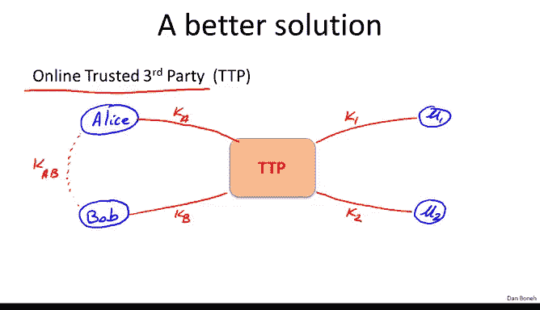
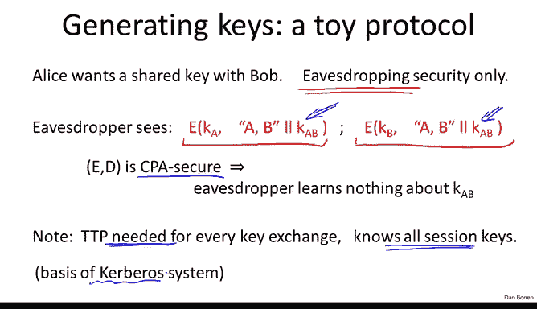
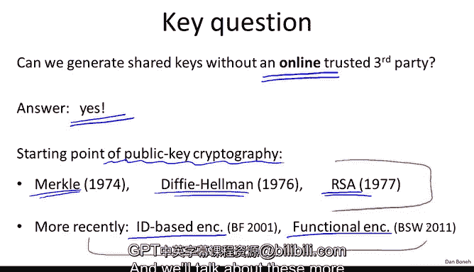

# 047：可信第三方与密钥交换

在本节课中，我们将学习如何通过一个可信第三方来帮助两个用户建立共享密钥。我们将探讨一个简单的密钥交换协议，理解其工作原理、安全假设以及局限性。

---

## 密钥管理问题

上一节我们讨论了如何使用共享密钥保护数据。本节中我们来看看，两个用户最初如何生成这个共享密钥。这个问题将引导我们进入公钥密码学的世界。在本模块中，我们将通过几个简单的密钥交换协议来介绍公钥密码学的核心思想。在我们构建更多公钥工具后，会再回来讨论并设计安全的密钥交换协议。

假设世界上有 `n` 个用户，问题在于这些用户如何管理他们彼此通信所需的秘密密钥。

例如，假设 `n = 4`，世界上有四个用户。一种方案是让每对用户共享一个秘密密钥。例如，U1 和 U3 共享密钥 `K13`，U1 和 U2 共享密钥 `K12`，以此类推，还有 `K24`、`K34`、`K14` 和 `K23`。

这种方法的问题是，现在存在大量需要用户管理的共享密钥。具体来说，如果每个用户需要与世界上其他 `n` 方通信，他必须存储大约 `n` 个密钥。

那么，我们能否做得比每个用户存储 `n` 个密钥更好呢？答案是肯定的。一种方法就是使用所谓的**在线可信第三方**。我们用 TTP 表示可信第三方。

## 可信第三方方案

使用可信第三方的方式是，每个用户现在只与这个可信第三方共享一个密钥。因此，用户一共享一个密钥，用户二共享一个密钥。我们的朋友 Alice 和 Bob 也有他们的秘密密钥，我们称之为 `K_A` 和 `K_B`。

现在，这种设计的好处是每个用户只需要记住一个秘密密钥。问题是，当 Alice 想与 Bob 通信时，他们俩必须执行某个协议，以便在该协议结束时，他们能拥有一个攻击者无法得知的共享秘密密钥 `K_AB`。

那么，Alice 和 Bob 如何生成这个共享秘密密钥 `K_AB` 呢？让我们看一个实现此目的的简单示例协议。

## 一个简单的密钥交换协议

以下是我们的朋友 Alice 和 Bob。Bob 有他与可信第三方共享的密钥 `K_B`。Alice 有她的秘密密钥 `K_A`，同样与可信第三方共享。因此，可信第三方同时拥有 `K_A` 和 `K_B`。问题在于，他们如何生成一个双方都同意、但攻击者完全不知道的共享密钥？

这里我们只讨论一个简单的协议。具体来说，这个协议仅能抵抗窃听攻击，无法抵抗篡改或主动攻击。正如之前所说，我们将在课程后期回来设计安全的密钥交换协议。但现在，为了介绍密钥交换的概念，让我们看看这个仅能抵抗窃听的最简单机制。换句话说，监听对话的对手将无法知道共享密钥 `K_AB` 是什么。

协议工作流程如下：
1.  Alice 首先向可信第三方发送一条消息，表示她想获得一个与 Bob 共享的秘密密钥。
2.  可信第三方将实际生成一个随机的秘密密钥 `K_AB`。可信第三方是生成他们共享秘密密钥的一方。
3.  可信第三方将向 Alice 发回一条消息，但这条消息由两部分组成：
    *   第一部分是使用 Alice 的秘密密钥 `K_A` 加密的消息。加密的内容是：这个密钥 `K_AB` 是供 Alice 和 Bob 双方使用的。
    *   第二部分是一个称为“票据”的消息。这个票据是使用 Bob 的密钥 `K_B` 加密的消息。加密的内容同样是：这个密钥 `K_AB` 是供 Alice 和 Bob 双方使用的。
4.  这两条消息从可信第三方发送给 Alice。
5.  当 Alice 稍后想与 Bob 安全通信时，她会解密用 `K_A` 加密的部分，从而获得密钥 `K_AB`。
6.  然后，她将“票据”发送给 Bob。
7.  Bob 收到票据后，使用他自己的秘密密钥 `K_B` 解密，从而也恢复出秘密密钥 `K_AB`。

现在，他们拥有了可以用于安全通信的共享秘密密钥 `K_AB`。

这里使用的加密系统 `E` 是一个 CPA 安全的密码，我们稍后会看到为什么需要这个属性。

## 协议安全性分析（针对窃听）

第一个问题是，为什么这个协议是安全的？即使我们只考虑窃听对手。让我们思考一下。

目前，我们只关心对窃听者的安全性。那么，在这个协议中，窃听者 `C` 能看到什么？他基本上能看到这两个密文：加密给 Alice 的密文和加密给 Bob 的票据。事实上，他可能会看到许多这样的消息实例，特别是如果 Alice 和 Bob 持续以这种方式交换密钥。

我们的目标是证明他对交换的密钥 `K_AB` 没有任何信息。这直接源于密码 `E` 的 CPA 安全性。因为窃听者无法区分对秘密密钥 `K_AB` 的加密和对随机垃圾的加密，这就是 CPA 安全的定义。因此，他无法将 `K_AB` 与随机垃圾区分开来，这意味着他对 `K_AB` 一无所知。这是一个关于其窃听安全性的高层次论证，但对我们目前的目的来说已经足够。

总之，在这个协议中，窃听者实际上对 `K_AB` 没有任何信息，因此可以安全地使用 `K_AB` 作为 Alice 和 Bob 之间交换消息的秘密密钥。

## 关于可信第三方的讨论

现在，让我们思考一下可信第三方。首先，你注意到每次密钥交换都需要可信第三方。基本上，除非可信第三方在线并可用以帮助他们，否则 Alice 和 Bob 根本无法进行密钥交换。

这个协议的另一个特性是，可信第三方知道所有的会话密钥。因此，如果可信第三方被破坏或遭到入侵，攻击者可以非常容易地窃取系统中每个用户之间交换的所有秘密密钥。

这就是为什么这个 TTP 被称为可信第三方，因为它本质上知道系统中生成的所有会话密钥。

尽管如此，这个机制的优点在于它只使用了对称密码学，没有超出我们已经见过的内容，因此非常快速高效。唯一的问题是，你必须使用这个在线的可信方，并且不清楚如果要在万维网上使用，谁将充当这个在线可信第三方。然而，在企业环境中，这可能是有意义的。如果你有一个拥有单一信任点的公司，指定一台机器作为可信第三方可能是合理的。事实上，类似这样的机制（虽然不完全是我描述的方式）是 Kerberos 系统的基础。

## 协议的局限性（主动攻击）

然而，我必须明确指出，这只是一个非常简单的示例协议，仅能抵抗窃听攻击。它实际上对主动攻击者完全不安全。这里有一个主动攻击者如何破坏此协议的简单示例：重放攻击。

假设攻击者记录了 Alice 与某个在线商家（我们称之为商家 Bob）之间的对话。例如，想象 Alice 从商家 Bob 那里订购了一本书，交易完成，Bob 接受了付款并发送给 Alice 这本书的副本。

攻击者现在可以完全记录这次对话，并在稍后时间简单地向商家 Bob 重放这次对话。Bob 会认为 Alice 刚刚又订购了一本同样的书，他会再次向她收费并再次发送副本。因此，通过重放对话，可能会给 Alice 造成相当大的损害。这只是一个简单的例子，说明了为什么这个协议对主动攻击完全不安全，绝不应该在现实世界中使用。正如我所说，我们将在几周后回来讨论这个协议的安全版本，并了解如何在现实世界中使其工作。

## 迈向无第三方密钥交换

尽管如此，你可以看到这个非常简单的协议已经提出了一个非常有趣的问题：我们能否设计出安全的密钥交换协议，无论是对抗窃听还是对抗主动攻击者，并且**不需要在线可信第三方**？我们不想依赖任何完成密钥交换协议所必需的在线可信方。

令人惊讶的答案是，这实际上是可能的。我们可以在没有可信第三方的情况下进行密钥交换，而这正是公钥密码学的起点。我将向你展示实现这一点的三个想法，我们将在接下来的模块中更详细地讨论它们。

1.  **第一个想法** 实际上来自 Ralph Merkle（1974 年）。当时他还只是一名本科生，就已经提出了这个无需在线可信第三方进行密钥交换的绝妙想法。这是我们将要研究的一个例子。
2.  **第二个例子** 来自 Diffie 和 Hellman（1976 年）。他们当时都在斯坦福大学工作，提出了这个开启了现代公钥密码学世界的想法。
3.  **第三个想法** 来自 Rivest、Shamir 和 Adleman（MIT）。我们将详细研究每个想法的工作原理。

我想指出的是，关于公钥管理的工作并没有在 70 年代末停止。事实上，多年来出现了许多想法。这里我只提两个近十年来的想法：一个是**基于身份的加密**，这是管理公钥的另一种方式；另一个是**函数加密**，这是一种仅能部分解密密文的密钥分发方式。

我们将在下周讨论公钥密码学的核心，并在课程后期讨论这些更高级的想法。

---

## 总结

本节课中，我们一起学习了如何通过一个在线可信第三方来帮助两个用户建立共享密钥。我们分析了一个简单的协议，它使用对称加密和可信第三方来分发密钥，并且仅能抵抗窃听攻击。我们认识到该协议对重放等主动攻击是不安全的，并且依赖于一个知晓所有会话密钥的可信中心。最后，我们了解到无需可信第三方的密钥交换是可能的，这引出了公钥密码学，并预告了后续课程将深入探讨的几种经典方案。