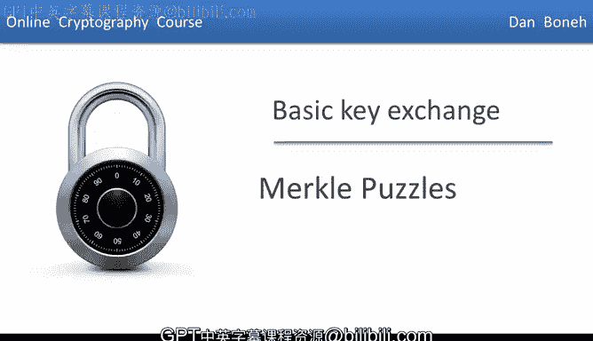
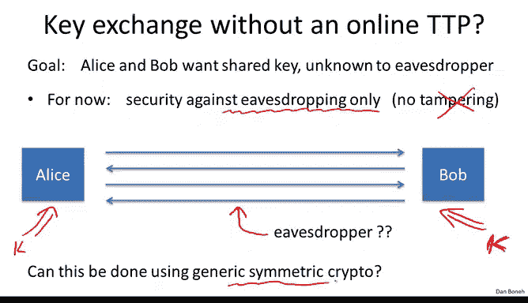
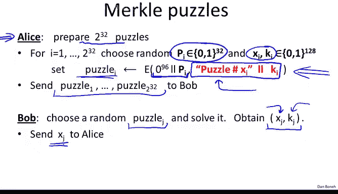

# 048：默克尔谜题



在本节课中，我们将学习第一个无需可信第三方的密钥交换协议。我们将从一种仅使用对称加密工具（如分组密码）的简单协议开始，了解其工作原理、效率以及局限性。

## 协议背景与目标

上一节我们介绍了密钥交换的基本概念。本节中，我们来看看一个具体的场景：爱丽丝和鲍勃从未见过面，但他们希望在不依赖任何可信第三方的情况下，通过公开的通信渠道协商出一个共享的密钥 `K`。我们假设攻击者只能窃听通信内容，而不能篡改。我们的目标是，即使攻击者窃听了所有通信，也无法得知最终的共享密钥 `K`。



一个核心问题是：**仅使用对称密码学工具（如分组密码或哈希函数）能否实现这个目标？**

令人惊讶的是，答案是肯定的。然而，由此产生的协议效率低下，在实践中并不使用。尽管如此，理解这些简单的协议有助于我们建立直觉，并为后续学习更高效的公钥密码学协议打下基础。

## 默克尔谜题协议详解

我们将要学习的简单协议被称为 **默克尔谜题**。它由拉尔夫·默克尔于1974年提出。该协议的核心工具是一个“谜题”。

### 什么是“谜题”？

一个“谜题”是一个难以解决但通过一定努力可以解决的问题。在密码学中，我们可以这样构造一个谜题：

假设我们使用一个128位的对称加密密钥（例如AES）。我们构造一个特殊的密钥：其前96位全部为0，只有后32位是随机选择的。然后，我们使用这个密钥加密一段固定的明文（例如，消息 `"puzzle"`）。加密后的密文就是这个“谜题”。


**公式表示：**
```
密钥 = (96个0位) || (32位随机数 P)
密文（谜题）= Encrypt(密钥, 明文 "puzzle||X||K")
```
由于只有32位是随机的，攻击者最多只需要尝试 `2^32` 次（即暴力破解所有可能的32位组合）就能解密出明文，找到正确的密钥 `P`。因此，解决这个谜题的工作量是 `O(2^32)`。

### 协议步骤

以下是默克尔谜题协议的具体步骤，每个列表前都有简短介绍。

**第一步：爱丽丝生成并发送谜题**
爱丽丝首先生成大量（例如 `n = 2^32` 个）这样的谜题。

以下是爱丽丝为生成第 `i` 个谜题所执行的操作：
1.  随机选择一个32位的谜题密钥 `P_i`。
2.  随机选择两个128位的值：一个谜题标识符 `X_i` 和一个将成为共享密钥的 `K_i`。
3.  构造一个128位的AES密钥：前96位为0，后32位为 `P_i`。
4.  使用这个AES密钥加密以下拼接的明文：`"puzzle" || X_i || K_i`。
5.  得到的密文就是第 `i` 个谜题。

爱丽丝将所有 `n` 个谜题发送给鲍勃。

**第二步：鲍勃解决一个谜题**
鲍勃从收到的 `n` 个谜题中随机选择一个（例如第 `j` 个）。



以下是鲍勃解决所选谜题的过程：
1.  他需要尝试所有 `2^32` 个可能的 `P` 值来解密这个谜题。
2.  对于每个尝试的 `P`，他用构造出的密钥（96个0位 + `P`）解密密文。
3.  检查解密出的明文是否以 `"puzzle"` 开头。如果是，则说明找到了正确的 `P_j`。
4.  从明文中提取出标识符 `X_j` 和共享密钥 `K_j`。

鲍勃将解出的谜题标识符 `X_j` 发送回爱丽丝，并自己保存好 `K_j`。

**第三步：爱丽丝恢复共享密钥**
爱丽丝收到 `X_j` 后，在她本地的数据库中查找标识符为 `X_j` 的谜题记录。该记录中包含她之前为这个谜题生成的 `K_j`。现在，爱丽丝和鲍勃都知道了同一个共享密钥 `K_j`。

### 工作量和安全性分析

现在我们来分析协议参与方和攻击者的工作量。

**参与方的工作量：**
*   **爱丽丝** 需要生成 `n` 个谜题。生成每个谜题是常数时间，所以总工作量是 `O(n)`。
*   **鲍勃** 需要解决一个谜题。解决一个谜题需要 `O(n)` 的工作量（因为 `n = 2^32`，解决一个谜题就需要尝试约 `n` 次）。

因此，爱丽丝和鲍勃的工作量都是线性的，即 `O(n)`。

**攻击者的工作量：**
攻击者窃听到了爱丽丝发送的所有 `n` 个谜题，以及鲍勃返回的 `X_j`。为了找出共享密钥 `K_j`，攻击者必须：
1.  尝试解决每一个谜题，直到找到那个内部明文包含 `X_j` 的谜题。
2.  解决一个谜题需要 `O(n)` 的工作量。
3.  在最坏情况下，他需要解决所有 `n` 个谜题才能找到目标。

因此，攻击者的总工作量是 `O(n) * O(n) = O(n^2)`。

**安全性总结：**
在这个协议中，合法参与方的工作量是线性的（`O(n)`），而攻击者破解协议的工作量是二次方的（`O(n^2)`）。这创造了一个**二次方差距**。例如，当 `n = 2^32` 时：
*   爱丽丝和鲍勃各需约 `2^32` 步操作（生成或解决谜题）。
*   攻击者则需要约 `2^64` 步操作来破解。


## 协议的局限性与启示

尽管默克尔谜题在概念上很巧妙，但它存在明显的效率问题。为了获得足够的安全性（例如让攻击者需要 `2^128` 步），参与方需要完成 `2^64` 步的操作，这在实践中是不可行的。因此，该协议从未被实际部署。

一个自然的问题是：**仅使用对称密码学工具，我们能否做得比二次方差距更好？**

答案是：**我们相信不能。** 有研究结果表明，如果我们将分组密码或哈希函数视为一个只能进行查询的“黑盒”，那么任何基于此类原语的密钥交换协议，都存在一个运行时间为 `O(n^2)` 的攻击。这意味着二次方差距可能是此类构造的理论极限。

这个局限性引出了密码学发展的一个关键转折点：为了实现高效且安全的密钥交换，我们不能仅仅依赖通用的对称密码原语。我们需要具有特殊数学性质的函数，这需要引入代数结构。

## 课程总结

本节课中我们一起学习了默克尔谜题协议。我们了解到：
1.  仅使用对称加密工具可以实现无需可信第三方的密钥交换。
2.  默克尔谜题通过让合法用户进行 `O(n)` 的工作，而迫使窃听者进行 `O(n^2)` 的工作，从而在两者之间建立了安全差距。
3.  该协议由于效率低下（合法用户的工作量随安全级别增长过快）而不实用。
4.  理论研究表明，仅将对称密码作为黑盒使用，可能无法突破二次方差距的效率瓶颈。


这个结论为我们接下来的学习指明了方向：为了构建实用的密钥交换协议，我们必须超越对称密码学的范畴，进入**公钥密码学**的领域，这需要利用数论和代数中的特定难题。在接下来的几节中，我们将开始学习这些必要的数学基础。