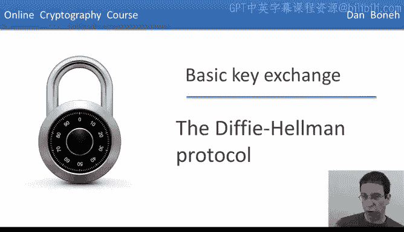
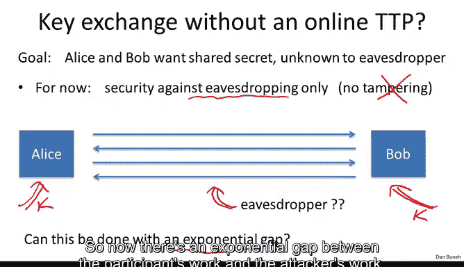
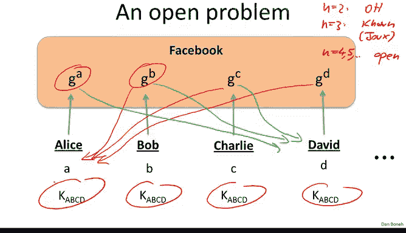
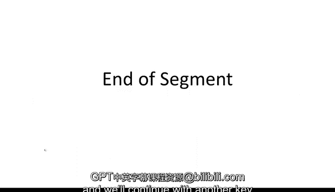

# 049：迪菲-赫尔曼协议 🔑

在本节课中，我们将要学习迪菲-赫尔曼协议。这是我们遇到的第一个实用的密钥交换机制。我们将了解其工作原理、安全性基础，以及它如何让从未谋面的双方安全地建立一个共享密钥。

## 协议设置与目标

上一节我们介绍了梅克尔谜题，它利用分组密码或哈希函数实现密钥交换，但攻击者与参与者的工作量差距仅为平方级别，因此不够安全。本节中，我们来看看能否实现指数级别的安全差距，即参与者工作量为 O(N)，而攻击者工作量需达到 O(exp(N))。

为了实现这种指数差距，我们不能仅依赖像AES或SHA-256这样的对称密码原语，因为它们缺乏必要的数学结构。因此，我们需要转向使用一些代数方法。

## 迪菲-赫尔曼协议详解

接下来，我们将具体且非正式地描述迪菲-赫尔曼协议。下周我们会更抽象、更严谨地分析它。

协议首先需要固定两个公开参数：
*   **一个大素数 `p`**：通常是一个非常大的素数，例如约600位十进制数（约2000比特）。
*   **一个整数 `g`**：范围在 `1` 到 `p-1` 之间。

参数 `p` 和 `g` 是协议的一部分，选定后长期固定。

以下是协议的具体步骤：

1.  **爱丽丝的操作**：
    *   随机选择一个秘密数字 `a`，范围在 `1` 到 `p-1` 之间。
    *   计算 `A = g^a mod p`。
    *   将计算结果 `A` 发送给鲍勃。

2.  **鲍勃的操作**：
    *   随机选择一个秘密数字 `b`，范围在 `1` 到 `p-1` 之间。
    *   计算 `B = g^b mod p`。
    *   将计算结果 `B` 发送给爱丽丝。

3.  **生成共享密钥**：
    *   共享密钥 `K_AB` 定义为 `g^(a*b) mod p`。
    *   **爱丽丝计算**：她收到 `B` 后，计算 `B^a mod p = (g^b)^a mod p = g^(a*b) mod p`。
    *   **鲍勃计算**：他收到 `A` 后，计算 `A^b mod p = (g^a)^b mod p = g^(a*b) mod p`。

由此可见，尽管双方看似计算了不同的值，但最终都得到了相同的共享密钥 `g^(a*b) mod p`。这个协议的核心在于指数运算的交换律：`(g^b)^a = (g^a)^b = g^(a*b)`。

## 协议安全性分析

理解协议为何有效相对简单，但更重要的是理解它为何安全。攻击者（窃听者）能看到什么？他能看到公开参数 `p` 和 `g`，以及双方交换的中间值 `A = g^a mod p` 和 `B = g^b mod p`。

关键问题是：给定 `g^a mod p` 和 `g^b mod p`，攻击者能否计算出 `g^(a*b) mod p`？这被称为**计算迪菲-赫尔曼问题**。

目前，解决此问题最著名的算法是**一般数域筛法**。假设素数 `p` 的长度为 `n` 比特，该算法的运行时间大致是 `exp(O(n^(1/3)))`。这是一个**亚指数时间**算法，而非真正的指数时间 `exp(O(n))`。这意味着，虽然问题很难，但由于立方根效应，其难度并未达到理想的指数级别。

以下是一个简化的对比表格，说明了为达到与特定密钥长度的分组密码相当的安全性，所需使用的模数 `p` 的大小：

| 分组密码密钥长度（比特） | 所需迪菲-赫尔曼模数大小（比特） |
| :--------------------- | :---------------------------- |
| 80                     | 约 1024                       |
| 128                    | 约 3072                       |
| 256                    | 约 15360                      |

从表格可以看出，为了匹配高强度对称密钥的安全性，需要使用非常大的模数，这会导致计算效率低下。

## 椭圆曲线迪菲-赫尔曼

为了解决模数过大导致的效率问题，密码学家找到了更好的代数结构：**椭圆曲线**。迪菲-赫尔曼协议可以完全移植到椭圆曲线上运行。

在椭圆曲线上，计算迪菲-赫尔曼问题被认为困难得多（目前最好的算法是指数时间的）。因此，我们可以使用小得多的参数来达到相同的安全强度。例如，要达到80比特密钥的安全强度，仅需约160比特的椭圆曲线参数；要达到256比特密钥的安全强度，也仅需约512比特的参数。因此，业界正逐渐从传统的模素数迪菲-赫尔曼转向更高效的椭圆曲线迪菲-赫尔曼。

## 中间人攻击与协议局限性

需要强调的是，我们刚刚描述的基础迪菲-赫尔曼协议**无法抵抗中间人攻击**。在这种攻击下，攻击者可以拦截并篡改爱丽丝和鲍勃交换的中间值 `A` 和 `B`，分别替换成自己生成的 `A'` 和 `B'`，从而与双方分别建立不同的共享密钥。这样，攻击者就能解密、阅读甚至修改双方通信的所有内容。

因此，基础协议仅能提供对抗被动窃听的安全性。要防御主动的中间人攻击，需要对协议进行增强（例如，结合数字签名或证书机制），我们将在后续课程中讨论。

## 协议的非交互特性与开放问题

迪菲-赫尔曼协议有一个有趣的特性：它可以被视为一种**非交互式**协议。想象一下，数百万用户（爱丽丝、鲍勃、查理等）各自选择一个秘密值，并将对应的公开值 `g^a`, `g^b`, `g^c` 发布在个人公开资料（如社交媒体主页）上。

此后，任意两个用户（如爱丽丝和查理）想要建立共享密钥，就无需再进行任何在线通信。爱丽丝只需读取查理的公开值 `g^c`，即可计算共享密钥 `(g^c)^a = g^(a*c)`；查理同样读取爱丽丝的公开值 `g^a` 计算 `(g^a)^c = g^(a*c)`。他们立刻就能开始安全通信。

这引出了一个有趣的**开放性问题**：我们能否将这种非交互式密钥建立扩展到**多于两方**的群组？例如，四个用户各自发布一个公开值后，仅通过读取彼此的公开资料，能否让四方同时建立一个共享的群组密钥？

*   对于 `n=2`（两方），这就是迪菲-赫尔曼协议。
*   对于 `n=3`（三方），存在已知协议（如Joux协议），但需要更复杂的数学。
*   对于 `n>=4`（四方及以上），这仍然是一个未解决的公开问题，谁能解决它将在密码学界获得巨大声誉。

## 总结

本节课我们一起学习了迪菲-赫尔曼协议。我们了解了它如何利用模指数运算的代数性质，让双方在不安全的信道上建立一个共享的秘密密钥。我们分析了其安全性基于计算迪菲-赫尔曼问题的困难性，并指出了基础协议只能抵抗被动窃听，无法防御中间人攻击。最后，我们探讨了协议的非交互式特性以及一个关于多方密钥建立的开放性问题。在接下来的课程中，我们将继续学习其他的密钥交换机制。