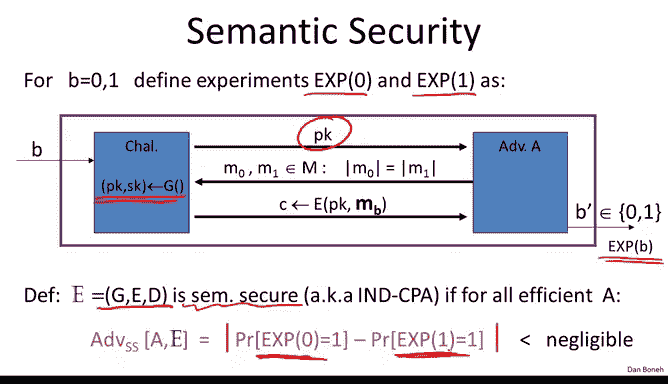
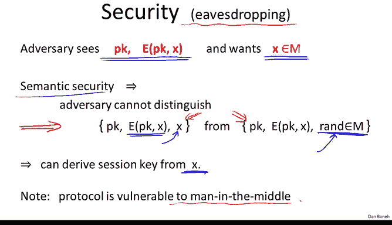
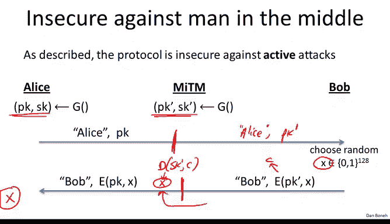
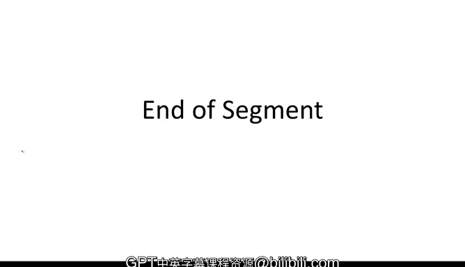

# 050：公钥加密 🔐

在本节课中，我们将学习一种基于公钥加密概念的密钥交换方法。我们将了解公钥加密的定义、工作原理，以及如何利用它来建立共享密钥。课程最后，我们会探讨其安全性，并简要提及后续的学习方向。

---

## 公钥加密的定义与构成

上一节我们介绍了Diffie-Hellman密钥交换机制。本节中，我们来看看另一种基于公钥加密的密钥交换方法。

公钥加密与对称加密类似，包含加密和解密算法。但关键区别在于，加密和解密使用不同的密钥。加密算法使用一个公开的密钥（公钥），而解密算法使用一个保密的密钥（私钥）。这两个密钥合称为一个密钥对。

更精确地说，一个公钥加密系统由三个算法构成：**G**（密钥生成）、**E**（加密）和**D**（解密）。

*   **密钥生成算法 G**：运行时生成一个密钥对 `(PK, SK)`，其中 `PK` 是公钥，`SK` 是私钥。
*   **加密算法 E**：输入公钥 `PK` 和明文消息 `M`，输出对应的密文 `C`。公式表示为：`C = E(PK, M)`。
*   **解密算法 D**：输入私钥 `SK` 和密文 `C`，输出原始明文 `M` 或一个错误标识 `⊥`。公式表示为：`M = D(SK, C)`。

系统必须满足一致性：对于任何由 `G` 生成的 `(PK, SK)`，解密用对应公钥加密的密文，必须得到原始消息。即：`D(SK, E(PK, M)) = M`。

---

## 公钥加密的安全性

理解了公钥加密的构成后，我们需要定义其安全性。我们沿用之前“语义安全”的概念，但游戏规则略有不同。

在公钥系统的语义安全游戏中：
1.  挑战者运行 `G` 生成密钥对 `(PK, SK)`，并将公钥 `PK` 交给攻击者。
2.  攻击者输出两个等长的消息 `M0` 和 `M1`。
3.  挑战者随机选择 `b ∈ {0,1}`，将 `C = E(PK, Mb)` 发送给攻击者。
4.  攻击者尝试猜测 `b` 的值。

我们定义实验0（加密 `M0`）和实验1（加密 `M1`）。如果攻击者在两个实验中输出1的概率几乎相同，无法区分收到的是 `M0` 还是 `M1` 的加密结果，则该公钥系统是语义安全的。

需要强调的是，在公钥设置中，攻击者**无需**进行选择明文攻击的能力，因为他已经拥有公钥 `PK`，可以自行加密任何消息。

---

## 基于公钥加密的密钥交换协议

现在我们已经理解了公钥加密及其安全性，让我们看看如何利用它来建立一个共享密钥。

以下是协议的步骤：
1.  **Alice 初始化**：Alice 运行密钥生成算法 `G`，为自己生成一个公钥-私钥对 `(PKA, SKA)`。
2.  **Alice 发送公钥**：Alice 将她的公钥 `PKA` 发送给 Bob，并声明消息来自 Alice。
3.  **Bob 加密共享秘密**：Bob 生成一个随机的128位值 `X`。然后，他使用 Alice 的公钥 `PKA` 加密 `X`，得到密文 `C = E(PKA, X)`。
4.  **Bob 发送密文**：Bob 将密文 `C` 发送回 Alice，并声明消息来自 Bob。
5.  **Alice 解密获得密钥**：Alice 收到密文后，使用自己的私钥 `SKA` 进行解密，得到 `X = D(SKA, C)`。

至此，Alice 和 Bob 共享了秘密值 `X`，可以将其用作会话密钥。

这个协议与上一节的 Diffie-Hellman 协议有一个重要区别：**它需要交互顺序**。Bob 必须等待收到 Alice 的公钥后才能发送他的消息。而 Diffie-Hellman 协议允许双方在任何时间发布自己的消息，无需严格顺序。

---

## 协议的安全性分析

我们分析了协议流程，接下来需要问：为什么这个协议是安全的？（我们目前仅考虑窃听安全性）

在协议中，攻击者能观察到公钥 `PKA` 和密文 `C`（即 `X` 的加密结果）。攻击者的目标是获取 `X`。

由于我们使用的公钥系统是语义安全的，这意味着攻击者无法区分 `X` 的加密结果与某个随机消息的加密结果。因此，在攻击者看来，`X` 与消息空间 `M` 中的一个随机元素是不可区分的。这样，`X` 就可以安全地作为双方之间的会话密钥。

可以证明，如果攻击者能区分上述两种分布，他就能直接破坏公钥加密的语义安全性。

然而，与许多基础协议一样，**该协议无法抵抗中间人攻击**。

---

## 中间人攻击示例

尽管协议能抵抗窃听，但在活跃攻击者面前非常脆弱。以下是简单的中间人攻击过程：

1.  Alice 生成她的密钥对 `(PKA, SKA)`。同时，中间人 Mallory 也生成自己的密钥对 `(PKM, SKM)`。
2.  当 Alice 发送她的公钥 `PKA` 给 Bob 时，Mallory 拦截该消息。他将消息替换为 `PKM`，但仍声称这是来自 Alice 的公钥。
3.  Bob 收到 `PKM`，信以为真。他生成随机值 `X`，并发送密文 `C' = E(PKM, X)` 给“Alice”。
4.  Mallory 拦截 `C'`。他用自己的私钥 `SKM` 解密得到 `X`。
5.  Mallory 然后用 Alice 的真实公钥 `PKA` 加密 `X`，得到 `C = E(PKA, X)`，并将其发送给 Alice。
6.  Alice 收到 `C`，用自己的私钥解密得到 `X`。

攻击结果：Alice 和 Bob 都认为自己与对方成功交换了密钥 `X`，但实际上，中间人 Mallory 也完全掌握了 `X`。这使得协议在消息可被篡改时完全不安全。我们将在后续引入数字签名后，探讨如何加固此类协议。

---

## 总结与展望

本节课中我们一起学习了：
1.  **公钥加密**的基本概念，它由密钥生成 `G`、加密 `E` 和解密 `D` 三个算法构成。
2.  公钥加密的**语义安全**定义，其核心是攻击者在拥有公钥的情况下，仍无法区分不同明文的加密结果。
3.  如何利用公钥加密构建一个**密钥交换协议**，使双方获得共享秘密 `X`。
4.  该协议能抵抗**窃听**，但易受**中间人攻击**。

公钥加密本身可以实现抗窃听的密钥交换。接下来的问题是：如何构造公钥加密系统？与 Diffie-Hellman 协议类似，实际的构造通常依赖于数论和代数知识。

因此，在深入具体的公钥加密构造之前，我们将在下一个模块进行一次简短的“绕行”，快速回顾相关的数论背景知识。之后，我们再回来详细讨论基于数论的公钥加密构造以及更安全的密钥交换方法。

**扩展阅读提示**：
*   有论文证明，如果仅将对称密码和哈希函数视为黑盒，那么“Merkle谜题”式的密钥交换方案已达到最优，无法获得比二次方更好的安全间隙。
*   另有一些文献总结了使用公钥加密和Diffie-Hellman进行密钥交换的多种机制，并展望了如何使其抵抗中间人攻击，而不仅仅是窃听攻击。

本模块到此结束。下一模块，我们将简要概述代数与数论。