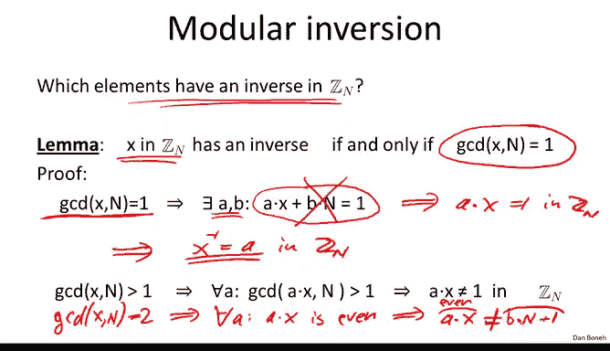
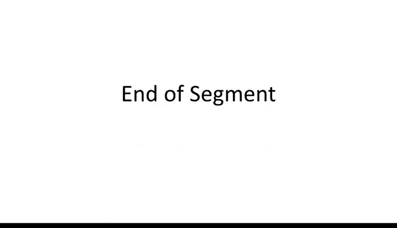

# 051：数论基础回顾

在本节课中，我们将要学习数论中的一些核心概念，这些概念是构建公钥密码系统（如密钥交换、数字签名和公钥加密）的基础。我们将从模运算开始，逐步介绍最大公约数、模逆元等关键知识。

## 模运算与集合 Zₙ

上一模块我们了解到数论对密钥交换很有用。本节中，我们来看看一些基本的数论事实，这些将帮助我们构建多种公钥系统。

我将使用以下符号表示法：
*   用大写 **N** 表示一个正整数。
*   用小写 **p** 表示一个正质数。

我将使用 **Zₙ** 来表示集合 {0, 1, 2, ..., N-1}。这不仅是整数集合，我们还可以在其中进行加法和乘法运算，只要运算结果总是对 **N** 取模。

对于了解一些代数的同学，可以说 **Zₙ** 表示一个环，其中的加法和乘法是模 **N** 运算。这是密码学中非常常见的符号。

为了确保大家都熟悉模运算，让我们以 **N = 12** 为例，看一些基本事实：
*   9 + 8 = 17，而 17 mod 12 = 5。所以我们写作在 **Z₁₂** 中，9 + 8 = 5。
*   5 × 7 = 35，而 35 mod 12 = 11（因为 36 可被 12 整除，35 = 36 - 1）。所以在 **Z₁₂** 中，5 × 7 = 11。
*   5 - 7 = -2，而 -2 mod 12 = 10。所以在 **Z₁₂** 中，5 - 7 = 10。

总的来说，在 **Zₙ** 中进行的模 **N** 算术，其运算规则与你所熟悉的整数或实数算术规则基本一致。例如，分配律 `x × (y + z) = x × y + x × z` 在 **Zₙ** 中同样成立。

## 最大公约数与扩展欧几里得算法

接下来我们需要了解的概念是最大公约数。给定两个整数 **x** 和 **y**，它们的最大公约数是能同时整除 **x** 和 **y** 的最大整数。

例如，12 和 18 的 GCD 是 6。

关于 GCD 有一个重要事实：对于任意两个整数 **x** 和 **y**，总存在另外两个整数 **a** 和 **b**，使得 `a × x + b × y = GCD(x, y)`。也就是说，GCD 可以表示为 **x** 和 **y** 的一个线性组合。

以 12 和 18 为例，`2 × 12 + (-1) × 18 = 24 - 18 = 6`。这里的 **a** 和 **b** 分别是 2 和 -1。

不仅 **a** 和 **b** 存在，还有一个非常高效简单的算法可以找到它们，即**扩展欧几里得算法**。给定 **x** 和 **y**，该算法可以在时间复杂度约为 `O((log N)²)` 内找到 **a** 和 **b**。

如果 **x** 和 **y** 的 GCD 恰好为 1，即 1 是能同时整除它们的最大整数，那么我们称 **x** 和 **y** 互质。例如，3 和 5 互质。

## 模逆元

在有理数中，我们知道一个数的逆元是什么，例如 2 的逆元是 1/2。那么在模 **N** 运算中，逆元是什么呢？

元素 **x** 在 **Zₙ** 中的逆元，是另一个元素 **y** ∈ **Zₙ**，满足 `x × y ≡ 1 (mod N)`。这个数 **y** 记作 **x⁻¹**。如果 **y** 存在，那么它是唯一的。

来看一个简单例子：假设 **N** 是某个奇数，那么 2 在 **Zₙ** 中的逆元是 **(N + 1) / 2**。因为 `2 × (N+1)/2 = N + 1 ≡ 1 (mod N)`。

那么，**Zₙ** 中哪些元素拥有逆元呢？有一个非常简单的定理：

> 元素 **x** ∈ **Zₙ** 是可逆的，当且仅当 **x** 与模数 **N** 互质（即 GCD(x, N) = 1）。

**证明：**
1.  **充分性（如果 GCD(x, N)=1，则 x 可逆）**：
    因为 GCD(x, N) = 1，根据 GCD 的性质，存在整数 **a**, **b** 使得 `a × x + b × N = 1`。
    将此等式模 **N** 化简，`b × N` 项变为 0，得到 `a × x ≡ 1 (mod N)`。因此，**a** 就是 **x** 在 **Zₙ** 中的逆元。
2.  **必要性（如果 x 可逆，则 GCD(x, N)=1）**：
    用反证法。假设 GCD(x, N) = d > 1，且存在逆元 **a** 使得 `a × x ≡ 1 (mod N)`。
    这意味着 `a × x = k × N + 1` 对某个整数 **k** 成立。
    由于 **d** 整除 **x** 和 **N**，那么 **d** 也整除等式左边 `a × x` 和右边 `k × N`，但 **d** 不能整除 1（因为 d>1），矛盾。因此逆元不存在。

这个证明不仅是存在性证明，也给出了计算逆元的方法：使用扩展欧几里得算法找到满足 `a × x + b × N = 1` 的 **a** 和 **b**，那么 **a** 就是 **x** 的模逆元。

## 可逆元集合 Zₙ*

我们引入符号 **Zₙ*** 来表示 **Zₙ** 中所有可逆元素（即与 **N** 互质的元素）的集合。

以下是几个例子：
*   当 **p** 是质数时，**Zₚ*** 包含从 1 到 p-1 的所有整数，因为除了 0，它们都与 **p** 互质。所以 **|Zₚ*| = p - 1**。
*   对于 **N = 12**，**Z₁₂*** 包含所有与 12 互质的数：{1, 5, 7, 11}。像 2, 3, 4, 6 等与 12 有非平凡公约数的数则不可逆。

## 解模线性方程

基于以上知识，我们可以轻松解决模线性方程。给定方程 `a × x ≡ b (mod N)`，其中 **a** 可逆（即 GCD(a, N)=1），解法如下：
1.  两边同时乘以 **a** 的模逆元 **a⁻¹**。
2.  得到 `x ≡ b × a⁻¹ (mod N)`。
3.  使用扩展欧几里得算法高效计算出 **a⁻¹**，然后计算 `b × a⁻¹ mod N` 即可得到解。

扩展欧几里得算法的时间复杂度是 `O((log N)²)`，因此这是解决模线性方程的二次时间算法，也是目前已知的最佳算法。

回顾高中代数，学完线性方程后，下一个问题自然是：如何解二次方程？这个问题非常有趣，我们将在接下来的部分中探讨。

## 总结

本节课中我们一起学习了数论的基础知识，为后续构建密码系统做准备。我们回顾了模运算和集合 **Zₙ** 的概念，理解了最大公约数及其通过扩展欧几里得算法得到的线性组合表示。我们重点学习了模逆元的定义、存在条件（元素与模数互质）及其高效计算方法。最后，我们定义了可逆元集合 **Zₙ***，并展示了如何利用模逆元来求解模线性方程。这些概念是理解后续公钥密码学内容的基石。