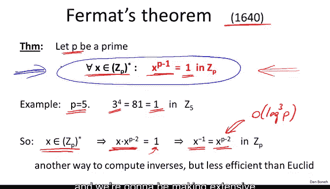
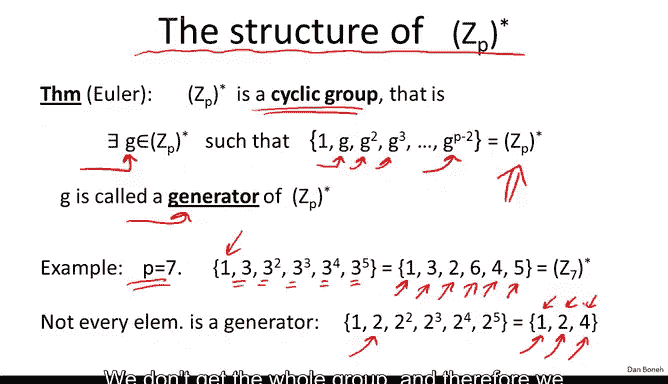
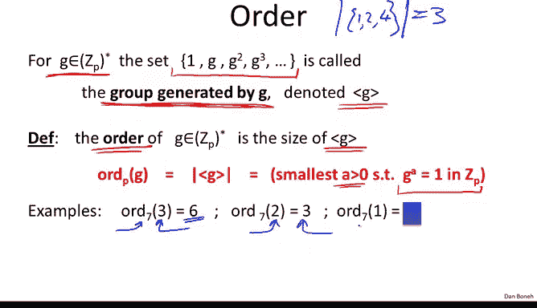
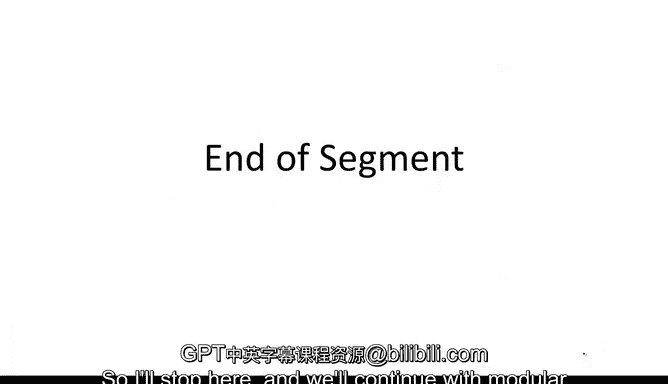

# 052：费马与欧拉定理 🔐

在本节课中，我们将学习两个在密码学中至关重要的数论定理：费马小定理和欧拉定理。我们将了解它们的定义、应用，以及它们如何帮助我们理解模运算中元素的结构。

---

## 回顾：模逆元与欧几里得算法

上一节我们介绍了模逆元的概念，并说明了欧几里得算法能高效地计算模 `n` 下元素的逆元。本节中，我们将时间快进到17和18世纪，探讨费马和欧拉的重要贡献。

在此之前，让我们快速回顾一下之前的内容。我们通常令 `n` 为一个正整数，且是一个 `n` 比特的整数（即介于 `2^n` 和 `2^(n+1)` 之间）。我们令 `p` 表示一个素数。

我们定义了集合 `Z_n` 为从 `0` 到 `n-1` 的整数集合，并可以在其中进行模 `n` 的加法和乘法运算。我们还定义了 `Z_n*` 为 `Z_n` 中所有可逆元素的集合，并证明了：元素 `x` 可逆的充要条件是 `x` 与 `n` 互质。

不仅如此，我们完全理解了哪些元素可逆，哪些不可逆。我们还展示了一个基于扩展欧几里得算法的高效算法，用于计算 `Z_n` 中元素 `x` 的逆元，其运行时间复杂度为 `O(n^2)`，其中 `n` 是数字 `N` 的比特长度。

---

## 费马小定理

现在，让我们从古希腊时代跳到17世纪，谈谈费马。费马提出了许多重要定理，其中一个关键定理如下：

假设给定一个素数 `p`，那么对于 `Z_p*` 中的任意元素 `x`，都有 `x^(p-1) ≡ 1 (mod p)`。

让我们看一个简单的例子。设 `p = 5`，我们看 `3^(p-1)`，即 `3^4`。`3^4 = 81`，而 `81 mod 5 = 1`。这个例子验证了费马定理。

有趣的是，费马本人并未证明这个定理。证明工作直到大约100年后才由欧拉完成，并且欧拉证明了一个更通用的版本。

### 费马定理的一个简单应用

假设我们有一个元素 `x ∈ Z_p*`（注意 `p` 必须是素数）。根据费马定理，我们知道 `x^(p-1) ≡ 1 (mod p)`。

我们可以将 `x^(p-1)` 写成 `x * x^(p-2)`。因此，`x * x^(p-2) ≡ 1 (mod p)`。这意味着 `x` 模 `p` 的逆元就是 `x^(p-2)`。

这为我们提供了另一种计算模素数逆元的算法：只需计算 `x^(p-2)` 即可得到 `x` 的逆元。然而，与欧几里得算法相比，这种方法有两个缺点：
1.  它只适用于模素数的情况，而欧几里得算法也适用于模合数。
2.  计算这个模幂运算的效率较低。我们将在本模块最后一节讨论模幂运算，届时你会看到计算 `x^(p-2)` 的时间复杂度约为 `O(log^3 p)`，而欧几里得算法计算逆元的时间复杂度是 `O(log^2 p)`。

因此，这个算法不仅通用性较差（仅适用于素数），效率也较低。尽管如此，关于素数的这个事实极其重要，我们将在接下来的几周内广泛使用它。

### 应用：生成大素数

让我们看一个费马定理的快速简单应用。假设我们需要生成一个大的随机素数，比如一个大约1024比特的素数（数量级约为 `2^1024`）。

以下是一个简单的概率算法：
1.  在指定区间内随机选择一个整数 `p`。
2.  测试这个整数是否满足费马定理。例如，以2为底数，测试 `2^(p-1) ≡ 1 (mod p)` 是否成立。
3.  如果等式不成立，那么我们肯定知道选择的数 `p` 不是素数。此时，我们返回步骤1，尝试另一个数，如此反复。
4.  一旦我们找到一个满足条件的整数，就输出它并停止。

事实证明，如果一个随机数通过了这个测试，那么它极有可能是一个素数。具体来说，对于1024比特的数，`p` 不是素数的概率非常小（小于 `2^-60`）。随着数字变大，通过测试但不是素数的概率会迅速趋近于零。

所以，这个算法并不保证输出一定是素数，但我们知道它非常、非常可能是一个素数。换句话说，它不是素数的唯一可能是我们遇到了概率极小的事件。

另一种说法是，在所有1024比特整数集合中，有一个素数子集，还有一小部分合数（我们称之为“伪素数”）会错误地通过测试。这个伪素数集合非常小，随机选择几乎不可能选中它们。

需要指出的是，这是一个非常简单的素数生成算法，远非最佳算法。我们现在有更好的算法。实际上，一旦你有了一个候选素数，我们现在有非常高效的算法可以毫无疑问地证明这个候选数确实是素数，因此我们甚至不必依赖概率性陈述。尽管如此，费马测试如此简单，我只是想向你展示它是生成素数的一种简单方法，尽管现实中并非如此生成素数。

最后一点，你可能会好奇这个迭代需要重复多少次才能找到一个素数。这是一个经典结果，称为素数定理，它表明经过几百次迭代后，我们大概率会找到一个素数。因此，期望的迭代次数是几百次，不会更多。

---

## 欧拉的工作与 `Z_p*` 的结构

理解了费马定理后，接下来我想谈谈 `Z_p*` 的结构。这里我们将时间快进100年到18世纪，看看欧拉的工作。欧拉首先用现代语言证明的一件事是：`Z_p*` 是一个**循环群**。

`Z_p*` 是循环群意味着存在某个元素 `g ∈ Z_p*`，使得如果我们取 `g` 并计算其一系列幂：`g, g^2, g^3, g^4, ...`，直到 `g^(p-2)`，这些幂的集合恰好就是整个 `Z_p*` 群。

注意，没有必要计算超过 `g^(p-2)` 的幂，因为根据费马定理，`g^(p-1) ≡ 1 (mod p)`。如果我们继续计算 `g^p`，它将等于 `g`；`g^(p+1)` 将等于 `g^2`，依此类推，形成一个循环。因此，我们不妨在 `g^(p-2)` 处停止。

欧拉证明，确实存在这样一个元素 `g`，它的所有幂次能够生成整个 `Z_p*` 群。这种类型的元素称为**生成元**。

让我们看一个简单的例子。设 `p = 7`，看看3的所有幂次：
*   `3^1 = 3`
*   `3^2 = 9 ≡ 2 (mod 7)`
*   `3^3 = 27 ≡ 6 (mod 7)`
*   `3^4 = 81 ≡ 4 (mod 7)`
*   `3^5 = 243 ≡ 5 (mod 7)`
*   `3^6 = 729 ≡ 1 (mod 7)` （根据费马定理）

我们可以看到，幂次 `3^1` 到 `3^5` 给出了集合 `{1, 2, 3, 4, 5, 6}`，即整个 `Z_7*`。因此，我们说3是 `Z_7*` 的一个生成元。

需要指出的是，并非每个元素都是生成元。例如，看看2的所有幂次：
*   `2^0 = 1`
*   `2^1 = 2`
*   `2^2 = 4`
*   `2^3 = 8 ≡ 1 (mod 7)`

之后开始循环：`2^4 ≡ 2, 2^5 ≡ 4, ...`。所以2的幂次只生成集合 `{1, 2, 4}`，而不是整个群。因此，2不是 `Z_7*` 的生成元。

### 阶的概念

给定 `Z_p*` 中的一个元素 `g`，`g` 的所有幂次构成的集合称为由 `g` **生成的群**，记作 `<g>`。这个群的大小称为元素 `g` 在 `Z_p*` 中的**阶**。

另一种理解阶的方式是：它是满足 `g^a ≡ 1 (mod p)` 的最小正整数 `a`。

很容易看出这两者是等价的。如果我们列出 `g` 的幂次：`1, g, g^2, g^3, ..., g^(ord(g)-1)`，那么根据定义，`g^(ord(g)) ≡ 1`。因此，这个集合的大小正好是 `g` 的阶。

让我们看几个例子。设 `p = 7`：
*   **3的阶**：由于3是生成元，它生成整个 `Z_7*`，其中有6个元素，所以 `ord(3) = 6`。
*   **2的阶**：如前所述，2的幂次生成集合 `{1, 2, 4}`，大小为3，所以 `ord(2) = 3`。
*   **1的阶**：由1生成的群只包含 `{1}`，所以 `ord(1) = 1`。实际上，1在任何模素数下的阶总是1。

拉格朗日定理（我们这里说的是一个非常特殊的情况）指出：元素 `g` 在模 `p` 下的阶总是整除 `p-1`。在我们的例子中，`6 | (7-1)`，`3 | (7-1)`。实际上，费马小定理可以直接从这个事实推导出来。拉格朗日的工作是在19世纪，可以看到我们正沿着时间线前进：从古希腊开始，现在已经到了19世纪。更高级的密码学实际上广泛使用了20世纪的数学。

---

## 推广到合数：欧拉定理

理解了 `Z_p*` 的结构后，让我们将其推广到合数，看看 `Z_n*` 的结构。这里我想介绍的是**欧拉定理**，它是费马小定理的直接推广。

欧拉定义了以下函数：给定一个整数 `n`，他定义了**欧拉φ函数** `φ(n)`，其值为集合 `Z_n*` 的大小。

例如，我们之前看过 `Z_12*`，它包含元素 `{1, 5, 7, 11}`，因此 `φ(12) = 4`。

作为一个思考题：`φ(p)` 是多少？它基本上是 `Z_p*` 的大小。`Z_p*` 包含 `Z_p` 中除0以外的所有元素，因此对于任何素数 `p`，`φ(p) = p - 1`。

这里有一个特殊情况，我们将在后续的RSA系统中用到：如果 `n` 恰好是两个素数 `p` 和 `q` 的乘积，那么 `φ(n) = n - p - q + 1`。让我解释一下为什么：
*   `n` 是 `Z_n` 的大小。
*   我们需要移除所有与 `n` 不互质的元素。一个元素不与 `n` 互质，意味着它能被 `p` 或 `q` 整除。
*   在 `0` 到 `n-1` 之间，有多少个元素能被 `p` 整除？恰好有 `q` 个。有多少个能被 `q` 整除？恰好有 `p` 个。
*   我们减去 `p` 以移除能被 `q` 整除的数，减去 `q` 以移除能被 `p` 整除的数。注意，我们减了0两次，因为0同时能被 `p` 和 `q` 整除。因此，我们加回1，确保0只被减去一次。
*   所以，`φ(n) = n - p - q + 1`。另一种写法是 `(p-1)(q-1)`。

这个事实我们将在后面讨论RSA系统时用到。

到目前为止，这只是定义了欧拉的φ函数。但欧拉将这个函数真正派上了用场，他证明了一个惊人的事实：

对于 `Z_n*` 中的任意元素 `x`，都有 `x^(φ(n)) ≡ 1 (mod n)`。

你可以看到这是费马小定理的推广。特别地，费马定理只适用于素数。对于素数，我们知道 `φ(p) = p-1`，因此如果 `n` 是素数，我们只需将 `φ(n)` 替换为 `p-1`，就得到了费马小定理。欧拉定理的美妙之处在于它适用于合数，而不仅仅是素数。

让我们看一些例子。以 `5 ∈ Z_12*` 为例，计算 `5^(φ(12))`。我们知道 `φ(12)=4`，所以计算 `5^4 = 625`。很容易验证 `625 mod 12 = 1`。这只是一个示例验证，并非证明。实际上，欧拉定理也不难证明，并且它也是拉格朗日一般定理的一个特例。

我们说这是费马小定理的推广，实际上，正如我们将看到的，欧拉定理是RSA密码系统的基础。

---

## 总结

本节课中，我们一起学习了：
1.  **费马小定理**：对于素数 `p` 和任意 `x ∈ Z_p*`，有 `x^(p-1) ≡ 1 (mod p)`。我们看到了它在计算模逆元和概率性素数测试中的应用。
2.  **循环群与生成元**：了解了 `Z_p*` 是一个循环群，存在生成元能生成整个群，并引入了元素的“阶”的概念。
3.  **欧拉定理**：这是费马定理的推广。我们定义了欧拉φ函数 `φ(n)`，它表示 `Z_n*` 的大小。定理指出，对于任意 `x ∈ Z_n*`，有 `x^(φ(n)) ≡ 1 (mod n)`。这对于理解模合数下的运算至关重要，并且是RSA等密码系统的理论基础。

下一节，我们将继续探讨模二次方程。