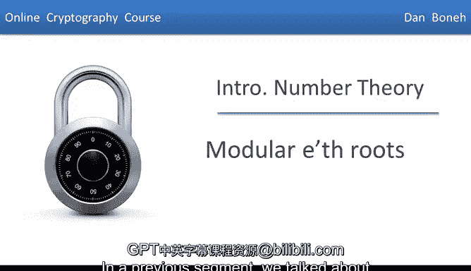
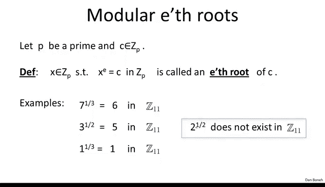
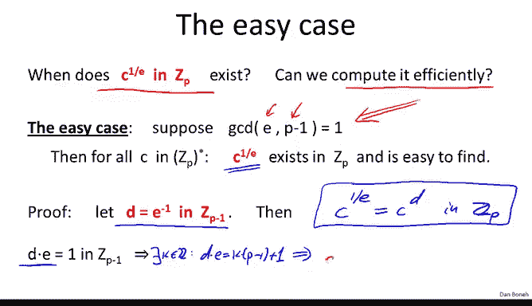
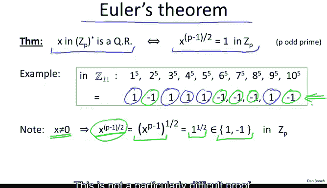
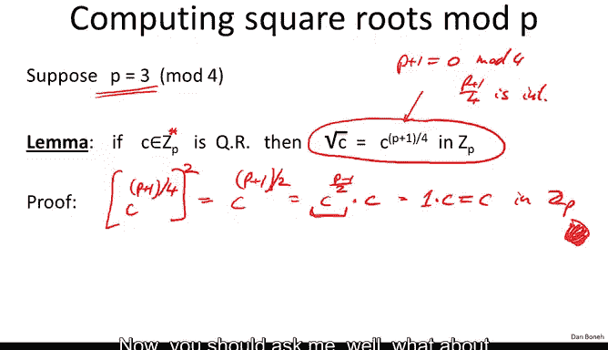

# 053：模e次根 🔢

在本节课中，我们将学习如何求解模二次方程，并更一般地探讨如何计算模e次根。我们将从回顾线性方程求解开始，逐步深入到更高次多项式，特别是模素数下的求解方法。

---

## 回顾：模线性方程求解

上一节我们讨论了如何求解模线性方程。其核心是使用求逆算法计算 `a` 的逆元 `a^{-1}`，然后乘以 `-b` 得到解。公式如下：

**公式：** `x ≡ a^{-1} * (-b) (mod p)`

---

## 模多项式求解简介

现在，我们关注更高次的多项式，特别是模素数 `p` 下的求解。我们感兴趣的多项式形式如下：

*   `x^2 - c ≡ 0 (mod p)`：求解 `x` 即计算 `c` 的平方根。
*   `y^3 - c ≡ 0 (mod p)`：求解 `y` 即计算 `c` 的立方根。
*   `z^37 - e ≡ 0 (mod p)`：求解 `z` 即计算 `e` 的37次根。

我们固定一个素数 `p`，并设 `c` 是 `Z_p` 中的一个元素。如果存在 `x ∈ Z_p` 满足 `x^e ≡ c (mod p)`，那么我们称 `x` 为 `c` 的模 `e` 次根。

**示例：**
*   在 `Z_11` 中，`7` 的立方根是 `6`，因为 `6^3 = 216 ≡ 7 (mod 11)`。
*   在 `Z_11` 中，`3` 的平方根是 `5`，因为 `5^2 = 25 ≡ 3 (mod 11)`。

需要注意的是，模 `e` 次根并不总是存在。例如，在 `Z_11` 中，`2` 的平方根就不存在。

---

## 简单情况：e 与 p-1 互质

当指数 `e` 与 `p-1` 互质时，情况非常简单。对于 `Z_p*` 中的任意 `c`，其模 `e` 次根总是存在，并且有一个高效的算法可以计算它。

以下是计算步骤：

1.  由于 `gcd(e, p-1) = 1`，我们可以计算 `e` 在模 `p-1` 下的逆元 `d`。即：`d * e ≡ 1 (mod p-1)`。
2.  `c` 的模 `e` 次根就是 `c^d mod p`。

**公式：** `c^{1/e} ≡ c^d (mod p)`，其中 `d ≡ e^{-1} (mod p-1)`。

**证明思路：** 验证 `(c^d)^e ≡ c (mod p)`。利用 `d*e = k*(p-1) + 1` 和费马小定理 `c^{p-1} ≡ 1 (mod p)`，即可完成证明。

这个算法一举两得：既证明了根的存在性，又提供了高效的计算方法。

---

## 较难情况：e 与 p-1 不互质（以 e=2 为例）

当 `e` 与 `p-1` 不互质时，情况变得复杂。最典型的例子是计算模奇素数 `p` 下的平方根（此时 `e=2` 必然整除 `p-1`）。

在奇素数模下，平方函数 `f(x) = x^2` 是一个“二对一”的函数，它将 `x` 和 `-x` 映射到同一个值 `x^2`。

**示例（模11）：**
*   `1^2 ≡ 10^2 ≡ 1 (mod 11)`
*   `2^2 ≡ 9^2 ≡ 4 (mod 11)`
*   `3^2 ≡ 8^2 ≡ 9 (mod 11)`

因此，并非所有元素都有平方根。这引出了以下定义：

*   **二次剩余：** 在 `Z_p` 中有平方根的元素。
*   **非二次剩余：** 在 `Z_p` 中没有平方根的元素。

对于奇素数 `p`，`Z_p*` 中恰好有一半的元素是二次剩余（加上元素 `0`，它总是二次剩余），另一半是非二次剩余。

---

### 欧拉准则：判断二次剩余

给定 `x ∈ Z_p*`，如何判断它是否是二次剩余？欧拉提供了一个简洁的判定准则：

**定理（欧拉准则）：** `x` 是模 `p` 的二次剩余，当且仅当 `x^{(p-1)/2} ≡ 1 (mod p)`。否则，`x^{(p-1)/2} ≡ -1 (mod p)`。

**示例（模11）：** 计算 `x^5 mod 11`。
*   当 `x = 1, 3, 4, 5, 9` 时，结果为 `1`，这些是二次剩余。
*   当 `x = 2, 6, 7, 8, 10` 时，结果为 `10 (即 -1)`，这些是非二次剩余。

值 `x^{(p-1)/2} mod p` 被称为勒让德符号 `(x/p)`，其结果只能是 `1` 或 `-1`。

然而，欧拉准则只解决了“存在性”判断问题，并没有告诉我们如何具体计算平方根。

---

### 计算模 p 下的平方根

计算平方根的算法分为两种情况：

**情况一：p ≡ 3 (mod 4)**
此时计算非常简单，有一个直接的公式：

**公式：** `sqrt(c) ≡ c^{(p+1)/4} (mod p)`

**验证：** `(c^{(p+1)/4})^2 = c^{(p+1)/2} = c^{(p-1)/2} * c ≡ 1 * c ≡ c (mod p)`。这里用到了对于二次剩余 `c`，有 `c^{(p-1)/2} ≡ 1`。

**情况二：p ≡ 1 (mod 4)**
此时没有像上面那样简单的确定性公式。但是，存在高效的**随机化算法**可以在多项式时间内计算出平方根。一个有趣的事实是，如果扩展黎曼猜想成立，那么将存在确定性的多项式时间算法。就目前所知，计算平方根的时间复杂度约为 `O(log^3 p)`。

---

### 求解模 p 下的二次方程

掌握了平方根的计算方法后，我们现在可以求解模 `p` 下的二次方程 `ax^2 + bx + c ≡ 0 (mod p)`。

求解过程与高中代数类似，使用求根公式：

**公式：** `x ≡ [-b ± sqrt(b^2 - 4ac)] * (2a)^{-1} (mod p)`

我们需要计算：
1.  `(2a)^{-1} mod p`：使用扩展欧几里得算法求逆。
2.  `sqrt(b^2 - 4ac) mod p`：使用上一小节介绍的平方根算法。
方程有解的前提是 `b^2 - 4ac` 是模 `p` 下的二次剩余。

---

## 模合数 N 下的 e 次根

现在，我们将问题扩展到模合数 `N` 的情况：何时存在模 `e` 次根？如果存在，能否高效计算？

这个问题变得**极其困难**。据我们所知，对于一般的 `e`，计算模合数 `N` 的 `e` 次根的难度，与**分解 `N` 的难度相当**。

目前最好的算法都需要先分解模数 `N`。一旦成功分解 `N = p * q`，问题就简化为：
1.  分别在模 `p` 和模 `q` 下计算 `e` 次根（这相对容易）。
2.  利用中国剩余定理将两个解组合成模 `N` 下的解。

这是一个鲜明的对比：计算模素数的 `e` 次根通常很容易，但计算模合数的 `e` 次根则异常困难，其安全性依赖于大整数分解的困难性。

---

## 总结

本节课我们一起学习了模 `e` 次根的计算：
1.  **模素数 p：**
    *   **简单情况 (`gcd(e, p-1)=1`)：** 根恒存在，可通过 `c^{e^{-1} mod (p-1)}` 直接计算。
    *   **平方根情况 (`e=2`)：** 仅一半元素有根。可用欧拉准则判断。计算时，若 `p≡3 mod 4` 有直接公式；若 `p≡1 mod 4` 需用随机化算法。
    *   由此可求解模 `p` 下的二次方程。
2.  **模合数 N：** 计算 `e` 次根被认为与分解 `N` 一样困难，这是许多密码学方案安全性的基础。

下一节，我们将转向模运算算法，探讨模素数和合数下的加法、乘法及幂运算。