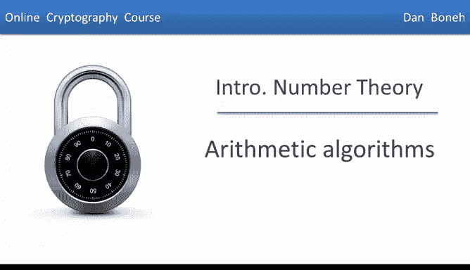
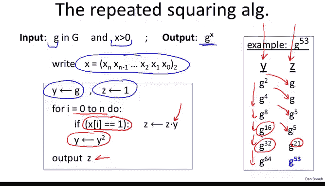
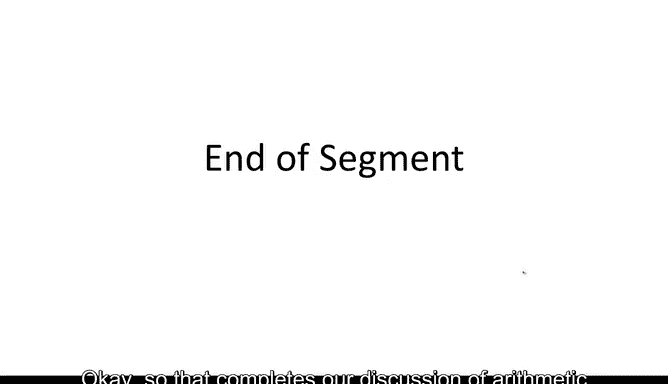

# 054：算术算法

在本节课中，我们将学习如何计算大整数的模运算。我们将从大整数在计算机中的表示方法开始，然后探讨加法、减法、乘法和除法的计算复杂度。最后，我们将重点学习一种称为“重复平方法”的高效算法，用于计算大指数幂。

## 大整数的表示

首先，我们来看看如何在计算机中表示大整数。这其实相当直接。想象我们在一台64位机器上，我们会将要表示的数字分解成多个32位的“桶”。这些32位的桶组合在一起，就代表了我们要存储在计算机中的数字。

需要说明的是，64位寄存器只是一个例子。实际上，许多现代处理器拥有128位甚至更宽的寄存器，并且可以在其上执行乘法运算。因此，通常我们会使用比32位大得多的块。之所以限制在32位，是为了确保两个块相乘的结果仍然小于机器的字长（例如64位）。

## 基本算术运算的复杂度

接下来，我们看看具体的算术运算，了解每种运算需要多长时间。

### 加法与减法

加法与减法基本上是带进位的加法或带借位的减法。这些是线性时间操作。换句话说，如果要相加或相减两个n位整数，运行时间基本上与n成线性关系。

### 乘法

朴素乘法需要二次方时间。这实际上就是所谓的“高中算法”，即你在学校学到的那种乘法。思考一下你会发现，该算法的运行时间与相乘数字的长度成二次方关系。

在20世纪60年代，卡拉楚巴算法带来了一个重大惊喜，它实现了比二次方时间好得多的性能，其运行时间为O(n^1.585)。这个1.585基本上是log₂3。

更令人惊讶的是，使用目前最好的乘法算法，实际上可以在大约O(n log n)的时间内完成乘法，几乎是线性时间。然而，这是一个极其渐近的结果，大O符号中隐藏了非常大的常数。因此，该算法仅在数字绝对巨大时才变得实用，所以并不常用。卡拉楚巴算法则非常实用，大多数密码学库都实现了它用于乘法。

为了简单起见，在这里我将忽略卡拉楚巴算法，并假设乘法以二次方时间运行。但在你的脑海中应该始终记得，乘法实际上比二次方要快一点。

### 带余除法

在乘法之后，下一个问题是带余除法。事实证明，这也是一个二次方时间算法。

## 指数运算与重复平方法

剩下的主要操作，也是我们迄今为止多次使用但从未解释如何计算的操作，就是指数运算问题。

让我们更抽象地解决这个指数运算问题。想象我们有一个有限循环群G。这意味着该群由某个生成元g的幂次生成。例如，可以将这个群视为Z_p^*，将小g视为大G的某个生成元。

我这样表述的原因，是希望你们开始习惯这种抽象，即我们处理一个通用群G，而Z_p^*只是这种群的一个例子。实际上，还有许多其他有限循环群的例子。再次强调，群G基本上就是这个生成元的幂次，直到群的阶，我将其写作g^q。

现在，我们的目标是给定这个元素g和某个指数x，计算g^x的值。

你可能会想，如果x等于3，我想计算g^3。这没什么可做的，我只需要做g * g * g，就得到了g^3。这确实很容易。但事实上，这不是我们感兴趣的情况。在我们的案例中，指数将是巨大的。想象一个500位的数字。如果你试图通过g乘以g再乘以g……来计算g的500次方，这将花费相当长的时间，实际上是指数时间，这不是我们想做的。

问题是，即使x是巨大的，我们是否仍然能相对快速地计算g^x？答案是肯定的，实现这一点的算法称为“重复平方法”。

让我展示重复平方法是如何工作的。我们以计算g^53为例。朴素方法需要53次g的连乘。但我想展示如何快速完成。

我们将把53写成二进制形式。53的二进制表示是110101。这意味着53等于32 + 16 + 4 + 1。

因此，g^53 = g^(32+16+4+1)。利用指数运算规则，我们可以将其分解为g^32 * g^16 * g^4 * g^1。这应该让你开始明白如何快速计算g^53了。

以下是计算步骤：
1.  我们取g，开始将其平方。
2.  平方一次得到g^2。
3.  再平方得到g^4。
4.  再平方得到g^8。
5.  再平方得到g^16。
6.  再平方得到g^32。
7.  现在，我们只需将适当的幂次相乘，得到g^53。

所以，g^1 * g^4 * g^16 * g^32 就得到了我们想要的值g^53。

这里我们看到，我们只需要进行5次平方运算，加上4次乘法运算。总共9次乘法，我们就计算出了g^53。这非常有趣。事实证明，这是一种普遍现象，允许我们将g提升到非常高的幂次，并且非常快速地完成。

让我展示这个算法。输入是元素g和指数x，输出是g^x。

算法步骤如下：
1.  将x写成二进制表示法。假设x有n位。
2.  我们使用两个寄存器：Y寄存器不断被平方，Z寄存器是一个累加器，根据需要乘以g的适当幂次。
3.  我们从最低有效位开始，循环遍历x的每一位。
4.  在每次迭代中，我们平方y（即 y = y * y）。
5.  每当指数x的对应位为1时，我们将y的当前值累加到累加器z中（即 z = z * y）。
6.  循环结束后，输出z。

这就是整个重复平方法算法。

让我们用g^53的例子来看一下。Y列在迭代过程中不断平方，遍历2的幂次。Z列更有趣，它在指数对应位为1时累加g的适当幂次。例如，指数的第一位是1，所以在第一次迭代后，z等于g。第二位是0，z不变。第三位是1，我们将g^4累加到z中，以此类推，最终得到g^53。

这个算法的迭代次数基本上是log₂(x)。即使x是一个500位的数字，也只需要大约500次迭代（实际上是约1000次乘法，因为每次迭代需要一次平方和可能一次累乘），我们就能将g提升到500位指数的幂次。

## 运行时间总结

现在我们可以总结运行时间了。假设我们有一个n位模数N。
*   **加法/减法**：在Z_N中为线性时间 O(n)。
*   **乘法**：为简单起见，我们说是二次时间 O(n²)。（实际有更快的算法如卡拉楚巴）。
*   **指数运算**：基本上需要log(x)次迭代，每次迭代我们基本上进行两次乘法。所以运行时间是O(log(x) * T_multiply)。假设乘法时间是二次的，那么运行时间就是O(n² log x)。由于x总是小于N（根据费马小定理，将g提升到大于模数的幂次没有意义），假设x也是一个n位整数，那么指数运算实际上是一个立方时间算法 O(n³)。这就是我希望你记住的：指数运算实际上是一个相对较慢的操作。

如今，在现代计算机上这需要几微秒，但对于一个4GHz的处理器来说，几微秒也是相当多的工作量。请记住，我们讨论的所有指数运算操作，例如判断一个数是否为二次剩余，所有这些指数运算基本上都需要立方时间。

本节课中，我们一起学习了计算机中表示大整数的方法，回顾了基本算术运算（加、减、乘、除）的时间复杂度，并重点掌握了用于高效计算大指数幂的“重复平方法”算法。理解这些基础算术算法的效率，对于后续学习密码学中的困难问题至关重要。在下一节中，我们将开始讨论关于模数、素数与合数的困难问题。