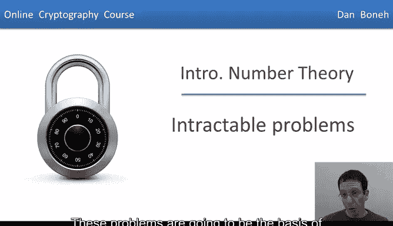
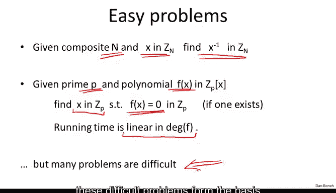
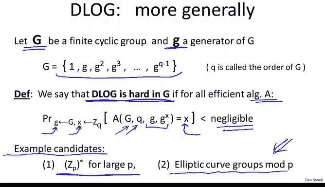
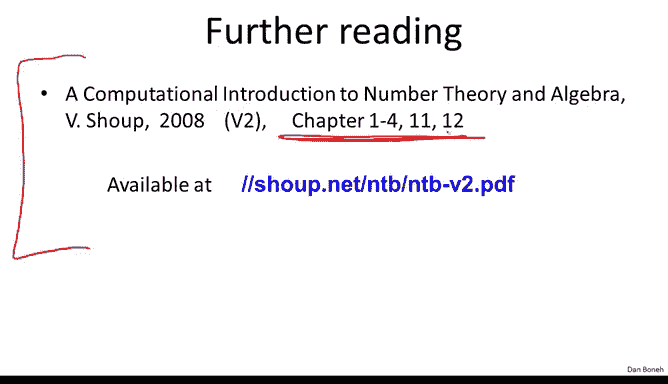

# 055：难解问题

在本节课中，我们将学习模运算中的一些难解问题。这些问题将是下周我们构建密码系统的基础。

首先需要指出，模运算中存在许多简单问题。例如，给定一个整数 N 和 Z_N 中的一个元素 x，使用欧几里得算法求 x 的逆元实际上非常容易。同样，给定一个素数 p 和一个多项式 f，在 Z_p 中寻找该多项式的根也相对容易。事实上，存在一个高效算法，其运行时间与多项式的次数呈线性关系。因此，至少对于低次多项式，在模素数下求根是相当容易的。

然而，模运算中的许多问题实际上相当困难。正如我所说，这些难题构成了许多公钥密码系统的基础。

## 模素数下的经典难题

让我们来看一些模素数下的经典难题。固定一个大的素数 P，可以将其想象为一个600位的素数。然后固定 Z_P* 中的一个元素 G，并假设该元素 G 的阶恰好是一个数 Q。

现在考虑指数函数，它简单地将一个数 x 映射到元素 G^x。我们在上一节中已经证明，使用重复平方法可以轻松计算这个函数。因此，计算 G^x 实际上可以非常高效地完成。

但让我们看看逆问题。逆问题基本上是：给定 G^x，现在要求你找到它的对数，即值 x。在实数域中，给定 G^x 求 x 正是对数函数的定义。但这里我要求你求模素数 P 下的对数。这个问题被称为**离散对数问题**。G^x 以 G 为底的离散对数就是指数 x。因此，我们的目标是输出某个在 0 到 Q-2 范围内的指数 x，该指数恰好是 G^x 的对数。

让我们看一个例子。假设我们观察模11的整数，这里我写下了以2为底的 Z_11 中的离散对数函数。首先，1的离散对数是0，因为 2^0 = 1。类似地，2的离散对数是1，因为 2^1 = 2。4的离散对数是2，因为 2^2 = 4。8的离散对数是3，因为 2^3 = 8，依此类推。

这里我为你列出了离散对数值。让我问你一个谜题：5模11的离散对数是多少？答案是4，因为 2^4 = 16，而 16 ≡ 5 (mod 11)。这说明以2为底的5的离散对数是4。

一般来说，离散对数函数实际上相当难以计算。当然，对于小素数来说很容易，你可以制作一个表格并读出离散对数值。但如果素数 P 是一个大数，比如一个2000位的数，那么计算离散对数就相当困难，我们没有好的算法来做到这一点。

## 离散对数问题的通用定义

让我们更通用地定义离散对数问题。不局限于群 Z_P*，让我们抽象地看一个通用群 G。我们有一个有限循环群，其生成元为 g。这意味着这个群仅由 g 的所有幂次组成，我们取所有幂次直到其阶（在本例中，g 的阶为 Q）。这些幂次实际上构成了群 G。

如果实际上没有高效算法能够计算离散对数函数，我们就说离散对数问题在群 G 中是困难的。这意味着，如果你在群 G 中随机选择一个元素 g 和一个随机指数 x，我给算法 g 和 g^x（当然我还需要给它群的描述和群的阶），算法实际计算出离散对数的概率是可忽略的。如果这对所有高效算法都成立，那么我们就说离散对数问题在这个群 G 中是困难的。我们这样说是因为没有高效算法能够以不可忽略的概率计算离散对数。

正如我提到的，我们有几个候选群组，其中离散对数是困难的。典型例子是 Z_P*，这实际上是 Diffie-Hellman 在1974年提出的例子。但事实证明，还有其他候选群组，其中离散对数问题被认为是困难的。我之前提到的一个候选是所谓的椭圆曲线群，即椭圆曲线上的点集。我不在这里定义它，但正如我所说，如果你想让我讨论椭圆曲线密码学，我可以在课程的最后一周进行讲解。

这两个群组中，离散对数问题被认为是困难的。但就我们所知，离散对数问题在椭圆曲线上比在 Z_P* 中更难。换句话说，如果你给我两个大小相同的问题，一个在群 Z_P* 中，一个在椭圆曲线群中，椭圆曲线群中的问题将比 Z_P* 中的问题难得多。因为椭圆曲线上的离散对数问题比在 Z_P* 中更难，这意味着我们在使用椭圆曲线时可以使用更小的参数，而使用 Z_P* 则需要更大的参数。因此，基于椭圆曲线的系统将更高效，因为参数更小，而攻击者的工作难度却与 Z_P* 中使用大得多的素数时一样。

具体来说，在 Z_P* 中，存在一种用于离散对数的亚指数时间算法。如果你有一个 n 位的素数，该算法的运行时间大约为 e^(n^(1/3))。实际上，该算法的精确运行时间中还有许多其他项，但主导项是素数位数的立方根。由于这个算法的存在，如果我们希望离散对数问题与破解相应对称密钥一样困难，就必须使用相对较大的模数 P。

相比之下，如果你观察椭圆曲线群，情况要好得多。在椭圆曲线群上，我们拥有的最佳离散对数算法的运行时间为 e^(n/2)。这是一个真正的指数时间算法，因为对于大小为 n 的问题，运行时间大致是 e^n，是 n 的指数函数，而不是 n 的立方根的指数函数。因为问题困难得多，我们拥有的最佳算法实际上需要指数时间。你注意到，在椭圆曲线上，我们可以使用小得多的参数，同时仍然保持安全。顺便说一下，椭圆曲线大小恰好是对称密钥大小两倍的原因，正是由于这里指数中的因子 2。我们必须将椭圆曲线的大小加倍，才能使问题实际需要 e^n 的时间。实际上，我这里有一个小笔误，这应该是 2^(n/2)，但对数的确切底数并不重要。

我之前提到过，由于椭圆曲线的参数比 Z_P* 小，因此从模 P 密码学过渡到椭圆曲线密码学是一个缓慢的过程。同样，我会提到，如果你想让我更详细地描述椭圆曲线，我可以在课程的最后一周进行讲解。

## 离散对数问题的应用：构造抗碰撞哈希函数

既然我们理解了什么是离散对数问题，让我给你一个离散对数困难性的直接应用。具体来说，让我们基于离散对数问题构建一个抗碰撞哈希函数。

选择一个离散对数问题困难的群 G。如果你愿意，可以将 G 视为群 Z_P*，并假设群 G 具有素数阶 Q。Q 是某个素数，恰好是群 G 的元素数量。

为了定义我们的哈希函数，我们将在群 G 中选择两个元素，称之为 g 和 h。然后我们如下定义哈希函数：哈希函数在输入 x 和 y 时，将输出 G 中的一个元素，定义为 g^x * h^y。就是这样，一个非常简单的哈希函数。如果你还记得，我们在之前讨论压缩函数时甚至提到过这个哈希函数。

我想向你展示，这个函数 H 实际上是抗碰撞的，其意义在于：找到 H 的碰撞与在群 G 中计算离散对数一样困难。具体来说，如果你能为 H 找到一个碰撞，你就可以计算以 g 为底的 h 的离散对数。既然我们说群 G 中的离散对数是困难的，计算离散对数应该是困难的，因此找到 H 的碰撞也将是困难的。

让我们看看如何证明这一点。这实际上是一个非常巧妙的证明。我们将这样做：假设我们得到了函数 H 上的一个碰撞。我们得到了两个不同的数对 (x0, y0) 和 (x1, y1)，它们在函数 H 上发生碰撞。这意味着，如果我计算 H(x0, y0) 和 H(x1, y1)，我会得到一个碰撞，即得到等式：g^x0 * h^y0 = g^x1 * h^y1。

现在我可以进行一些操作。我将所有 g 移到一边，所有 h 移到另一边。这意味着 g^(x0 - x1) = h^(y1 - y0)。现在我可以对两边取 (y1 - y0) 次方根。换句话说，我取两边的 (y1 - y0) 次方根。一边将变成简单的 h，另一边将变成 g 的 (x0 - x1)/(y1 - y0) 次方。看看我们刚刚得到了什么：我们基本上将 h 表示为 g 的某个已知幂次。我们所做的只是除法，然后我们就完成了——我们刚刚计算出了以 g 为底的 h 的离散对数。

你可能会问，指数中的除法是什么意思？除以 (y1 - y0) 在指数中意味着什么？它的意思是，我们计算 (y1 - y0) 模 Q 的逆元，然后将结果乘以 (x0 - x1)，这就给出了清晰的指数。因此，我们刚刚得知了以 g 为底的 h 的离散对数。

这也说明了为什么我们希望 Q 是素数：我们需要确保 (y1 - y0) 总是可逆的。事实上，我们知道在模素数下，除了 0 之外，所有元素都是可逆的。这实际上引出了几个问题：如果 (y1 - y0) 恰好等于 0 怎么办？如果是这种情况，我们将无法得到离散对数，因为我们无法除以零。

但如果你思考一下，你会发现：如果 y1 - y0 = 0，那意味着 y1 = y0。但如果 y1 = y0，看看这个等式，那必然意味着 x0 也等于 x1。是的，这需要一点时间来理解：如果 y0 = y1，这两项基本上就抵消了，然后我们得到 x0 = x1。但如果 x0 = x1 且 y0 = y1，你给我的就不是一个碰撞，你只是给了我相同的数对两次，这是作弊，不被视为碰撞。因此，我不需要找到离散对数。但如果你给我一个碰撞，必然有 y0 ≠ y1，结果我就能得到以 g 为底的 h 的离散对数。

正如我们所说，由于离散对数在群 G 中被认为是困难的，这意味着这个非常简单的函数 H 必须是抗碰撞的。这是一个从寻找碰撞归约到计算离散对数的非常优雅的例子。

顺便说一下，我应该告诉你，这个函数并没有真正被使用。尽管这个函数有一个漂亮的抗碰撞性证明，但它并不常用，因为它相对较慢。本质上，每次哈希都必须计算两次指数运算，这比像 SHA-256 这样的函数以及其他类型的专用抗碰撞哈希函数要慢得多。

## 模合数下的难解问题

以上是关于模素数下难解问题的内容。现在让我们看看模合数下的一些难解问题。这里我们将再次观察，比如1024位的数，并定义集合 Z_{2N}。这将是所有整数的集合，这些整数恰好是两个素数的乘积，且这两个素数都是 n 位的素数。

这里的“2”对应于这样一个事实：这个集合中的数基本上有两个素因子，并且这两个素因子大小大致相同，都是 n 位的素数。在集合 Z_{2N} 中有两个经典的难解问题。

第一个问题是：如果我随机选择集合 Z_{2N} 中的一个整数，问题是分解它。对于1024位的数来说，这已经是一个相当困难的问题。虽然目前尚未实现，但很可能这种量级的数很快就会被分解。因此，目前推荐的值实际上是使用2048位的数，这仍然超出我们的能力范围，这些数我们仍然无法分解。

模合数下难解问题的另一个例子是：如果我给你一个非线性多项式（其次数大于1），并给你集合 Z_{2N} 中的一个随机合数，你的目标是找到该多项式的一个根，即找到一个 x，使其成为该多项式的根。同样，我们不知道如何做到这一点。当然，如果次数等于1，那只是解线性方程，我们已经知道这很容易。但是一旦次数变成非线性的，我们不知道如何在不首先分解模数然后计算群的情况下模 N 求解这个问题。

有一些系统，例如 RSA，依赖于特定多项式的这个问题的困难性，我们将在下周看到。作为一个例子，我应该提到，例如，在随机合数 Z_{2N} 下取平方根或立方根被认为是困难的。

关于分解问题，实际上有很多已知信息。这是一个非常古老的问题，古希腊人就对分解感兴趣。高斯实际上有一段精彩的引述，谈到了分解问题和素性测试问题。在他1805年的著名论文中，他写道：“区分素数和合数的问题（即素性测试）以及将后者（即合数）分解为其素因子的问题，被认为是算术中最重要和最有用的（问题）之一。”他有远见地意识到这些是极其有趣的问题。这些本质上是计算机科学问题：我们如何测试一个数是否为素数？如果一个数不是素数而是合数，我们如何分解它？高斯已经意识到这些是极其重要和有趣的问题，如今这些问题实际上在网络上被广泛使用。

事实上，测试一个数是否为素数已经完全解决了。我们现在知道如何使用随机算法高效地做到这一点，甚至知道如何使用确定性算法做到这一点。将合数分解为其素因子，这仍然被认为是一个难题。我鼓励你思考一下这个问题。这是一个值得思考的奇妙问题。如果你们中有人能解决它，提出一个将合数分解为素因子的算法，正如我所说，这将在密码学界立即成名，并对整个网络的安全产生巨大影响。所以，这是一个有趣的问题。

让我告诉你关于分解问题的已知情况。我们拥有的最佳算法称为数域筛法。它的运行时间也是这种指数形式，是指数的立方根，这就是为什么合数必须相当大才能使问题困难。尽管目前的世界纪录只是分解了一个768位的数，这被称为 RSA-768 挑战数，是一个最近被分解的约200位的数。分解这个数已经耗费了巨大的工作量，大约在数百台机器上花费了两年时间。最终他们成功分解了这个数。据估计，分解一个1024位的数比分解 RSA-768 大约困难1000倍。因此，不是两年，而是需要2000年。当然，计算机速度越来越快，我们有更多的核心和计算机可用。这个1000倍的因子，假设摩尔定律等，实际上只意味着一个十年。计算机速度大约每十年提高1000倍。因此，很可能在未来十年内，我们将看到1024位数的分解，这将意味着1024位公钥密码学的终结。

这就是分解领域的最新技术水平，本模块到此结束。我会提到，如果你想阅读更多关于我们讨论的任何主题的内容，网上有一本好书，是 Victor Shoup 写的免费电子书，你可以下载。特别是，我们讨论的主题涵盖在第1至4章、第11章和第12章。我鼓励你去看一看，希望这有助于理解材料。

下周，我们将开始使用刚刚学到的主题构建密码系统。