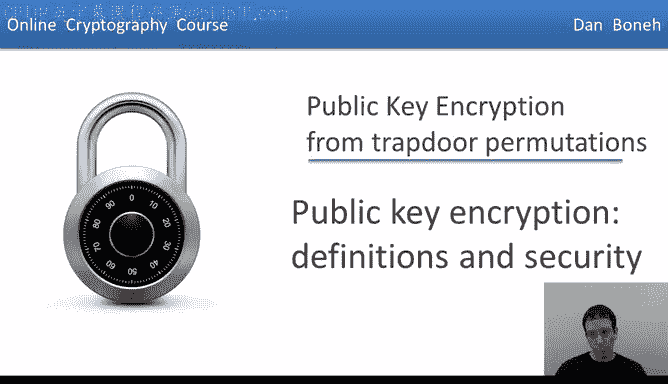
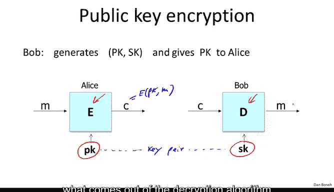
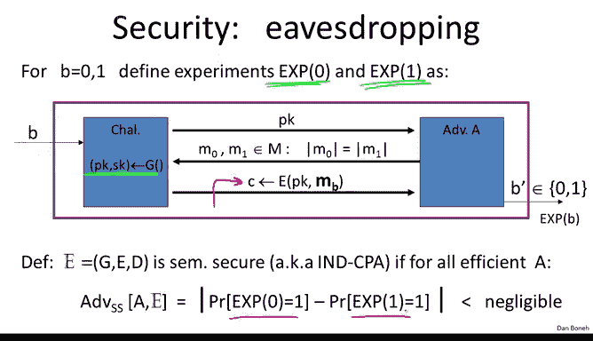
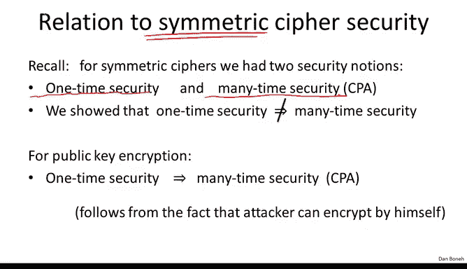
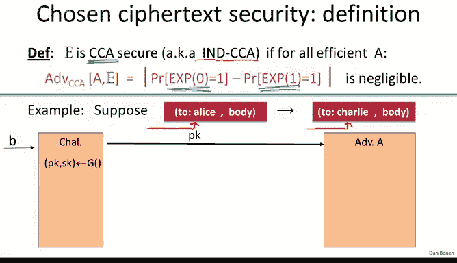
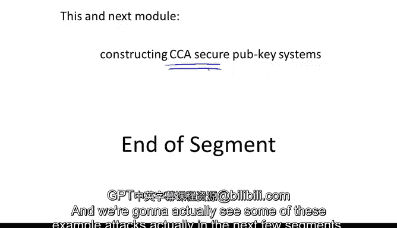

# 056：定义与安全性 🔐

在本节课中，我们将要学习公钥加密的基本定义及其安全性概念。我们将从回顾公钥加密的构成开始，然后详细探讨其安全性，特别是针对窃听攻击和更强大的选择密文攻击的安全性定义。

## 公钥加密系统回顾

上一周我们学习了许多公钥加密所需的理论。本节中，我们来看看如何将这些知识付诸实践，构建安全的公钥加密方案。但首先，我们需要明确什么是公钥加密，以及公钥加密的安全性意味着什么。

让我提醒你，在一个公钥加密方案中，有一个加密算法（我们通常用 **E** 表示）和一个解密算法（用 **D** 表示）。然而，这里的加密算法需要一个公钥，而解密算法需要一个私钥。

这对密钥被称为**密钥对**。公钥用于加密消息，而私钥用于解密消息。

因此，在这种情况下，消息 **M** 使用公钥进行加密，得到的结果是密文 **C**。

类似地，密文被输入到解密算法中，并使用私钥进行解密。解密算法输出的就是原始消息 **M**。

## 公钥加密的应用

公钥加密有许多应用。上周我们看到了经典应用——会话建立，即密钥交换。目前我们只关注仅能抵抗窃听的密钥交换。如果你还记得协议的工作方式，基本上爱丽丝会生成一个公钥-私钥对，并将公钥发送给鲍勃。鲍勃会生成一个随机的 **x**，这将作为他们的共享秘密，然后他将 **x** 用爱丽丝的公钥加密后发送给她。爱丽丝可以解密并恢复 **x**，现在他们双方都拥有了这个共享秘密 **x**，可以用来安全地通信。攻击者当然只能看到公钥和用公钥加密的 **x**，他应该无法从中获取关于 **x** 的任何信息。我们将更精确地定义这一点，以理解“无法了解关于 **x` 的任何信息”意味着什么。

公钥加密实际上还有许多其他应用。例如，它在非交互式应用中非常有用。以电子邮件系统为例。

这里，鲍勃想给爱丽丝发送邮件。当鲍勃发送邮件时，邮件会从一个邮件中继传递到另一个邮件中继，最终到达爱丽丝那里，此时爱丽丝应该能够解密。电子邮件系统的设置是为非交互式场景设计的，鲍勃发送邮件，然后爱丽丝接收，爱丽丝不需要与鲍勃通信来解密邮件。因此，在这种情况下，由于非交互性，爱丽丝和鲍勃之间没有机会建立共享秘密。所以，这里发生的情况是，鲍勃基本上会使用爱丽丝的公钥加密邮件并发送。世界上任何人都可以使用她的公钥加密邮件发送给爱丽丝。当爱丽丝收到这封邮件时，她使用自己的私钥解密密文并恢复明文消息。

当然，在这样的系统中有一个需要注意的地方是，鲍勃需要以某种方式获得爱丽丝的公钥。目前我们假设鲍勃已经拥有爱丽丝的公钥，但稍后当我们讨论数字签名时，我们将看到如何通过所谓的公钥管理非常高效地完成这项工作。正如我所说，我们稍后会再回到这个问题，但我想让你记住的主要一点是，公钥加密用于会话建立，这在网络上非常常见，公钥加密用于在网络浏览器和网络服务器之间建立安全密钥。

公钥加密对于非交互式应用也非常有用，世界上任何人非交互式地需要向爱丽丝发送消息时，都可以使用爱丽丝的公钥加密消息，而爱丽丝可以解密并恢复明文。

## 公钥加密系统的构成

让我更详细地提醒你公钥加密系统是什么。它由三个算法组成：**G**、**E** 和 **D**。

*   **G** 被称为密钥生成算法。基本上，它会生成这个密钥对，即公钥和私钥。如上所述，**G** 不接受参数，但在现实生活中，**G** 实际上接受一个称为安全参数的参数，该参数指定此密钥生成算法生成的密钥大小。
*   然后是这些加密算法，像往常一样，它们接受一个公钥和一个消息，并产生一个密文。
*   解密算法接受相应的私钥和一个密文，并产生相应的消息。

像往常一样，为了保持一致性，我们说，如果我们在给定的公钥下加密一条消息，然后用相应的私钥解密，我们应该得到原始消息。

## 公钥加密的安全性定义

我将从定义针对窃听的安全性开始，然后我们将定义针对主动攻击的安全性。

定义针对窃听的安全性的方式与我们之前看到的对称加密情况非常相似，上周我们已经看到了这一点，所以我将快速回顾一下。基本上，攻击游戏定义如下：我们定义两个实验，实验0和实验1。在任一实验中，挑战者将生成一个公钥-私钥对，并将公钥交给对手。对手将输出两个等长的消息 **M0** 和 **M1**，然后他得到的是 **M0** 的加密或 **M1** 的加密。在实验0中，他得到 **M0** 的加密；在实验1中，他得到 **M1** 的加密。然后对手应该说出他得到的是哪一个：是 **M0** 的加密还是 **M1** 的加密。

在这个游戏中，攻击者只得到一个密文。这对应于一次窃听攻击，他只是窃听到了那个密文 **C**。现在他的目标是判断密文 **C** 是 **M0** 的加密还是 **M1** 的加密。目前还不允许对密文 **C** 进行篡改。

像往常一样，我们说一个公钥加密方案是语义安全的，如果攻击者无法区分实验0和实验1。换句话说，他无法分辨他得到的是 **M0** 的加密还是 **M1** 的加密。

## 与对称加密定义的比较

在我们转向主动攻击之前，我想提一下我们刚刚看到的定义与对称密码窃听安全定义之间的一个快速关系。如果你还记得，当我们讨论对称密码的窃听安全时，我们区分了密钥使用一次和密钥使用多次的情况。事实上，我们看到存在明显的区别。例如，如果密钥用于加密单个消息，一次一密是安全的，但如果密钥用于加密多个消息，则完全不安全。事实上，我们有两个不同的定义：一个是一次性安全的定义，另一个是当密钥多次使用时更强的单独定义。

我在上一张幻灯片上展示的定义与对称密码的一次性安全定义非常相似。事实上，对于公钥加密来说，如果一个系统在某种意义上对一次性密钥是安全的，那么它对多次使用密钥也是安全的。换句话说，我们不必明确赋予攻击者请求加密他选择的消息的能力，因为他可以自己创建这些加密。他被给予了公钥，因此他可以自己加密任何他喜欢的消息。

因此，在某种意义上，任何公钥-私钥对本质上都用于加密多个消息，因为攻击者可能已经使用我们在第一步中给他的公钥加密了许多他自己选择的消息。

所以，结果就是，事实上，一次性安全的定义足以暗示多次使用的安全性，这就是为什么我们将这个概念称为**选择明文攻击下的不可区分性**。

这只是一个小点，用于解释为什么在公钥加密的设置中，我们不需要更复杂的定义来捕捉窃听安全性。

## 主动攻击与选择密文安全

现在我们理解了窃听安全性，让我们看看能够发起主动攻击的更强大的对手。

特别是，让我们看看电子邮件示例。这里我们有我们的朋友鲍勃，他想给他的朋友卡罗琳发送邮件，而卡罗琳恰好有一个Gmail账户。其工作方式基本上是邮件被发送到Gmail服务器，经过加密，Gmail服务器解密邮件，查看预期收件人，然后如果预期收件人是卡罗琳，它将邮件转发给卡罗琳；如果预期收件人是攻击者，它将邮件转发给攻击者。

这类似于Gmail的实际工作方式，因为发件人会通过SSL加密将邮件发送到Gmail服务器，Gmail服务器会终止SSL，然后将邮件转发给适当的收件人。

现在假设鲍勃使用一个允许对手篡改密文而不被检测的系统加密邮件。例如，想象这封邮件是使用计数器模式之类的东西加密的。

那么当攻击者拦截这封邮件时，他可以更改收件人，使收件人现在显示为 `attacker@gmail.com`。我们知道，对于计数器模式来说，这很容易做到。攻击者知道邮件是发给卡罗琳的，他只对邮件正文感兴趣，因此他可以轻松地将邮件收件人更改为 `attacker@gmail.com`。现在当服务器收到邮件时，它会解密，看到收件人应该是攻击者，并将正文转发给攻击者。现在攻击者就能够阅读原本打算给卡罗琳的邮件正文了。

这是一个典型的主动攻击示例。你注意到攻击者在这里可以做的是，它可以解密任何预期收件人是“收件人：攻击者”的密文，即任何明文以“收件人：攻击者”开头的密文。

所以我们的目标是设计安全的公钥系统，即使攻击者可以篡改密文并可能解密某些密文。再次强调，这里的攻击者的目标是获取消息正文，攻击者已经知道邮件是发给卡罗琳的，他所要做的只是更改预期收件人。

## 选择密文安全定义

篡改攻击引出了选择密文安全的定义。事实上，这是公钥加密的标准安全概念。

让我解释一下攻击游戏如何进行。正如我所说，我们的目标是构建在这种非常保守的加密概念下安全的系统。这里我们有一个加密方案 **G, E, D**，假设它定义在消息空间和密文空间 **M, C** 上。像往常一样，我们将定义两个实验：实验0和实验1。这里的 **b** 表示挑战者是在实现实验0还是实验1。挑战者首先生成一个公钥-私钥对，然后将公钥交给对手。

现在对手可以说：“这里有一堆密文，请为我解密它们。” 因此，对手提交密文 **C1**，他得到密文 **C1** 的解密结果 **M1**。他可以一次又一次地这样做：提交密文 **C2**，得到解密结果 **M2**；提交密文 **C3**，得到解密结果 **M3**，依此类推。最终，对手表示查询阶段结束，现在他像往常一样提交两个等长的消息 **M0** 和 **M1**，并收到作为响应的挑战密文 **C**，该密文是 **M0** 的加密或 **M1** 的加密，具体取决于我们是在实验0还是实验1。

现在对手可以继续发出密文查询，即他可以继续发出解密请求。他提交一个密文，并得到该密文的解密结果。但当然，这里必须有一个限制：如果攻击者可以提交他选择的任意密文，他当然可以破解挑战。他会做的是将挑战密文 **C** 作为解密查询提交，然后他就会被告知在挑战阶段他得到的是 **M0** 的加密还是 **M1** 的加密。因此，我们在这里设置了限制，规定他实际上可以提交他选择的任何密文，除了挑战密文。

因此，攻击者可以请求解密他选择的任何密文，只要不是挑战密文。即使他得到了所有这些解密结果，他仍然不应该能够分辨出他得到的是 **M0** 的加密还是 **M1** 的加密。

你注意到这是一个非常保守的定义。它赋予了攻击者比我们在上一张幻灯片上看到的更多的权力。在上一张幻灯片中，攻击者只能解密那些明文以“收件人：攻击者”开头的消息。这里我们说，攻击者可以解密他选择的任何密文，只要它与挑战密文 **C** 不同。

然后他的目标是说出挑战密文是 **M0** 的加密还是 **M1** 的加密。像往常一样，如果他不能做到这一点，换句话说，他在实验0中的行为与在实验1中的行为基本相同，那么即使他拥有所有这些权力，他也无法区分 **M0** 的加密和 **M1** 的加密，我们就说该系统是**选择密文安全**的，即 **CCA 安全**。有时有一个缩写词，其缩写是“选择密文攻击下的不可区分性”，但我只说 **CCA 安全性**。

## CCA 安全如何捕捉电子邮件示例

让我们看看这如何捕捉我们之前看到的电子邮件示例。假设使用的加密系统使得攻击者仅给定消息的加密，就可以将预期收件人从“给爱丽丝”更改为“给查理”。

以下是他在 CCA 游戏中获胜的方式：第一步，他被给予公钥。

然后攻击者会做的是，他会发出两个等长的消息，即在第一个消息中，正文是0，在第二个消息中，正文是1，但两个消息都是发给爱丽丝的。作为响应，他将被给予挑战密文 **C**。

现在，我们有了挑战密文 **C**。攻击者接下来要做的是，他将利用他在这里修改预期收件人的能力，发送回一个密文 **C'**，其中 **C'** 是消息“给查理，正文为挑战正文 **b**”的加密。

记住，**b** 要么是0，要么是1。因为明文不同，我们知道密文也必然不同，所以特别是 **C'** 必须与挑战密文 **C** 不同。因此，这里的 **C'** 必须不同于 **C**。结果，根据 CCA 游戏的定义，可怜的挑战者现在必须解密。挑战者必须解密任何不等于挑战密文的密文。所以挑战者解密，给对手 **M'**，基本上他给了对手 **b**，现在对手可以输出挑战 **b**，并以优势1赢得游戏。因此，对于这个特定方案，他的优势是1。仅仅因为攻击者能够将挑战密文从一个收件人更改为另一个收件人，就允许他以优势1赢得 CCA 游戏。

正如我所说，**CCA 安全性**实际上是公钥加密系统的正确安全概念。这是一个非常、非常有趣的概念。基本上，即使攻击者拥有解密他想要的任何东西的能力（除了挑战密文），他仍然无法了解挑战密文是什么。

因此，我们在本模块剩余部分以及下一个模块的目标是构建 **CCA 安全**的系统。实际上，这是可以实现的，这相当了不起，我将向你展示具体如何做到。事实上，我们构建的那些 **CCA 安全**系统正是现实世界中使用的系统。每当一个系统试图部署非 **CCA 安全**的公钥加密机制时，总会有人提出攻击并能够破解它。我们实际上将在接下来的几个部分中看到一些这样的攻击示例。

## 总结

本节课中我们一起学习了公钥加密的核心定义。我们回顾了公钥加密系统的构成，包括密钥生成算法 **G**、加密算法 **E** 和解密算法 **D**。我们定义了针对窃听攻击的语义安全性，并将其与对称加密的安全性概念进行了比较。更重要的是，我们深入探讨了针对主动攻击的选择密文安全概念，即 **CCA 安全性**。这是一个非常强大的安全概念，要求即使攻击者能够解密除挑战密文外的任意密文，也无法获取挑战密文所保护消息的任何信息。理解这些定义是设计和分析安全公钥加密方案的基础。