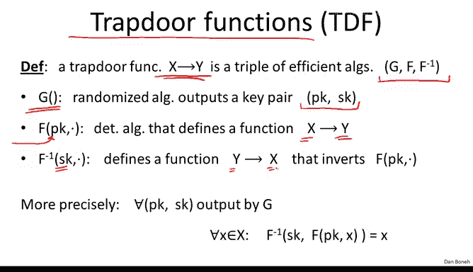
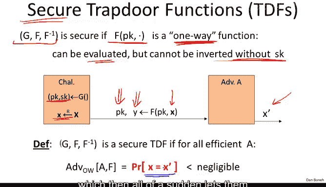
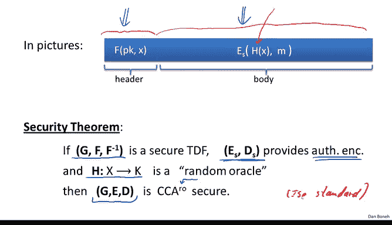
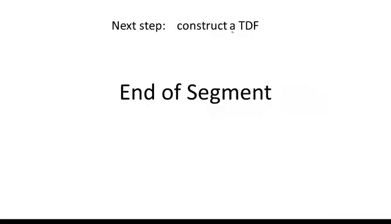

# 057：构造方法 🔐

在本节课中，我们将学习如何利用“陷门置换”这一核心概念来构建公钥加密系统。我们将首先定义陷门函数及其安全性，然后展示如何将其与对称加密方案结合，从而构造出安全的公钥加密方案。最后，我们会指出一个常见但完全不安全的错误构造方法。

## 陷门函数定义

上一节我们介绍了公钥加密系统及其安全目标。本节中，我们来看看构建安全公钥加密的一个基础工具：陷门函数。

陷门函数本质上是一个从集合 X 映射到集合 Y 的函数，它由三个算法定义：
*   **密钥生成算法 G**：生成一个密钥对 `(PK, SK)`。
*   **函数 F**：使用公钥 `PK`，可以轻松计算任何 `x ∈ X` 对应的 `y = F_PK(x) ∈ Y`。
*   **逆函数 F⁻¹**：使用私钥 `SK`，可以轻松计算任何 `y ∈ Y` 对应的原像 `x = F⁻¹_SK(y) ∈ X`。

其核心思想是：**拥有公钥 `PK` 可以轻松正向计算函数，但只有拥有私钥 `SK`（即“陷门”）才能轻松反向计算（求逆）**。

## 陷门函数的安全性

一个陷门函数是安全的，当且仅当函数 `F_PK` 是一个**单向函数**。这意味着在不知道私钥 `SK` 的情况下，即使知道公钥 `PK` 和函数输出 `y`，任何高效的攻击者也无法计算出其原像 `x`。

我们可以通过一个安全游戏来形式化定义：

1.  挑战者运行 `G()` 生成 `(PK, SK)`，并随机选取 `x ∈ X`。
2.  挑战者计算 `y = F_PK(x)`，并将 `(PK, y)` 发送给攻击者。
3.  攻击者输出一个猜测值 `x‘`。

如果对于所有高效的攻击者，其成功输出 `x‘ = x` 的概率都是可忽略的，那么这个陷门函数就是安全的。

## 从陷门函数构建公钥加密

理解了陷门函数后，我们就可以用它来构建公钥加密系统。除了陷门函数，我们还需要另外两个工具：
1.  **一个安全的对称加密方案**：要求能抵抗主动攻击，即提供认证加密。
2.  **一个哈希函数 H**：用于将陷门函数的输入域 `X` 映射到对称加密的密钥空间 `K`，即 `H: X → K`。

以下是构建公钥加密系统的具体步骤：

### 密钥生成
公钥加密的密钥生成与陷门函数的密钥生成完全相同：
`(PK, SK) ← G()`，其中 `PK` 是公钥，`SK` 是私钥。

### 加密算法
加密算法输入公钥 `PK` 和明文消息 `M`，步骤如下：
1.  随机选取 `x ← X`。
2.  计算 `y = F_PK(x)`。
3.  计算对称密钥 `k = H(x)`。
4.  使用对称密钥加密明文：`c ← E_sym(k, M)`。
5.  输出密文 `CT = (y, c)`。

**注意**：陷门函数仅作用于随机值 `x`，而消息 `M` 本身是用由 `x` 派生的对称密钥加密的。

### 解密算法
解密算法输入私钥 `SK` 和密文 `CT = (y, c)`，步骤如下：
1.  使用陷门逆函数恢复 `x`：`x = F⁻¹_SK(y)`。
2.  重新计算对称密钥：`k = H(x)`。
3.  使用对称密钥解密密文：`M = D_sym(k, c)`。
4.  输出明文 `M`。

### 安全性定理
如果满足以下三个条件，那么上述构造的公钥加密系统是CCA安全的：
1.  陷门函数是安全的（即 `F_PK` 是单向函数）。
2.  对称加密方案提供认证加密。
3.  哈希函数 `H` 被建模为**随机预言机**（在实践中，可使用如SHA-256这样的强密码学哈希函数来近似）。

这个构造已被国际标准化组织（ISO）采纳为标准，因此可称为**ISO加密方案**。

## 一个错误的构造方法

在结束本节前，必须警告一个常见但完全错误的构造方法：**直接使用陷门函数加密消息**。

错误方法如下：
*   **加密**：`c = F_PK(M)`
*   **解密**：`M = F⁻¹_SK(c)`

虽然从功能上看，解密确实是加密的逆过程，但这个方案是**完全不安全**的。最明显的原因是它是**确定性的**加密（没有引入随机性），因此连最基本的语义安全都无法满足。此外，当使用具体的陷门函数（如RSA）实例化时，会存在多种攻击。**绝对不要使用这种构造**。

## 总结

本节课中我们一起学习了：
1.  **陷门函数**的定义及其作为单向函数的安全性要求。
2.  如何结合**陷门函数**、**认证对称加密**和**哈希函数**，构造出CCA安全的**公钥加密系统**（ISO标准）。
3.  一个必须避免的**错误构造**：直接使用陷门函数加密消息，因为它是确定性的且存在严重安全漏洞。

现在我们已经知道如何用陷门函数构建加密，下一个问题自然是：如何构造陷门函数本身？我们将在下一节探讨这个问题。