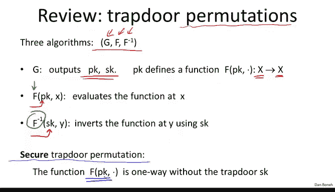
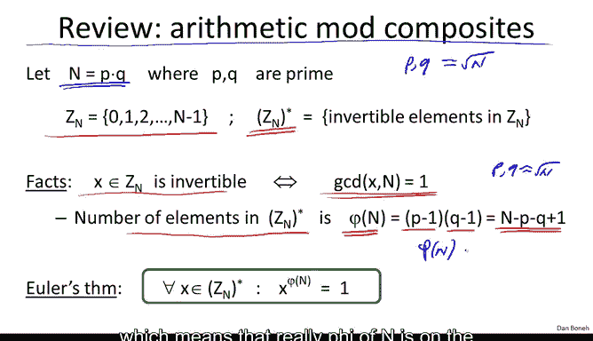
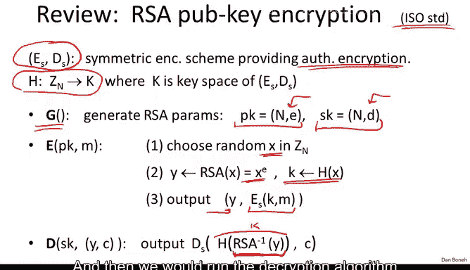
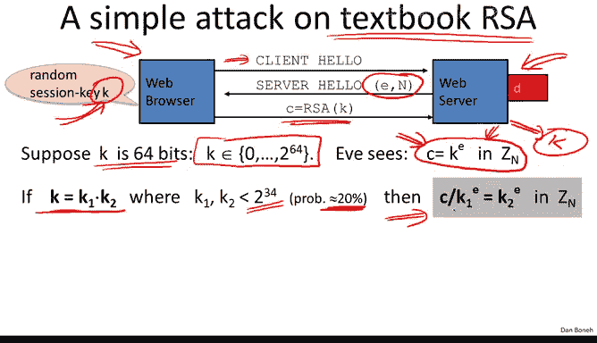

# 058：RSA陷门置换 🔐

在本节课中，我们将学习如何构建一个经典的陷门置换——RSA。我们将从回顾陷门置换的定义开始，然后介绍必要的算术背景知识，接着详细描述RSA的构造、工作原理及其安全性假设。最后，我们将探讨如何正确地将RSA用于公钥加密，并警示一种常见的错误用法。

## 回顾陷门置换

上一节我们学习了如何从陷门函数构建公钥加密。本节中，我们来看看一个经典的陷门置换——RSA。

首先，让我们快速回顾一下什么是陷门置换。陷门置换由三个算法组成：
*   **密钥生成算法**：输出一个公钥 `PK` 和一个私钥 `SK`。
*   **函数 `F`**：由公钥 `PK` 定义，将一个集合 `X` 映射到其自身（因此称为“置换”）。
*   **反函数 `F^{-1}`**：由私钥 `SK` 定义，用于计算函数 `F` 的逆。

我们称一个陷门置换是安全的，如果由公钥定义的函数是一个**单向函数**。这意味着在不知道陷门（私钥）的情况下，正向计算函数 `F` 很容易，但逆向计算（求逆）则非常困难。

## 必要的算术背景

在深入RSA之前，我们需要回顾一些必要的算术知识，特别是关于模合数的运算。

设模数 `n` 为两个大素数 `p` 和 `q` 的乘积，即 `n = p * q`。我们记 `Z_n` 为从 `0` 到 `n-1` 的整数集合，可以在其中进行模 `n` 的加法和乘法。

我们记 `Z_n^*` 为 `Z_n` 中所有可逆元素（即与 `n` 互素的元素）的集合。`Z_n^*` 中元素的数量由欧拉函数 `φ(n)` 表示。当 `n` 是两个不同素数的乘积时，有：
`φ(n) = (p-1) * (q-1) = n - p - q + 1`

由于 `p` 和 `q` 都大约为 `√n` 的数量级，因此 `φ(n)` 非常接近 `n`。这意味着在 `Z_n` 中随机选取一个元素，它极大概率属于 `Z_n^*`（即可逆）。

最后，我们需要欧拉定理：对于任意 `x ∈ Z_n^*`，有：
`x^{φ(n)} ≡ 1 (mod n)`
这个等式对于理解RSA的工作原理至关重要。

## RSA陷门置换的构造

现在，我们准备描述RSA陷门置换。它由密钥生成、函数计算和函数求逆三部分组成。

### 密钥生成 (G)

以下是密钥生成的步骤：
1.  生成两个大素数 `p` 和 `q`（例如，每个约1000比特）。
2.  计算RSA模数 `n = p * q`。
3.  选取两个指数 `e` 和 `d`，使得它们在模 `φ(n)` 下互为逆元，即：
    `e * d ≡ 1 (mod φ(n))`
    这意味着 `e` 和 `d` 必须与 `φ(n)` 互素。
4.  公钥 `PK` 是 `(n, e)`，私钥 `SK` 是 `(n, d)`。`e` 常被称为加密指数，`d` 被称为解密指数。

### 函数计算 (F)

RSA函数定义在 `Z_n^*` 上。给定输入 `x ∈ Z_n^*`，函数计算为：
`F(x) = x^e mod n`
这非常简单，就是对输入 `x` 进行模 `n` 的 `e` 次幂运算。

### 函数求逆 (F^{-1})

给定输出 `y ∈ Z_n^*`，使用私钥进行求逆：
`F^{-1}(y) = y^d mod n`
即对 `y` 进行模 `n` 的 `d` 次幂运算。

### 正确性验证

为什么 `y^d mod n` 能恢复出 `x` 呢？让我们验证一下：
假设 `y = x^e mod n`，那么：
`y^d mod n = (x^e)^d mod n = x^{e*d} mod n`
根据密钥生成条件，存在某个整数 `k`，使得 `e*d = k*φ(n) + 1`。代入上式：
`x^{e*d} mod n = x^{k*φ(n) + 1} mod n = (x^{φ(n)})^k * x mod n`
根据欧拉定理，`x^{φ(n)} ≡ 1 (mod n)`，所以 `(x^{φ(n)})^k ≡ 1 (mod n)`。因此：
`y^d mod n ≡ 1 * x ≡ x (mod n)`
这就证明了求逆操作的正确性。

## RSA的安全性假设

RSA函数的安全性基于**RSA假设**。该假设声称：对于所有高效的算法 `A`，在给定公钥 `(n, e)` 和一个随机值 `y ∈ Z_n^*` 的情况下，算法 `A` 能够计算出使得 `x^e ≡ y (mod n)` 成立的 `x` 的概率是可忽略的。

换句话说，在只知道公钥而不知道私钥 `d` 的情况下，RSA函数是一个单向置换。正是由于私钥 `d` 提供了“陷门”，使得知道它的人可以轻松求逆，因此RSA构成了一个安全的陷门置换。

## 构建公钥加密系统

既然我们有了一个安全的陷门置换（RSA），就可以将其代入上一节介绍的ISO标准构造中，从而得到一个实用的公钥加密系统。

回顾一下，该构造需要一个提供认证加密的对称加密方案 `(E, D)`，以及一个将陷门置换输出映射到对称密钥的哈希函数 `H`。

对于RSA，具体构造如下：
*   **密钥生成**：运行RSA密钥生成算法 `G`，得到公钥 `PK=(n, e)` 和私钥 `SK=(n, d)`。
*   **加密 (E)**：
    1.  随机选择 `x ∈ Z_n^*`。
    2.  计算 `y = RSA(x) = x^e mod n`。
    3.  通过哈希函数导出对称密钥：`k = H(x)`。
    4.  输出密文：`(y, E_k(m))`，其中 `E_k(m)` 是使用对称密钥 `k` 加密消息 `m` 的结果。
*   **解密 (D)**：
    1.  使用私钥恢复 `x`：`x = y^d mod n`。
    2.  重新导出对称密钥：`k = H(x)`。
    3.  使用对称密钥解密：`m = D_k(c)`，其中 `c` 是接收到的对称加密密文。

根据上一节的定理，如果RSA陷门置换是安全的，对称加密方案提供认证加密，并且哈希函数 `H` 被建模为随机预言机，那么这个公钥加密系统是选择密文攻击安全（CCA）的。

## 警告：教科书式RSA加密的错误用法

获得一个可用的公钥加密系统后，我们必须警惕RSA的一种错误用法。这通常被称为“教科书式RSA”加密。

错误做法是直接使用RSA函数加密消息 `m`：
*   **加密**：`c = m^e mod n`
*   **解密**：`m = c^d mod n`

**这是不安全的，绝不能在实际中使用！** RSA本身只是一个陷门置换，并非一个完整的加密方案。直接加密会导致多种攻击，因为它不具备语义安全性等加密所需属性。

### 一个具体攻击示例

假设在一个SSL/TLS场景中，客户端需要生成一个64位的预主密钥 `k` 并发送给服务器。如果错误地使用教科书式RSA加密，即发送 `c = k^e mod n`。

攻击者可以实施“中间相遇攻击”：
1.  假设 `k` 可以分解为两个约34位的数之积，即 `k = k1 * k2`。这种情况发生的概率约为20%。
2.  那么密文满足：`c ≡ (k1 * k2)^e ≡ k1^e * k2^e (mod n)`。
3.  变形为：`c / k1^e ≡ k2^e (mod n)`。
4.  攻击者预先计算所有可能的 `c / k1^e mod n`（约 `2^34` 个值）并存入表。
5.  然后计算所有可能的 `k2^e mod n`（约 `2^34` 个值），并检查是否存在于上述表中。
6.  一旦找到匹配，就得到了 `k1` 和 `k2`，进而恢复出 `k = k1 * k2`。

这个攻击的复杂度约为 `2^40` 量级，远低于暴力搜索 `2^64` 的复杂度。这清楚地展示了直接使用RSA加密的脆弱性。

**核心要点**：永远不要直接使用RSA函数加密数据。必须将其嵌入一个像ISO标准那样的安全加密框架中。

## 总结

本节课中，我们一起学习了经典的RSA陷门置换。我们从定义回顾和算术背景开始，详细描述了RSA的密钥生成、加密（幂运算）和解密（幂运算）过程，并验证了其正确性。我们了解到RSA的安全性基于一个计算性假设。更重要的是，我们学习了如何正确地将RSA陷门置换与对称加密和哈希函数结合，构建一个安全的公钥加密系统。最后，我们通过一个攻击实例，强调了绝不能直接使用“教科书式RSA”进行加密，而必须采用经过安全证明的构造方案。