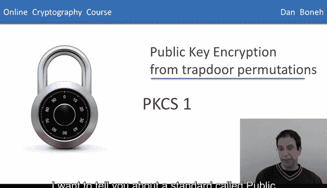
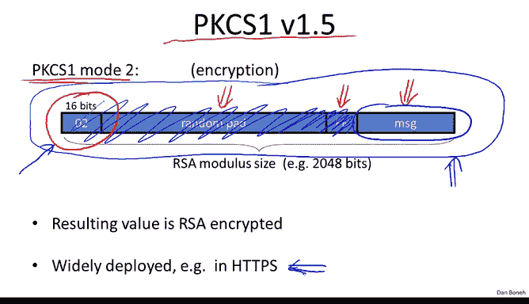
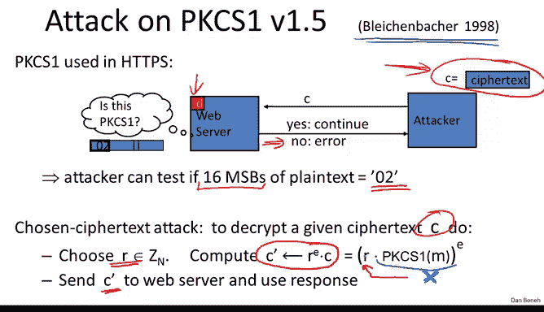
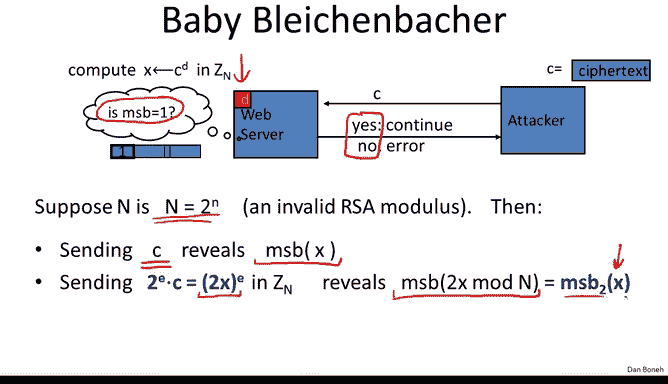
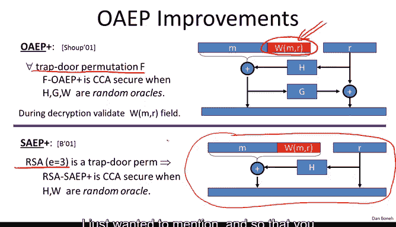
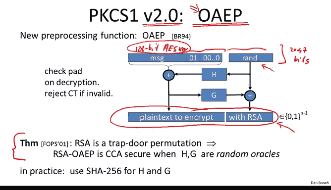
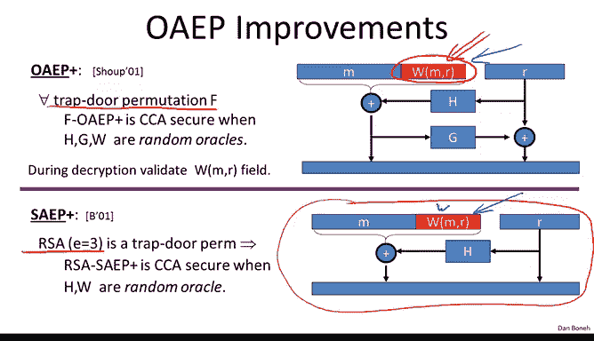
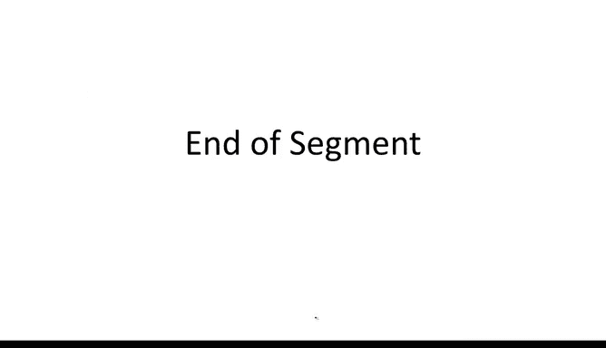

# 059：RSA 实践与PKCS标准 🛡️

在本节中，我们将学习RSA在实际应用中的使用方法，特别是被称为公钥密码学标准一号（PKCS#1）的规范。我们将了解为什么不能直接使用“教科书式RSA”加密，以及如何通过预处理消息来确保安全。我们还将探讨一个著名的攻击案例，并学习更安全的替代方案。

---

## 为什么不能直接使用教科书式RSA？ ⚠️

我们已经多次强调，永远不应该直接使用所谓的“教科书式RSA”来加密消息，因为这是不安全的。在实际应用RSA函数之前，必须对消息进行一些处理。

在之前的章节中，我们看到了ISO标准，其做法是：生成一个随机数 `X`，用RSA加密 `X`，然后从这个 `X` 派生出对称加密密钥。

然而，这并不是RSA在实际中的典型用法。

---

## RSA在实际中如何工作？ 🔧

在实际应用中，流程略有不同。通常，系统会先生成一个对称加密密钥（例如一个128位的AES密钥），然后要求RSA去加密这个给定的对称密钥，而不是将生成对称密钥作为RSA加密过程的一部分。

因此，RSA系统的输入是一个需要加密的对称密钥。为了用RSA加密这个较短的密钥（如128位），我们首先需要将其扩展为完整的模数大小（例如2048位），然后再应用RSA函数。

这就引出了两个核心问题：
1.  应该如何进行这个预处理（即扩展）？
2.  如何论证最终的系统是安全的？

---

## PKCS#1 v1.5：一种广泛部署的标准 📜

一种古老但至今仍被广泛部署的方法是 **PKCS#1 版本 1.5**。PKCS代表公钥密码学标准。这里我们关注其模式2（用于加密），模式1用于签名。

以下是PKCS#1 v1.5的工作方式：

1.  **放置消息**：将你的消息（例如128位AES密钥）放在要创建值的**最低有效位**。
2.  **添加固定标识**：紧接着消息，添加**16位全为1的字节**（即 `0xFF`）。
3.  **添加随机填充**：然后，添加一个**不包含 `0xFF` 字节的随机填充串**。这部分大约有1900个随机比特。
4.  **添加模式标识**：最后，在**最高有效位**放置数字 `0x02`，表示此明文是使用PKCS#1模式2编码的。

最终，这个完整的2048位字符串会被送入RSA函数：`C = (这个值)^E mod N`，结果就是PKCS#1密文。

解密时，接收方会：
1.  对密文应用RSA逆函数，恢复出这个数据块。
2.  检查最高有效位是否为 `0x02`。如果是，则说明是PKCS#1格式。
3.  移除 `0x02` 和其后的随机填充，直到遇到 `0xFF`。
4.  `0xFF` 之后的部分就是原始消息。

---

## Bleichenbacher 攻击：针对PKCS#1 v1.5的漏洞 🕵️♂️

有趣的是，PKCS#1 v1.5设计于80年代末，当时并没有严格的安全证明。1998年，Daniel Bleichenbacher 提出了一种非常巧妙的攻击，展示了如何攻击使用PKCS#1（例如在HTTPS中）的系统。

**攻击原理如下：**

假设攻击者截获了一个PKCS#1密文 `C`。他可以与一个Web服务器（拥有私钥）进行交互。服务器解密后，会检查解密结果的最高有效位是否为 `0x02`：
*   如果是 `0x02`，则继续正常协议。
*   如果不是 `0x02`，则返回一个错误信息。

这实际上为攻击者提供了一个“预言机”：攻击者可以提交任何密文 `C‘` 给服务器，服务器会告诉他 `C‘` 解密后的明文是否以 `0x02` 开头。

**攻击者如何利用这一点？**

攻击者拥有他想解密的密文 `C`。他会进行如下操作：
1.  选择一个随机值 `r`。
2.  构造一个新的密文 `C‘ = (r^E * C) mod N`。根据RSA的乘法同态性，这相当于使原始明文 `m` 乘以了 `r`。
3.  将 `C‘` 发送给服务器，根据服务器的响应（是/否），他知道 `(r * m) mod N` 是否以 `0x02` 开头。

通过精心选择大量的 `r` 值（大约需要一百万次查询），并询问服务器对应的 `C‘` 解密后是否以 `0x02` 开头，攻击者可以逐步缩小 `m` 的可能范围，最终完全恢复出原始明文 `m`。

**一个简化示例（Baby Bleichenbacher）：**

为了理解核心思想，假设服务器只检查最高位是否为1（而不是 `0x02`），并且模数 `N` 是2的幂（仅为简化示例）。
*   查询 `C` 本身，得知 `m` 的最高位。
*   查询 `(2^E * C) mod N`，这相当于查询 `(2*m) mod N` 的最高位，从而得知 `m` 的第二高位。
*   查询 `(4^E * C) mod N`，得知 `m` 的第三高位。
*   …… 重复此过程，只需几千次查询即可恢复整个 `m`。

Bleichenbacher 攻击需要约一百万次查询，因为他检测的是更具体的 `0x02` 模式，但原理相同。这个攻击表明，即使只泄露关于RSA解密结果最高位的极少信息，也足以导致完全解密。

---

## 如何防御Bleichenbacher攻击？ 🛑

SSL/TLS社区希望以最小的代码改动来防御此攻击。RFC中提出的方案是：

**如果解密后得到的明文不是有效的PKCS#1格式（即不以 `0x02` 开头），服务器不会返回错误，而是生成一个随机的伪“主密钥”，并继续执行协议。**

当然，由于客户端和服务器使用了不同的密钥，会话最终会失败。但关键在于，攻击者无法再区分“无效密文”和“有效但解密后格式错误”的密文，从而切断了信息泄露的渠道。

这个方案作为一个微小的代码补丁被广泛部署。然而，这引发了更深层的问题：我们是否应该彻底修改PKCS#1，以获得可证明的选择密文安全性（CCA）？

---

## OAEP：更优的非对称加密填充 ✅

这引出了另一种使用RSA进行加密的方法：**最优非对称加密填充（OAEP）**。PKCS#1 版本 2.0 已加入对OAEP的支持。

OAEP 由 Bellare 和 Rogaway 于1994年提出，其工作原理如下：

1.  **准备消息**：取要加密的消息 `M`（如AES密钥），并添加一个固定的填充（如 `0x01` 后跟一串 `0x00`），使其达到一定长度。
2.  **选择随机数**：选择一个随机值 `R`。
3.  **使用哈希函数进行变换**：
    *   将 `R` 通过哈希函数 `H` 处理，结果与（填充后的）消息 `M` 进行异或，得到第一部分数据。
    *   将上一步的结果通过另一个哈希函数 `G` 处理，再与 `R` 异或，得到第二部分数据。
4.  **连接并加密**：将这两部分数据连接起来，形成一个长度与RSA模数匹配的字符串，然后对其应用RSA加密函数。

**解密过程**则是逆向操作，并且**必须验证填充的正确性**。如果填充无效，则拒绝该密文。

**为什么叫“最优”？**
因为其密文长度就是单个RSA输出的长度，没有附加任何额外数据。相比之下，像ISO标准等方法，即使加密很短的消息，也会产生“一个RSA密文 + 一个对称密文”的输出。

**安全性**：在随机预言机模型下（假设哈希函数 `H` 和 `G` 是理想的），如果RSA函数是一个安全的陷门置换，那么OAEP能提供选择密文安全性。

---

## OAEP的变体与实现注意事项 ⚠️

还存在一些OAEP的变体，如 **OAEP+** 和 **SAEP+**，它们旨在提供更一般的安全性证明（不依赖于RSA的特定代数性质），但在实践中，标准化的OAEP使用更广泛。

**实现OAEP时的关键陷阱：**

即使OAEP的数学原理是安全的，错误的实现也会引入漏洞，特别是**时序攻击**。

考虑一个OAEP解密程序：
1.  对密文应用RSA逆函数。
2.  **检查1**：结果是否在有效范围内（例如，小于 2^{2047}）？如果不是，则报错退出。
3.  **检查2**：解包后，填充是否正确？如果不是，则报错退出。

如果这两个检查的失败路径执行时间不同，攻击者就可能通过精确测量响应时间，来判断错误是由于“范围过大”还是“填充错误”引起的。这种微小的信息泄露，结合类似Bleichenbacher的攻击技术，可能再次导致完全解密。

**教训**：不要自己实现密码学，尤其是像RSA-OAEP这样复杂的算法。应使用经过严格测试的标准库（如OpenSSL），它们会确保解密过程的运行时间是恒定的，不受错误类型影响。

---

## 本节总结 📝

在本节课中，我们一起学习了：
1.  **RSA的实际使用**：不能直接加密消息，必须使用填充方案。
2.  **PKCS#1 v1.5**：一种历史悠久、广泛部署但存在理论缺陷的填充标准。
3.  **Bleichenbacher攻击**：利用PKCS#1 v1.5解密过程中的错误信息反馈，可以逐步解密任意密文。
4.  **防御措施**：通过不返回具体错误信息来掩盖解密状态。
5.  **OAEP**：一种更安全、可证明安全的RSA填充方案，是当前的标准推荐。
6.  **实现安全**：即使算法安全，错误的实现（如引入时序侧信道）也会导致系统被攻破，因此务必使用权威的标准库。

下一节，我们将继续探讨RSA本身的安全性。