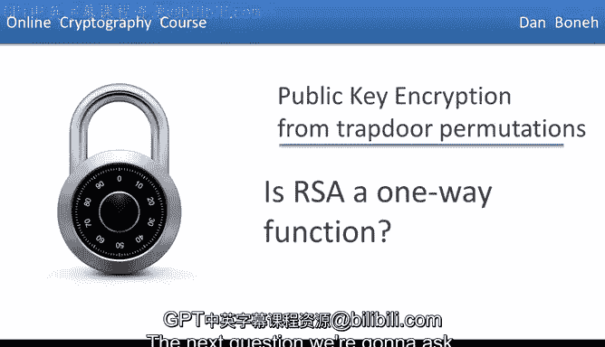
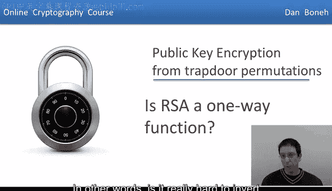
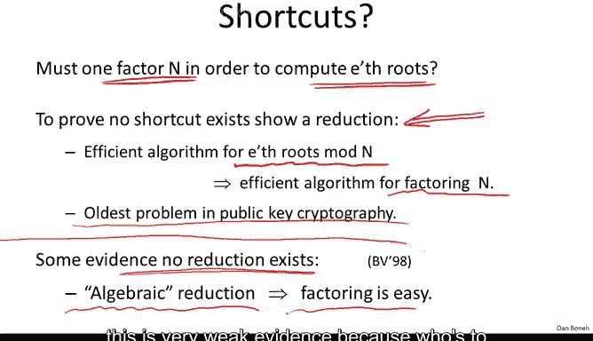
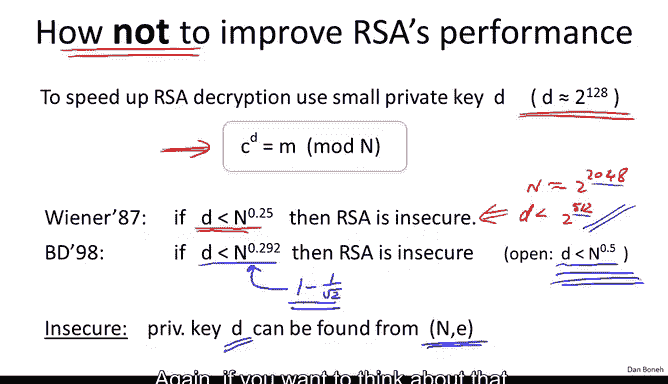
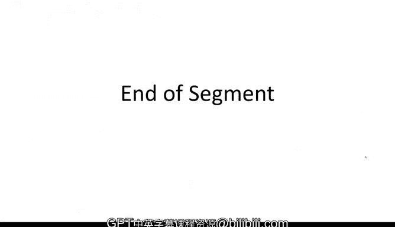

# 060：RSA是单向函数吗

在本节课中，我们将探讨RSA加密算法是否是一个真正的单向函数。我们将分析在没有陷门信息（私钥）的情况下，逆向计算RSA函数的难度，并讨论一些与RSA性能优化相关的安全陷阱。

## RSA逆向计算的难度

上一节我们介绍了RSA加密的基本原理。本节中我们来看看，对于一个攻击者而言，在没有私钥的情况下，逆向计算RSA函数有多困难。

攻击者拥有公钥 `(n, e)`，并看到了密文 `c ≡ x^e (mod n)`。他的目标是恢复明文 `x`。因此，核心问题是：给定 `x^e mod n`，计算 `x` 有多难？这等价于问，计算模合数 `n` 下的 `e` 次方根有多难？

如果这个问题被证明是困难的，那么RSA就是一个单向函数。如果它很容易（当然我们不相信它容易），那么RSA就被破解了。

目前，解决这个问题的最佳算法要求我们首先对模数 `n` 进行**因式分解**。一旦分解了 `n`，我们上周已经看到，计算模 `p` 和模 `q` 下的 `e` 次方根是容易的。然后，利用**中国剩余定理**，可以很容易地将这两个根组合起来，恢复出模 `n` 下的 `e` 次方根。

因此，一旦能够分解模数 `n`，计算模 `n` 下的 `e` 次方根就变得容易。但就我们所知，分解模数是一个非常、非常困难的问题。

## 逆向计算是否必须分解模数？

一个自然的问题是：为了计算模 `n` 下的 `e` 次方根，是否必须分解模数 `n`？就我们所知，计算模 `n` 下 `e` 次方根的最佳算法需要分解 `n`。但也许存在某种捷径，可以在不分解模数的情况下计算 `e` 次方根？

为了证明这是不可能的，我们需要展示一个**规约**。也就是说，我们必须证明，如果我给你一个计算模 `n` 下 `e` 次方根的高效算法，那么这个高效算法可以被转化为一个因式分解算法。这被称为规约：给定一个计算模 `n` 下 `e` 次方根的算法，我们得到一个因式分解算法。这将表明，计算模 `n` 下 `e` 次方根的速度不会比分解模数更快。

如果我们有这样的结果，它将表明破解RSA实际上和因式分解一样困难。但不幸的是，目前这尚未被证明。事实上，这是公钥密码学中最古老的问题之一。

让我给你一个具体的例子。假设我给你一个能计算模 `n` 下立方根的算法。对于 `Z_n*` 中的任何 `x`，该算法都能计算出 `x` 模 `n` 的立方根。我的问题是：你能证明使用这样的算法可以分解模数 `n` 吗？即使这个问题也未被完全解决。

已知的是，对于 `e = 2`（即计算模 `n` 下的平方根），确实意味着可以分解模数。因此，计算平方根实际上和分解模数一样困难。然而，回想RSA的定义，它要求 `e * d ≡ 1 (mod φ(n))`。这意味着 `e` 必须与 `φ(n)` 互质。如果 `e` 模 `φ(n)` 可逆，那么 `e` 必须与 `φ(n)` 互质。

但请记住，`φ(n) = (p-1)(q-1)`。由于 `p` 和 `q` 都是大素数，`(p-1)(q-1)` 总是偶数。因此，`2` 和 `φ(n)` 的最大公约数 `GCD(2, φ(n)) = 2`（因为 `φ(n)` 是偶数）。这意味着公钥指数 `2` 与 `φ(n)` 不互质，因此 `e = 2` 不能用作RSA指数。

所以，实际上最小的合法RSA指数是 `e = 3`。但对于 `e = 3`，计算立方根是否和因式分解一样困难，这是一个**开放性问题**。思考这个问题很有趣，我鼓励你思考一下：如果我给你一个计算模 `n` 下立方根的高效算法，你能用那个算法来分解模数 `n` 吗？

有一些微弱的证据表明，这样的规约可能不存在。但证据非常弱。基本上，如果你的规约是某种特定形式（例如“代数”规约），那么规约本身就会意味着存在一个因式分解算法。但这只是非常弱的证据，因为谁规定规约必须是代数的呢？也许存在我们尚未考虑的其他类型的规约。

## RSA的性能优化与安全陷阱

如前所述，就我们所知，RSA是一个单向函数，破解RSA（计算 `e` 次方根）实际上需要分解模数。我们普遍相信这是真的，这也是目前的技术现状。

现在，有很多工作致力于提高RSA的性能，无论是RSA加密还是解密。事实证明，在这个方向上有一些错误的开端。我想展示一个绝佳的例子作为警告，这基本上是一个关于**如何不**提高RSA性能的例子。

你可能会想，如果我想加快RSA解密速度（解密是通过将密文提升到 `d` 次方来完成的，而求幂算法的时间复杂度与 `d` 的大小 `log(d)` 成线性关系），为什么不直接使用一个小的 `d` 呢？比如一个大约 `2^128` 数量级的解密指数 `d`？

这显然足够大，使得对 `d` 进行穷举搜索不可行。但通常解密指数 `d` 和模数 `n` 一样大，比如2000比特。通过使用一个只有128比特的 `d`，我基本上将RSA解密速度提高了约20倍（从2000比特降到约128比特）。

事实证明，这是一个**糟糕透顶**的主意。Michael Wiener提出的一种攻击表明，一旦私钥指数 `d` 小于模数 `n` 的**四次方根**（如果模数约为2048比特，这意味着如果 `d` 小于 `2^512`），那么RSA就完全不安全了，而且是以最糟糕的方式不安全：仅仅给定公钥 `(n, e)`，你就可以非常快速地恢复出私钥 `d`。

有些人可能会说，这个攻击对高达512比特的 `d` 有效，那我们为什么不把模数 `n` 设为，比如530比特呢？这样攻击就不适用了，而我们仍然可以通过将指数从2000比特缩小到530比特来将RSA解密速度提高约4倍。

然而，事实证明即使这样也不安全。实际上，Wiener攻击有一个更复杂的扩展，表明如果 `d` 小于 `n^0.292`，那么RSA也不安全。并且猜想认为这个结论一直成立到 `n^0.5`。所以，即使 `d` 像 `n^0.4999` 一样大，RSA应该仍然不安全，尽管这是一个开放性问题。

这里的教训是：**不应该为了改善RSA性能而对 `d` 施加任何结构限制**。事实上，现在有一系列类似的结果表明，任何试图通过这类技巧来提高RSA性能的尝试都可能以灾难告终。这不是提高RSA性能的正确方法。

## Wiener攻击细节（可选）

最初我不打算涵盖Wiener攻击的细节，但考虑到课堂上的讨论，我认为你们中的一些人会喜欢看到细节。它只涉及操作一些不等式。如果你对此感到不适应，可以跳过这部分，尽管我认为许多人会喜欢看到细节。

让我提醒你，在Wiener攻击中，我们被给定模数 `n` 和RSA公钥指数 `e`，我们的目标是恢复私钥指数 `d`。我们只知道 `d` 基本上小于 `n` 的四次方根。事实上，我将假设 `d < (n^(1/4))/3`。这个3并不重要，但主导项是 `d < n^(1/4)`。让我们看看如何做到。

首先，回想一下，因为 `e` 和 `d` 是RSA的公钥和私钥指数，我们知道 `e * d ≡ 1 (mod φ(n))`。这意味着存在某个整数 `k`，使得 `e * d = k * φ(n) + 1`。基本上，这就是 `e * d` 模 `φ(n)` 余1的含义。

现在，让我们稍微审视一下这个方程。事实上，这个方程是攻击中的关键方程。

我们要做的首先是两边同时除以 `d * φ(n)`。实际上，我将把这个项移到左边。除以 `d * φ(n)` 后，我得到：
`e/φ(n) - k/d = 1/(d * φ(n))`

好的，我所做的只是除以 `d * φ(n)`，并把 `k * φ(n)` 项移到了左边。现在，为了完整性，我将在这里加上绝对值符号，这在一分钟后会变得有用，当然它们不会改变等式的成立。

现在，`φ(n)` 当然几乎等于 `n`。正如我们之前所说，`φ(n)` 非常接近 `n`。对于这个分数，我只需要说它小于 `1/√n`。实际上它比 `1/√n` 小得多，大约在 `1/n` 的数量级甚至更小，但为了我们的目的，我们只需要这个分数小于 `1/√n`。

现在，让我们稍微审视一下左边的这个分数。你意识到我们实际上并不知道这个分数。我们知道 `e`，但我们不知道 `φ(n)`。因此，我们不知道 `e/φ(n)`。但我们有一个很好的近似值：我们知道 `φ(n)` 非常接近 `n`，因此 `e/φ(n)` 非常接近 `e/n`。所以我们有一个很好的近似值来逼近左边的分数，即 `e/n`。

我们真正想要的是右边的分数，因为一旦我们得到右边的分数，基本上就涉及到了 `d`，然后我们就能恢复 `d`。让我们看看，如果我们用 `e/n` 替换 `e/φ(n)`，我们会得到什么样的误差。

为了分析这一点，我们首先要提醒自己，`φ(n)` 基本上是 `n - p - q + 1`，这意味着 `n - φ(n) < p + q`（实际上我应该精确一点，应该是 `p + q + 1`，但加1不影响什么，为简单起见我就忽略它了）。所以 `n - φ(n) < p + q`。

`p` 和 `q` 都大约是 `n` 长度的一半，所以它们都在 `√n` 的数量级。基本上，`p + q` 小于 `3√n`。好的，我们稍后会用到这个不等式。

现在我们将开始利用我们知道 `d` 很小这一事实。如果我们看这个不等式 `d < (n^(1/4))/3`，很容易看出，如果我对两边平方并稍微操作一下，可以直接推导出以下关系：
`1/(2d^2) - 1/√n > 3/√n`

正如我所说，这基本上是通过两边平方，然后取倒数，然后我想是一边乘以二分之一推导出来的。好的，你可以很容易地推导出这个关系，我们马上会需要它。

现在，我们想做的是界定 `e/n` 和 `k/d` 之间的差。根据三角不等式，我们知道：
`|e/n - k/d| ≤ |e/n - e/φ(n)| + |e/φ(n) - k/d|`

这只是三角不等式的性质。这里的绝对值，我们已经知道如何界定。如果你考虑一下，它基本上是我们已经推导出的界限。所以我们知道这个绝对值小于 `1/√n`。

那么，这个绝对值 `|e/n - e/φ(n)|` 呢？让我们做通分看看得到什么。公分母是 `n * φ(n)`。分子是 `e * |φ(n) - n|`。根据上面的表达式，我们知道它小于 `3√n`。所以分子将小于 `e * 3√n`。

现在我知道 `e < φ(n)`，所以我知道 `e/φ(n) < 1`。换句话说，如果我擦掉 `e` 和 `φ(n)`，我只让分数变大了。所以最初的绝对值不会大于 `(3√n)/n`，也就是 `3/√n`。

好的，但我们知道 `3/√n` 小于 `1/(2d^2) - 1/√n`。好的，这就是我们推导的终点。

所以现在我们知道第一个绝对值小于 `1/(2d^2) - 1/√n`，第二个绝对值小于 `1/√n`，因此它们的和小于 `1/(2d^2)`。

这就是我希望你仔细审视的表达式。现在，让我们稍微审视一下这里。首先，和之前一样，我们知道 `e/n` 的值，我们想知道的是 `k/d` 的值。但我们知道这两个分数的差非常小，小于 `1/(2d^2)`。

事实证明，`k/d` 如此好地近似 `e/n`（以至于它们的差小于 `k/d` 分母平方的倒数）的情况很少发生。实际上，这种情况不会经常发生。事实证明，形式为 `k/d` 的分数中，能如此好地近似另一个分数（差小于 `1/(2d^2)`）的分数非常少。实际上，这样的分数数量最多是 `n` 的对数级别。

现在有一个**连分数算法**，它是一个非常著名的算法，基本上它能从分数 `e/n` 中恢复出最多 `log n` 个可能的 `k/d` 候选值。所以我们只需一个一个地尝试它们，直到找到正确的 `k/d`，然后我们就完成了。我们完成了，因为我们知道 `e * d ≡ 1 (mod k)`，因此 `d` 与 `k` 互质。

所以，如果我们只是将 `k/d` 表示为一个有理分数（分子除以分母），那么分母必须是 `d`。因此，我们刚刚尝试了所有近似 `e/n` 非常好（差小于 `1/(2d^2)`）的 `log n` 个分数。然后我们查看所有这些分数的分母，其中一个分母必须是 `d`，然后我们就完成了，我们刚刚恢复了私钥。

这是一个相当巧妙的攻击，它基本上展示了如果私钥指数很小（小于 `n` 的四次方根），那么我们可以完全且相当容易地恢复 `d`。

## 总结

本节课中我们一起学习了RSA作为单向函数的强度问题。我们了解到，目前破解RSA（计算模 `n` 下的 `e` 次方根）的最佳已知方法需要分解模数 `n`，而分解大整数被认为是困难的。然而，严格证明“破解RSA等价于因式分解”对于常用指数（如 `e=3`）仍然是一个开放性问题。

我们还深入探讨了一个重要的安全教训：试图通过使用小的私钥指数 `d` 来优化RSA解密性能是极其危险的。Wiener攻击及其扩展表明，如果 `d` 小于模数 `n` 的某个界限（如 `n^0.292`），攻击者可以直接从公钥中恢复出私钥。这警示我们，在密码学中，性能优化绝不能以牺牲核心安全属性为代价。