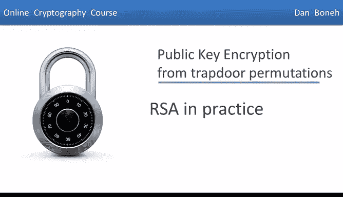
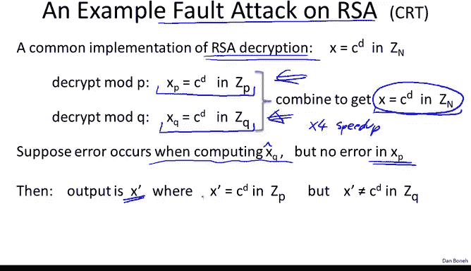

# 061：RSA实践应用

在本节课中，我们将探讨RSA加密算法在实际应用中的关键要点，包括性能优化、实现攻击以及密钥生成的安全隐患。我们将学习如何安全高效地使用RSA。

---

## 加速RSA加密

上一节我们介绍了RSA的基本原理，本节中我们来看看如何优化其加密速度。为了加速RSA加密过程，使用一个较小的加密指数 `e` 是完全可行的。

以下是关于选择加密指数 `e` 的要点：
*   **最小可用值**：最小的可用加密指数是 `e = 3`。`e = 1` 不安全，因为其逆运算过于简单；`e = 2` 无效，因为它与偶数 `φ(n)` 不互质。
*   **使用条件**：当使用 `e = 3` 时，需要确保素数 `p` 和 `q` 满足 `p ≡ 2 mod 3` 且 `q ≡ 2 mod 3`，这样 `(p-1)(q-1)` 才不会被3整除。
*   **推荐值**：实际应用中，推荐使用 `e = 2^16 + 1`，即 **65537**。计算 `x^65537 mod n` 仅需约17次乘法运算（通过16次平方和1次乘法），这比使用一个随机的、需要约2000次乘法运算的大指数要快得多。

## RSA的不对称性

上述优化引出了RSA的一个关键特性：**不对称性**。加密过程可以非常快，但解密过程则要慢得多。

*   **加密速度**：使用 `e=65537` 时，加密仅需约17次乘法运算。
*   **解密速度**：解密使用私钥指数 `d`，其大小与模数 `n` 相当，因此需要约2000次乘法运算。
*   **速度对比**：RSA中加密与解密的速度比大约在10到30倍之间。这种加密远快于解密的特性是RSA所特有的，其他公钥系统（如下一模块将介绍的ElGamal加密）的加密和解密耗时通常相近。

## 密钥长度与实现攻击

我们之前讨论过RSA的密钥长度。为了匹配128位AES密钥的安全强度，应使用约3000位的RSA模数，但实践中普遍使用2048位。

接下来，我们关注针对RSA具体实现的攻击。这些攻击表明，即使数学原理正确，糟糕的实现也会导致系统完全不安全。

以下是几种著名的实现攻击：
*   **时序攻击**：通过精确测量RSA解密操作所花费的时间，攻击者可能推断出私钥 `d`。因此，实现必须确保解密时间与输入参数无关。
*   **功耗分析攻击**：通过测量智能卡等设备在执行RSA解密时的功耗波动，攻击者可以直接读取私钥 `d` 的各个比特。
*   **故障攻击**：RSA对解密过程中的错误异常敏感。在特定情况下，单次计算错误就足以完全泄露私钥。

## 故障攻击实例分析

鉴于故障攻击的严重性，我们深入分析一个具体案例，即针对**使用中国剩余定理加速的RSA解密**的攻击。

RSA解密常通过CRT加速：分别计算 `c^d mod p` 和 `c^d mod q`，然后组合得到 `c^d mod n`。假设在计算 `c^d mod q` 时发生了一个错误，得到了错误结果 `x_q_hat`，而计算 `c^d mod p` 是正确的。

1.  组合后的输出 `x‘` 满足：`x’ ≡ c^d (mod p)` 但 `x‘ ≠ c^d (mod q)`。
2.  将两边取 `e` 次幂（因为 `d` 和 `e` 互为逆元）：`(x‘)^e ≡ c (mod p)` 但 `(x‘)^e ≠ c (mod q)`。
3.  因此，差值 `(x‘)^e - c` 能被 `p` 整除，但不能被 `q` 整除。
4.  计算 **`gcd((x‘)^e - c, n)`**。由于 `n = p * q`，且 `p` 能整除该差值而 `q` 不能，这个最大公约数结果就是 **`p`**。
5.  得到 `p` 后，即可分解 `n`，计算出 `φ(n)`，进而从公钥 `(n, e)` 推导出私钥 `d`。

**防御措施**：因此，在执行RSA解密（尤其是使用CRT加速时）后，验证结果是一个好习惯。可以通过计算 `(解密结果)^e mod n` 并检查是否等于原始密文 `c` 来实现。虽然这会引入约10%的性能开销，但至关重要。

**核心建议**：永远不要自己实现RSA。务必使用经过严格测试和防护的标准密码学库。

## 密钥生成与熵的重要性

最后，我们讨论一个近期的发现：**不良的随机性（熵）会导致RSA密钥生成出现灾难性问题**。

以OpenSSL的旧实现为例：
1.  系统启动时，熵池可能不足。
2.  生成第一个素数 `p` 时，随机源熵值低，导致 `p` 的可能取值集合很小。
3.  生成 `p` 需要一些时间，期间系统积累了更多熵。
4.  生成第二个素数 `q` 时，熵池已较丰富，因此 `q` 通常是唯一的。

问题在于，**大量设备在启动后立即生成RSA密钥，可能会使用相同的“低熵素数” `p`，但配以不同的 `q`**。如果攻击者收集网络上的大量RSA公钥 `n1, n2, ...`，并通过计算 **`gcd(ni, nj)`** 来寻找公约数，就有可能分解那些共享了相同素数 `p` 的模数。在实际扫描中，研究者曾因此成功分解了约0.4%的SSL公钥。

**教训**：生成任何密码学密钥（无论是RSA、ElGamal还是对称密钥）时，确保随机数生成器已获得足够的、良好的熵源是至关重要的。避免在系统刚启动时立即生成密钥。

---

本节课中我们一起学习了RSA在实际应用中的多个方面。我们了解了如何通过选择小加密指数来优化加密速度，认识了RSA加解密的不对称性。更重要的是，我们探讨了时序攻击、功耗分析、故障攻击等多种针对实现的攻击手段，并通过实例深入分析了故障攻击的原理。最后，我们强调了在密钥生成过程中拥有高熵随机源的重要性。所有这些都指向一个核心原则：在实践中，应始终依赖久经考验的标准密码库来实现RSA，而非自行构建。