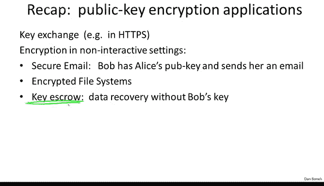
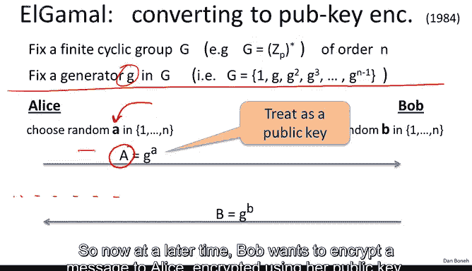
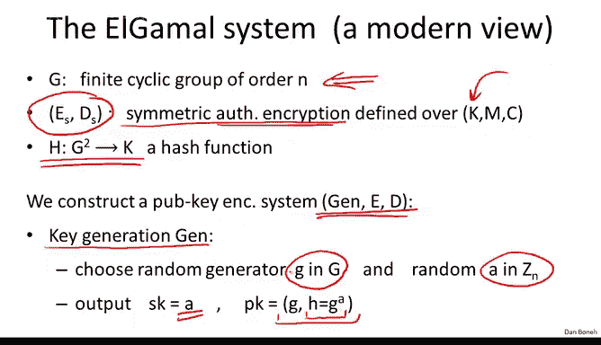
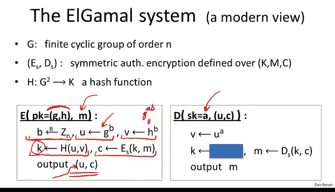

# 062：ElGamal公钥系统 🔐

在本节课中，我们将学习如何基于Diffie-Hellman协议构建公钥加密系统，即ElGamal加密方案。我们将了解其工作原理、应用场景以及性能特点。

---

在上一讲中，我们探讨了基于RSA或陷门函数构建的公钥加密系统。本节中，我们将关注基于Diffie-Hellman协议构建的公钥加密方案。

首先回顾一下，一个公钥加密系统由三个算法组成：
*   **密钥生成算法**：生成一个公钥和一个私钥。
*   **加密算法**：使用公钥对消息进行加密。
*   **解密算法**：使用私钥对密文进行解密。

公钥加密的物理世界类比是一个带锁的盒子。任何人都可以将消息放入盒子并锁上（这对应于使用公钥加密），但只有拥有钥匙（私钥）的人才能打开盒子并取出消息。

在上一讲中，我们看到了公钥加密的多种应用，特别是在密钥交换中的应用。然而，在许多场景中，交互是不可能的，此时公钥加密被直接用于加密消息。

以下是两个非交互式应用的例子：

**1. 加密文件系统**
想象一下，Bob想在一个存储服务器上存储一个加密文件。以下是他的操作步骤：
1.  生成一个随机的文件加密密钥 `K_F`。
2.  使用对称加密系统，用 `K_F` 加密文件。
3.  使用Bob自己的公钥加密 `K_F`，并将这个加密后的“头部”和加密后的文件一起存储。

这样，Bob以后可以用自己的私钥解密头部，得到 `K_F`，再解密文件。如果Bob想让Alice也能访问这个文件，他只需在文件头部额外添加一个用Alice公钥加密的 `K_F`。这样，无需与Alice交互，Bob就授权了Alice的访问权限。

**2. 密钥托管**
在企业环境中，公司可能需要访问员工的加密文件（例如，员工离职后）。密钥托管服务可以解决这个问题。以下是其工作方式：
1.  Bob在存储文件时，除了用自己的公钥加密 `K_F`，还会用托管服务的公钥加密 `K_F`，并将两者都存入文件头部。
2.  当公司需要访问Bob的文件时，可以联系托管服务。
3.  托管服务使用自己的私钥解密其对应的头部，得到 `K_F`，从而解密文件。

托管服务在文件写入时是完全离线的，只有在需要时才被调用。

上一讲我们看到了基于陷门函数（如RSA）的公钥加密构造。本节我们将学习基于Diffie-Hellman协议的另一类公钥系统，即ElGamal公钥加密方案。

---

## 回顾：Diffie-Hellman协议 🔄

在介绍ElGamal系统之前，我们先简要回顾一下Diffie-Hellman协议。我们将使用有限循环群的概念进行抽象描述。

假设我们有一个有限循环群 `G`（例如 `Z_p^*` 或椭圆曲线点群），其阶为 `n`。我们固定该群的一个生成元 `g`。这意味着 `g` 的幂次可以生成群 `G` 中的所有元素，且 `g^n = 1`。

Diffie-Hellman协议的工作流程如下：
1.  Alice选择一个随机数 `a`，计算 `A = g^a` 并发送给Bob。
2.  Bob选择一个随机数 `b`，计算 `B = g^b` 并发送给Alice。
3.  双方可以计算出共享密钥 `s = g^(a*b)`。
    *   Alice计算：`s = B^a = (g^b)^a = g^(a*b)`
    *   Bob计算：`s = A^b = (g^a)^b = g^(a*b)`

攻击者可以看到 `A = g^a` 和 `B = g^b`，但在类似 `Z_p^*` 的群中，从 `g^a` 和 `g^b` 计算 `g^(a*b)` 被认为是困难的（计算性Diffie-Hellman假设）。

---

## ElGamal加密方案 🛡️

现在，我们来看看如何将Diffie-Hellman协议转化为一个公钥加密系统。这个巧妙的想法归功于Taher ElGamal。

我们仍然固定一个循环群 `G` 及其生成元 `g`。ElGamal方案可以看作是Diffie-Hellman协议在时间上的分离：
*   **密钥生成**：这对应于Diffie-Hellman中Alice的第一步。她选择随机私钥 `a`，计算公钥 `h = g^a`。从公钥 `h` 推导私钥 `a` 是离散对数难题。
*   **加密**：当Bob想用Alice的公钥加密消息 `m` 时，他执行类似Diffie-Hellman中Bob的步骤：
    1.  选择随机数 `b`。
    2.  计算 `u = g^b`（这相当于他的临时公钥）。
    3.  计算共享密钥 `v = h^b = (g^a)^b = g^(a*b)`。
    4.  从 `v` 派生出对称密钥 `k`。
    5.  使用对称密钥 `k` 加密消息 `m`，得到密文 `c`。
    6.  发送密文对 `(u, c)` 给Alice。
*   **解密**：Alice收到 `(u, c)` 后：
    1.  使用她的私钥 `a` 计算共享密钥 `v = u^a = (g^b)^a = g^(a*b)`。
    2.  从 `v` 派生出相同的对称密钥 `k`。
    3.  使用 `k` 解密密文 `c`，恢复消息 `m`。

---

### 详细算法描述 📝

为了使方案更严谨并实现选择密文安全，我们引入一个哈希函数和一个提供认证加密的对称加密方案。

**系统参数**
*   一个有限循环群 `G`，阶为 `n`。
*   一个提供认证加密的对称加密方案 `(E_s, D_s)`，其密钥空间为 `K`。
*   一个哈希函数 `H: G × G → K`，将群元素对映射到对称密钥空间。

**密钥生成算法 (Gen)**
1.  选择群 `G` 的一个随机生成元 `g`。
2.  选择一个随机指数 `a`（私钥）。
3.  计算 `h = g^a`。
4.  输出公钥 `pk = (G, g, h)`，私钥 `sk = a`。

**加密算法 (E)**
输入：公钥 `pk = (G, g, h)`，明文 `m`。
1.  选择一个随机数 `b`。
2.  计算 `u = g^b`。
3.  计算 `v = h^b`。
4.  计算对称密钥 `k = H(u, v)`。
5.  计算对称密文 `c = E_s(k, m)`。
6.  输出密文 `(u, c)`。

**解密算法 (D)**
输入：私钥 `sk = a`，密文 `(u, c)`。
1.  计算 `v = u^a`。
2.  计算对称密钥 `k = H(u, v)`。
3.  解密明文 `m = D_s(k, c)`。
4.  输出 `m`。

---

### 性能分析 ⚡

ElGamal加密的性能瓶颈在于群 `G` 中的模幂运算：
*   **加密**：需要计算两次模幂（`g^b` 和 `h^b`）。
*   **解密**：需要计算一次模幂（`u^a`）。

表面上看，加密比解密慢一倍。但有一个优化技巧：由于加密时底数 `g` 和 `h` 是固定的（来自公钥），加密方可以预先计算并存储 `g` 和 `h` 的许多幂次（例如所有2的幂次）。这样，在实际加密时，大部分耗时的平方运算已经完成，只需进行乘法累积，可以显著提升加密速度（甚至可能快于解密）。这种技术称为“固定基预计算”或“窗口指数运算”。

然而，如果加密方总是为不同的接收者加密（例如每次给不同的人发邮件），则无法利用此优化，加密速度约为解密的两倍。

---

### 安全性说明 🔒

一个自然的问题是：ElGamal系统是否安全？能否证明其在选择密文攻击下是安全的？这依赖于怎样的计算假设？

简而言之，在“决策性Diffie-Hellman假设”和哈希函数被建模为随机预言机的条件下，可以证明上述描述的ElGamal变体是IND-CCA安全的。我们将在下一节详细讨论其安全性证明。

---

## 总结 📚

本节课我们一起学习了基于Diffie-Hellman协议的ElGamal公钥加密方案。我们了解到：
1.  ElGamal方案可以视为将Diffie-Hellman密钥交换协议在时间上分离，从而构造出非交互式的公钥加密。
2.  该方案包含三个核心算法：密钥生成、加密和解密，其中加密是随机化的。
3.  我们看到了ElGamal在加密文件系统和密钥托管等非交互式场景下的应用。
4.  方案性能依赖于群上的模幂运算，但可通过预计算进行优化。
5.  通过引入哈希函数和认证加密，可以构建出满足现代安全标准（选择密文安全）的ElGamal变体。

ElGamal加密是密码学中的一个重要范例，展示了如何将交互式协议转化为非交互式的加密工具。