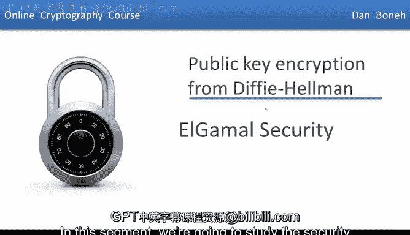
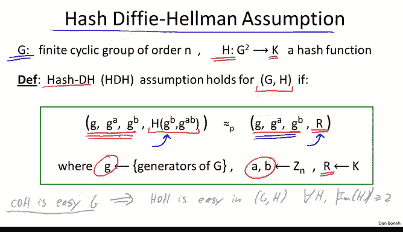
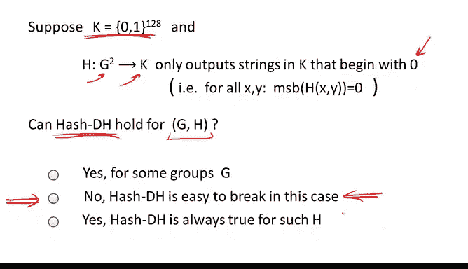
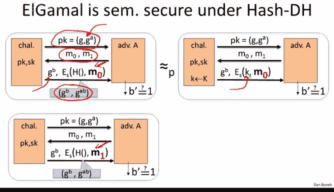
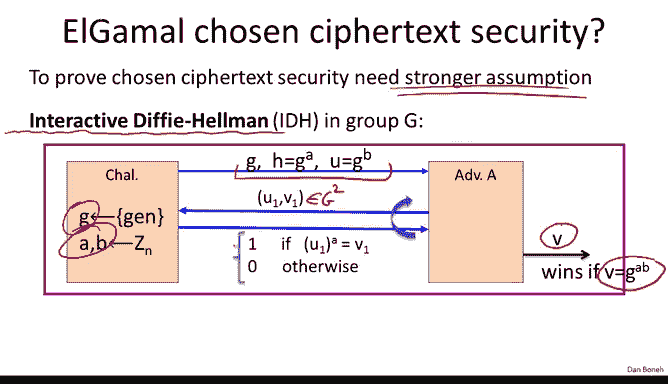
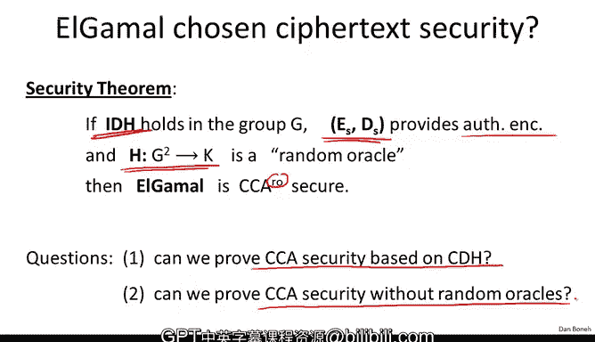

# 063：ElGamal加密系统的安全性分析



在本节课中，我们将要学习ElGamal公钥加密系统的安全性。我们将探讨其安全性所依赖的数学假设，并理解如何基于这些假设来证明其语义安全性和选择密文安全性。

---

## 概述

ElGamal加密系统的安全性建立在Diffie-Hellman问题的困难性之上。我们将首先回顾计算性Diffie-Hellman（CDH）假设，然后引入一个更强的假设——哈希Diffie-Hellman（HDH）假设，并展示如何利用HDH假设证明ElGamal的语义安全性。最后，我们将讨论为了证明选择密文安全性所需引入的交互式Diffie-Hellman假设。

---

## 计算性Diffie-Hellman（CDH）假设


上一节我们介绍了ElGamal加密系统的基本原理，本节中我们来看看其安全性的理论基础。首先，让我们回顾计算性Diffie-Hellman（CDH）假设。

CDH假设指出，在一个阶为`N`的有限循环群`G`中（例如`Z_p*`或椭圆曲线群），给定生成元`g`以及`g^a`和`g^b`（其中`a`和`b`是随机选择的指数），对于任何高效的算法，计算出Diffie-Hellman秘密`g^(ab)`的概率是可忽略的。

用公式描述，CDH假设成立的条件是：对于所有高效算法`A`，以下概率是可忽略的：
```
Pr[ A(g, g^a, g^b) = g^(ab) ]
```
其中，`a`和`b`是从`Z_N`中随机均匀选取的。

---

## 哈希Diffie-Hellman（HDH）假设

然而，CDH假设对于分析ElGamal系统的安全性并不理想。因此，我们引入一个更强的假设，称为哈希Diffie-Hellman（HDH）假设。



HDH假设不仅涉及一个群`G`，还引入一个哈希函数`H`，该函数将`G`中的元素对映射到某个对称加密系统的密钥空间`K`。HDH假设认为，以下两个分布在计算上是不可区分的：

1.  **真实分布**：`(g, g^a, g^b, H(g^b, g^(ab)))`
2.  **随机分布**：`(g, g^a, g^b, R)`，其中`R`是从密钥空间`K`中均匀随机选取的。

用代码描述这个假设的核心思想：
```python
# 假设以下两个元组对于任何高效敌手都是不可区分的
tuple_real = (g, g_a, g_b, hash_func(g_b, g_ab))
tuple_random = (g, g_a, g_b, random_key)
```

HDH假设比CDH假设更强。如果CDH在某个群`G`中是容易的（即可以高效计算`g^(ab)`），那么敌手就能轻易计算出`H(g^b, g^(ab))`，从而区分上述两个分布，导致HDH假设不成立。因此，HDH成立意味着CDH也必须成立。

---



### 关于HDH假设的一个思考题

为了确保理解HDH假设，请考虑以下场景：假设我们的密钥空间是128位字符串（`{0,1}^128`），而哈希函数`H`总是输出以`0`开头的字符串（即最高有效位总是0）。那么，HDH假设对于这对`(G, H)`还成立吗？

答案是否定的。因为一个真正随机的128位密钥，其最高位为`0`的概率是1/2。然而，来自“真实分布”的哈希值最高位总是`0`。因此，敌手可以通过检查最高位来以1/2的优势区分两个分布，从而打破HDH假设。这说明，即使CDH在群`G`中是困难的，如果选择了“坏”的哈希函数，HDH也可能不成立。

---

## 基于HDH假设证明ElGamal的语义安全性


现在，我们来看看如何利用HDH假设证明ElGamal加密系统是语义安全的。首先，快速回顾ElGamal的工作流程：

*   **密钥生成**：选择随机生成元`g`和随机指数`a`。公钥是`(g, g^a)`，私钥是`a`。
*   **加密**：为了加密消息`M`，选择随机指数`b`，计算共享秘密`(g^a)^b = g^(ab)`，然后通过哈希函数`H`导出对称密钥`K = H(g^b, g^(ab))`。最后，输出密文`(g^b, E_K(M))`，其中`E`是语义安全的对称加密算法。
*   **解密**：使用私钥`a`从`g^b`计算共享秘密`(g^b)^a = g^(ab)`，导出相同的密钥`K`，然后解密`E_K(M)`得到`M`。

证明思路如下：

1.  在语义安全游戏中，敌手会获得公钥`(g, g^a)`和一个挑战密文（要么是`M0`的加密，要么是`M1`的加密）。
2.  挑战密文中包含`g^b`和对称密文`E_K(M)`，其中`K = H(g^b, g^(ab))`。
3.  根据HDH假设，密钥`K = H(g^b, g^(ab))`与一个完全独立、均匀随机的密钥`R`在计算上是不可区分的。因此，我们可以将游戏中的`K`替换为`R`，而敌手无法察觉。
4.  替换后，游戏变为：敌手获得`(g, g^a, g^b, E_R(M))`，其中`R`是随机密钥，与`g^a`和`g^b`无关。
5.  在这种情况下，由于对称加密算法`E`本身是语义安全的，敌手无法区分`E_R(M0)`和`E_R(M1)`。
6.  通过这一系列不可区分的游戏变换，我们得出结论：敌手在原始的ElGamal语义安全游戏中也无法区分`M0`和`M1`的加密。因此，ElGamal在HDH假设下是语义安全的。



---

## 选择密文安全性（CCA）与交互式Diffie-Hellman假设

然而，语义安全性并不足够，我们通常希望加密系统能够抵抗更强的选择密文攻击（CCA）。那么，ElGamal是否具有CCA安全性呢？

事实证明，要证明ElGamal的CCA安全性，CDH或HDH假设是不够的。我们需要一个更强的假设，称为**交互式Diffie-Hellman（Interactive DH）假设**。

在交互式DH游戏中：
1.  挑战者生成`g`、`g^a`和`g^b`，并将`(g, g^a, g^b)`发送给敌手。
2.  敌手的目标仍然是输出Diffie-Hellman秘密`g^(ab)`。
3.  **关键增强**：敌手被允许多次向挑战者提交查询。每次查询可以提交一对群元素`(U, V)`，挑战者会回答`1`（如果`U^a = V`）或`0`（否则）。

这个假设更强，因为敌手拥有了“解密预言机”的某种能力（通过查询来测试某个值是否等于`U^a`）。假设声称，即使敌手可以进行任意多次这样的查询，他成功计算出`g^(ab)`的概率仍然是可以忽略的。

在交互式DH假设下，并且额外假设：
1.  使用的对称加密方案提供“认证加密”功能。
2.  哈希函数`H`是“随机预言机”（一个理想化的哈希函数模型）。
那么，我们可以证明ElGamal加密系统是抵抗选择密文攻击（CCA安全）的。



---

## 总结与展望

本节课中我们一起学习了ElGamal加密系统的安全性分析：

1.  我们回顾了**计算性Diffie-Hellman（CDH）假设**，它是许多密码学协议的基础。
2.  我们引入了更强的**哈希Diffie-Hellman（HDH）假设**，并利用它简洁地证明了ElGamal的**语义安全性**。
3.  我们了解到，为了证明更强的**选择密文安全性（CCA）**，需要借助更强的**交互式Diffie-Hellman假设**以及随机预言机模型。



然而，交互式假设和随机预言机模型并非理想。一个自然的问题是：我们能否仅基于标准的CDH假设，并使用一个具体的、非理想化的哈希函数，来构造一个CCA安全的公钥加密方案呢？这将是下一节课我们要探讨的内容。