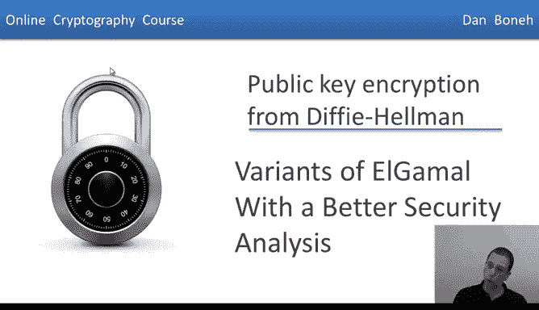
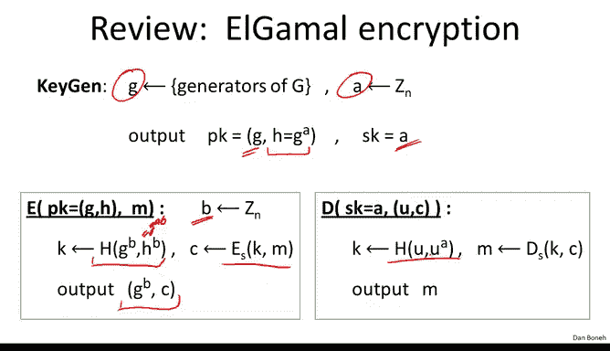
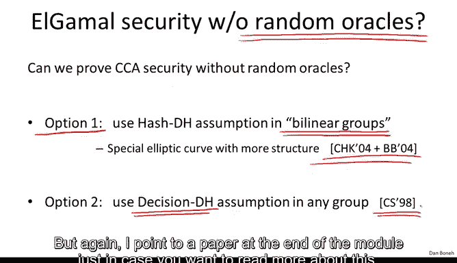

# 064：安全性更强的ElGamal变体 🔐

## 概述
在本节课程中，我们将探讨ElGamal公钥加密系统的变体，这些变体能够提供更强的选择密文攻击（CCA）安全性。我们将回顾标准ElGamal的局限性，并介绍几种改进方案，它们基于更自然或更弱的假设来证明安全性。课程最后会提供延伸阅读的论文列表。

---

## ElGamal加密系统回顾
上一节我们介绍了ElGamal公钥加密系统，并提到它在一种较为特殊的交互式Diffie-Hellman假设下被证明是选择密文安全的。本节中，我们来看看如何改进ElGamal，使其安全性分析更优。

首先，让我们回顾一下标准ElGamal加密系统的工作原理。

**密钥生成**：
1.  选择一个随机生成元 `g`。
2.  选择一个随机指数 `a ∈ Zn`。
3.  公钥 `PK` 为 `(g, h = g^a)`。
4.  私钥 `SK` 为 `a`。

**加密过程**：
1.  选择一个随机指数 `b ∈ Zn`。
2.  计算 `u = g^b`。
3.  计算共享秘密 `s = h^b = g^(ab)`。
4.  使用哈希函数从 `s` 派生对称密钥 `k = H(g^b, h^b)`。
5.  使用对称加密算法 `E` 和密钥 `k` 加密消息 `m`，得到 `c = E(k, m)`。
6.  输出密文 `CT = (u, c)`。

**解密过程**：
1.  从密文 `CT` 中提取 `u` 和 `c`。
2.  使用私钥 `a` 计算共享秘密 `s = u^a = g^(ab)`。
3.  派生对称密钥 `k = H(u, s)`。
4.  使用对称解密算法 `D` 和密钥 `k` 解密密文 `c`，得到 `m = D(k, c)`。

---

## 基于标准CDH假设的改进：Twin ElGamal
标准ElGamal的CCA安全性证明依赖于交互式Diffie-Hellman（IDH）假设。一个自然的问题是：能否仅基于标准的计算性Diffie-Hellman（CDH）假设来证明其安全性？答案是肯定的，这可以通过一个优雅的构造——**Twin ElGamal**（双生ElGamal）来实现。

以下是Twin ElGamal的工作流程，它是对标准ElGamal的一个简单修改。

**密钥生成**：
1.  选择一个随机生成元 `g`。
2.  选择**两个**随机指数 `a1, a2 ∈ Zn` 作为私钥 `SK = (a1, a2)`。
3.  公钥 `PK` 为 `(g, h1 = g^a1, h2 = g^a2)`。可以看到，公钥比标准ElGamal多了一个元素。

**加密过程**：
1.  选择一个随机指数 `b ∈ Zn`。
2.  计算 `u = g^b`。
3.  **计算三个元素的哈希值**来派生密钥：`k = H(g^b, h1^b, h2^b)`。
4.  使用对称加密算法 `E` 和密钥 `k` 加密消息 `m`，得到 `c = E(k, m)`。
5.  输出密文 `CT = (u, c)`。密文长度与标准版相同。

**解密过程**：
1.  从密文 `CT` 中提取 `u` 和 `c`。
2.  使用私钥 `(a1, a2)` 计算 `u^a1 = g^(b*a1) = h1^b` 和 `u^a2 = g^(b*a2) = h2^b`。
3.  现在，解密方拥有了加密方哈希过的三个值：`u`, `h1^b`, `h2^b`。因此可以计算相同的对称密钥 `k = H(u, h1^b, h2^b)`。
4.  使用对称解密算法 `D` 和密钥 `k` 解密密文 `c`，得到 `m = D(k, c)`。

**安全性分析**：
这个简单的修改（公钥多一个元素，加/解密时多哈希一个值）使得我们能够**仅基于标准的CDH假设**（在随机预言机模型下）证明其CCA安全性。代价是加密方需要多进行一次指数运算（共3次），解密方也需要多进行一次指数运算（共2次）。

---

## 超越随机预言机模型
Twin ElGamal的证明仍然依赖于“哈希函数是理想的随机预言机”这一假设。密码学界一个非常活跃的研究领域就是构建**不依赖随机预言机**的、高效的CCA安全公钥加密方案。针对ElGamal框架，主要有两类构造：

1.  **使用双线性群**：这类特殊群具有额外的代数结构（通常基于椭圆曲线），使得CDH假设和IDH假设被证明是等价的。利用这种结构，可以构造出非常高效且不依赖随机预言机的CCA安全方案。
2.  **使用判定性Diffie-Hellman（DDH）假设**：在某些群中（如ZP*的素数阶子群），DDH假设被认为是困难的。基于DDH假设，可以构造一个称为**Cramer-Shoup系统**的ElGamal变体，它可以在不依赖随机预言机的情况下被证明是CCA安全的。

这两类构造都非常精妙，但需要更深入的背景知识才能详细展开。

---

## 延伸阅读
以下是一些推荐阅读的论文，它们深入探讨了本节提到的各种概念和构造：

*   **关于Diffie-Hellman假设的综述**：Dan Boneh的论文《The Decision Diffie-Hellman Problem》详细讨论了与Diffie-Hellman相关的各种计算假设。
*   **基于DDH的CCA安全构造**：Cramer和Shoup于2002年发表的论文《A Practical Public Key Cryptosystem Provably Secure Against Adaptive Chosen Ciphertext Attack》是经典之作。
*   **基于双线性群的CCA安全构造**：Boneh和Franklin的论文《Identity-Based Encryption from the Weil Pairing》介绍了基于身份的加密，该方案可以自然地导出CCA安全的公钥加密。
*   **Twin ElGamal构造及其证明**：Cash, Kiltz和Shoup的论文《The Twin Diffie-Hellman Problem and Applications》详细阐述了Twin ElGamal。
*   **可抽取哈希证明的通用框架**：Jutla的近期论文《Encryption Schemes with Post-Challenge Auxiliary Inputs》提供了一个构建CCA安全系统的新颖通用框架。

---

## 总结
本节课我们一起学习了如何增强ElGamal加密系统的安全性。我们首先回顾了标准ElGamal在CCA安全性上的局限，然后介绍了**Twin ElGamal**变体，它仅基于标准的CDH假设即可实现CCA安全。最后，我们概述了密码学界为**摆脱随机预言机假设**所做的努力，主要分为利用**双线性群**和基于更强的**DDH假设**（如Cramer-Shoup系统）两条路径。这些工作展示了公钥加密设计领域在过去几十年的丰硕成果。