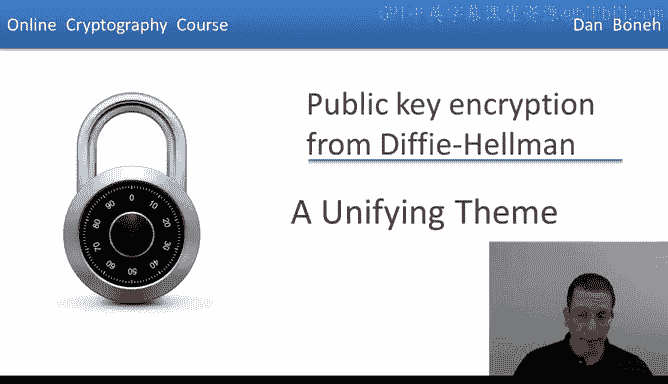
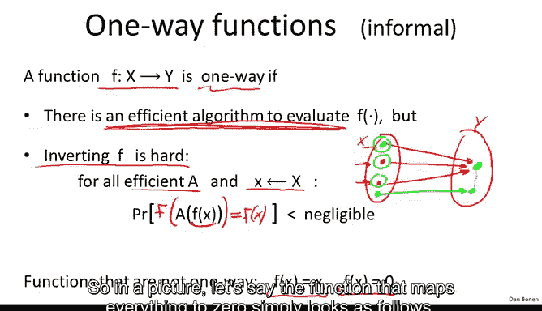
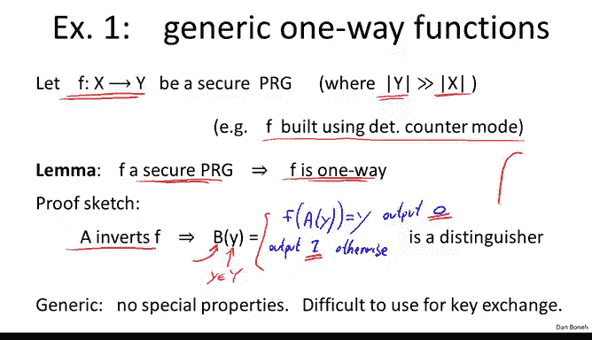
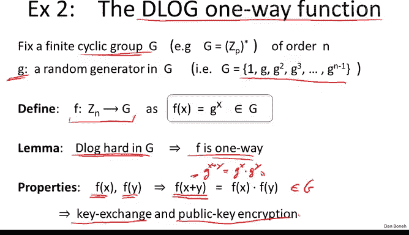

# 065：统一主题

在本节课中，我们将探讨公钥加密系统背后的统一核心概念——单向函数。我们将了解单向函数的定义，并通过几个具体例子来理解它们如何成为构建公钥密码学（如Diffie-Hellman密钥交换和RSA加密）的基础。

## 单向函数的概念

上一节我们介绍了两种公钥加密体系。本节中，我们来看看它们共同遵循的一个更普遍的原则。

这个统一主题被称为**单向函数**。那么，什么是单向函数呢？我们之前已经简要接触过这个概念。本质上，一个从集合X映射到集合Y的函数F被称为单向的，如果存在一个高效算法可以让我们计算函数F（即任何人都能计算任意输入对应的F值），但**反推**函数F却非常困难。这就是函数“单向”的含义。

更具体地说，我们可以将函数F视为一个映射。但需要注意的是，X中的多个点可能被映射到Y中的同一个点。

当我说函数难以求逆时，意思是：当我给你Y中的某个点，并要求你找出这个点的一个原像时，你无法高效地找到任何一个原像。换句话说，没有高效算法能找到给定点Y的逆。

更精确的定义是：对于所有高效算法A，如果我随机从集合X中选择一个x，并将F(x)给算法A，然后要求算法A产生F(x)的一个原像。算法A产生了一个点，如果我将函数F应用于A的输出，得到的结果恰好是F(x)的概率是**可忽略的**。

这旨在捕捉一个事实：给定F(x)，很难找到F(x)的某个原像。

以下是几个**不是**单向函数的简单例子：
*   **恒等函数**：`f(x) = x`。这显然不是单向的，因为给定f(x)，我可以轻易找到其逆，即x本身。
*   **映射到常数的函数**：例如将所有输入映射到0的函数。如下图所示，它将所有点映射到同一个点。

这个函数不是单向的，因为如果给你这个像中的点（0），很容易找到一个原像，只需选择X中的任意一点即可。

需要指出的是，如果我们更形式化地定义单向函数，那么证明单向函数的存在性将等价于证明P不等于NP。由于我们目前无法证明P是否等于NP，我们基本上也无法证明单向函数的存在，只能假设它们存在。

## 从伪随机生成器构建单向函数

现在，让我们看第一个单向函数的例子（或者说，我们假设的单向函数）。我们将从一个伪随机生成器来构建它。

假设我有一个从X到Y的函数F，它是一个安全的伪随机生成器。伪随机生成器接受一个小的种子，并将其扩展成一个更大的输出。例如，你可以想象这个伪随机生成器是使用AES的确定性计数器模式构建的。

可以很容易地看出，如果F是一个安全的伪随机生成器，那么F实际上就是一个单向函数。因此，我们的第一个单向函数例子直接构建于伪随机生成器之上。这个证明比较简单，我们采用反证法。

假设存在一个能高效反演F的算法A（即F不是单向的）。那么我需要构建一个算法B来攻破这个伪随机生成器。

算法B的工作方式如下：当给定集合Y中的某个y时，它会尝试在输入y上运行算法A。如果y是伪随机生成器的输出，那么算法A将以不可忽略的概率输出种子（即X中的某个元素）。然后，我们再次将伪随机生成器应用于算法A的输出。如果y确实是生成器的输出，那么A的输出就是种子，再次应用生成器应该得到我们最初开始的y。如果这个条件成立，算法B就输出0；否则输出1。

这就是一个针对伪随机生成器的区分器。如果我们的区分器B得到的是伪随机生成器的输出y，那么它以不可忽略的概率输出0。然而，如果B得到的是一个真正的随机字符串，由于真正的随机字符串几乎不可能是生成器的输出（即没有对应的种子），因此我们的区分器将以极高的概率输出1。

因此，如果算法A能够反演F，那么算法B就能攻破生成器。既然生成器是安全的，算法A就不能反演F。所以，没有高效算法能反演F，因此F是一个单向函数。

这个讨论虽然较长，但核心是想表明：伪随机生成器直接给出了一个单向函数。不幸的是，这种单向函数没有特殊属性，这意味着很难用它来进行密钥交换或公钥加密。就我们所知，用它实现的最佳密钥交换是Merkle谜题。

## 离散对数单向函数

接下来，让我们看第二个例子。第二个例子我称之为**离散对数单向函数**。

我们固定一个阶为n的循环群G，并让g作为群G的一个生成元。这意味着g的所有幂次能生成整个群G。

现在定义以下函数：`f: Z_n -> G`，定义为 `f(x) = g^x`。它将0到n-1之间的任何元素映射到群G中的一个元素，方法是将g提升到相应的幂次。

显然，如果群G上的离散对数问题是困难的，那么f就是单向的。实际上，f的单向性就是离散对数假设。

这个单向函数的有趣之处在于它具有一些特殊属性。具体来说，即使我不知道x和y是什么，只要给我f(x)和f(y)，我就能很容易地计算出`f(x + y)`。这是如何做到的呢？

根据指数运算规则，`f(x + y)` 就是 `f(x) * f(y)`（在群G中进行运算）。如果你不确定，只需回想一下：`f(x + y) = g^(x+y) = g^x * g^y`，这正是我们这里的结果。

这个简单的属性——函数具有这种加法同态性——正是实现密钥交换和公钥加密的关键所在。

## RSA单向函数

现在让我们看下一个例子：**RSA单向函数**。

我们选择两个素数p和q，设 `n = p * q`。然后选择一个与φ(n)互质的数e。接着定义函数：`f: Z_n* -> Z_n*`，定义为 `f(x) = x^e mod n`。同样，在RSA假设下，我们认为这个函数是单向的。

这个函数的有趣之处在于它具有与上一张幻灯片中看到的函数相似的属性。给定f(x)和f(y)，我们现在可以计算`f(x * y)`（而不是`f(x + y)`）。我们说这个函数具有**乘法属性**，而不是上一张幻灯片的加法属性。

但更重要的是，这个函数最令人兴奋的地方在于它有一个**陷门**。换句话说，存在一个秘密密钥，可以让我们突然反演这个函数，而在没有这个陷门的情况下，据我们所知该函数是单向的。

这个陷门属性同样使得RSA函数特别适合构建数字签名。在第7周，我们将看到RSA函数和离散对数函数都能让我们构建数字签名，但RSA函数因为有陷门，使得构建数字签名变得非常、非常简单。事实上，世界上大多数数字签名都依赖于RSA函数，正是因为用它构建数字签名如此简单。

## 总结

本节课中我们一起学习了公钥密码学的统一核心——单向函数及其特殊属性。

我们能够构建公钥密码学（即能够进行密钥交换、公钥加密等）的原因，是因为我们能够构造具有非常特殊属性的单向函数。特别是，它们具有这些有时被称为**同态**的属性，即给定f(x)和f(y)，我们可以构造出`f(x + y)`或`f(x * y)`。而像RSA这样的函数甚至还有**陷门**，这让我们可以非常轻松地构建数字签名。

我想展示的主要观点是：公钥密码学的魔力之所以成为可能，正是得益于这些具有特殊属性的单向函数。

本模块到此结束，在第7周我们将开始学习数字签名。