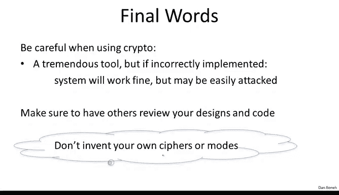

# 066：课程回顾与暂别寄语 🎓

在本节课中，我们将对为期六周的《密码学1》课程进行回顾与总结，并展望后续内容。

## 课程内容回顾 📚

上一节我们介绍了公钥加密的构建，本节中我们来整体回顾一下本课程所涵盖的核心主题。

以下是我们在课程中讨论的密码学原语概览图：

*   **第一周**：我们首先讨论了伪随机数生成器（PRG）和流密码。
*   **第二周**：我们讨论了分组密码。理解分组密码的正确方式是将其视为伪随机置换（PRP）和伪随机函数（PRF）。我们提到，使用计数器模式（CTR），可以将分组密码转换为PRG。同时，通过GGM构造，可以从伪随机生成器构建分组密码。
*   **第三周**：我们讨论了数据完整性，特别是消息认证码（MAC）。我们研究了从伪随机函数构建MAC的各种方法，例如CBC-MAC、HMAC、PMAC等。我们还讨论了抗碰撞性，并指出抗碰撞哈希函数可用于数据完整性保护，尤其是在只读存储器场景中：先将数据的哈希值写入只读存储器，之后通过比较哈希值来验证数据的真实性。
*   **第四周**：我们讨论了如何结合完整性与机密性。具体来说，我们探讨了如何结合加密和MAC来构建我们所说的认证加密。我告诉过你们，实际上在实践中唯一允许使用的对称加密形式就是认证加密。仅能抵御窃听攻击的加密通常并不安全，必须同时防范篡改。因此，进行对称加密时应只使用认证加密模式。
*   **第五周和第六周**：我们转换主题，讨论了密钥交换和公钥加密。第五周我们讲解了陷门函数和Diffie-Hellman协议，并解释了其背后的数学原理。第六周我们讨论了如何基于陷门函数和Diffie-Hellman协议构建公钥加密。

## 重要说明与未来展望 🔮

需要强调的是，我们在第五周看到的密钥交换协议仅能抵御窃听攻击，**绝不应**在实践中使用。实际上，在后续的第八周，我们将学习认证密钥交换协议，这些才是实际中（例如在SSL等协议中）真正使用的协议。我们学习那些简单密钥交换机制的唯一原因，是为了引出陷门函数和Diffie-Hellman群组的概念。

完整的密码学课程还有四周内容，我们将在稍后继续。以下是后续内容的简要介绍：

*   **第七周**：我们将讨论数字签名，以及如何以任何人都能验证的方式认证数据。
*   **第八周**：如前所述，我们将讨论认证密钥交换。
*   **第九周**：我们将讨论用户认证，包括密码管理、一次性密码、挑战-响应协议等。
*   **第十周**：我们将讨论各种隐私保护机制，例如如何在不暴露位置的情况下进行认证，如何在不透露身份的情况下进行签名等。作为其中一些机制的构建模块，我们还将讨论零知识证明协议，这是一种在密码学中应用非常广泛的通用工具。

## 密码学的广阔天地 🌌

但必须说明，密码学远不止这些核心主题。实际上，如果有足够的时间，我还有很多很多主题想与大家分享。

这里列出的只是一个简短的清单，甚至不是一个详尽的清单。还有许多其他内容我希望介绍。因此，如果有足够的需求，我甚至可能会开设一门高级密码学课程（通常是为研究生开设的），涵盖这些更高级的主题。这可能会在明年某个时候进行，请保持关注，届时我会发布相关通知。

## 核心建议与最终提醒 ⚠️

最后，请务必记住我从这门课程中传达的主要信息：密码学是一个强大的工具，但使用时必须始终谨慎。

如果你错误地实现了密码学，系统可能仍会正常运行，你无法察觉任何问题，直到攻击者尝试攻击时，系统可能轻易被攻破。因此，密码学是那种“一知半解相当危险”的领域。确保实现正确至关重要。实现这一点的一种方法是，确保始终有其他人审查你的代码和设计，以发现密码学实现中的任何缺陷，甚至是系统设计中更普遍的缺陷。

最后，留给大家的临别赠言是：**永远不要**发明自己的密码算法或操作模式，也**永远不要**去实现自己的密码算法或操作模式。尽可能遵循标准，尽可能使用这些算法的标准实现。如果不得不偏离标准，请确保有足够的第三方对你所做的工作进行审查。

## 课程结束安排 📝

那么，我就在这里和大家说再见了。

期末考试将在第七周发布，基本上是第六周讲座公开一周后。期末考试将涵盖全部六周的内容，其形式与习题集大致相同。

我希望大家都能在考试中取得好成绩。在所有课程作业完成后，我们将发放证书。我期待在下一期课程中与大家再见。请一如既往地在论坛上提交您的评论和建议，我会阅读所有的帖子，它们对改进课程非常有帮助。期待在秋季与大家相见。

---

**本节课中我们一起学习了**《密码学1》六周课程的核心内容回顾，了解了从伪随机生成器、分组密码、数据完整性、认证加密到公钥加密与密钥交换的知识脉络。我们明确了已学密钥交换协议的局限性，并展望了后续关于数字签名、认证密钥交换、用户认证和隐私机制等主题。最重要的是，我们牢记了密码学实践中的核心准则：谨慎使用标准实现，并寻求第三方审查，切勿自行发明或实现密码算法。