# 001：什么是网络安全？HTML 和 JavaScript 复习

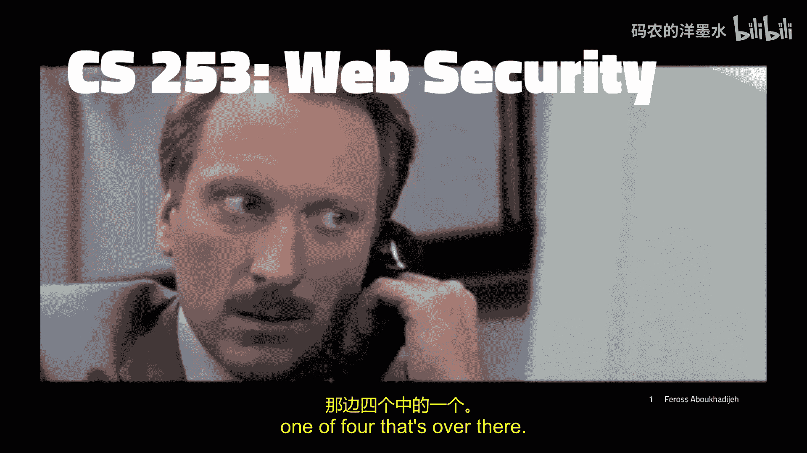

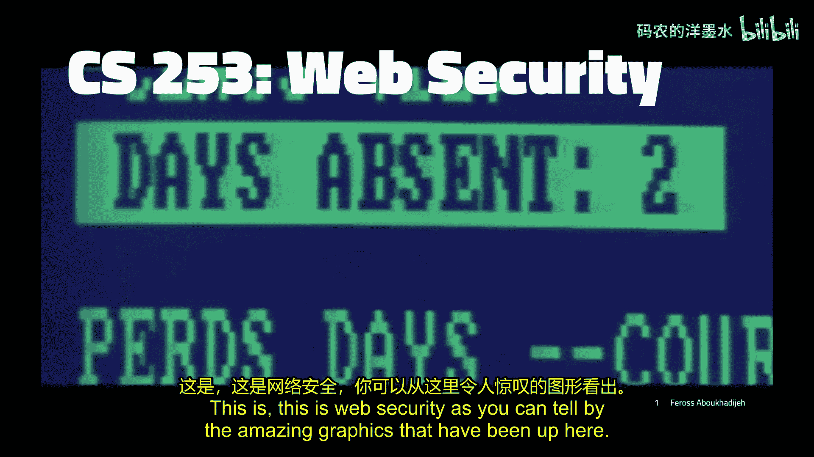

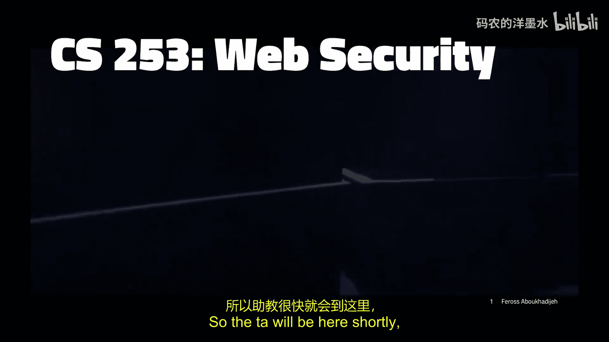

## 概述

在本节课中，我们将要学习网络安全的基本概念，并对构建现代网页的核心技术——HTML 和 JavaScript 进行快速复习。课程将从课程介绍开始，探讨网络安全的重要性、面临的挑战，并回顾必要的网页开发基础知识，为后续深入学习安全议题打下基础。

## 课程介绍与目标

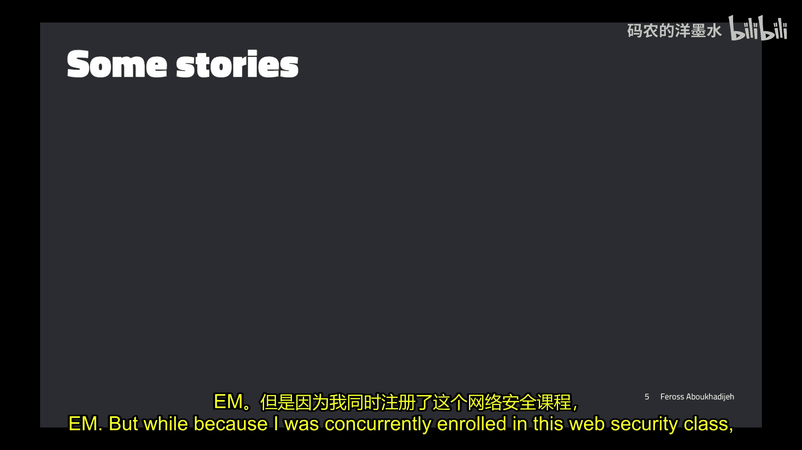

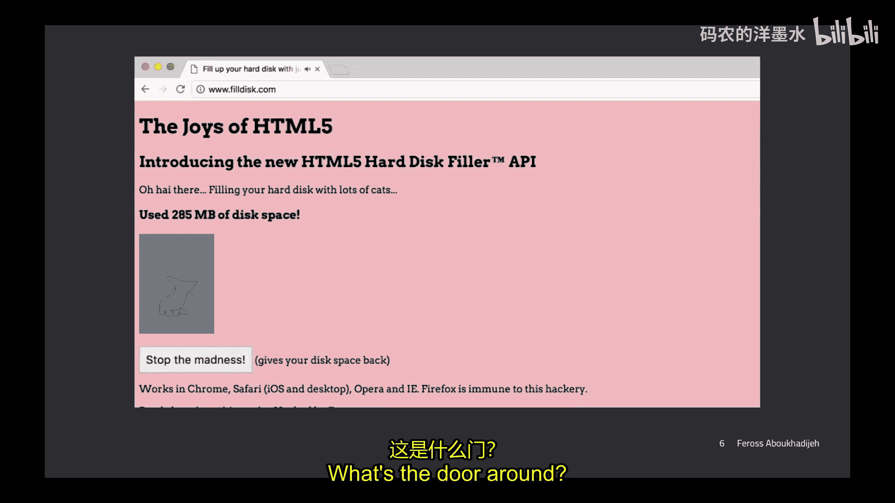

欢迎来到网络安全课程。我是本课程的讲师。助教 Esther 也会参与课程。

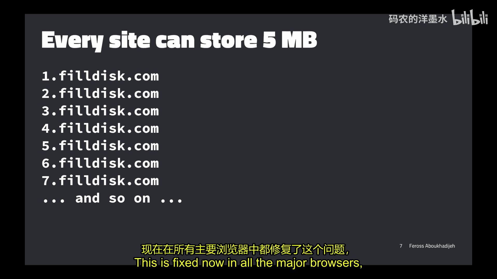

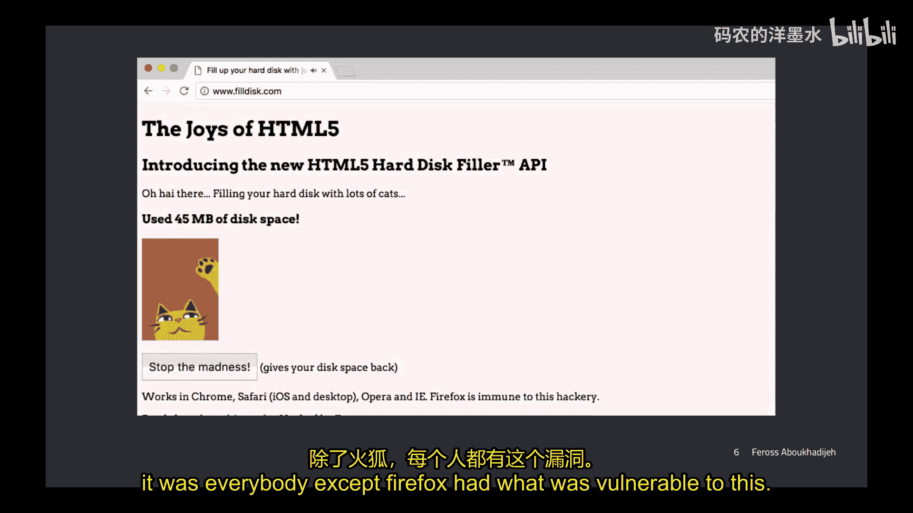

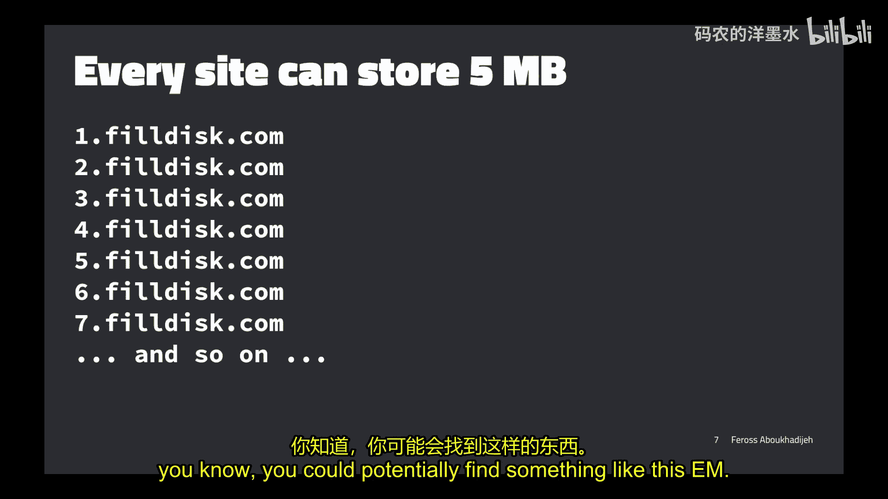

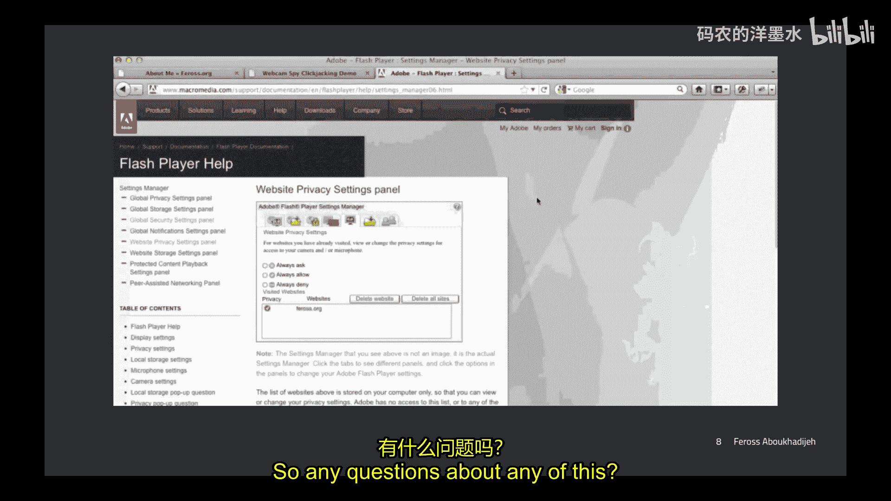

本课程将有五到六个作业，主要是编程作业，可能包含一个书面作业。第一个作业（作业零）将于今晚发布，旨在帮助大家评估是否具备课程所需的 HTML 和 JavaScript 基础知识。

课程将包含七到八次客座讲座，约占课程总时长的三分之一。我们邀请了来自业界的专家，例如来自注重隐私的 Brave 浏览器团队、Google Chrome 安全团队以及 GitHub 安全团队的成员，他们将分享网络安全领域的前沿知识。

我们将使用 Piazza 进行问题讨论。由于这是一门新课，非常欢迎大家通过网站上的匿名反馈表提供意见。

## 网络安全的重要性与“攻击者思维”

本课程的首要目标是培养“攻击者思维”。这是一种在编写代码或设计系统时，不断思考“如何破坏它”的思维方式。具备这种思维是构建安全系统的前提。

与“攻击者思维”相辅相成的是“防御者思维”。要有效防御，必须了解攻击是如何进行的。在网络安全领域，攻击通常比防御更容易，因为攻击者只需找到一个漏洞即可，而防御者需要确保整个系统没有漏洞。

为了鼓励大家实践，课程设置了额外的奖励政策：在本学期内发现安全漏洞的同学将获得额外加分。这可以是任何网站或 Web API 中的漏洞，但请务必遵循负责任的披露流程，不要进行任何破坏性测试。

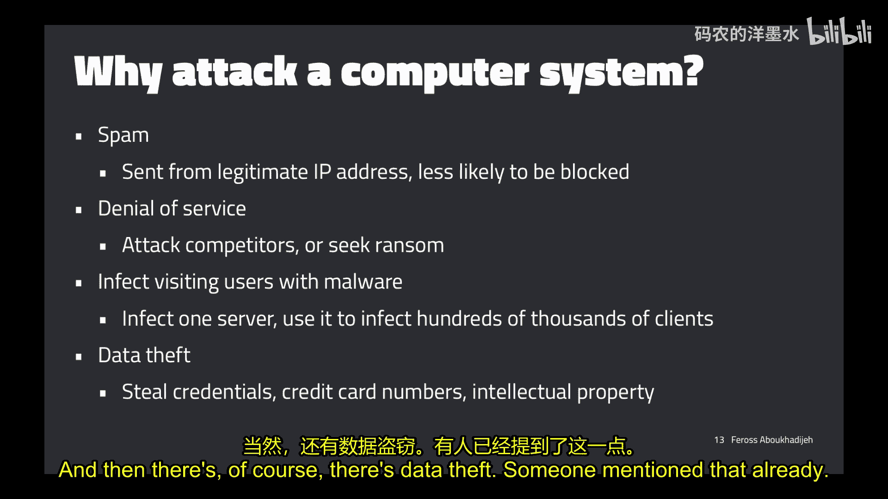

## 为什么网络安全如此困难？

计算机安全之所以困难，原因有很多。首先，存在大量存在缺陷的代码，即使功能完美的程序也可能存在安全漏洞。其次，社会工程学攻击（例如通过电话骗取密码）非常有效。此外，利用漏洞可以牟利，这催生了一个寻找和利用漏洞的市场。

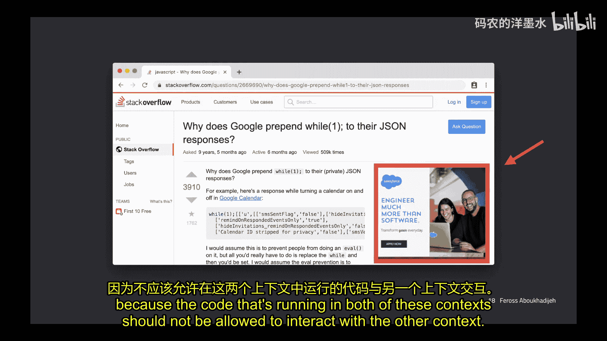

一旦攻击者控制了机器，他们可以进行多种恶意活动，例如：发起分布式拒绝服务攻击、窃取数据、安装勒索软件、发送垃圾邮件，甚至进行政治攻击。

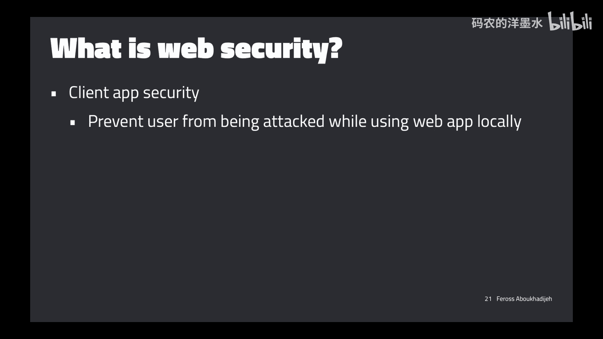

## 什么是 Web 安全？

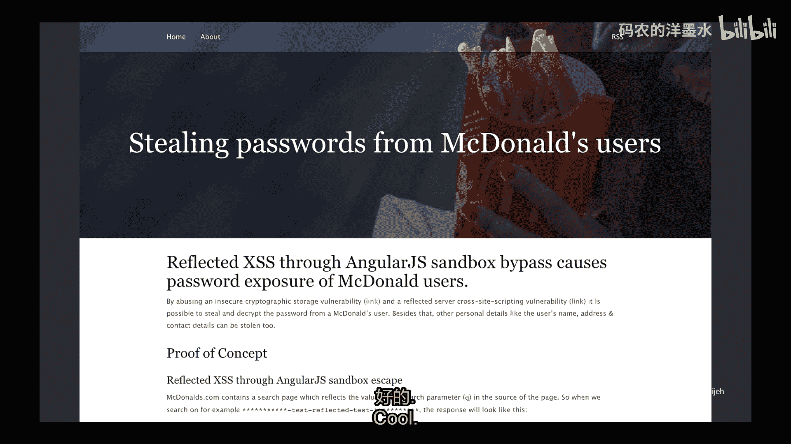

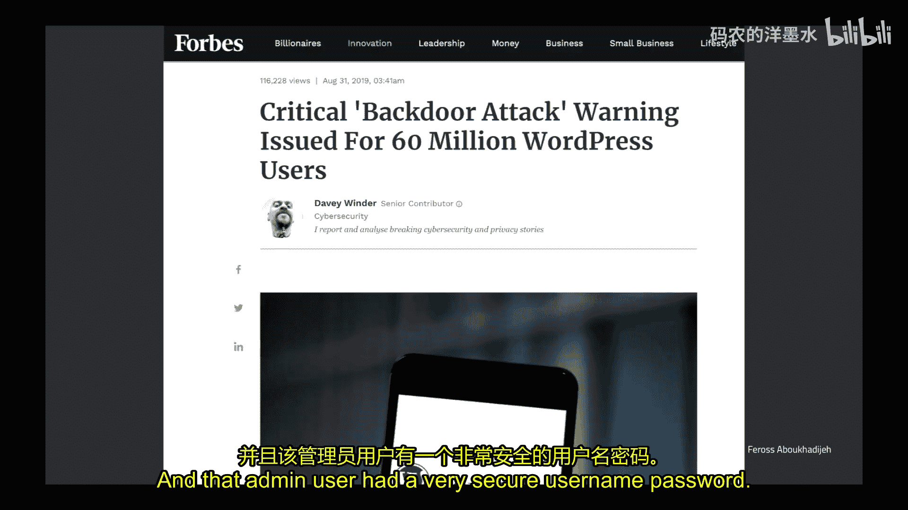

“Web 安全”是一个宽泛的术语，可以从多个角度理解：

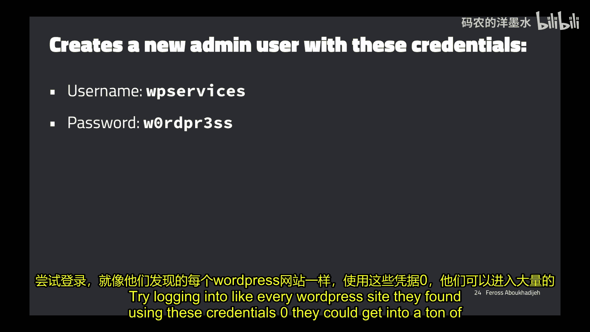

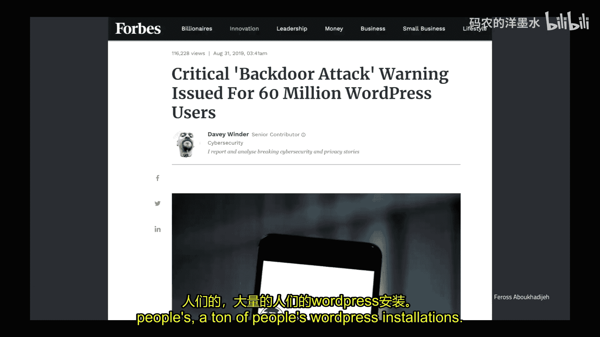

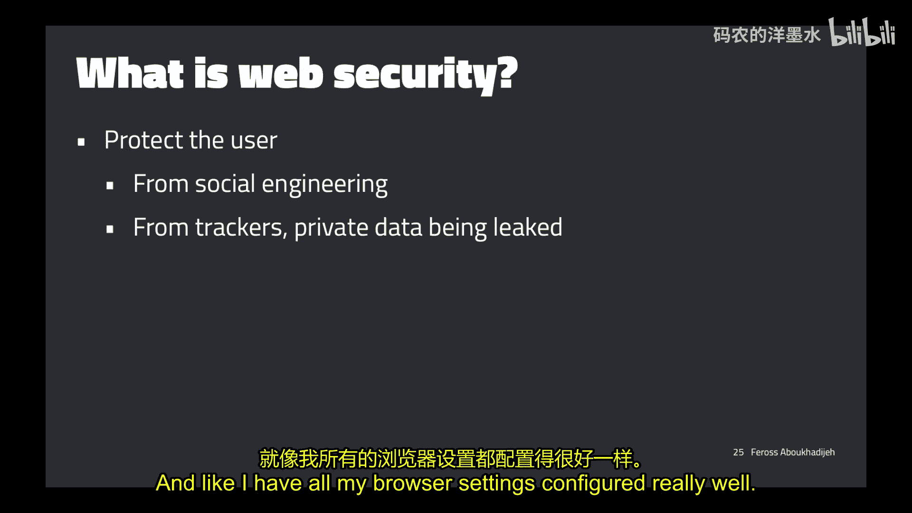

1.  **浏览器安全模型**：确保不同网站（如维基百科和你的银行）在同一个浏览器中运行时相互隔离，无法访问彼此的数据。这主要通过“同源策略”来实现，这是 Web 安全中最重要的概念之一。
2.  **服务器端安全**：作为 Web 服务器的开发者，你需要确保用户（客户端）只能执行你允许的操作。难点在于你无法控制客户端，攻击者可以发送任何 HTTP 请求。
3.  **客户端应用安全**：保护用户浏览器中运行的代码。例如，确保恶意链接或 URL 中的参数不会导致应用执行非预期的操作（如跨站脚本攻击）。
4.  **用户权益保护**：保护用户免受社会工程学攻击和无处不在的网络追踪。即使技术素养很高的人也可能中招。

## Web 安全面临的独特挑战

Web 安全尤其困难，原因在于：
*   **运行不受信任的代码**：浏览器需要安全地运行来自任何人的代码。
*   **复杂的交互**：不同网站在同一用户上下文中的交互非常复杂。
*   **功能与安全的平衡**：为了提供丰富的功能，浏览器不断添加新的 API（如访问摄像头、GPU），这增加了攻击面。
*   **历史包袱与向后兼容**：Web 技术是逐步演进而非全新设计的，并且必须保持严格的向后兼容性，不能破坏旧网站。
*   **设计目标的演变**：Web 从最初的文档查看平台演变为应用平台，安全模型需要不断适应。

尽管面临这些挑战，Web 平台通过逐步演进的安全措施，已经变得相当健壮。本课程的目标就是学习如何在这个复杂的生态系统中构建安全的系统。

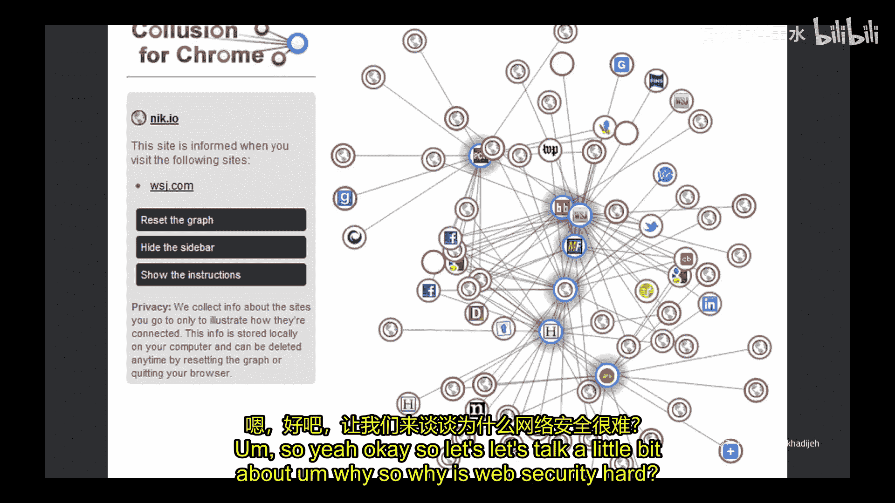

## 技术复习：HTML

上一节我们探讨了 Web 安全的广阔图景和挑战，本节中我们来看看构成 Web 基础的技术。首先是对 HTML 的快速复习。

HTML 使用标签来定义文档结构。例如：

```html
<h1>企鹅的饮食</h1>
<p>企鹅主要吃...</p>
<ul>
  <li>鱼</li>
  <li>磷虾</li>
</ul>
```

URL 是 Web 的核心，其组成部分包括：协议方案（`https`）、主机名（`example.com`）、端口（`:443`）、路径（`/path/to/page`）、查询字符串（`?key1=value1&key2=value2`）和片段（`#section`）。

在 HTML 中指定 URL 有几种方式：
*   **绝对 URL**：包含完整地址，如 `https://example.com/events`。
*   **相对 URL**：相对于当前页面地址，如 `./september`。
*   **根相对 URL**：以 `/` 开头，相对于网站根目录，如 `/events`。
*   **片段 URL**：以 `#` 开头，指向页面内的特定锚点。

以下是一些重要的 HTML 标签，我们将在课程中重点讨论：
*   `<link>` 和 `<style>`：用于引入或编写 CSS 样式。
*   `<script>`：用于引入或编写 JavaScript 代码。

## 技术复习：JavaScript 与 Node.js

接下来，我们复习一下 JavaScript 及其在服务器端的运行时 Node.js。

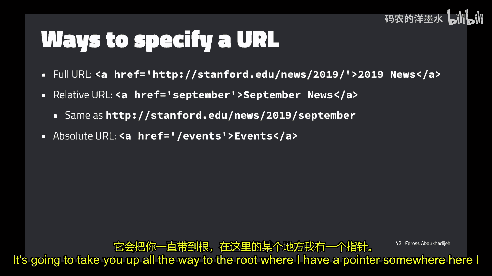

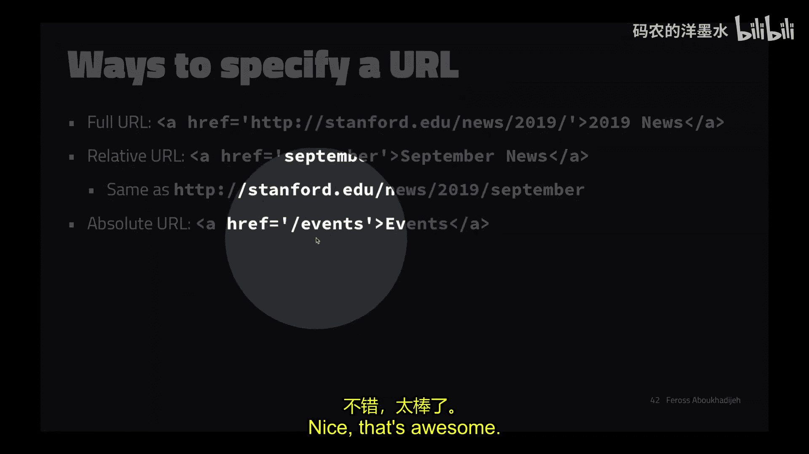

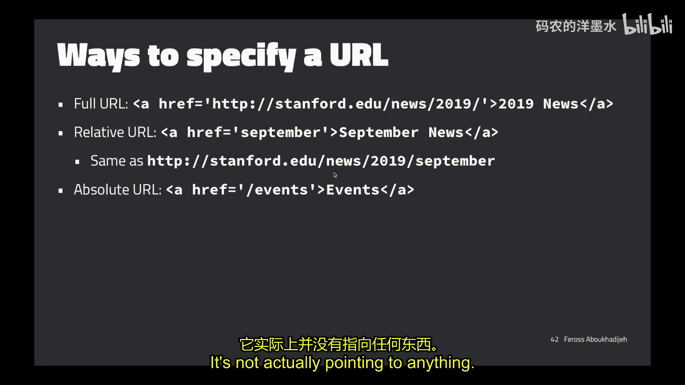

JavaScript 是一种灵活且功能强大的脚本语言。它的一个关键优势在于其“无处不在”——所有浏览器都内置了 JavaScript 引擎和开发者工具。

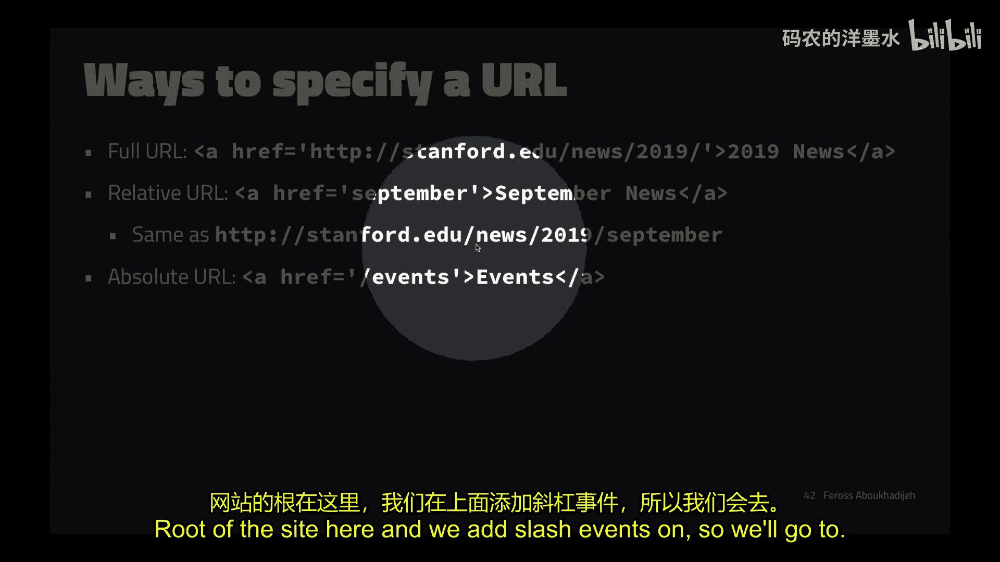

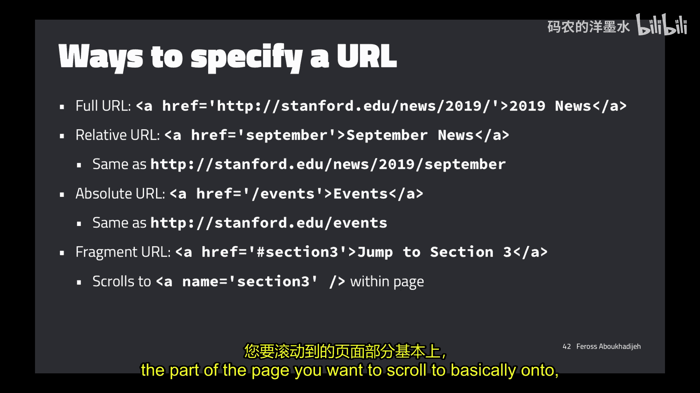

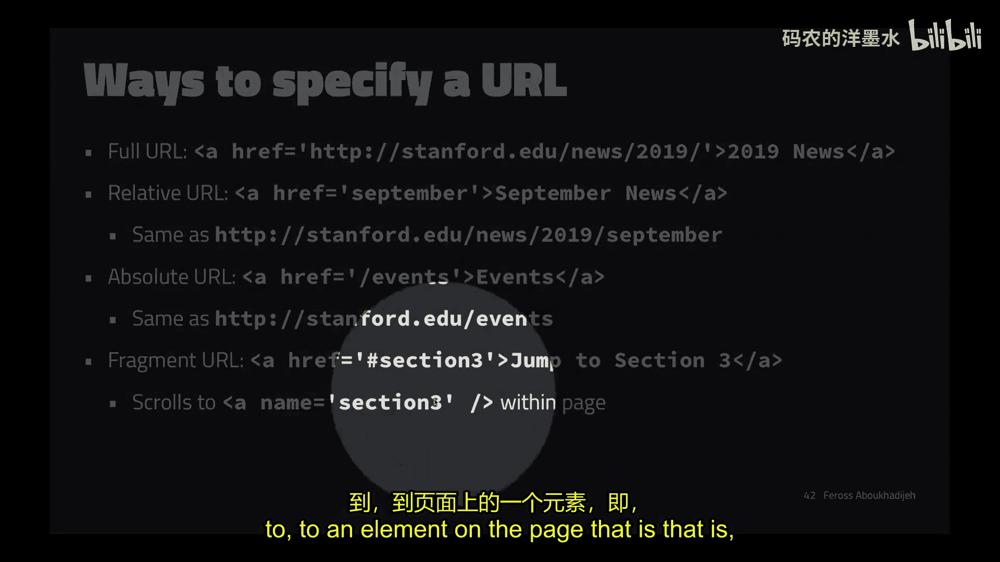

需要区分 JavaScript 语言本身和它运行环境提供的 API：
*   **JavaScript 语言核心**：包括 `Array`、`Object` 等内置对象和语法。
*   **浏览器 API**：例如文档对象模型（DOM），提供 `document.createElement` 等方法。
*   **Node.js API**：在服务器端运行时添加的功能，如文件系统操作（`fs.readFile`）、HTTP 模块等。

Node.js 的出现使得 JavaScript 可以用于服务器端编程，它补充了语言本身缺乏的模块系统、文件操作等能力。

## 课程内容预告与总结

本节课我们一起学习了网络安全的基本概念、其重要性及面临的挑战，并复习了 HTML 和 JavaScript 的核心知识。

在接下来的课程中，我们将深入探讨以下主题：
1.  浏览器安全模型与同源策略。
2.  攻击客户端的技术。
3.  攻击服务器的技术。
4.  安全的身份验证机制。
5.  TLS/HTTPS 与安全连接。
6.  编写安全代码的模式与实践。

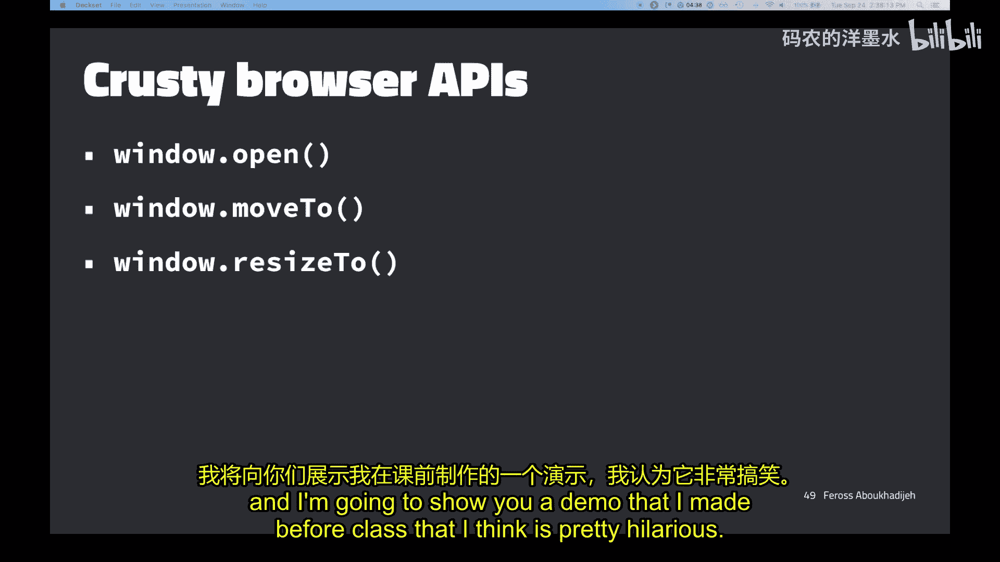

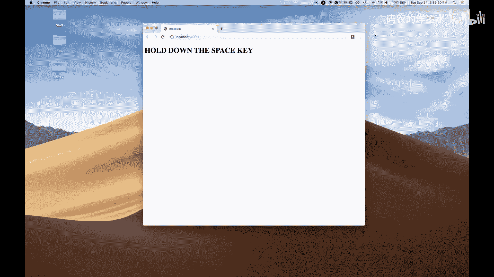

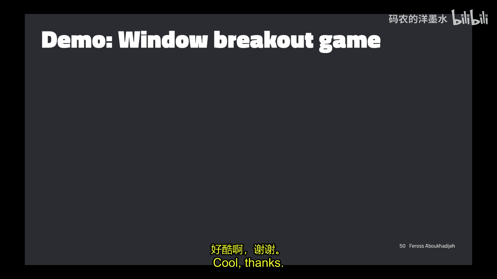

下节课，我们将具体学习 Cookie、会话、HTTP 协议，并开始探讨 Web 安全的基石——同源策略。