# 003：会话攻击

## 概述
在本节课中，我们将要学习网络会话（Session）的概念、如何通过Cookie实现会话，以及在这个过程中可能遇到的安全攻击。我们将从回顾一个不安全的Cookie实现开始，逐步探讨如何通过签名和会话ID等方法来加固安全性，并分析常见的会话攻击手段，如会话劫持。

---

## 回顾：Cookie与会话基础
上一节我们介绍了HTTP协议的无状态特性。本节中我们来看看服务器如何利用Cookie来维持用户状态，实现会话。

HTTP本身是无状态的，这意味着服务器默认无法关联来自同一用户的一系列请求。为了解决这个问题，服务器可以使用`Set-Cookie`响应头，指示浏览器存储一些键值对。之后，浏览器在向同一站点发送请求时，会自动在请求头中包含这些Cookie。

服务器这样做的主要目的是实现**会话**。会话允许服务器在一系列请求中保持与特定用户相关的数据。常见的应用场景包括：
*   **用户登录**：用户登录后，在浏览网站期间保持登录状态。
*   **购物车**：用户即使未登录，也能将商品加入购物车并在后续页面中查看。
*   **用户追踪**：广告服务器可以通过设置唯一ID的Cookie，在不同网站上追踪同一用户。

这种机制被称为**环境授权**。访问控制基于请求者的一个全局、持久性属性（即Cookie头），用户无需在每个请求中都证明自己的身份（如反复输入密码）。

除了Cookie，还有其他几种较少使用的环境授权方式：
*   **基于IP地址**：根据请求的源IP地址决定是否允许访问。例如，大学图书馆可能只允许校园IP访问某些期刊。
*   **HTTP内置认证**：一种较老的、由浏览器弹出的用户名/密码框认证方式，因用户体验差而较少使用。
*   **TLS客户端证书**：一种几乎从未在实际中使用的复杂认证方式。

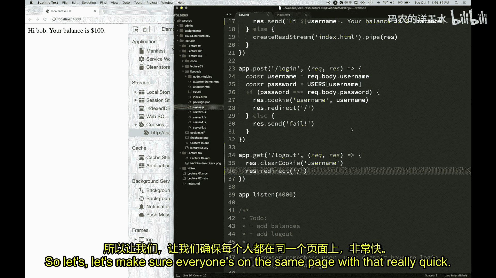

目前，Cookie是实现Web会话最主要的方式。

---

## 演示：一个不安全的银行网站
让我们通过一个简单的银行网站演示来回顾上节课的内容。这个网站有一个密码数据库和几个路由：

*   **主页路由 (`/`)**：检查请求中是否存在名为`username`的Cookie。如果存在，则假设用户已登录并显示欢迎信息和余额；否则，返回一个登录表单。
*   **登录路由 (`/login`)**：接收用户提交的用户名和密码（通过POST请求体），与数据库比对。如果匹配，则通过`Set-Cookie`响应头设置`username`Cookie，并将用户重定向回主页。
*   **数据库**：一个简单的JavaScript对象，存储用户名、密码和用户余额（例如，Alice有500美元，Bob有100美元）。

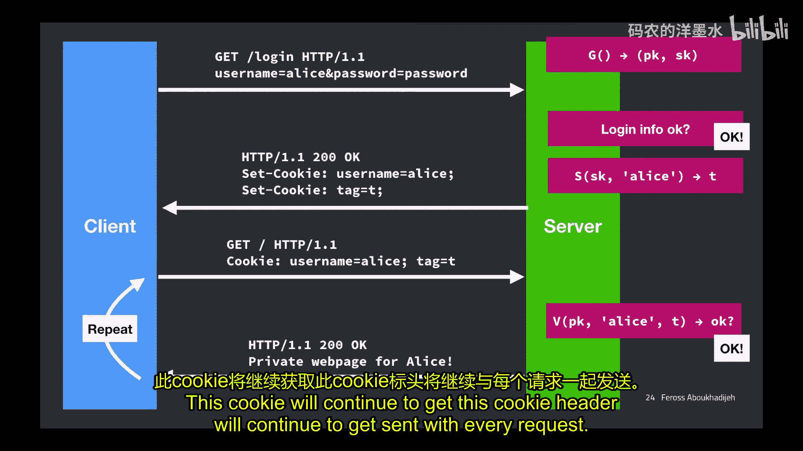

这个实现存在一个严重的安全问题：**任何用户都可以手动修改浏览器中的Cookie值**。例如，将`username`从`Alice`改为`Bob`并刷新页面，服务器就会错误地将该用户识别为Bob，并显示Bob的余额信息。

显然，我们不能信任客户端提供的Cookie值。

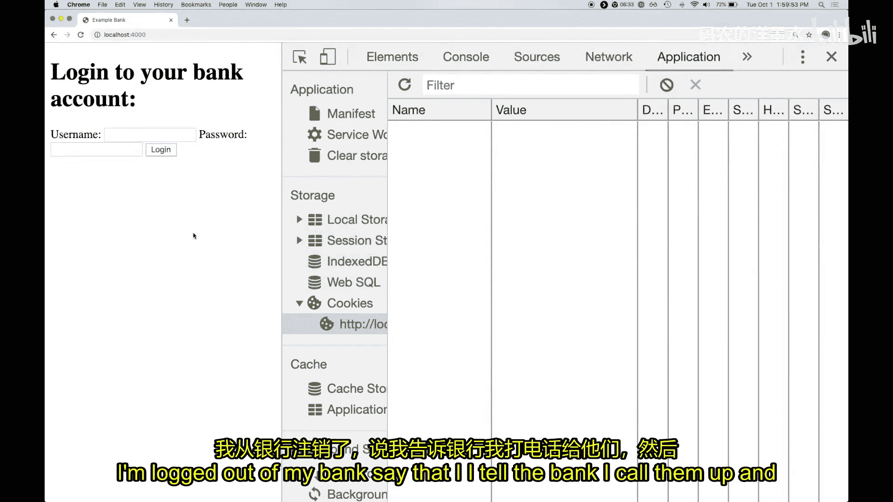

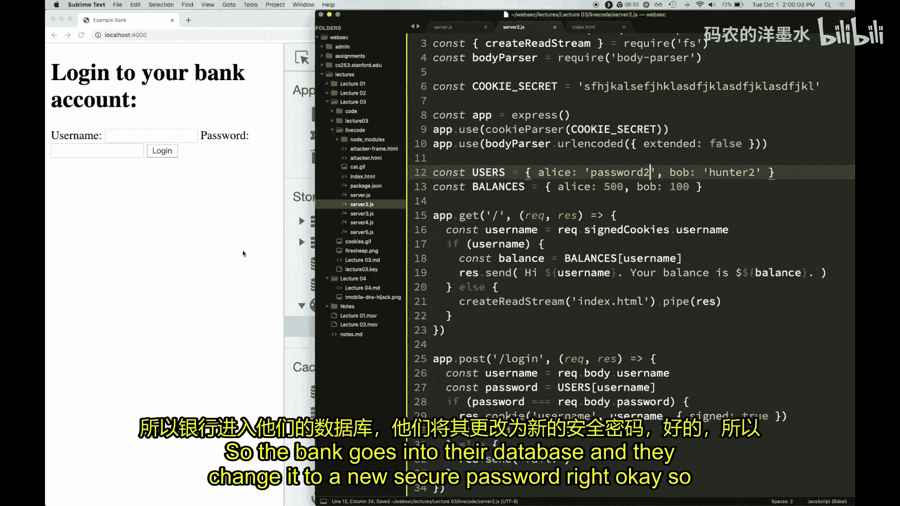

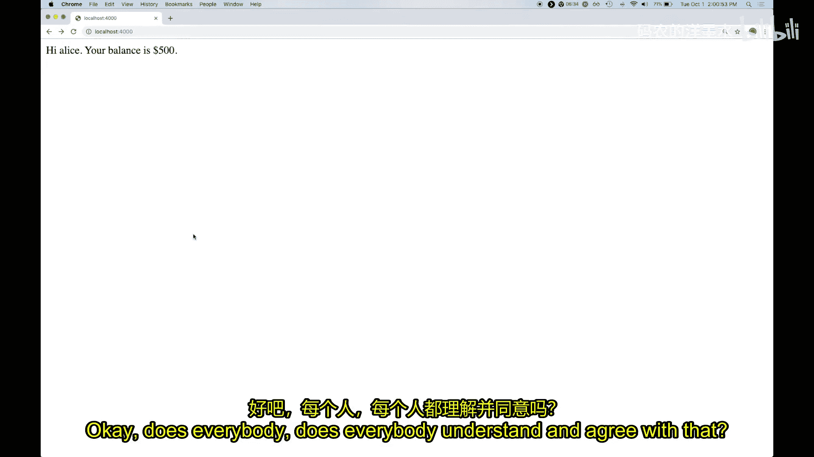

---

## 改进方案一：签名Cookie
为了解决Cookie被篡改的问题，我们引入密码学中的**签名**概念。

签名涉及三个算法：
1.  **生成算法 (G)**：生成一对密钥：一个**私钥 (SK)** 用于签名，一个**公钥 (PK)** 用于验证。
2.  **签名算法 (S)**：输入私钥 (SK) 和待签名的消息 (X)，输出一个**标签 (T)**。
3.  **验证算法 (V)**：输入公钥 (PK)、原始消息 (X) 和标签 (T)，输出一个布尔值，表明标签是否有效。

签名方案需要满足两个属性：
*   **正确性**：用私钥对消息X生成的标签T，必须能通过对应公钥的验证。公式表示为：`V(PK, X, S(SK, X)) == true`。
*   **安全性**：对于任何未经签名的消息X'或伪造的标签T'，验证算法通过的概率极低。攻击者很难在计算上找到一个能欺骗验证函数的(X', T')组合。

在Web应用中，我们可以这样使用签名：
1.  服务器生成密钥对。
2.  用户登录时，服务器验证凭据后，不仅发送`username=Alice`的Cookie，还使用私钥对`"Alice"`进行签名，并将签名结果作为另一个Cookie（例如`tag=T`）发送给浏览器。
3.  浏览器后续访问时，会同时发送`username`和`tag`这两个Cookie。
4.  服务器使用公钥验证收到的`username`和`tag`是否匹配。如果验证通过，则相信用户名未被篡改。

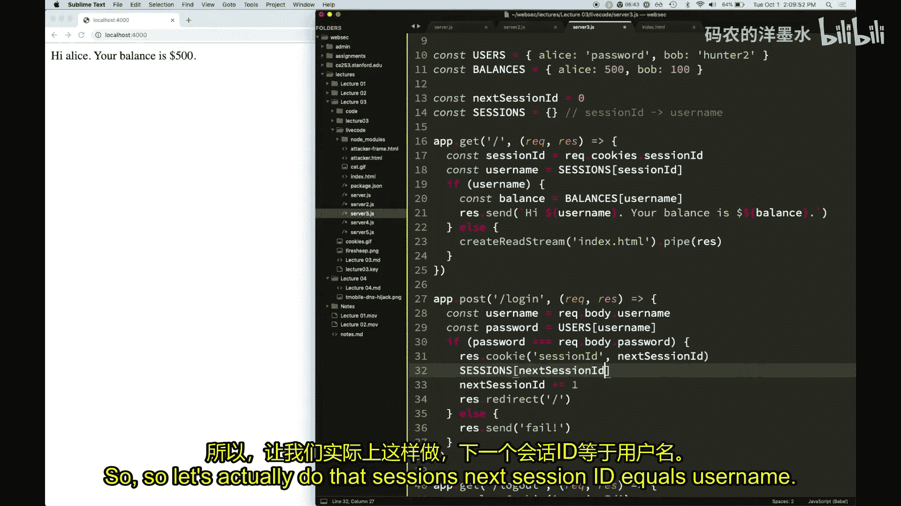

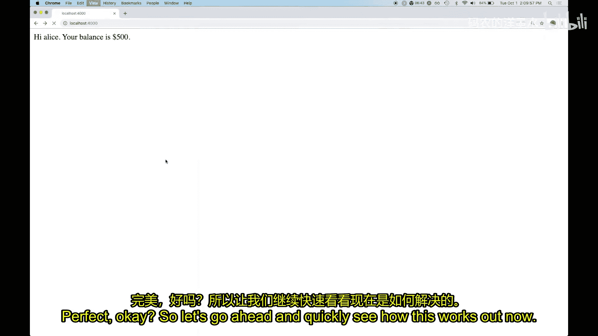

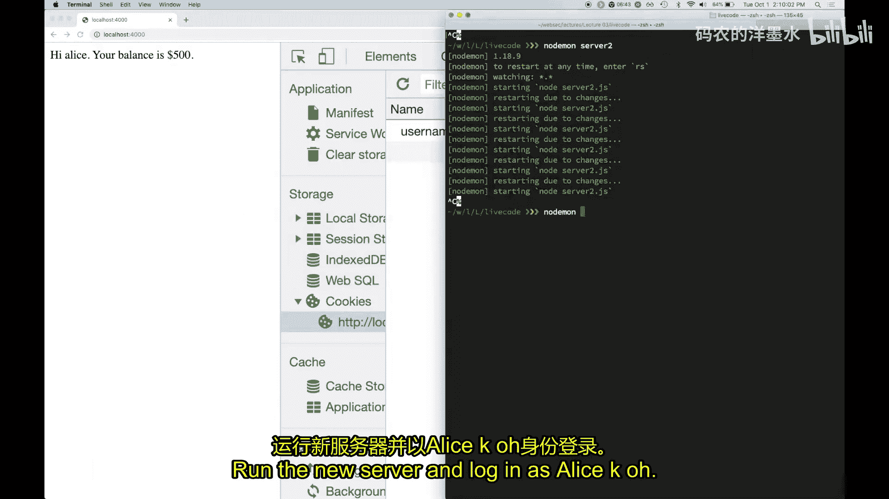

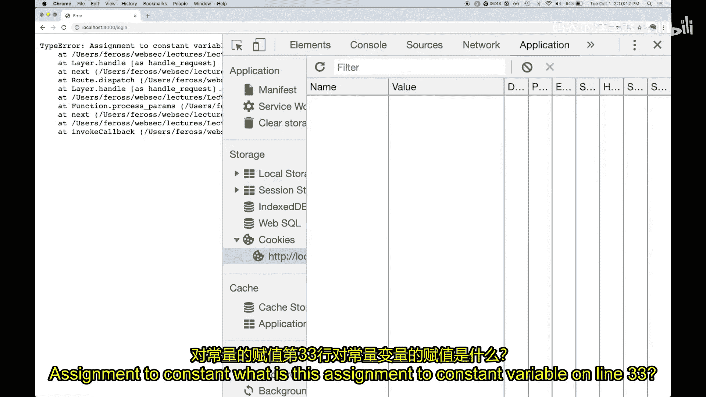

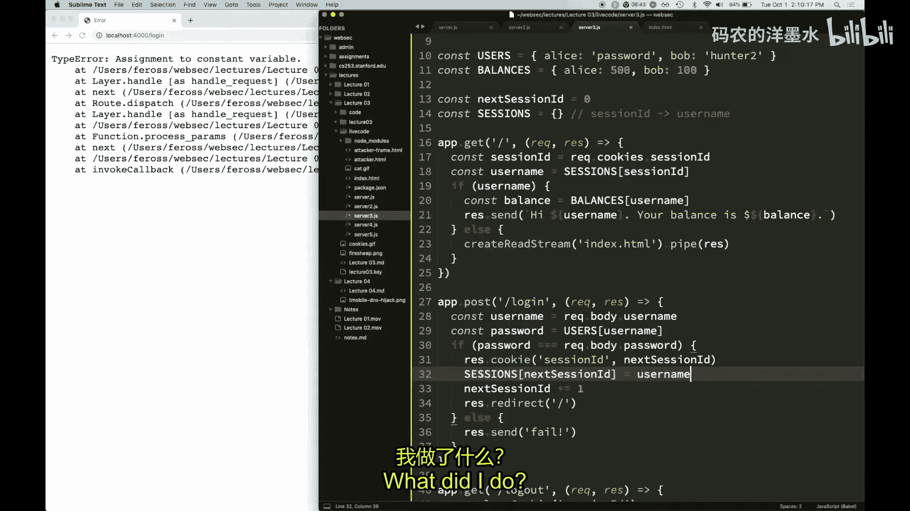

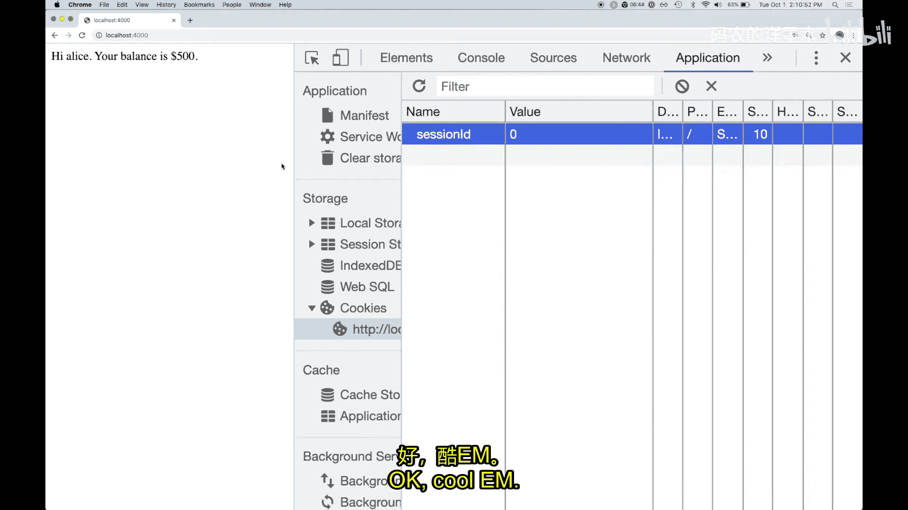

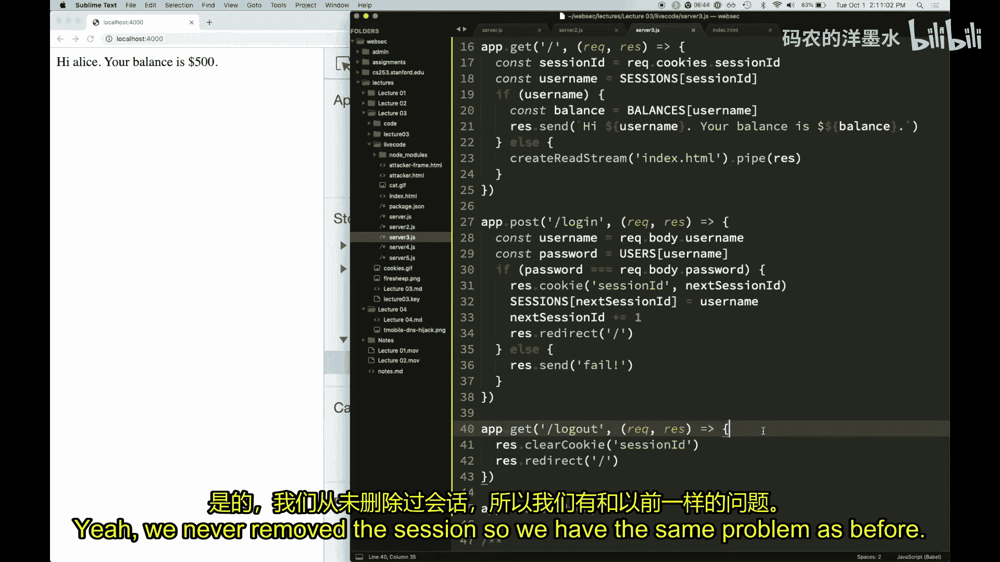

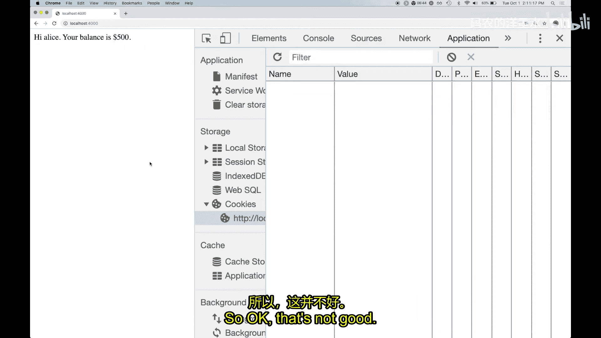

在代码中，我们可以使用Web框架（如Express.js）的中间件简化此过程：
*   初始化时，传入一个**密钥**。
*   设置Cookie时，添加`{ signed: true }`选项。
*   读取Cookie时，使用`signedCookies`对象，它只包含验证通过的Cookie值。

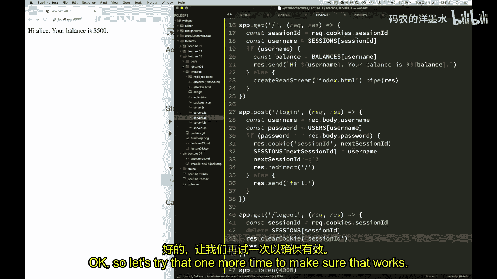

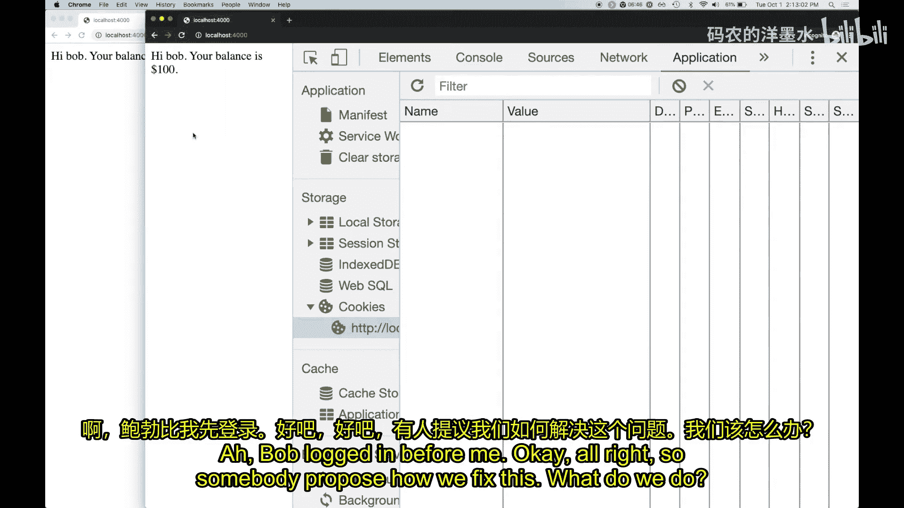

**签名Cookie的局限性**：
虽然签名防止了用户篡改Cookie值，但它引入了一个新问题：**Cookie被盗用**。如果攻击者窃取了`username=Alice`和对应的`tag=T`，他就可以在任何地方设置这些Cookie，从而永久性地冒充Alice，即使用户修改了密码或点击了“退出登录”也无济于事。这是因为签名本身是持久有效的，服务器无法单方面使其失效。

---

## 改进方案二：会话ID
我们需要一个能让服务器主动使会话失效的机制。更安全的方案是使用**会话ID**。

其工作流程如下：
1.  服务器维护一个**会话数据库**（例如内存中的对象或真正的数据库），用于映射**会话ID**到**用户名**（或其他会话数据）。
2.  用户登录成功后，服务器**随机生成一个唯一且不可预测的会话ID**（例如，使用密码学安全的随机数生成器生成16字节随机数，并转换为Base64字符串），将其存储在会话数据库中，并通过Cookie发送给浏览器（例如`sessionId=随机字符串`）。
3.  浏览器后续请求时携带此`sessionId` Cookie。
4.  服务器收到请求后，用这个`sessionId`去查询会话数据库，以确定用户身份。
5.  当用户点击“退出登录”时，服务器不仅清除浏览器的Cookie，还**从会话数据库中删除该sessionId对应的条目**。这样，即使攻击者之前窃取了Cookie，也无法再使用它，因为服务器端已无对应记录。

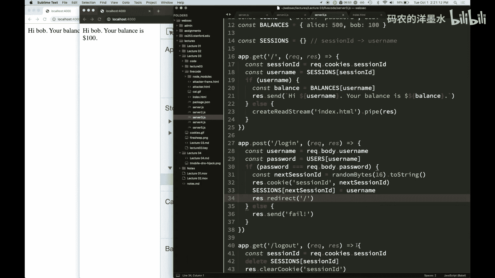

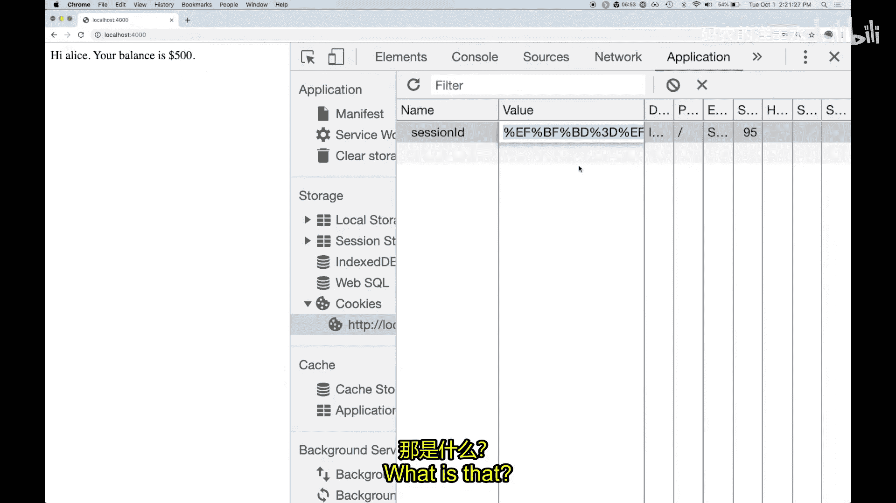

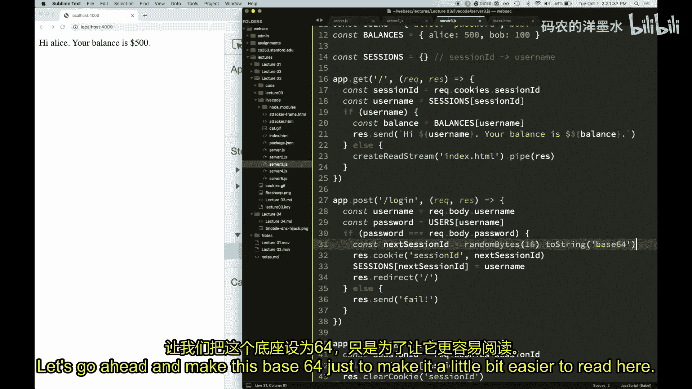

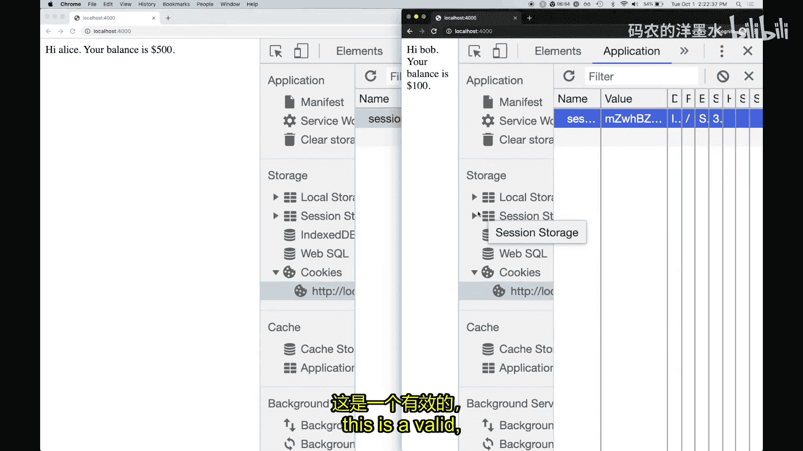

**会话ID的安全性关键**：
*   **随机性**：会话ID必须足够长且随机，使得攻击者无法通过猜测或枚举获得有效的ID。使用`crypto.randomBytes(16)`可以生成一个具有128位熵的强随机ID。
*   **服务器端状态**：会话的安全核心在于服务器端的数据库。退出登录、修改密码或用户主动终止会话时，都应删除或更新服务器端的对应记录。

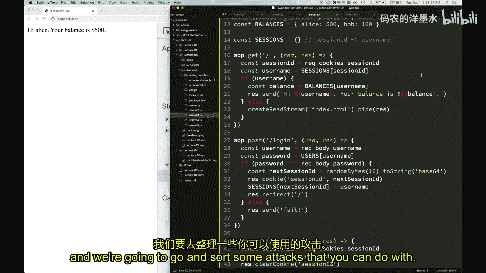

这种模式的优势在于，服务器掌握了会话的主动控制权，可以实现诸如“查看所有活跃会话”和“远程退出特定设备”等功能。

---

## Cookie的属性与安全问题
Cookie有一些可设置的属性，但它们的设计存在历史遗留问题，可能导致安全漏洞。

### Cookie属性
*   **Expires**：设置Cookie的过期日期。如果不设置，则为“会话Cookie”，理论上浏览器关闭即删除，但现代浏览器的“会话恢复”功能可能会保留它们。
*   **Path**：指定Cookie仅在特定路径（及其子路径）下发送。例如，`Path=/docs`的Cookie只会发送给`/docs`或`/docs/web`等路径的请求。
*   **Domain**：允许Cookie发送给指定域名及其子域名。默认情况下，Cookie只发送给设置它的确切域名。

### 会话劫持攻击
如果Cookie（特别是会话ID）在传输过程中被窃取，攻击者就能冒充用户，这称为**会话劫持**。

*   **主要途径**：在不使用HTTPS（即HTTP明文传输）的网络中，攻击者可以监听网络流量，直接获取Cookie。
*   **历史案例**：2010年，一个Firefox扩展“Firesheep”演示了在公共Wi-Fi中如何轻易劫持未加密网站的会话，引发了业界对全站HTTPS的重视。
*   **防御措施**：
    *   **全站HTTPS**：这是根本解决方案，确保Cookie在传输过程中始终加密。
    *   **`Secure`属性**：在设置Cookie时添加`Secure`属性，指示浏览器仅通过HTTPS连接发送此Cookie。这可以作为过渡措施，但最终目标应是全站HTTPS。
    *   **`HttpOnly`属性**：在设置Cookie时添加`HttpOnly`属性，可以阻止JavaScript通过`document.cookie` API访问该Cookie。这能有效防御跨站脚本攻击窃取Cookie。

### Path属性的安全误解
`Path`属性**不能**提供安全隔离。由于Web的核心安全模型——同源策略（Same-Origin Policy）——与Cookie的安全模型不同，导致`Path`限制可以被绕过。

**攻击演示**：
假设`https://web.stanford.edu/class/cs106a`设置了一个Cookie，并指定`Path=/class/cs106a`，意图将其隔离在该路径下。
攻击者在`https://web.stanford.edu/class/cs253`（同一域名，不同路径）的页面中，可以通过JavaScript执行以下操作：
1.  创建一个隐藏的`<iframe>`，其`src`指向`https://web.stanford.edu/class/cs106a`。
2.  由于同源策略（协议、域名、端口相同），`cs253`页面的JavaScript可以访问`iframe`内部`cs106a`页面的`document`对象。
3.  通过`iframe.contentDocument.cookie`，攻击者就能直接读取到`cs106a`路径下的Cookie。

这个例子说明，依赖`Path`属性来保护Cookie免受同一域名下其他“兄弟”路径的访问是无效的。真正的安全隔离需要通过**不同的子域名**来实现，因为同源策略将不同子域名视为不同的“源”。

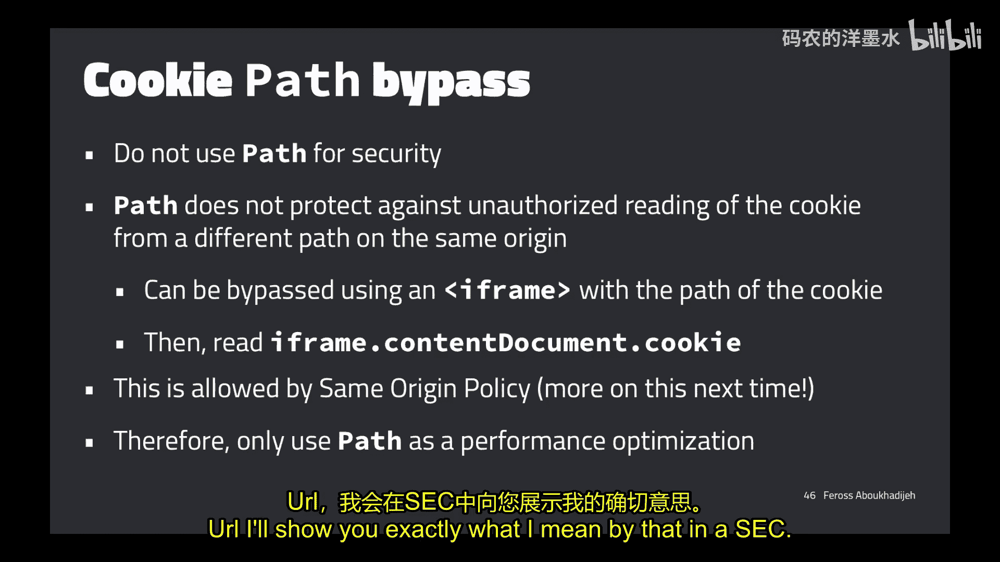

---

## 总结
本节课中我们一起学习了Web会话的安全实现与相关攻击。

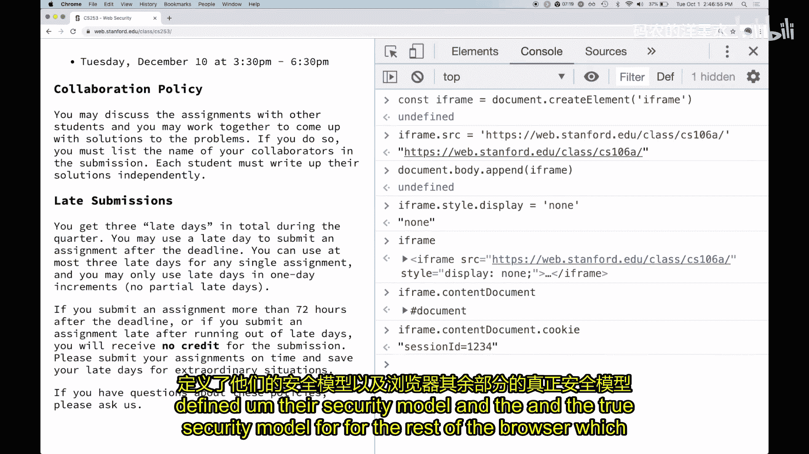

1.  **会话基础**：我们了解了Cookie是实现HTTP无状态协议下会话管理的主要机制，它使得环境授权成为可能。
2.  **不安全实现**：最初的简单实现（直接以用户名作为Cookie值）极易被篡改，不可用。
3.  **签名Cookie**：引入密码学签名可以防止Cookie被篡改，但无法解决Cookie被盗后的重用问题，因为签名本身是持久有效的。
4.  **会话ID模式**：更安全的模式是使用随机、不可预测的会话ID，并在服务器端维护会话状态数据库。这使服务器能够主动使会话失效，是实际应用中的标准做法。
5.  **Cookie安全属性**：我们探讨了`Secure`和`HttpOnly`属性的重要性，前者强制Cookie通过HTTPS传输，后者防止JavaScript访问，两者都是重要的防御措施。
6.  **会话攻击**：重点介绍了**会话劫持**攻击，其根源在于Cookie的机密性被破坏。全站HTTPS是防御此类攻击的基石。
7.  **Cookie模型的局限性**：我们认识到Cookie规范的历史遗留问题，特别是`Path`属性不能提供真正的安全隔离，Web安全更多地依赖于同源策略，而这将是下节课的重点。

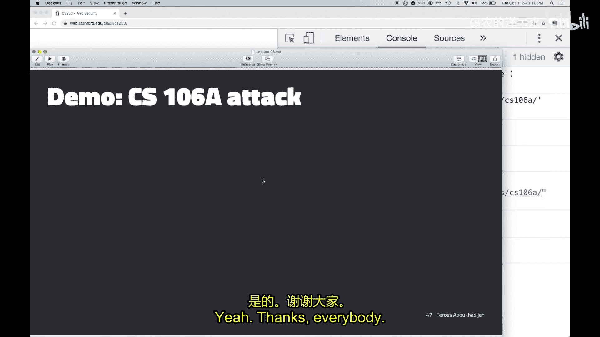

通过本课，你应该理解如何安全地实现用户会话，并意识到保护会话标识符（如Cookie）的机密性和完整性至关重要。