# 004：跨站请求伪造与同源策略

## 概述
在本节课中，我们将要学习网络安全中的两个核心概念：跨站请求伪造（CSRF）和同源策略（SOP）。我们将探讨Cookie的安全设置、CSRF攻击的原理与防御，以及浏览器如何通过同源策略隔离不同来源的网页以保障安全。

---

## Cookie安全设置回顾

上一节我们介绍了会话管理和Cookie的基础知识。本节中，我们来看看如何更安全地设置Cookie。

Cookie的默认行为可能带来安全风险。例如，仅依赖`path`属性来限制Cookie的访问范围是不可靠的，因为其他页面可能通过嵌入框架等方式绕过此限制。

以下是设置安全Cookie的建议步骤：

1.  **使用`Secure`属性**：确保Cookie仅通过HTTPS连接传输。
    ```javascript
    Secure
    ```
2.  **使用`HttpOnly`属性**：防止JavaScript代码访问Cookie，这有助于防御某些类型的攻击（如XSS）。
    ```javascript
    HttpOnly
    ```
3.  **明确设置`Path`属性**：不要依赖默认路径。建议显式设置为根路径`/`，以避免对路径保护产生错误的安全感。
    ```javascript
    Path=/
    ```
4.  **使用`SameSite`属性**：这是防御CSRF攻击的关键。它控制Cookie是否随跨站请求一同发送。
    *   `Lax`：允许同站请求和顶级导航（如链接点击）携带Cookie，但阻止大多数跨站子资源请求（如表单提交、图片加载）。这是推荐的平衡设置。
    *   `Strict`：完全阻止跨站请求携带Cookie，即使是用户点击的链接。这更安全，但可能影响用户体验。
    *   `None`：允许所有跨站请求携带Cookie（必须与`Secure`属性一同使用）。
    ```javascript
    SameSite=Lax
    ```
5.  **设置合理的`Max-Age`**：为会话Cookie设置一个合适的过期时间（例如30天），并在用户每次活动时刷新它。

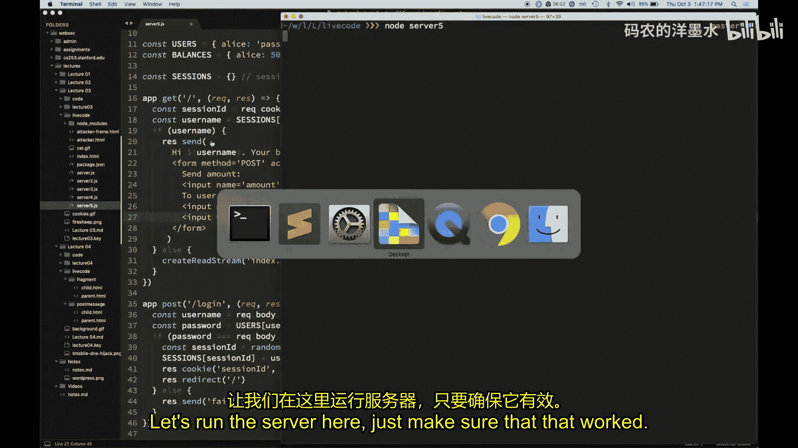

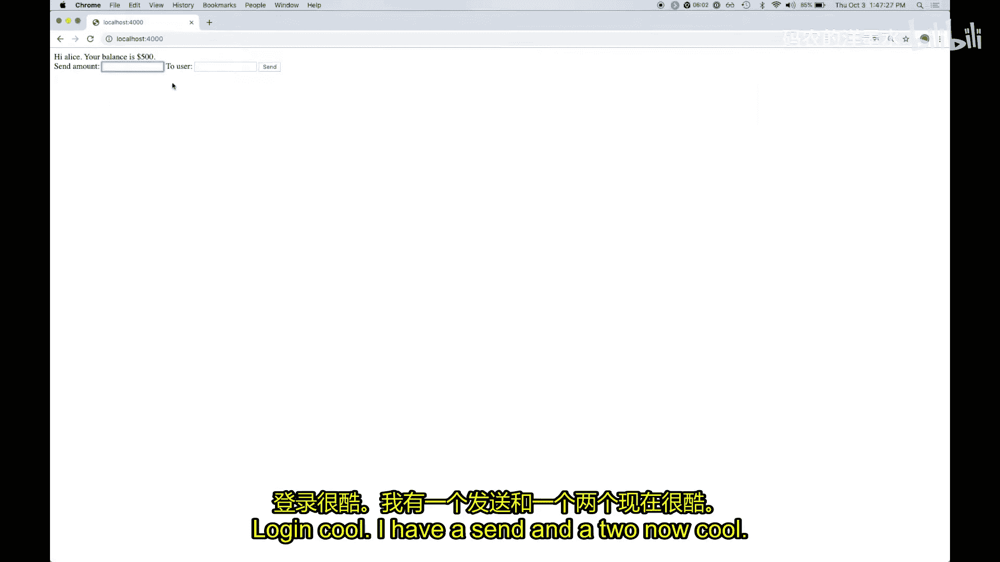

一个相对安全的Cookie设置示例如下：
```javascript
Set-Cookie: sessionId=abc123; Secure; HttpOnly; Path=/; SameSite=Lax; Max-Age=2592000
```

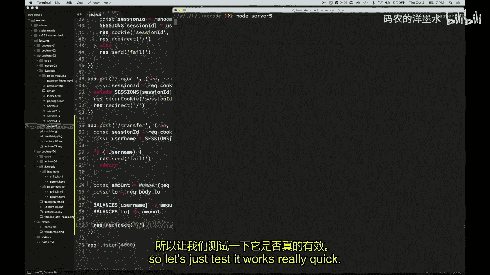

**注意**：在清除Cookie（如用户登出）时，必须使用与设置时完全相同的属性（除了`Max-Age`设为过去时间），否则浏览器可能将其视为不同的Cookie。

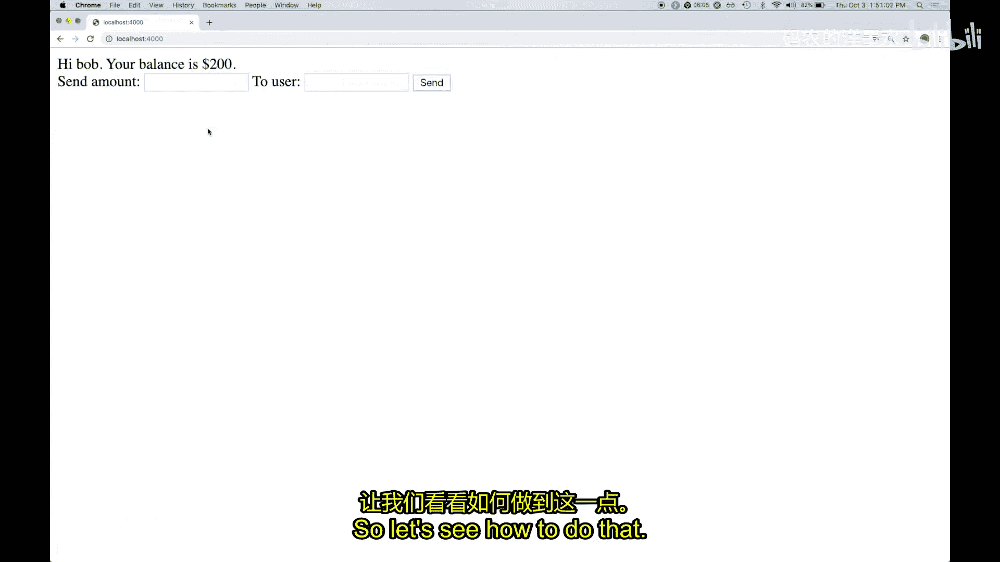

---

## 跨站请求伪造

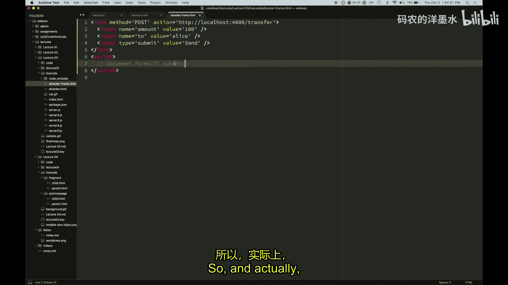

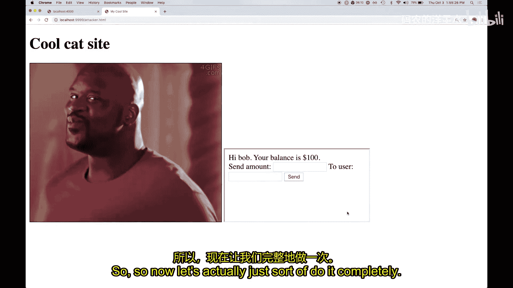

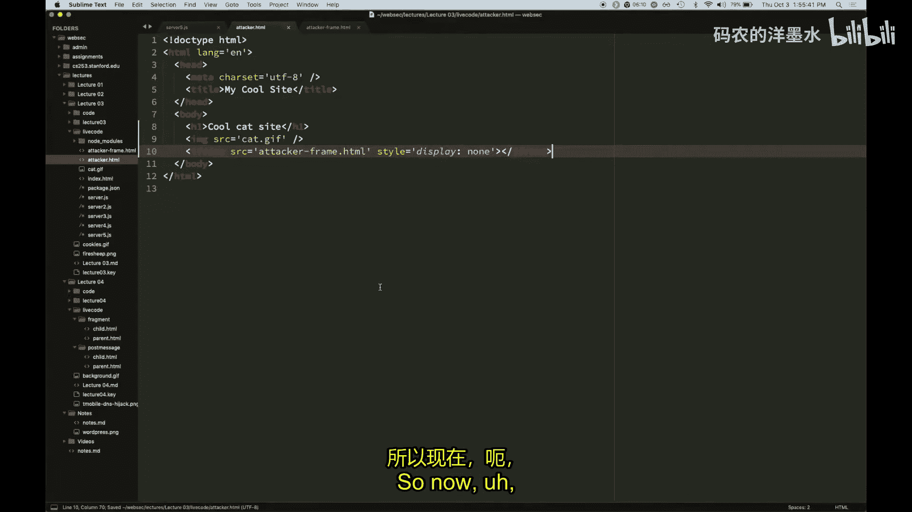

### 攻击原理
跨站请求伪造是一种攻击方式，攻击者诱使已登录目标网站的用户，在不知情的情况下向该网站发送恶意请求。

攻击得以实现，核心在于浏览器会自动将用户的Cookie附加到发往对应站点的**每一个请求**中，无论这个请求是由用户主动发起，还是由其他网站（如攻击者页面）触发的。这被称为“环境权威”。

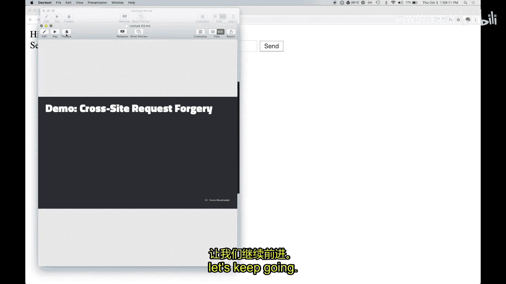

**攻击场景示例**：
1.  用户登录了`bank.example.com`，并拥有有效的会话Cookie。
2.  用户访问了攻击者的恶意网站`attacker.com`。
3.  该恶意网站包含一个隐藏的表单或自动提交的脚本，其`action`指向`bank.example.com/transfer`，并预设了转账参数（如向攻击者账户转账）。
4.  当页面加载或触发事件时，浏览器会向`bank.example.com`发送这个POST请求，并**自动附上用户的会话Cookie**。
5.  银行服务器收到请求，验证Cookie有效，便执行了转账操作。

即使目标端点设计为只接受POST请求，攻击者仍然可以通过在其站点上创建隐藏表单并利用JavaScript自动提交来发动攻击。

### 演示：一个简单的CSRF攻击
我们构建了一个简易的银行网站和攻击者网站来演示此攻击。

1.  **银行网站** (`localhost:4000`)：具有登录、查看余额和转账功能。转账端点 `/transfer` 接受POST请求。
2.  **攻击者网站** (`attacker.com:9999`)：表面上是一个普通的“猫咪图片”网站。页面中隐藏了一个`iframe`，其内部是一个指向银行转账端点的表单，并预设了转账金额和收款人（攻击者）。页面加载后，JavaScript会自动提交该表单。

**关键点**：当用户已登录银行网站并访问攻击者页面时，转账请求会携带用户的银行会话Cookie发出并被银行服务器成功处理，而用户对此毫无察觉。

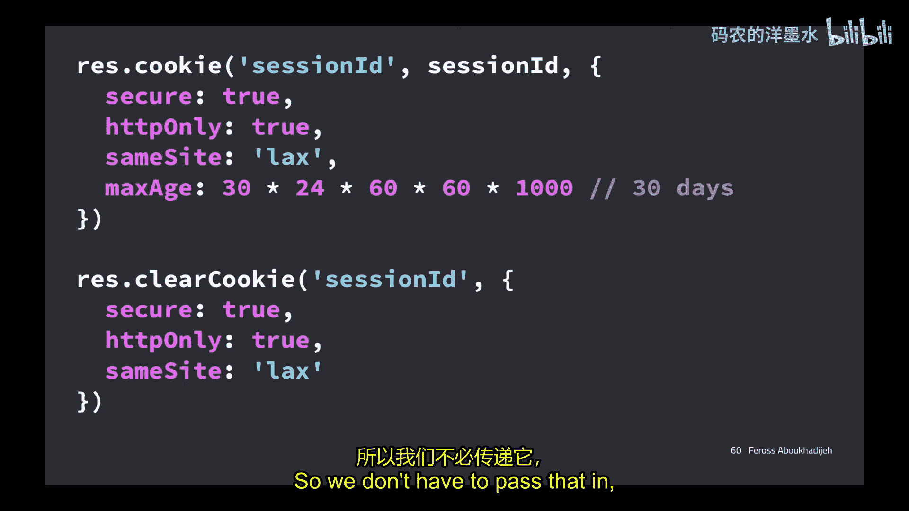

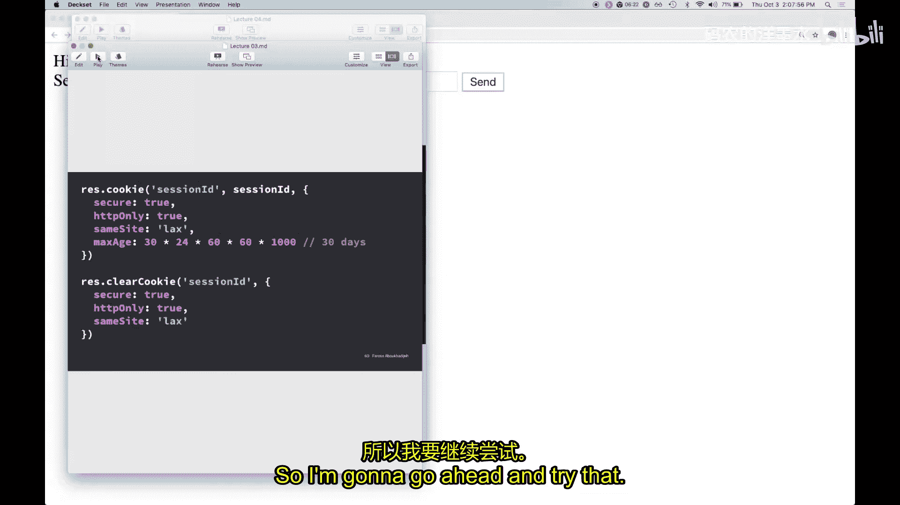

### 主要防御措施：SameSite Cookie属性
正如之前提到的，设置 `SameSite=Lax` 或 `SameSite=Strict` 是防御CSRF攻击的有效手段。

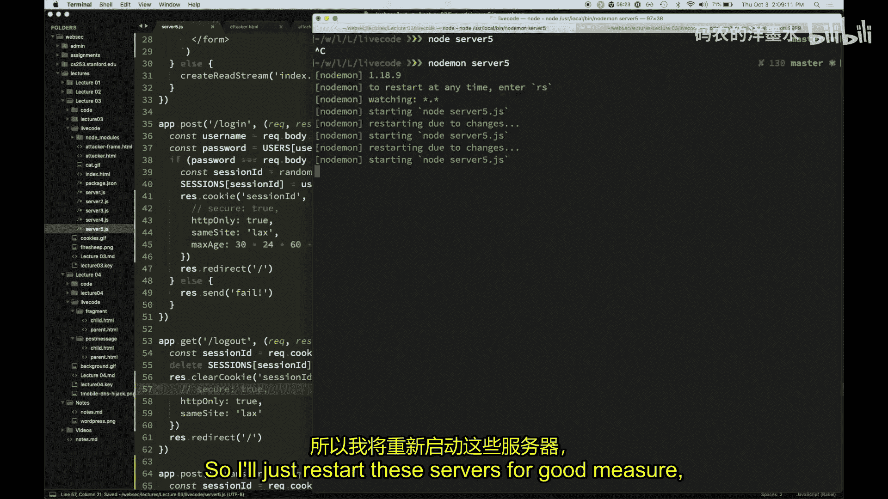

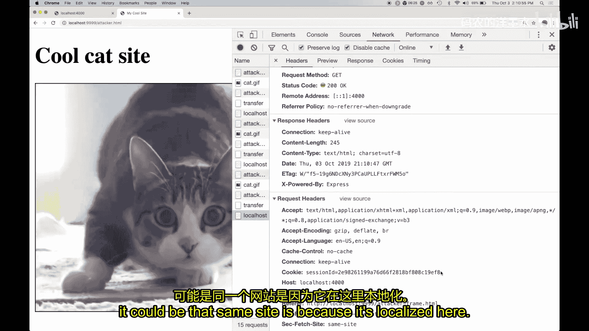

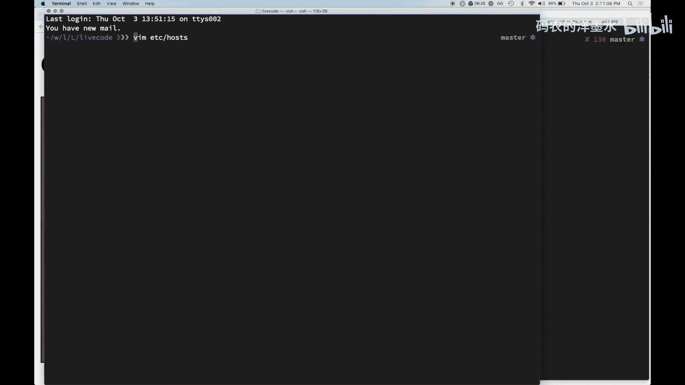

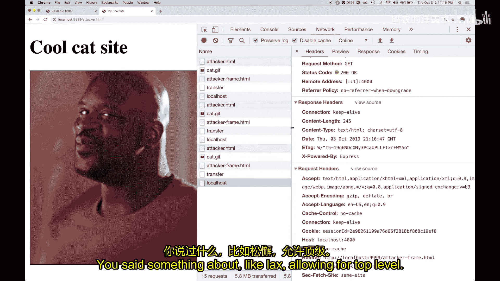

*   当Cookie被标记为`SameSite=Lax`时，浏览器将不会在**跨站子资源请求**（如由`attacker.com`页面内表单发往`bank.example.com`的POST请求）中发送此Cookie。这直接阻止了上述攻击。
*   但`Lax`模式允许在**顶级导航**（如用户从`attacker.com`点击一个指向`bank.example.com`的链接）中发送Cookie，以维持基本的用户体验。

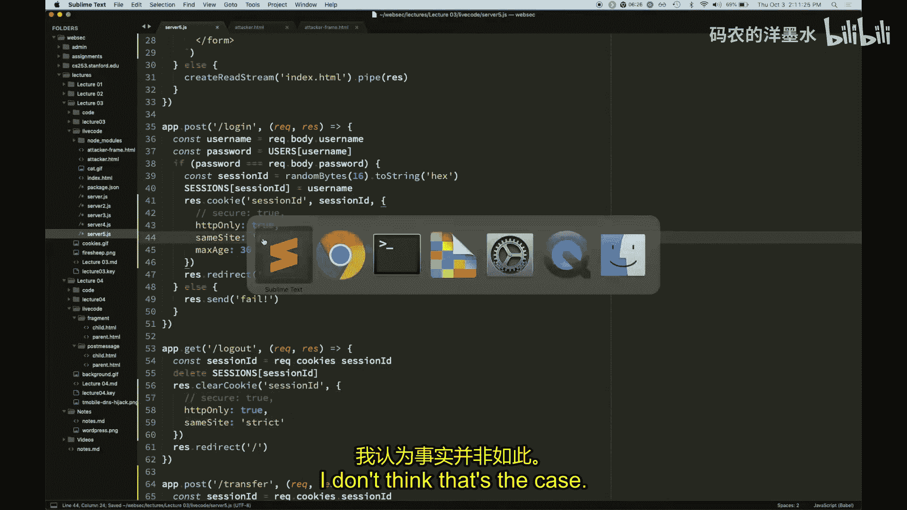

**注意**：`SameSite`策略的判断基于**请求的源（Origin）**。在演示中，当攻击者站点和银行站点都使用`localhost`但端口不同时，浏览器可能在某些情况下仍视其为“同站”（Site），因为“站”的定义（eTLD+1）通常不包含端口。为了正确测试，我们需要使用不同的主机名（如`bank.local`和`attacker.com`）。

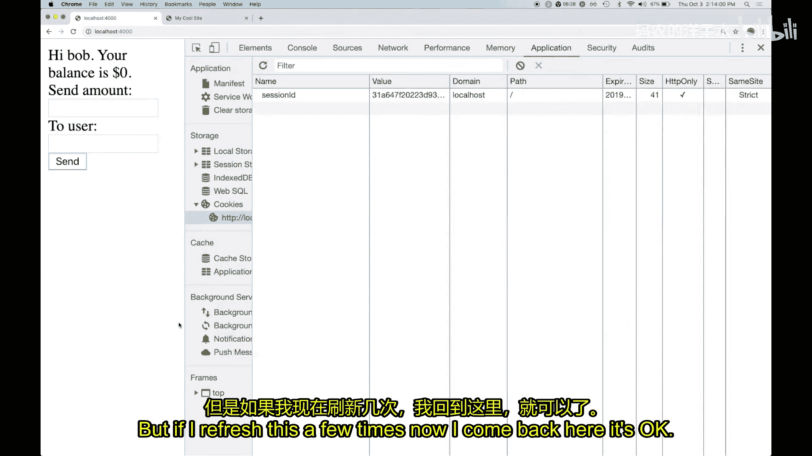

---

## 同源策略

### 核心概念
同源策略是Web安全的基石。其核心思想是：**来自不同源（Origin）的两个页面不应该被允许相互干扰**。

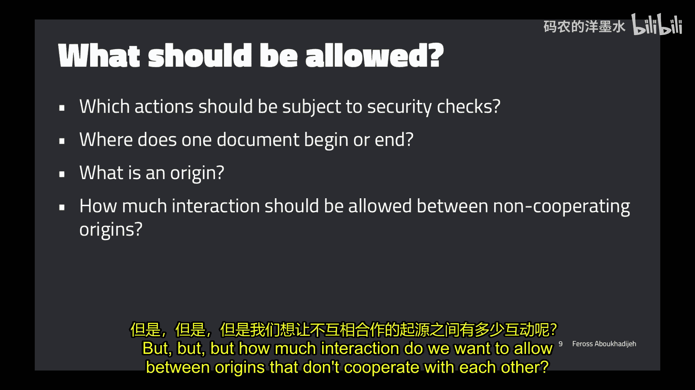

浏览器将每个源视为一个独立的“进程”，负责强制执行它们之间的隔离。

**源（Origin）的定义**：由**协议（Protocol）、主机名（Hostname）和端口（Port）** 三元组共同确定。
公式表示为：`Origin = (protocol, hostname, port)`

如果两个URL的协议、主机名和端口完全相同，则它们属于**同源**，可以自由交互（例如，通过JavaScript相互访问DOM、Cookie等）。否则，就是**跨源**，交互受到严格限制。

### 同源策略规则示例
以下是同源策略在不同场景下的应用：

*   **链接与重定向**：允许。这是Web的基础。
*   **嵌入资源**：
    *   ``, `<script>`, `<link>`, `<iframe>`：**允许**跨源加载。这是为了支持CDN、公共库等用例。
    *   但是，**不允许**父页面通过JavaScript读取跨源`iframe`内的DOM内容（`iframe.contentDocument` 会返回`null`）。
*   **修改嵌入内容**：**不允许**。父页面不能直接修改跨源`iframe`的内部。
*   **导航嵌入内容**：**允许**。父页面可以改变跨源`iframe`的`src`属性，将其导航到其他URL。
*   **通过JavaScript发起网络请求**：使用现代API如`fetch()`或`XMLHttpRequest`发起跨源请求时，**默认被浏览器阻止**。这是为了防止恶意站点使用用户的身份凭证（Cookie）访问其他网站（如邮箱、社交网络）并窃取数据。

### 放松同源策略：跨源通信
有时，两个不同源的站点需要安全地进行通信（例如，登录服务与主应用之间）。同源策略提供了几种“选择性开放”的机制。

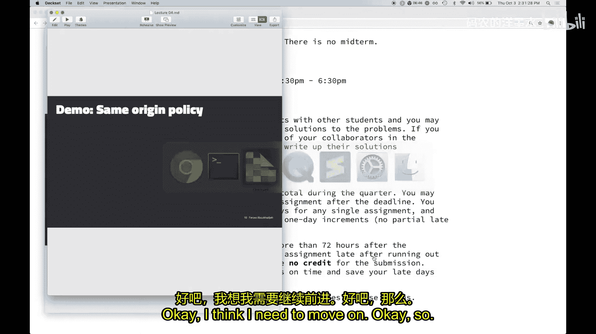

**1. 不安全的旧方法：`document.domain` (已废弃)**
允许页面将其源的后缀部分设置为更通用的域（例如，`login.example.com` 可以设置为 `example.com`）。**但极度不推荐**，因为它会放宽对所有共享该父域的站点的限制，引入安全风险。

**2. 历史技巧：URL片段标识符哈希通信**
利用父页面可以更改子`iframe`的URL哈希（`#fragment`），而子页面可以通过轮询监听自身URL哈希变化来实现单向通信。这种方法笨拙、低效且不安全，已成为历史。

**3. 现代标准方法：`postMessage` API**
这是安全实现跨源通信的推荐方式。

*   **发送方**：获取目标窗口的引用（如`iframe.contentWindow`），调用`postMessage(data, targetOrigin)`方法。
*   **接收方**：监听`message`事件，并从`event.data`中获取信息。
*   **关键安全实践**：**双方都必须验证消息来源**。接收方应检查`event.origin`是否在预期范围内；发送方应指定精确的`targetOrigin`。不进行验证可能导致恶意站点注入消息。

一个简单的`postMessage`示例：
```javascript
// 父页面 (发送方)
iframe.contentWindow.postMessage('Hello from parent!', 'https://child-site.example.com');

// 子页面 (接收方)
window.addEventListener('message', (event) => {
  if (event.origin !== 'https://parent-site.example.com') {
    return; // 忽略来自非预期源的消息
  }
  console.log('Received:', event.data);
});
```

`postMessage`功能强大，支持传输复杂对象（通过结构化克隆算法），甚至可以通过“可转移对象”实现零拷贝大数据传输。

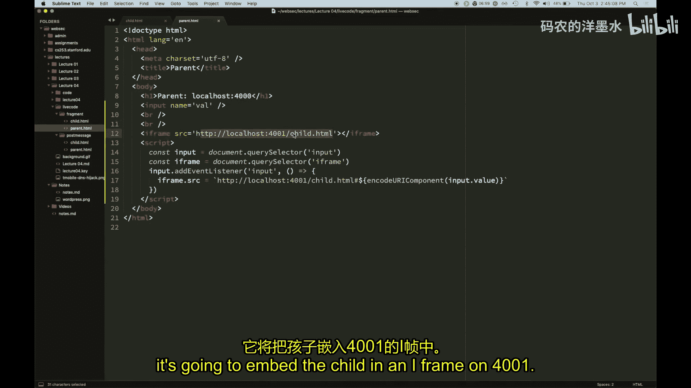

---

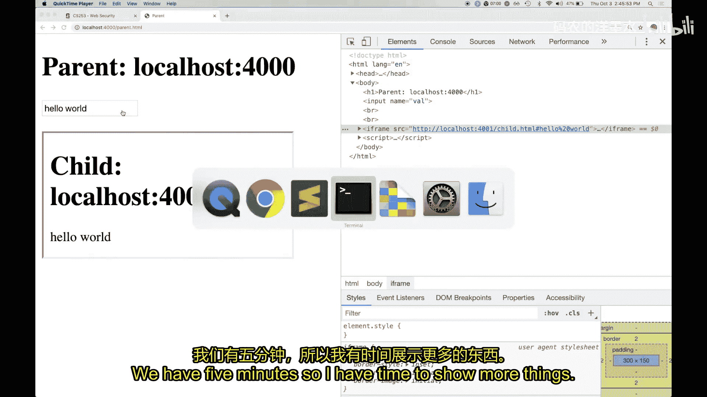

## 总结
本节课中我们一起学习了：
1.  **Cookie安全**：通过`Secure`、`HttpOnly`、`SameSite`等属性加固Cookie，其中`SameSite=Lax`是防御CSRF的关键。
2.  **跨站请求伪造**：理解了CSRF攻击如何利用浏览器的自动Cookie附加机制，让用户在不知情时执行恶意操作。
3.  **同源策略**：掌握了Web安全的基石——同源策略，它通过隔离不同源的页面来防止相互干扰。我们了解了其规则（什么允许，什么禁止）以及判断同源的标准（协议、主机、端口）。
4.  **跨源通信**：探讨了在需要时，如何安全地放松同源策略，特别是使用现代的`postMessage` API来实现受控的跨源数据交换，并强调了验证消息来源的重要性。

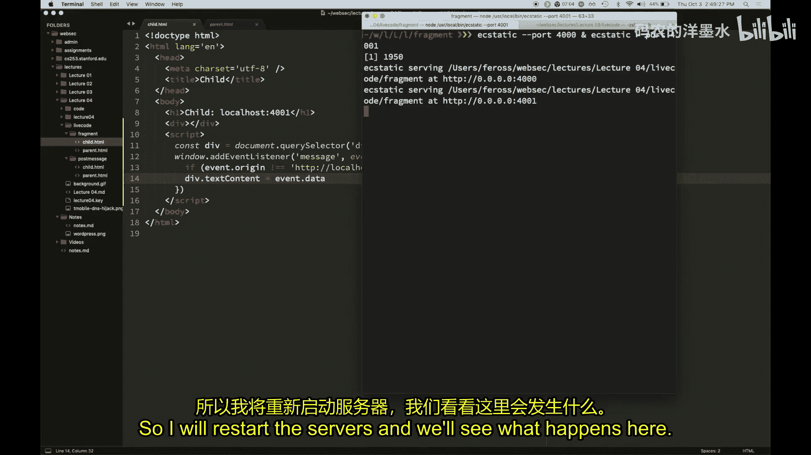

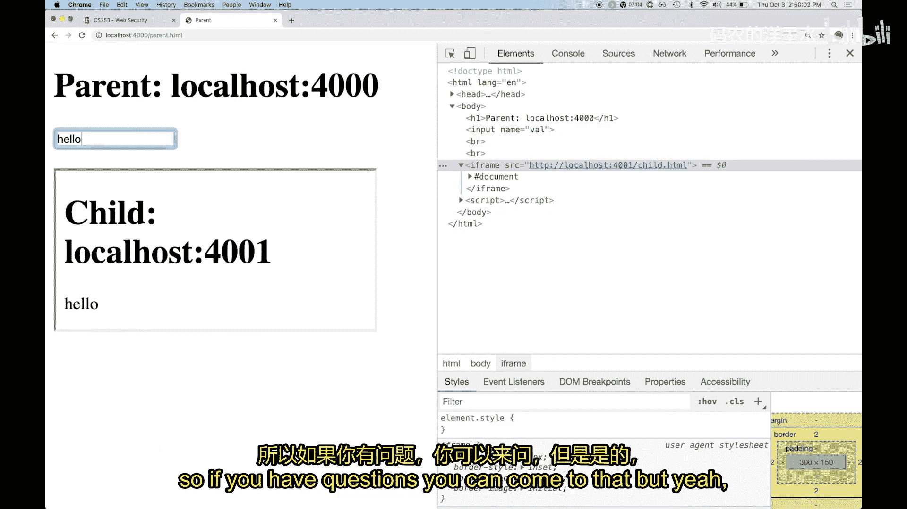

记住，安全是一个多层次的工作。结合使用安全的Cookie策略、对敏感操作实施额外的CSRF令牌验证、并理解和尊重同源策略，是构建安全Web应用的基础。