# 005：同源策略的例外情况

在本节课中，我们将继续探讨同源策略的例外情况，特别是跨域通信的安全问题。我们将学习如何使用 `postMessage` API 进行安全的跨域通信，并了解如何通过验证消息来源和目标来防止安全漏洞。此外，我们还将讨论如何通过配置HTTP响应头来增强或放宽同源策略的限制，以应对不同的安全需求。

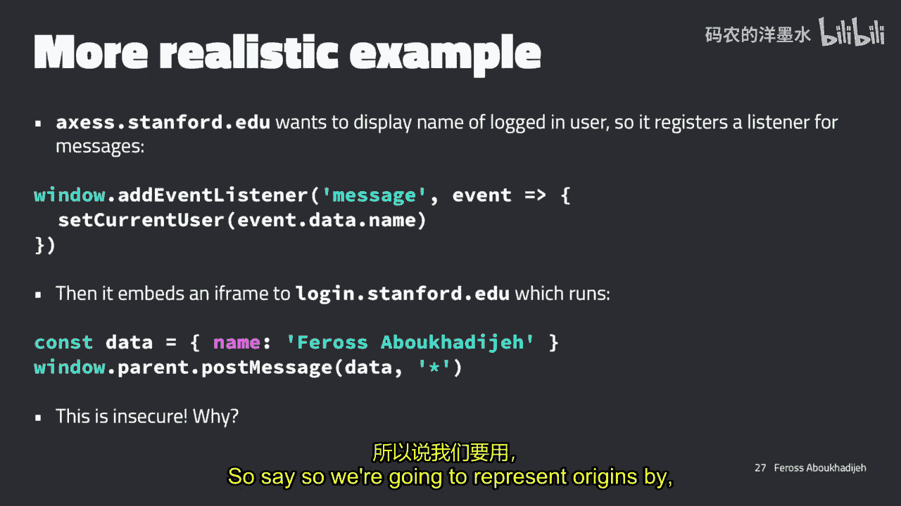

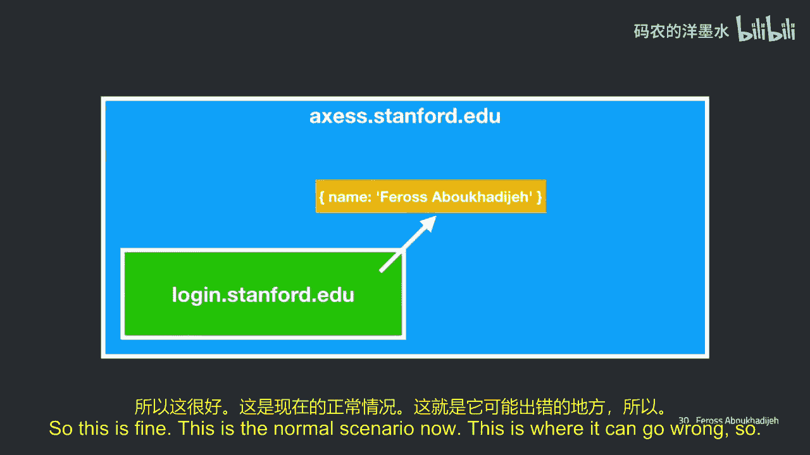

---

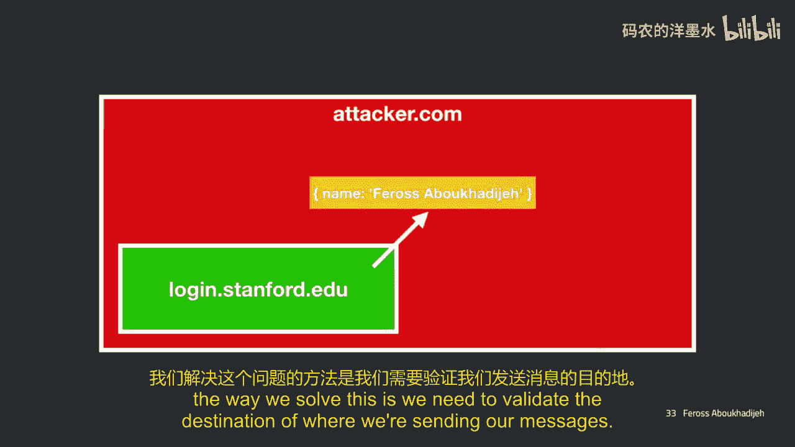

## 跨域通信与 `postMessage` API

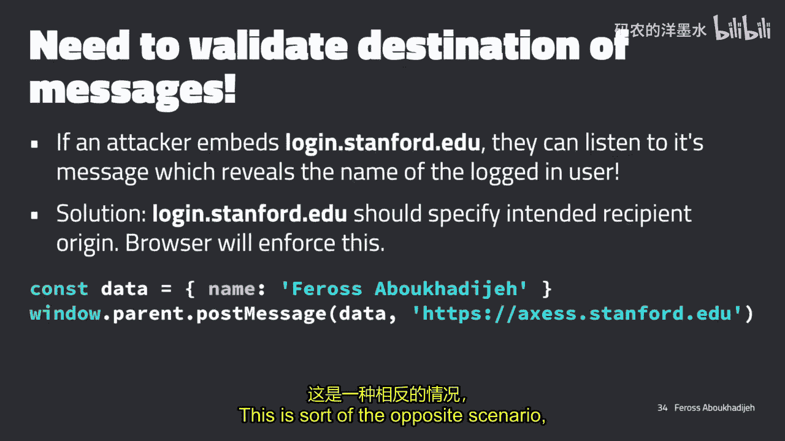

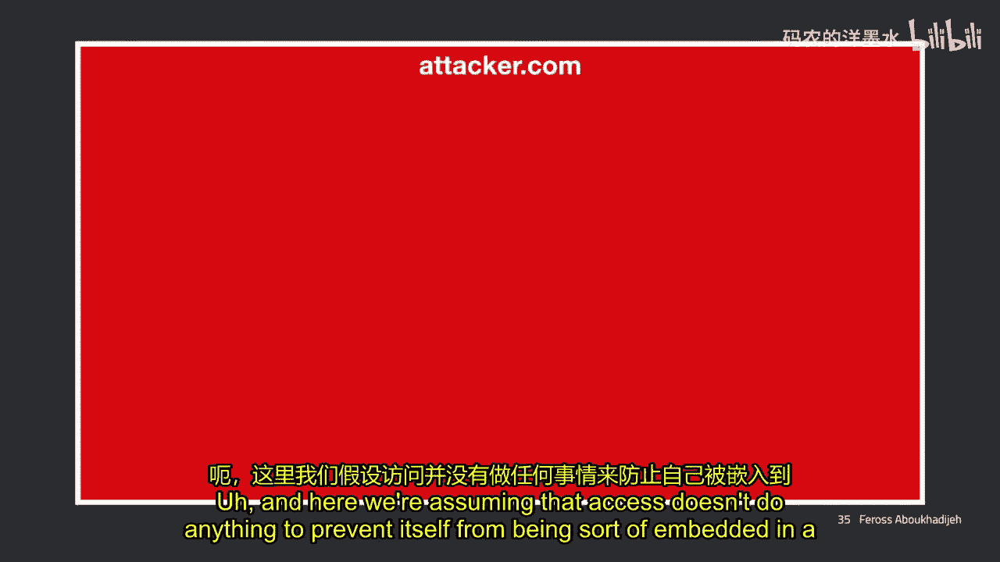

上一节我们介绍了跨域通信的基本概念。本节中，我们来看看如何使用 `postMessage` API 实现两个愿意合作的站点之间的安全通信。

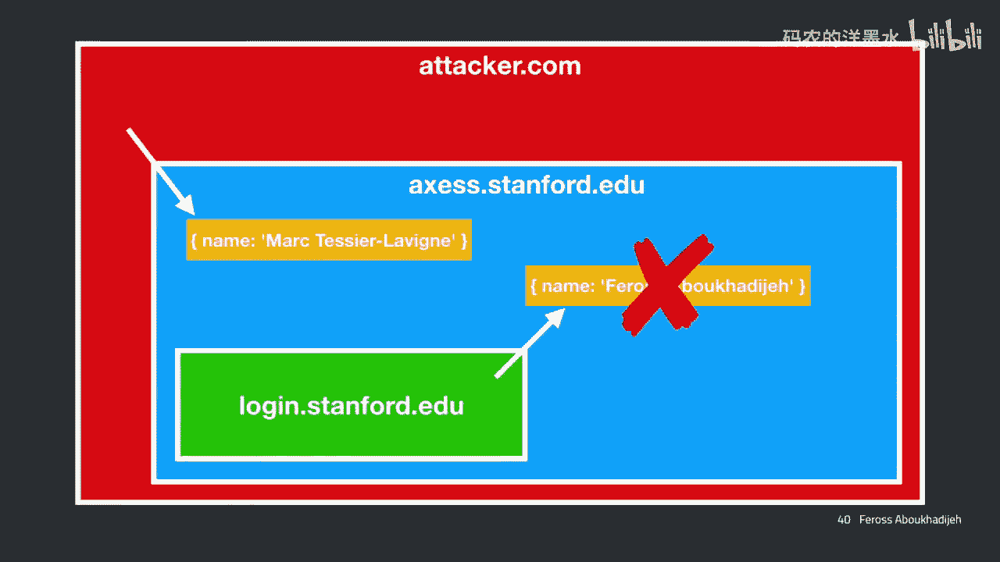

`postMessage` API 允许一个站点向另一个站点发送消息，前提是发送方拥有接收方窗口的引用。一种常见的方式是创建一个 `<iframe>` 并加载目标站点，从而获得对该框架的引用。

**核心代码示例：发送消息**
```javascript
// 发送消息到 iframe
iframe.contentWindow.postMessage('Hello', 'https://target.com');
```

**核心代码示例：接收消息**
```javascript
// 监听来自其他窗口的消息
window.addEventListener('message', function(event) {
    if (event.origin === 'https://trusted.com') {
        console.log('Received:', event.data);
    }
});
```

然而，这种通信方式存在安全隐患。如果发送方不指定目标来源，或者接收方不验证消息来源，攻击者可能嵌入目标站点并窃取信息，或伪造消息进行欺骗。

### 确保通信安全

以下是确保 `postMessage` 通信安全的关键步骤：

1.  **发送方指定目标来源**：在调用 `postMessage` 时，始终提供目标窗口的源（origin）作为第二个参数。浏览器会阻止消息发送到非指定源的窗口。
    ```javascript
    targetWindow.postMessage(data, 'https://expected-origin.com');
    ```

2.  **接收方验证消息来源**：在消息事件监听器中，始终检查 `event.origin` 属性，确保消息来自预期的源。
    ```javascript
    window.addEventListener('message', function(event) {
        if (event.origin !== 'https://trusted-origin.com') {
            return; // 忽略来自非信任源的消息
        }
        // 处理消息
    });
    ```

忽略这些验证步骤可能导致信息泄露或跨站脚本攻击（XSS）。

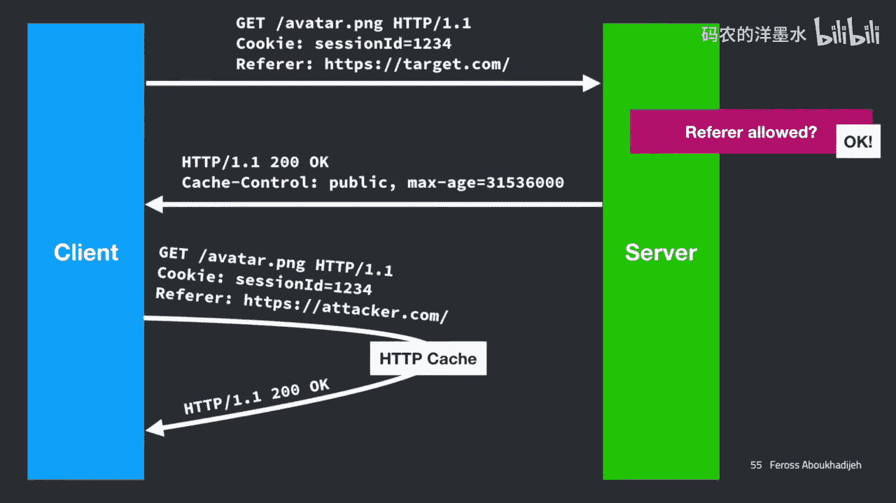

---

## 同源策略的自动例外

除了显式的跨域通信API，浏览器默认允许一些跨域操作，这些是出于历史原因和功能需要而存在的“自动例外”。了解这些对于安全至关重要。

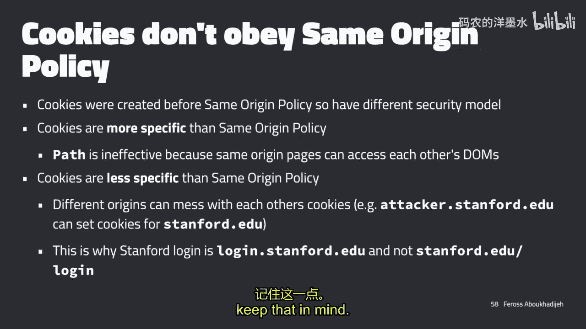

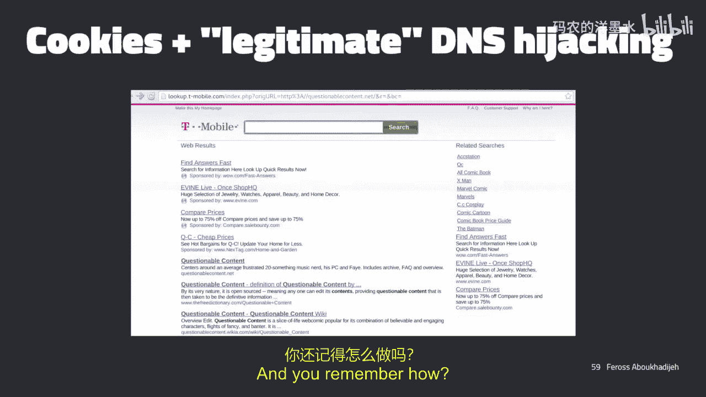

以下是浏览器默认允许的跨域请求类型：

*   **嵌入资源**：页面可以嵌入来自其他源的图像、样式表（CSS）和脚本。
*   **提交表单**：页面可以向其他源提交表单（包括GET和POST请求）。
*   **创建链接**：页面可以链接到其他源的URL。

这些操作本身不违反同源策略的核心——即一个源的脚本无法读取另一个源文档的内容。但是，它们会携带“环境权威”，例如自动附加的Cookie，这可能引发安全问题。

### 由跨域请求引发的安全问题

一个典型的例子是**跨站请求伪造（CSRF）**。攻击者可以在自己的页面中嵌入一个指向目标站点（如银行）的图片或表单。当用户访问攻击者页面时，浏览器会自动向银行发送带有用户Cookie的请求，可能导致非预期的资金转移。

**防御措施：使用 `SameSite` Cookie 属性**

解决CSRF等问题的一个有效方法是使用 `SameSite` Cookie。服务器在设置Cookie时，可以指定 `SameSite` 属性：

*   `SameSite=Strict`：Cookie仅在同站请求（即请求的源与Cookie的域一致）时发送。
*   `SameSite=Lax`：Cookie在大多数同站请求以及顶级导航（如点击链接）时发送，但在跨站子资源请求（如图片、脚本）中不发送。

通过设置 `SameSite` 属性，可以防止Cookie在跨站请求中被自动附加，从而有效缓解CSRF攻击。

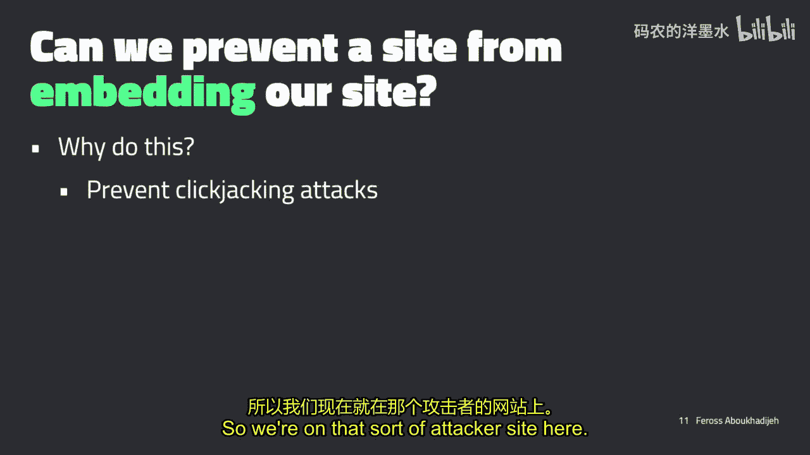

---

## 配置同源策略：强化与放宽

有时，我们需要调整默认的同源策略规则，以增强安全性或实现特定功能。

### 强化策略：防止点击劫持

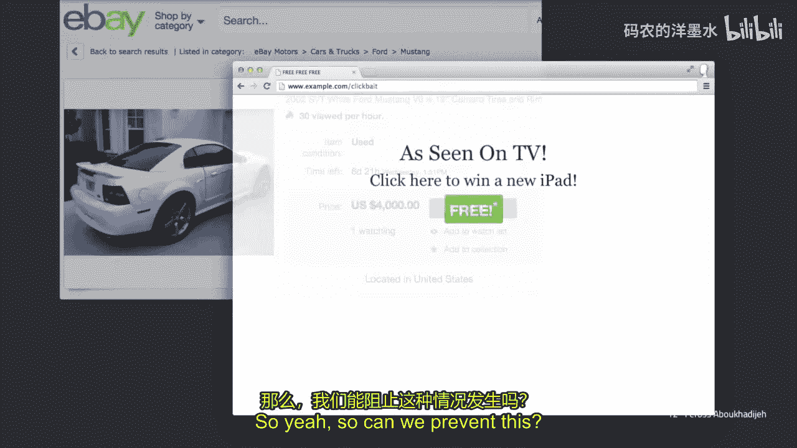

点击劫持是一种攻击手段，攻击者将目标网站嵌入一个透明iframe中，诱使用户在不知情的情况下点击目标网站上的按钮。

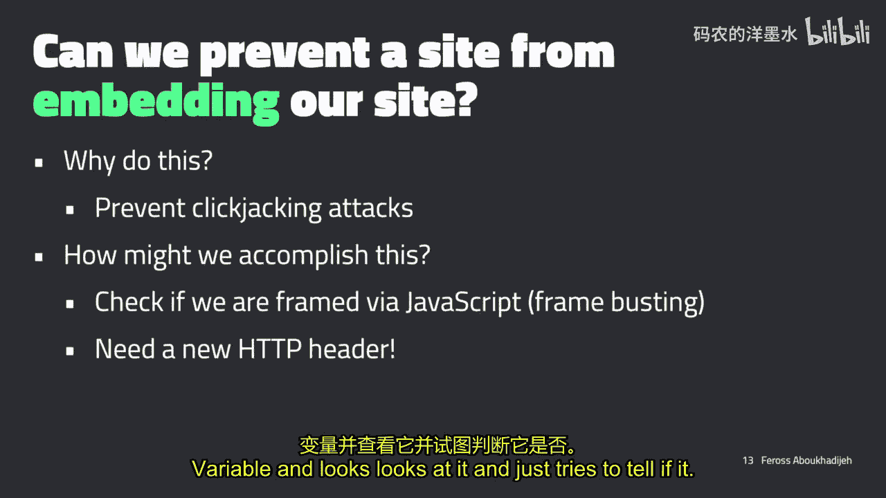

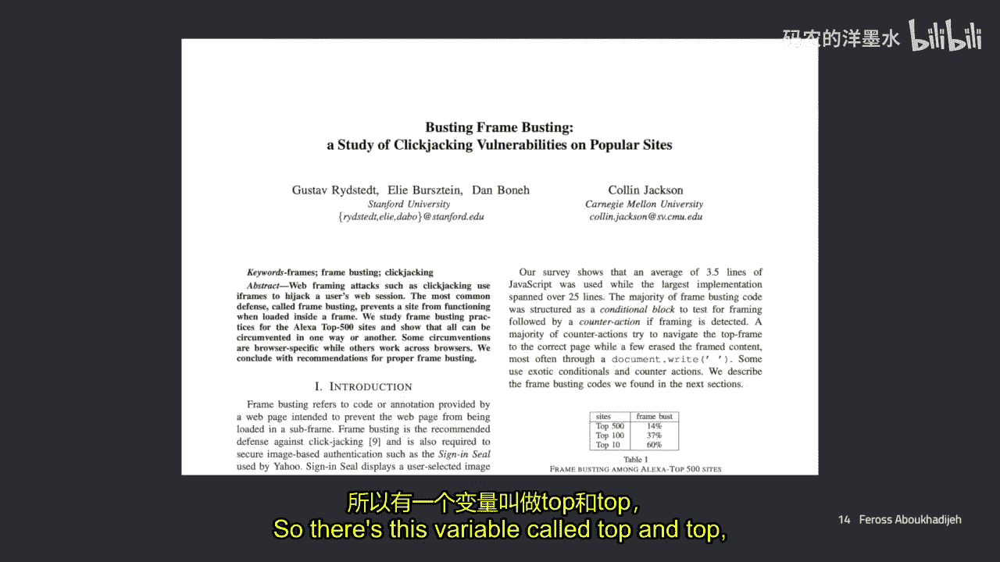

**防御措施：使用 `X-Frame-Options` 或 `Content-Security-Policy` 响应头**

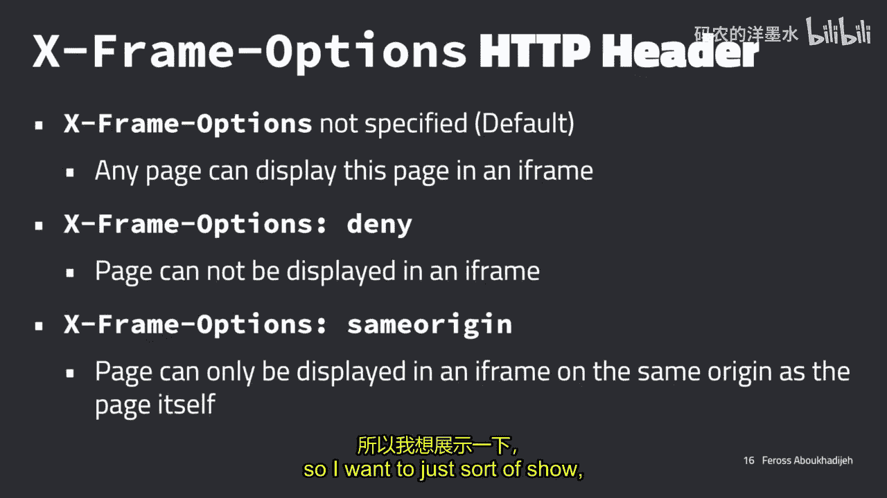

网站可以通过HTTP响应头声明不允许被嵌入到框架中。

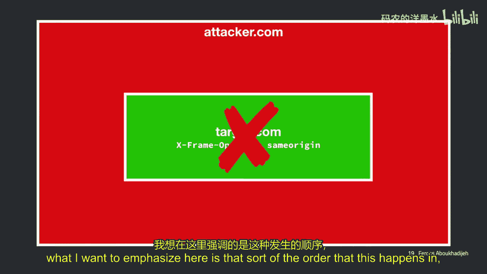

*   **`X-Frame-Options` 头**：
    *   `DENY`：禁止任何页面嵌入此页面。
    *   `SAMEORIGIN`：只允许同源页面嵌入此页面。
    ```http
    X-Frame-Options: SAMEORIGIN
    ```

*   **更现代的 `Content-Security-Policy` 头**：
    ```http
    Content-Security-Policy: frame-ancestors 'self';
    ```
    这表示只允许同源页面作为祖先框架嵌入。

### 放宽策略：跨域资源共享（CORS）

有时，我们确实需要允许一个源读取另一个源的资源数据（例如，通过 `fetch` API 获取JSON数据）。默认的同源策略会阻止这种读取。

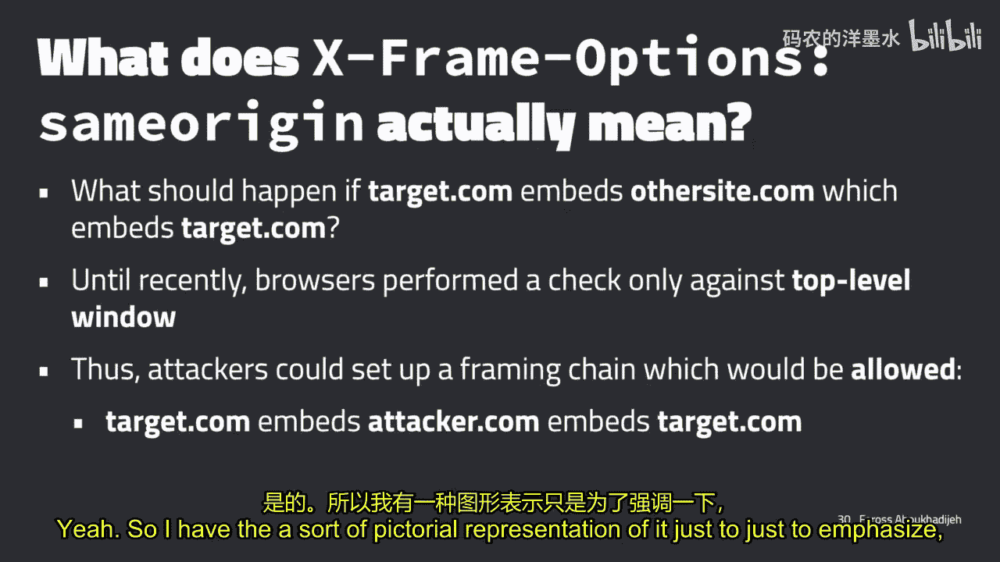

**解决方案：CORS机制**

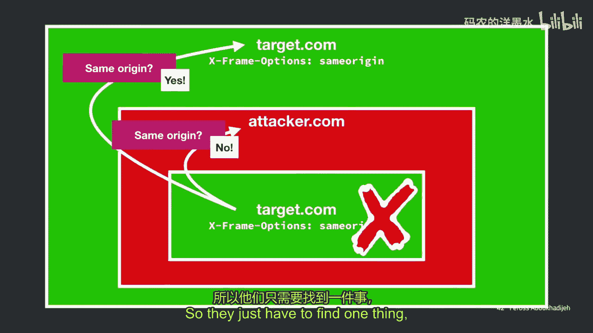

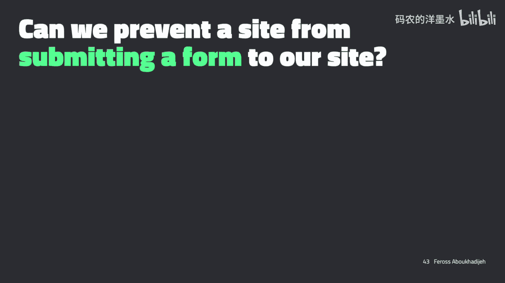

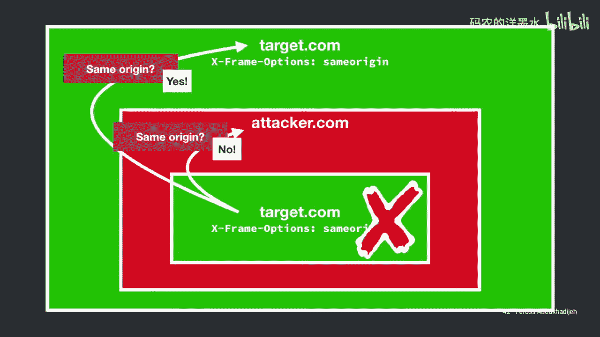

服务器可以通过设置 `Access-Control-Allow-Origin` 响应头，来显式允许特定源或所有源读取其资源。

```http
Access-Control-Allow-Origin: https://requesting-site.com
```
或者允许所有源（需谨慎）：
```http
Access-Control-Allow-Origin: *
```

当浏览器发现跨域请求的响应中包含此头部，且其值匹配请求源或为 `*` 时，就会允许前端JavaScript读取响应内容。

**历史方案：JSONP（已过时）**

在CORS普及之前，开发者使用一种称为JSONP的变通方法。其原理是利用 `<script>` 标签可以跨域加载并执行JavaScript的特性。服务器将数据包装在一个函数调用中返回，客户端预先定义同名函数来处理数据。

```javascript
// 客户端定义回调函数
function handleData(data) {
    console.log(data);
}
// 动态添加script标签，请求数据，服务器返回：handleData({"time": "12:00"});
```
```html
<script src="https://api.example.com/data?callback=handleData"></script>
```

JSONP的缺点是安全性差（给了服务器在客户端执行任意代码的能力），且功能有限。**现代Web开发应优先使用CORS。**

---

## 总结

本节课中我们一起学习了：

1.  **安全的跨域通信**：使用 `postMessage` API 时，发送方必须指定目标源，接收方必须验证消息源，以防止信息泄露和欺骗攻击。
2.  **同源策略的自动例外**：浏览器默认允许跨域嵌入资源、提交表单和创建链接，但这些操作可能携带Cookie，引发CSRF等安全问题。使用 `SameSite` Cookie属性是有效的防御手段。
3.  **配置同源策略**：
    *   **强化**：通过设置 `X-Frame-Options` 或 `Content-Security-Policy` 响应头，可以防止网站被恶意嵌入，抵御点击劫持攻击。
    *   **放宽**：通过CORS机制，服务器可以显式允许特定源跨域读取其资源。JSONP是一种过时的替代方案，因其安全缺陷不应在新项目中使用。

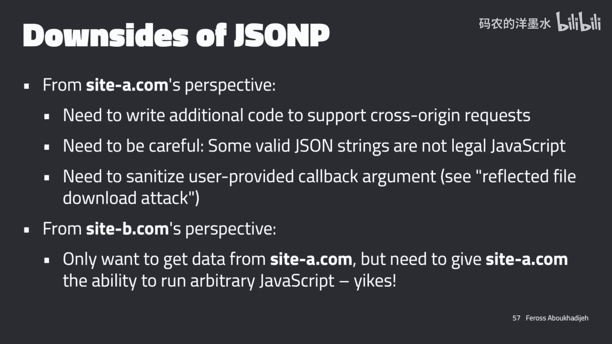

理解这些例外情况和配置选项，对于构建既功能丰富又安全的Web应用至关重要。