# 006：跨站脚本（XSS）

## 概述

在本节课中，我们将要学习跨站脚本攻击。这是一种非常常见且危险的网络安全漏洞，它允许攻击者在受害者的浏览器中执行恶意代码。我们将通过一个著名的MySpace蠕虫案例来了解其危害，并深入探讨其原理、不同类型以及如何防御。

## 从MySpace蠕虫说起

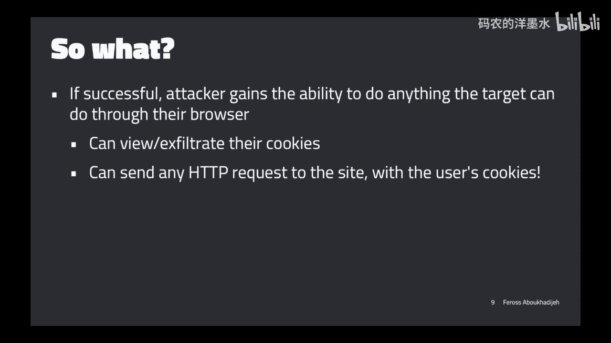

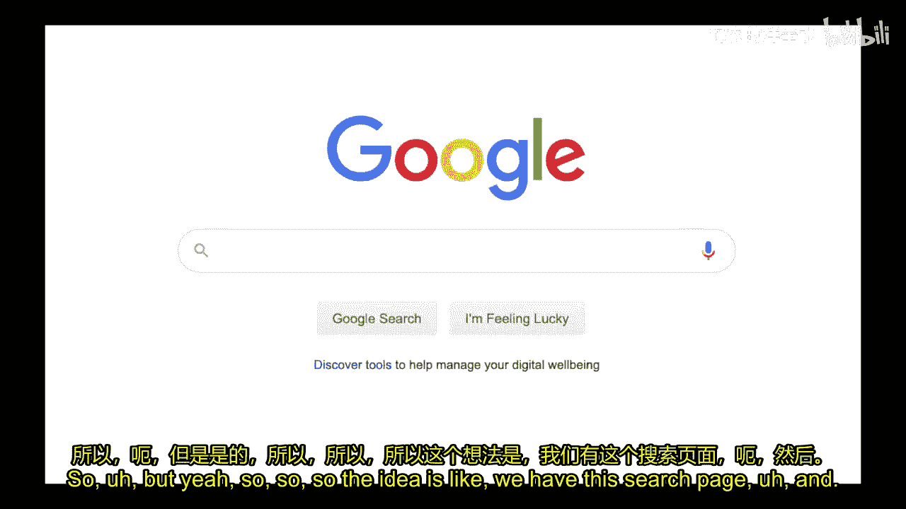

上一节我们提到了代码与数据在不该混合的上下文中混合的问题。本节中，我们来看看一个真实世界中的XSS攻击案例。

2005年，一位名叫Samy的用户在MySpace上发现了一个XSS漏洞。他注意到可以在个人资料信息框中注入额外的代码，这些代码会被包含在最终生成的页面中，并在访问者的浏览器中运行。

他最初编写了一个脚本，让任何查看他个人资料的用户自动将他加为好友。随后，他改进了脚本，让被感染的用户的个人资料也包含同样的恶意代码。这样，任何查看被感染用户资料的人也会执行相同的操作。

以下是Samy记录的事件发展过程：
*   初始时，他有73个好友。
*   发布程序1小时后，他收到了1个好友请求。
*   7小时后，好友请求增至221个。
*   随后，请求数量呈指数级增长，最终在短时间内达到了超过100万个好友请求。
*   同时，他的脚本在所有被感染用户的个人资料上插入了“Samy is my hero”的文字。
*   最终，由于脚本产生了海量的请求，导致整个MySpace网站因维护而宕机数小时。

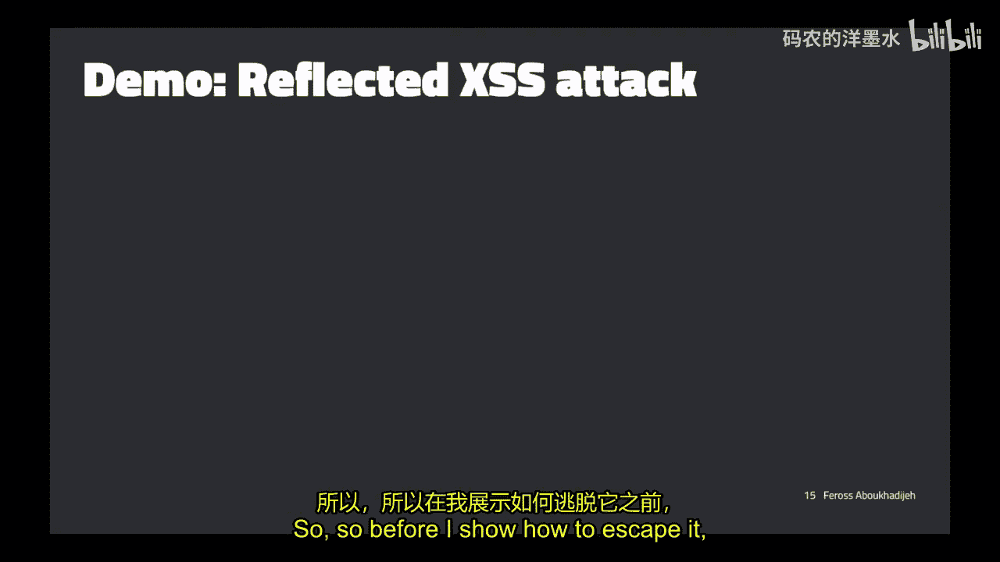

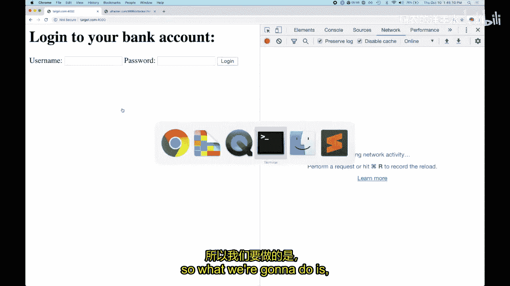

这个案例生动地展示了XSS攻击如何被用来创建自我传播的“蠕虫”，对网站造成毁灭性影响。

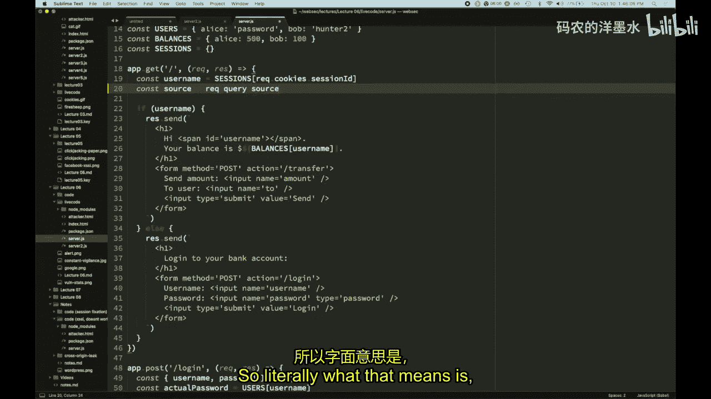

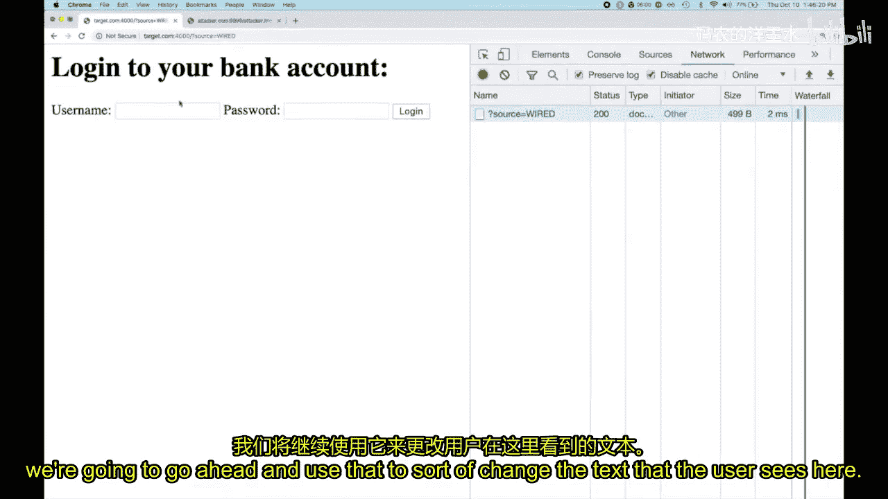

## XSS攻击的目标与原理

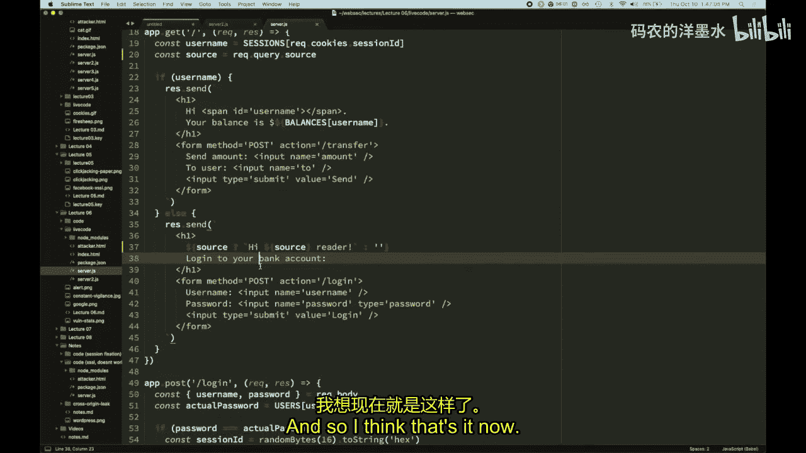

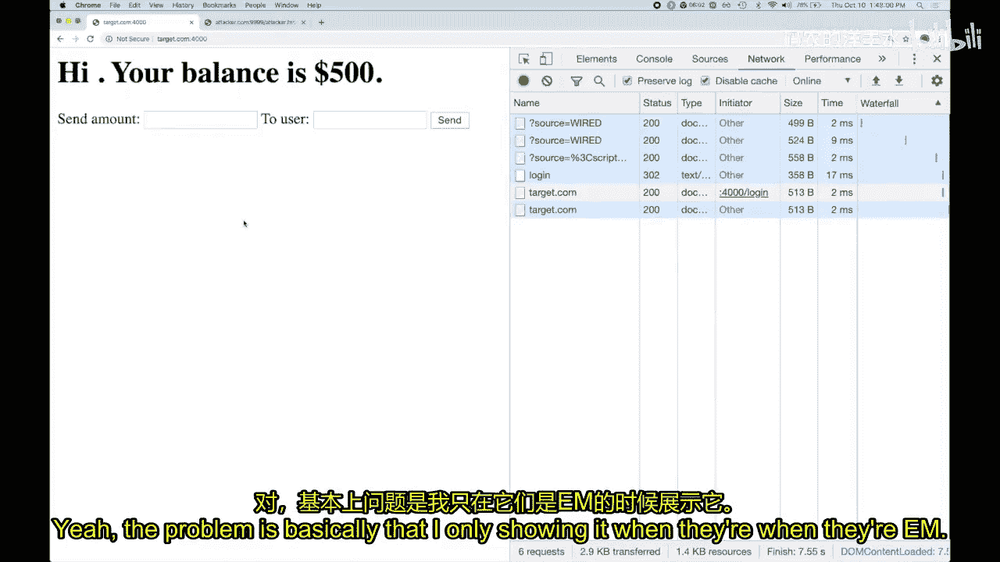

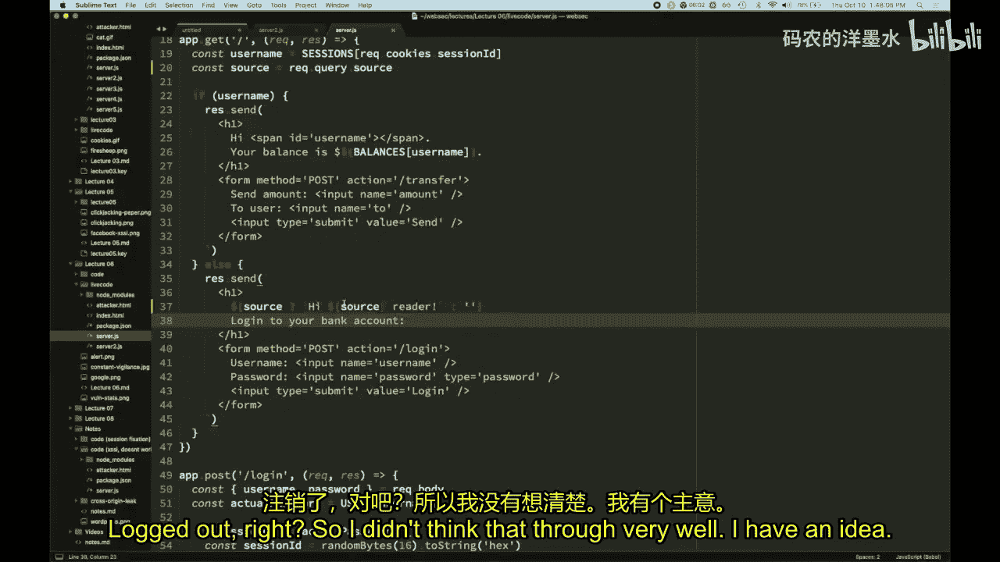

那么，攻击者为什么要使用跨站脚本攻击呢？

根本目标是试图在他们想要攻击的某个网站的上下文中运行代码。由于同源策略的限制，攻击者无法直接从一个页面访问或操控另一个不同源的页面（例如，无法在嵌入的银行网站iframe中窃取登录凭据）。因此，他们需要找到其他方法让他们的JavaScript在目标页面中执行。

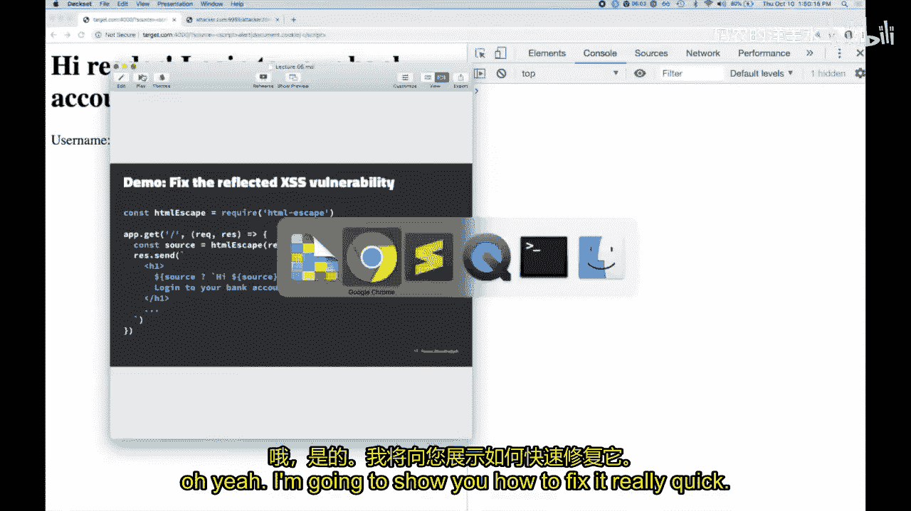

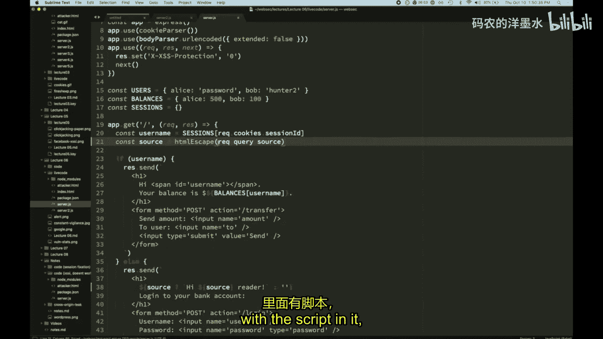

XSS就是一种代码注入漏洞。其根源在于，当开发者将不受信任的用户数据与代码（通常是开发者编写的用于渲染页面的代码）组合在一起时，如果没有正确处理，用户的数据就可能被意外地解释为代码并执行。

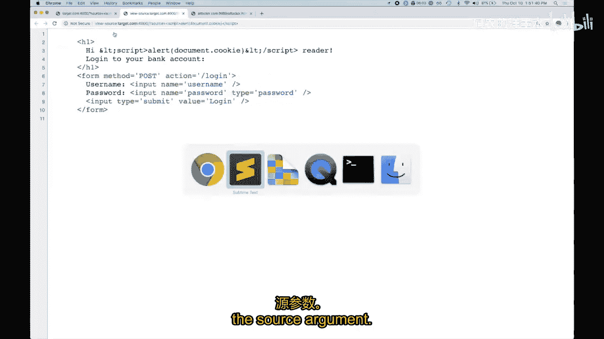

这种问题不仅出现在XSS中，也出现在另一种非常常见的漏洞——SQL注入中。两者的核心思想相似：用户提供的数据被添加到一段命令（HTML/JavaScript 或 SQL）中，从而意外地改变了命令的意图。

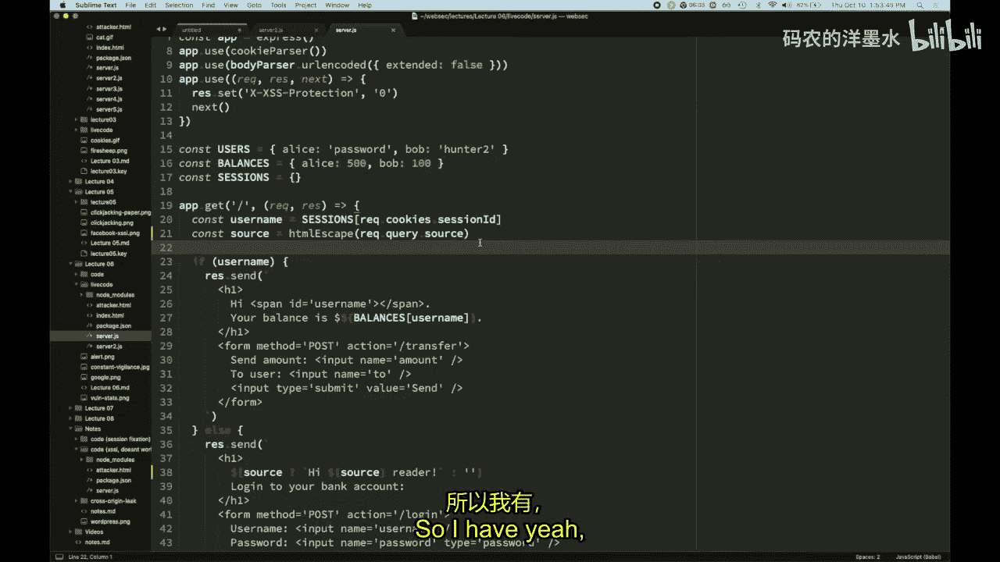

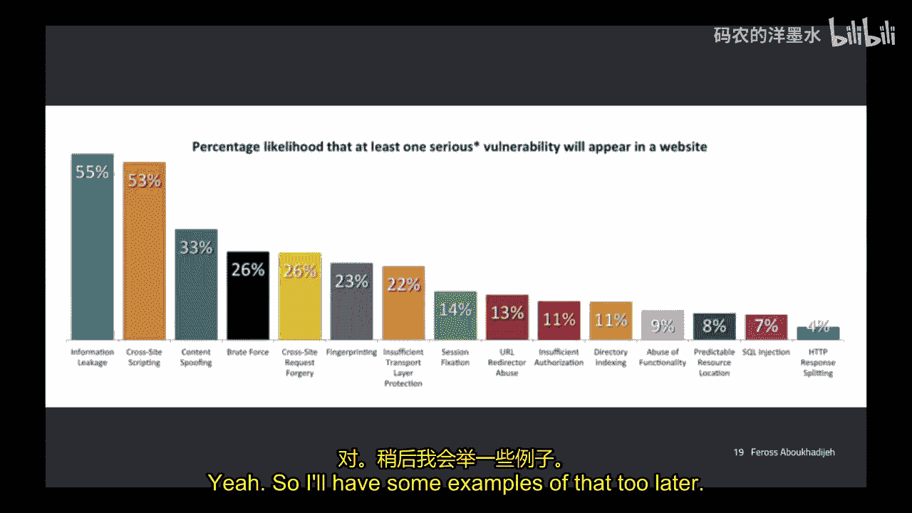

## XSS的危害

一旦攻击者成功将数据注入到被解释为代码的位置，他们就能以网站开发者的权限执行任意操作。由于攻击发生在已登录用户的浏览器中，攻击者可以：
*   **以用户身份执行操作**：例如，像Samy那样发送修改个人资料的POST请求。
*   **窃取用户会话**：通过`document.cookie`获取用户的Cookie，并将其发送到攻击者控制的服务器。攻击者随后可以使用这个Cookie“变成”该用户。

## 一个简单的XSS示例

让我们通过一个简单的搜索页面示例来理解XSS是如何发生的。

假设有一个搜索页面，用户搜索“flower”后，服务器会生成类似以下的HTML：
```html
<p>您搜索了： flower</p>
```
服务器代码可能简单地拼接了用户输入：
```html
<p>您搜索了： " + userInput + "</p>
```
如果攻击者将搜索词改为恶意脚本，例如：
```html
<script>alert(document.cookie)</script>
```
那么服务器生成的HTML将包含：
```html
<p>您搜索了： <script>alert(document.cookie)</script></p>
```
当浏览器加载此页面时，它会将`<script>`标签内的内容当作代码执行，从而弹出一个显示用户Cookie的警告框。在实际攻击中，攻击者会将这些Cookie发送到自己的服务器。

## 防御XSS：转义

那么，如何防止这种情况发生呢？核心思想是**转义**。

我们需要告诉浏览器，用户输入的数据是**要显示的文本**，而不是**要执行的代码**。具体来说，需要将那些在HTML上下文中有特殊意义的字符（如 `<`, `>`, `&`, `"`, `'`）替换为对应的HTML实体。

例如：
*   `<` 转义为 `&lt;`
*   `>` 转义为 `&gt;`
*   `&` 转义为 `&amp;`
*   `"` 转义为 `&quot;`
*   `'` 转义为 `&#x27;` (或 `&apos;`)

经过转义后，恶意输入 `<script>alert(1)</script>` 会变成 `&lt;script&gt;alert(1)&lt;/script&gt;`。浏览器会将其显示为普通文本，而不会执行。

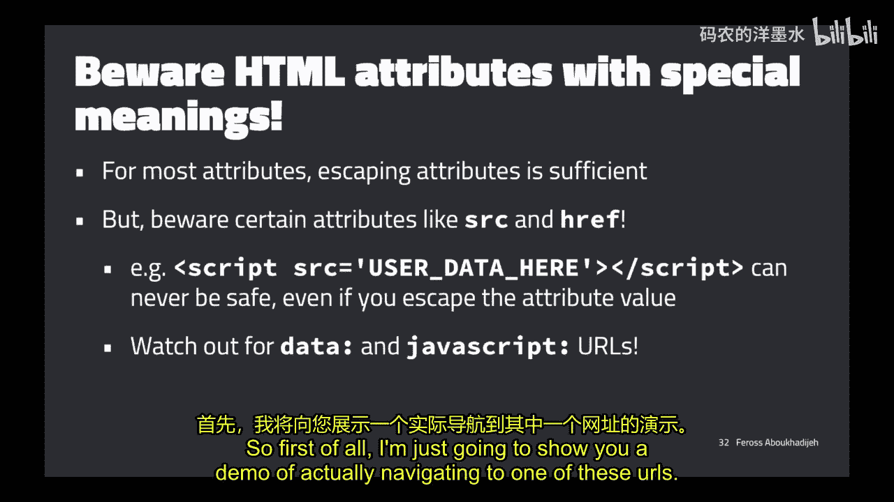

**最佳实践**：在实际开发中，你应该使用成熟的Web框架（如Express with EJS, React, Vue等）提供的模板引擎或数据绑定机制。这些工具通常会自动对插入到HTML中的数据进行转义。你只需要注意不要使用那些“不安全”的、会绕过转义的功能。

## XSS的普遍性与挑战

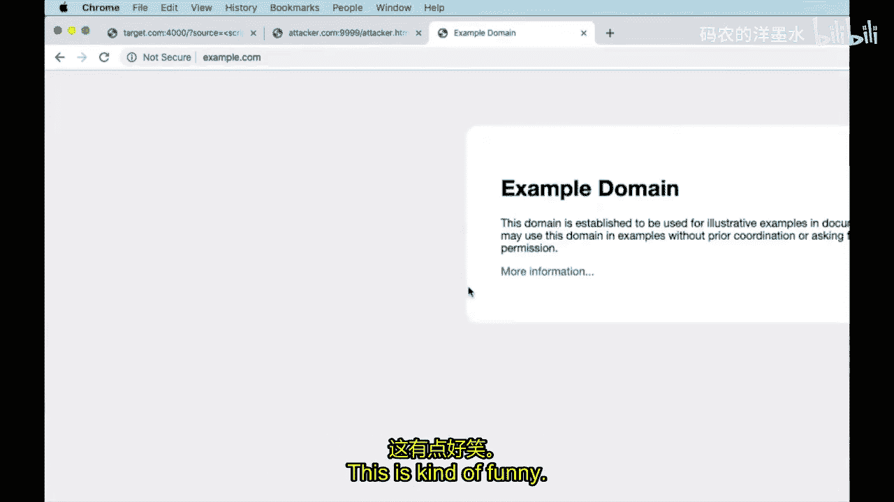

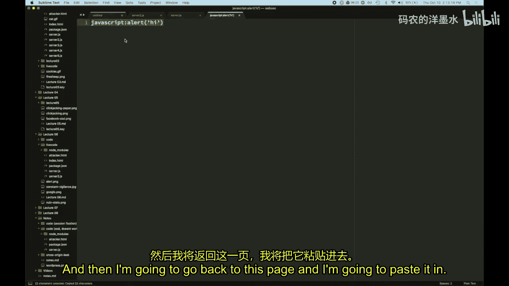

尽管防御原理已知，XSS仍然是当今最普遍的Web漏洞之一。据统计，近半数的网站都存在某种形式的XSS问题。这主要是因为：
1.  **上下文复杂**：Web包含HTML、JavaScript、CSS、URL等多种语言和上下文，每种上下文都有不同的转义规则。
2.  **规则繁多且易错**：某些上下文（如`<script>`标签内、HTML属性内、CSS内）的转义规则非常复杂且容易混淆。
3.  **容错性高**：浏览器HTML解析器非常“宽容”（遵循“鲁棒性原则”），会尝试修复格式错误的HTML，这导致攻击者可以利用许多奇怪的变体来绕过简单的过滤规则。

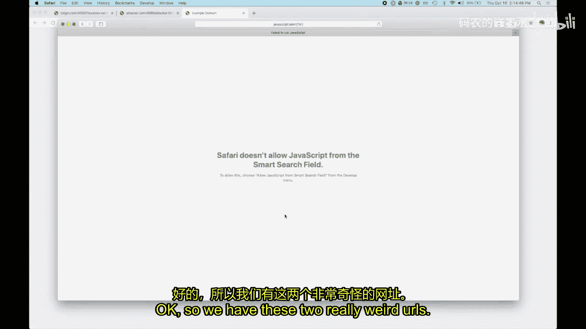

## XSS的类型

XSS主要分为三种类型：

1.  **反射型XSS**：攻击代码位于HTTP请求本身（如URL参数中）。攻击者需要诱使用户点击一个包含恶意代码的链接。我们目前看到的例子大多属于此类。
2.  **存储型XSS**：攻击代码被保存到服务器的数据库或文件中（如用户评论、个人资料）。当其他用户访问正常页面时，恶意代码会从服务器加载并执行。MySpace蠕虫就是存储型XSS。这种攻击更危险，因为受害者不需要点击特定链接，只需访问存在漏洞的页面即可。
3.  **DOM型XSS**：漏洞存在于客户端JavaScript代码中，攻击载荷通过修改DOM环境来执行，而不经过服务器端响应。我们将在后续课程中详细讨论。

## 不同上下文下的XSS与防御

防御XSS的关键在于理解数据被插入的**上下文**，并应用正确的转义规则。

### 上下文一：HTML标签之间（文本节点）

这是最常见的情况。防御方法是进行HTML转义，主要转义 `<`, `>`, `&`。

### 上下文二：HTML属性值内

例如：``。
*   **攻击**：如果用户输入 `" onload="alert(1)`，会闭合`alt`属性并添加新的`onload`事件处理器。
*   **防御**：除了转义 `<`, `>`, `&`，还必须转义引号 `"` 和 `'`。**最佳实践是始终用引号包裹属性值**。

**注意**：对于某些属性（如`href`、`src`），仅仅转义引号是不够的，因为其值本身就是URL，可能包含`javascript:`或`data:`协议来执行代码。必须验证URL协议是否合法（只允许`http://`、`https://`）。

### 上下文三：JavaScript代码内（危险！）

例如，在`<script>`标签内动态生成内容：`var username = 'USER_DATA';`
*   **攻击**：极其复杂。攻击者需要闭合字符串、注释，甚至注入`</script>`标签来跳出当前脚本块。
*   **防御**：**尽量避免将用户数据直接放入JavaScript代码中**。如果必须这样做，推荐方法有：
    *   **JSON编码**：将用户数据序列化为JSON字符串（JSON本身定义了严格的转义规则），然后通过`JSON.parse`解析。
    *   **使用`<template>`标签**：将用户数据作为文本放入惰性的`<template>`标签中，然后用JavaScript读取。
    *   **十六进制编码**：将用户数据编码为十六进制字符串，在JS中解码。

### 应避免的上下文

以下上下文转义规则极其复杂，应尽量避免让用户数据进入：
*   `<script>...</script>`标签内的自由代码区域。
*   HTML注释 `<!-- ... -->` 内。
*   标签名称内（如 `<USER_DATA>...</USER_DATA>`）。
*   属性名称内（如 `<div USER_DATA="value">`）。
*   `<style>...</style>`标签内。

## 嵌套解析链的陷阱

最复杂的情况是“嵌套解析链”。例如：
```html
<div onclick="setTimeout('alert(\'USER_DATA\')', 1000)"></div>
```
用户数据 `USER_DATA` 经历了三层解析：
1.  **HTML属性解析**：作为`onclick`属性的值。
2.  **JavaScript字符串解析**：作为`setTimeout`的第一个参数（字符串）。
3.  **JavaScript代码解析**：1秒后，`setTimeout`的字符串参数被当作代码执行。

在这种情况下，数据需要被转义多次（两次JavaScript转义，一次HTML转义），极易出错。**应避免编写这种深度嵌套、混合上下文的代码**。

## 总结

本节课中我们一起学习了跨站脚本攻击。
*   我们了解了XSS的原理：将用户输入的数据意外地解释为代码。
*   我们看到了反射型和存储型XSS的区别及其巨大危害。
*   我们认识到防御XSS的核心是**根据上下文对不受信任的数据进行正确的转义**。
*   我们探讨了在HTML文本、属性、JavaScript等不同上下文下的转义规则和最佳实践，特别是要避免将用户数据放入复杂的或危险的上下文中。
*   我们理解了尽管有防御方法，但由于Web的复杂性和浏览器的容错性，XSS仍然是当今最主要的网络安全威胁之一。

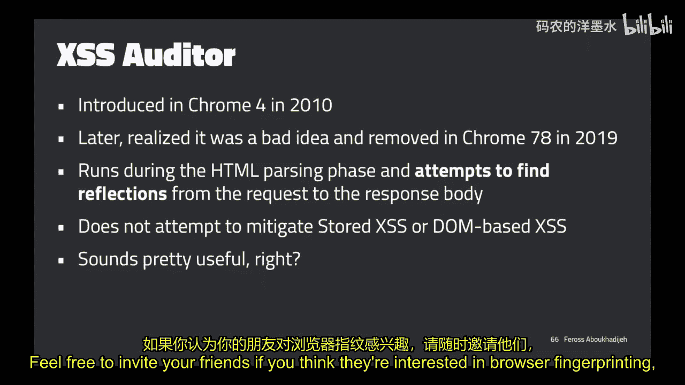

记住根本原则：**永远不要信任客户端提交的数据**。在将任何用户数据合并到代码（HTML、JS、SQL等）之前，都必须进行适当的清理或转义。