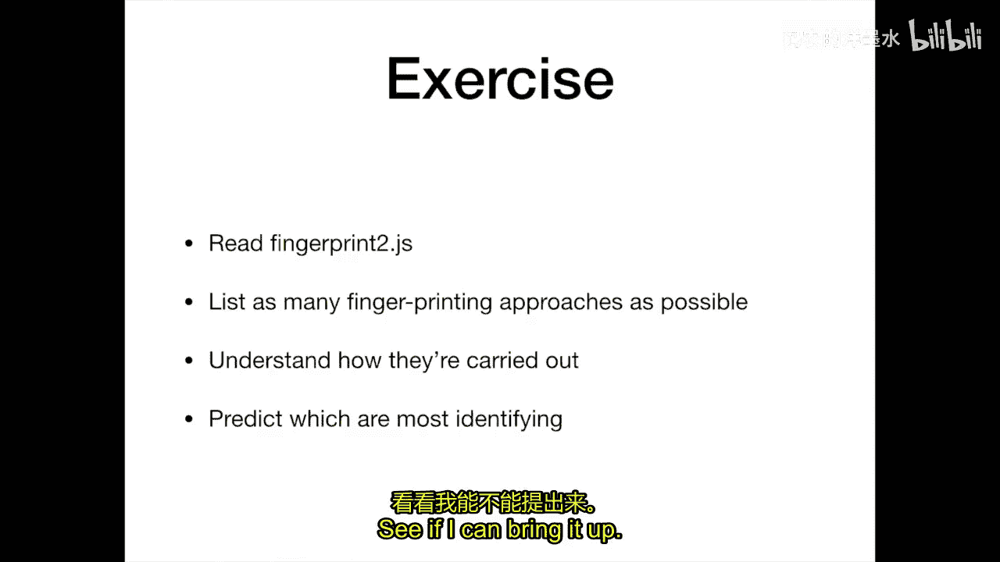
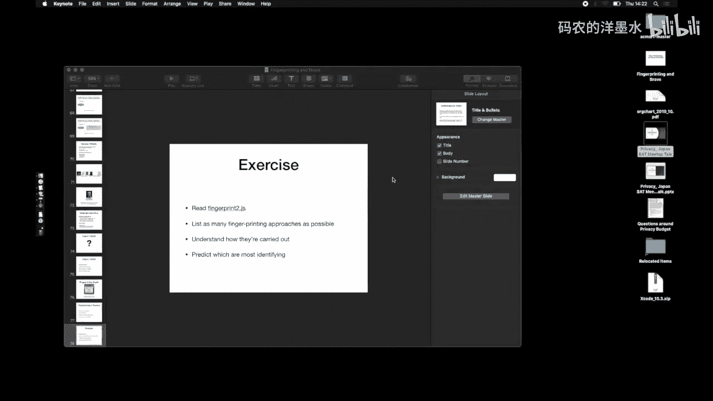
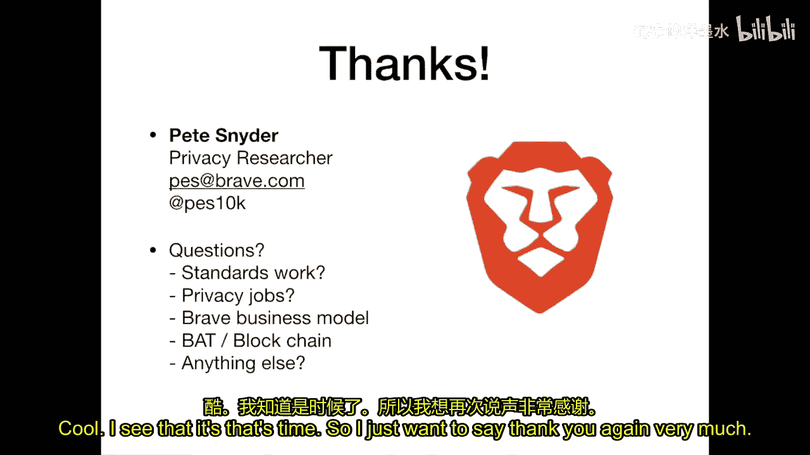

# 008：指纹识别与网络隐私

## 概述

在本节课中，我们将要学习网络隐私的核心问题之一：用户跟踪与指纹识别。我们将探讨网站为何以及如何跟踪用户，重点分析从传统的Cookie跟踪到现代浏览器指纹识别技术的演变。我们还将了解当前对抗这些隐私侵犯技术的各种方法，并以Brave浏览器为例，探讨实际部署的隐私保护措施。

---

## 为什么网站要跟踪用户？

要理解网络隐私问题，首先需要了解网站跟踪用户的原因及其历史演变。

最初，广告是基于内容匹配的。例如，报纸会在体育版旁边放置运动鞋广告，因为编辑认为阅读体育内容的读者可能对运动鞋感兴趣。这是一种基于内容的广告，而非针对个人的跟踪。

随着网络的出现，最初的广告模式也类似。网站根据自身内容放置相关广告。随后出现了“网络环”（Web rings），即主题相似的网站相互交换广告，这开始隐含了对用户兴趣的跨网站推断。

技术的进步和专业化催生了第三方广告网络。广告不再由网站直接提供，而是通过内嵌的第三方框架加载。关键转变在于：广告开始与访问网站的“人”匹配，而不仅仅是与网站“内容”匹配。第三方广告商通过在大量网站上嵌入代码，能够构建关于每个用户的庞大数据库，记录他们访问过哪些网站。

这种模式带来了严重后果：
1.  **资金从高质量网站流向低质量网站**：广告商不再需要将广告投放在制作精良、内容优质的网站上以触达目标用户。他们可以在成千上万个低质量网站上，通过跟踪技术找到同一批用户。这使得高质量网站的广告收入被侵蚀。
2.  **隐私侵犯与下游影响**：跟踪可能导致严重的隐私泄露。例如，曾有案例显示，零售商通过分析用户购物数据，推断出一名少女怀孕并向其家庭邮寄相关商品广告，导致其家人提前知晓，造成了隐私侵害。

目前，网络上有大量中间商专门从事用户数据收集和画像构建。除了谷歌和Facebook等少数盈利者，许多广告技术公司实际上并不盈利，它们在进行一场关于数据价值的长期赌博。

研究表明，即使在普通网站上，平均也有近20个不同的第三方实体能够记录用户的访问行为。其中，谷歌通过其各类服务（如Google Analytics、Google Fonts）能够记录约80%的用户访问记录。

---

## 传统的跟踪机制：Cookie

上一节我们介绍了跟踪的动机和现状，本节中我们来看看最经典的跟踪技术是如何实现的。

早期的网络（Web 0.0）是无状态的。服务器无法区分连续请求是否来自同一用户，这给用户认证、购物车等功能带来了挑战。

解决方案是**Cookie**。Cookie本质上是一个由服务器发送、浏览器存储并在后续请求中自动带回的令牌。这允许服务器识别用户会话。

同时，为了节省成本，网站开始从第三方域名引用资源（如图片）。当时，由于规范不明确和开发仓促，决定在请求这些第三方资源时也发送Cookie。于是，**第三方Cookie**诞生了。

这成为了跨网站跟踪的基础原语：
1.  用户访问网站A，网站A的页面中包含来自跟踪域T的代码（如图片或脚本）。
2.  浏览器向T请求资源，T设置一个唯一标识用户的Cookie。
3.  用户随后访问网站B，网站B的页面也包含来自同一个跟踪域T的代码。
4.  浏览器再次向T请求资源，并自动带上之前设置的Cookie。
5.  跟踪域T从而知道访问网站A和网站B的是同一个用户。

JavaScript和DOM的发明者Brendan Eich曾开玩笑说，他为自己在90年代创造了这些技术而一直道歉，因为其无意中为跟踪打开了大门。

---

## 对抗传统跟踪与升级

随着浏览器开始意识到第三方Cookie的隐私问题，一些浏览器采取了对抗措施。例如，Safari和Firefox（曾一度）默认阻止第三方Cookie。

作为反制，跟踪者开始寻找Cookie的替代存储方案，例如：
*   **URL参数**
*   **LocalStorage**
*   **ETag**
*   **HSTS跟踪**：这甚至利用了安全功能进行跟踪。HSTS（HTTP Strict Transport Security）强制浏览器使用HTTPS连接。攻击者可以注册超长子域名（如`a.b.c.d...tracker.com`），并为每个用户设置独特的HSTS指令组合，从而在子域名中编码用户标识符。

这些方法表明，只要存在存储标识符的可能性，跟踪者就会加以利用。

---

## 现代跟踪：浏览器指纹识别

当传统的基于存储的跟踪受到限制时，指纹识别技术变得流行起来。你可以将指纹识别视为“跟踪困难模式”。它不依赖于在用户设备上存储标识符，而是通过收集浏览器和设备的各种特征来生成一个唯一或近乎唯一的标识符。

单个特征（如浏览器类型、操作系统、屏幕分辨率）可能覆盖数百万用户，并不独特。但将足够多的这些“半标识符”组合起来，其交集就可能变得非常小，从而唯一地识别出个体。

**公式化理解**：
设 `F = {f1, f2, f3, ..., fn}` 为从浏览器收集到的一组特征值。
每个特征 `fi` 将用户池划分为若干个子集。
指纹 `Fingerprint = Hash(f1, f2, f3, ..., fn)`。
当这个哈希值足够独特时，它就可以作为用户的标识符。

以下是几个关键的指纹识别向量：

### 1. User Agent 字符串
这是浏览器在HTTP请求中自动发送的标识字符串。由于历史兼容性原因，它变得冗长且包含大量细节（如浏览器版本、操作系统、渲染引擎等），提供了多个半标识符。

### 2. 已安装字体列表
网站可以通过JavaScript间接探测用户系统上安装了哪些字体。它们会尝试用一长串字体名称来渲染文本，并通过测量渲染元素宽度的变化来判断该字体是否存在。用户安装的办公软件、设计软件或个性化字体都可能成为独特的标识符。

### 3. Canvas 指纹识别
Canvas API允许网页进行绘图。跟踪代码会执行一系列复杂的绘图指令，然后将绘制结果（Canvas的像素数据）转换并哈希。由于不同的硬件（尤其是显卡）、操作系统和浏览器在渲染时存在极其细微的、人眼无法察觉的差异，这个哈希值就能成为独特的指纹。

### 4. 硬件与设备信息
一系列API可以暴露硬件信息，通常无需用户许可：
*   `navigator.hardwareConcurrency`：CPU逻辑核心数。
*   `navigator.deviceMemory`：设备内存（RAM）的大致范围。
*   Web Audio API：音频通道数等信息。
*   网络信息API：连接类型（如Wi-Fi、蜂窝网络）。

### 5. 屏幕分辨率与窗口大小
虽然可以通过 `window.screen.width/height` 和 `window.innerWidth/Height` 轻松获取，但更隐蔽的方式是通过CSS和图像加载行为来推断，这使得防御变得困难。

像 `fingerprint2.js` 这样的库集合了数十种此类技术，被广泛用于实际网站的指纹识别。电子前哨基金会（EFF）的 `Panopticlick` 项目可以评估你的浏览器指纹的独特性。

---

## 对抗指纹识别的方法

面对复杂的指纹识别，研究人员和浏览器开发者提出了多种防御思路：

以下是主要的五类对抗措施：

1.  **移除功能**：直接禁用有问题的API（如阻止读取字体列表或Canvas数据）。简单粗暴，但可能破坏网站的正常功能。
2.  **统一化**：让所有浏览器或某一类浏览器返回一致的值（例如，所有Chrome用户都报告相同的字体列表）。这同样可能影响功能，且本质上与移除类似。
3.  **限制访问**：不改变API本身，但限制其可被访问的条件。
    *   **权限提示**：像地理位置API一样，在访问敏感信息前请求用户许可。但会导致“许可疲劳”。
    *   **用户手势**：仅当用户与页面交互（如点击）后才开放某些API。
    *   **第一方 vs 第三方**：仅允许用户直接访问的网站（第一方）使用某些指纹API，阻止内嵌的第三方框架使用。
    *   **网站参与度**：根据用户与网站的互动频率、是否添加书签等信号，动态决定开放哪些权限。但这种方式难以预测和向用户解释。
4.  **噪声注入（随机化）**：这是目前被认为较有前景的方向。向高熵值的指纹识别点注入随机但人眼无法察觉的噪声。
    *   **隐写术思想**：例如，在Canvas指纹识别中，轻微地、随机地修改最高位的像素值，使得每次生成的哈希都不同。
    *   **随机化User Agent**：在保证网站兼容性的前提下，随机化User Agent字符串中的非关键部分。
    *   这种方法迫使跟踪者无法获得稳定标识，但需要精心设计以防破坏网站功能。
5.  **隐私预算**：这是一个由谷歌团队提出的概念性方案。为每个网站分配一个“隐私预算”，量化其可收集的识别性比特数。一旦超出预算，就触发保护措施。该方案面临诸多挑战，如预算如何重置、如何在第一方和第三方间分配等，被认为过于复杂且可能不可行，目前尚未被主流浏览器采纳。

---

## Brave浏览器的实践

我们了解了理论和对抗措施，现在来看一个实际的案例：Brave浏览器是如何保护用户隐私的。

Brave的核心隐私保护功能称为“Shields”（防护盾），默认对所有网站开启，但用户可根据需要为特定网站关闭。

其主要措施包括：

1.  **拦截已知跟踪器**：Brave维护并整合了多个跟踪器黑名单（如EasyList、EasyPrivacy、Disconnect list、uBlock Origin的列表以及自研列表）。当浏览器请求资源时，会检查其URL是否在这些列表中，如果是已知跟踪器，则直接阻止加载。
2.  **阻止第三方Cookie**：Brave默认阻止所有第三方Cookie的发送，仅对极少数必需情况例外。
3.  **对抗指纹识别**：
    *   对于第三方上下文，默认禁用许多指纹识别API。
    *   对于第一方上下文，目前允许访问，但正在研究更精细的控制策略（如基于网站参与度的权限模型、噪声注入等）。
    *   Brave积极推动Web标准的隐私改进，并与Mozilla、Apple等拥有更强隐私立场的厂商合作。

---

## 总结与展望

本节课中我们一起学习了网络隐私跟踪的演变、核心机制及防御方案。

我们从网站跟踪的经济动机和历史讲起，分析了传统的基于Cookie的跟踪机制及其演变。随后，我们深入探讨了更隐蔽、更强大的**浏览器指纹识别**技术，了解了其多种实现方式（如User Agent、字体、Canvas、硬件信息等）。接着，我们系统性地回顾了当前对抗指纹识别的五大类方法，并评价了其优缺点。最后，我们以Brave浏览器为例，看到了隐私保护技术在实际产品中的部署。

网络隐私的斗争是一场持续的军备竞赛。技术防御（如Brave的做法）至关重要，但法律与法规（如欧盟的GDPR、加州的隐私法案）也在形成重要的约束力。对于未来的开发者和从业者，重要的是在设计和开发过程中，将隐私视为一个必须避免的“失败状态”，而非一个可选的“功能”，并在职业选择中考虑其工作的伦理影响。

保护网络隐私需要技术、法律、商业模型和用户教育的多管齐下。