# 010：代码注入

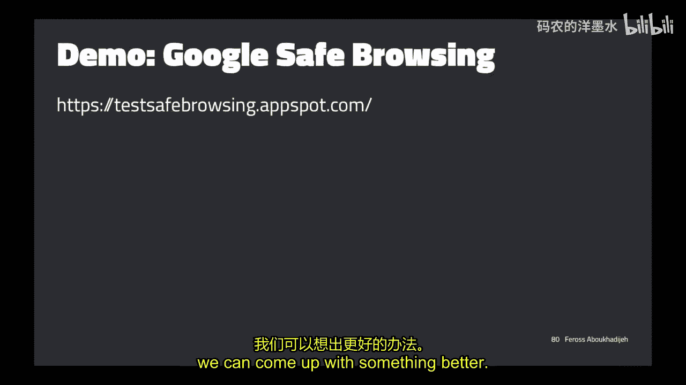

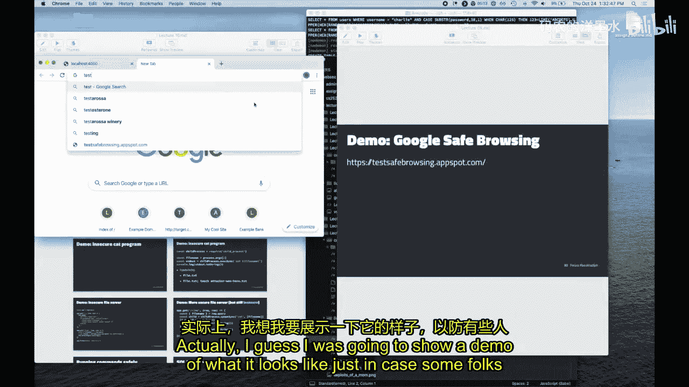

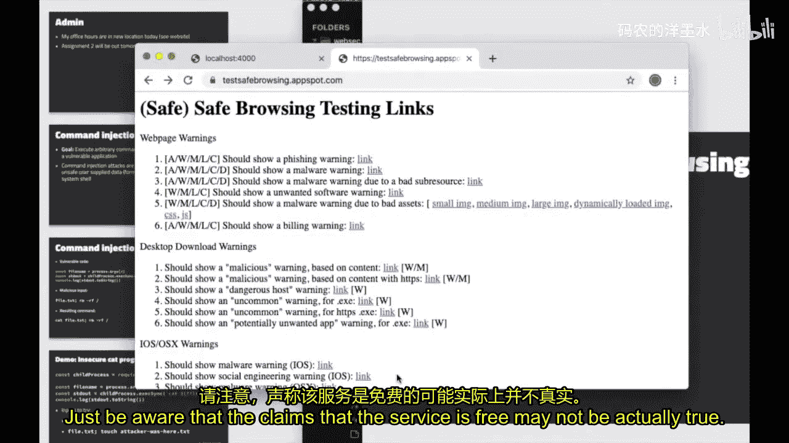

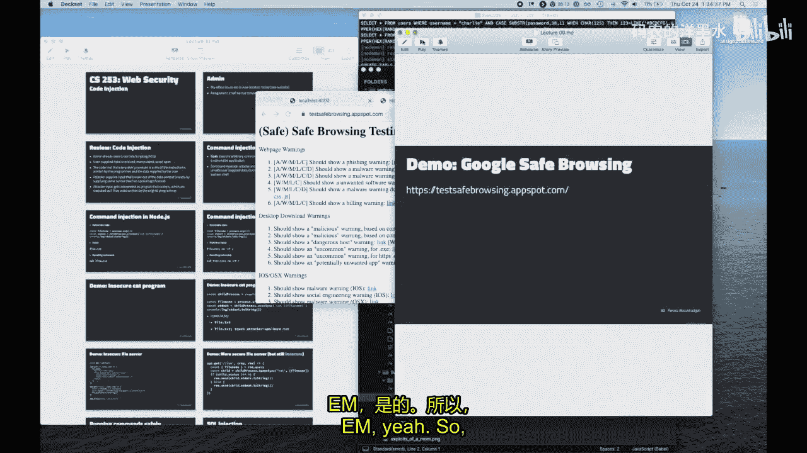

## 概述
在本节课中，我们将要学习代码注入攻击。上一节我们介绍了用户界面安全和侧信道攻击，本节中我们来看看服务器端的一种常见安全漏洞——代码注入。我们将重点学习命令注入和SQL注入的原理、攻击方式以及如何防御。

## 谷歌安全浏览（Google Safe Browsing） 🛡️
上一节我们介绍了用户界面安全，本节中我们来看看一种增强安全性的系统——谷歌安全浏览。其核心思想是维护一个已知的恶意软件和钓鱼网站URL列表，并在用户访问前进行查询。

一个简单的方法是每次访问前都向谷歌服务实时查询，但这会暴露用户的浏览历史并引入延迟。

更好的方法是下载一个可疑URL的哈希前缀列表到本地浏览器。以下是其工作原理的核心步骤：

1.  **客户端获取列表**：浏览器从谷歌安全浏览服务下载一个哈希前缀列表。这些前缀是可疑URL经过哈希函数（如SHA-256）处理后，截取前一部分的结果。
    *   **公式**：`前缀 = 截取(SHA256(可疑URL), 前缀长度)`
2.  **本地安全检查**：当用户尝试访问一个URL时，浏览器用同样的方法计算该URL的哈希前缀。
    *   **公式**：`待检查前缀 = 截取(SHA256(待访问URL), 前缀长度)`
3.  **快速安全判定**：如果计算出的前缀**不在**本地列表中，则可以立即判定该URL是安全的，因为列表包含了所有已知可疑URL的前缀。
4.  **潜在风险判定**：如果计算出的前缀**在**本地列表中，则说明该URL**可能**不安全。此时，浏览器会将这个前缀（而非完整URL）发送给谷歌服务，请求获取所有具有该前缀的完整哈希值列表。
5.  **最终确认**：浏览器将待访问URL的完整哈希值与收到的列表比对。如果匹配，则确认不安全并警告用户；否则确认为安全。

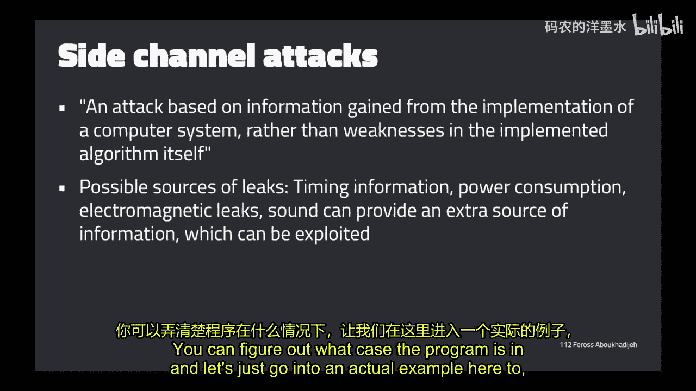


这种方法在保护隐私（不发送完整URL）和速度（大部分检查在本地完成）之间取得了平衡，但并非完美，仍可能泄露部分信息。

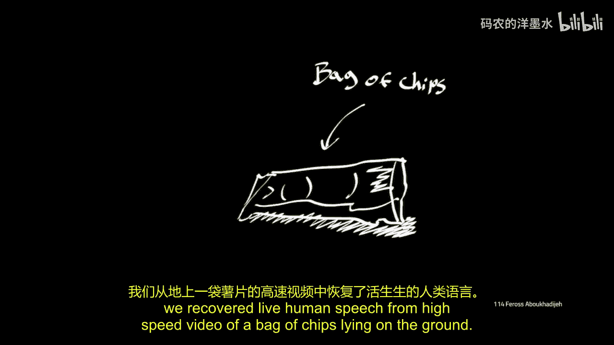

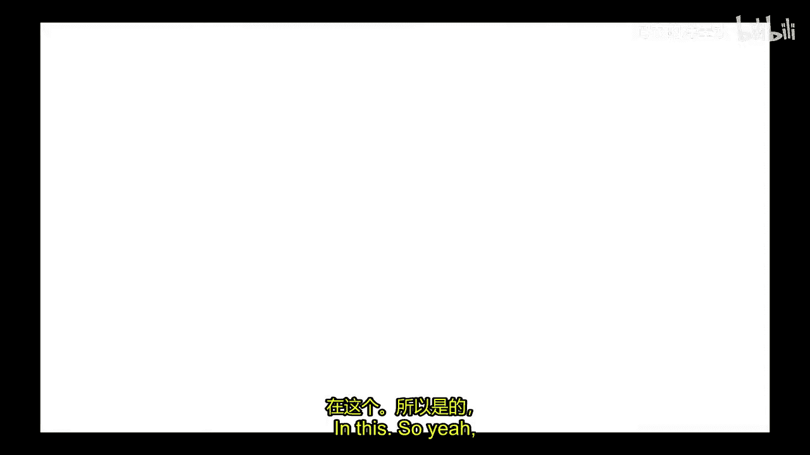

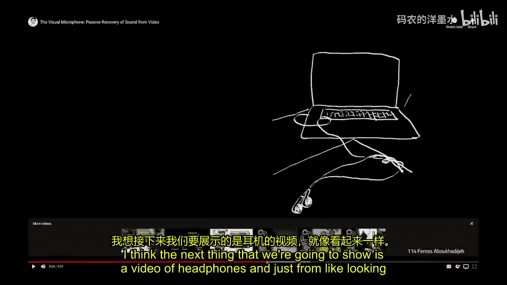

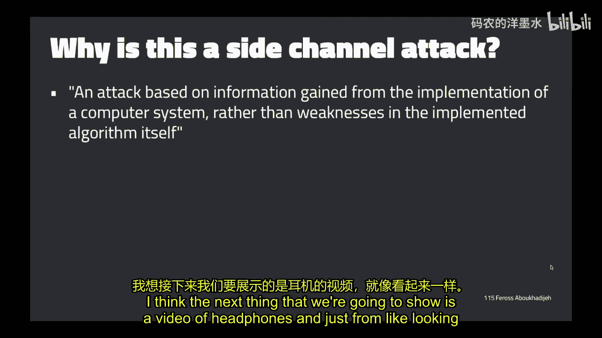

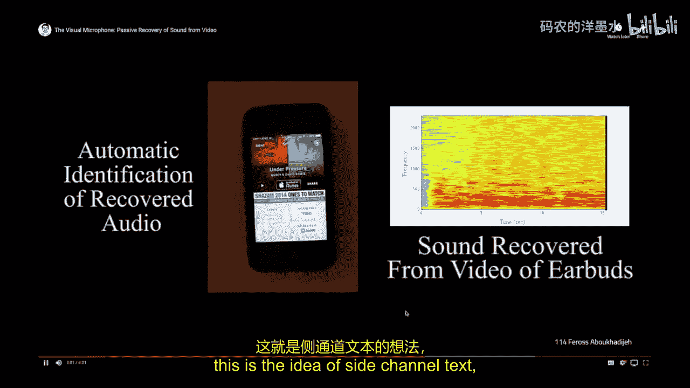

## 侧信道攻击（Side-Channel Attacks） 🕵️
侧信道攻击是指系统在功能正确的情况下，通过非预期的信息泄露渠道（如时间、功耗、电磁辐射）暴露出敏感信息。即使代码没有错误，攻击者也能利用这些物理效应进行攻击。

### 经典案例：链接访问历史泄露
一个长期存在的攻击是通过检查浏览器渲染链接的颜色来判断用户是否访问过该URL（已访问链接通常为紫色）。虽然浏览器后来通过欺骗JavaScript（始终返回未访问的颜色）和限制可样式化的CSS属性来缓解，但攻击者仍能通过其他侧信道探测。

例如，攻击者可以：
1.  为所有链接设置一个巨大的`text-shadow`。
2.  动态改变一个链接的`href`属性，使其指向一个待检测的URL。
3.  如果新URL是已访问的，浏览器内部状态改变会触发重绘，渲染带有巨大阴影的页面会消耗更多时间；如果是未访问的，则重绘较快。
4.  通过`requestAnimationFrame`等API精确测量渲染时间差，从而推断出访问历史。

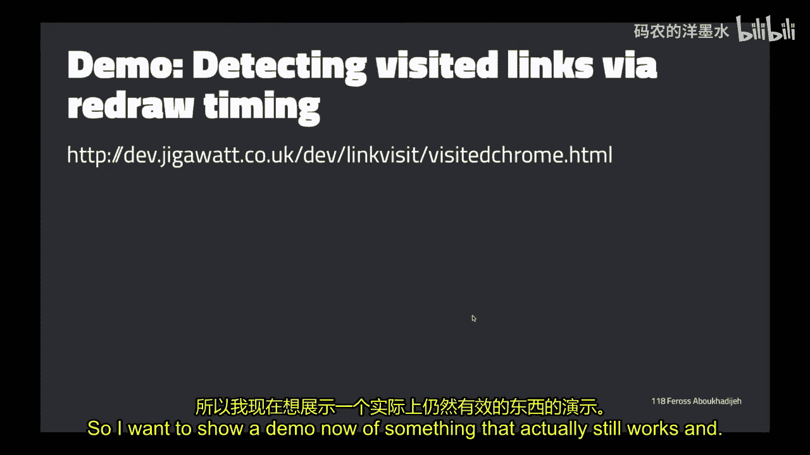

以下是攻击的核心逻辑伪代码：
```javascript
// 设置数千个带有巨大text-shadow的链接
// 将其中一个链接的href从已知未访问URL改为待检测URL
let startTime = performance.now();
link.href = targetUrlToCheck;
// 等待一帧绘制
requestAnimationFrame(() => {
    let elapsedTime = performance.now() - startTime;
    // 根据耗时长短判断targetUrlToCheck是否被访问过
});
```

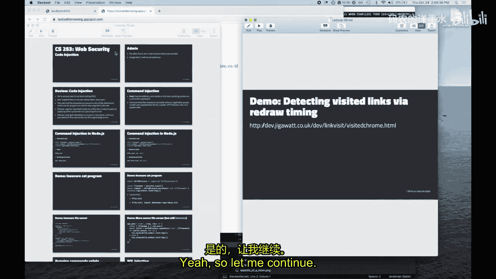

### 其他现代侧信道案例
*   **环境光传感器**：网站可以利用设备的环境光传感器，通过检测屏幕显示不同颜色（如黑/白）时环境光的细微变化，来推断屏幕上渲染的内容，甚至探测浏览历史。
*   **陀螺仪**：高精度的陀螺仪可以捕捉到声波引起的设备微小振动，从而在未经麦克风授权的情况下窃听周围对话。

侧信道攻击揭示了安全模型的复杂性：即使遵守同源策略，物理层面的信息泄露也可能发生。防御措施通常包括限制API精度、降低采样频率或对敏感API要求权限。

## 命令注入（Command Injection） 💻
现在我们将话题转向服务器端的代码注入。命令注入允许攻击者在目标服务器的操作系统上执行任意命令。

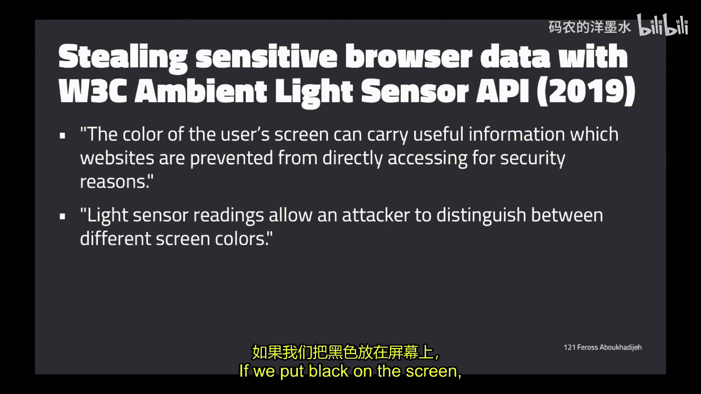

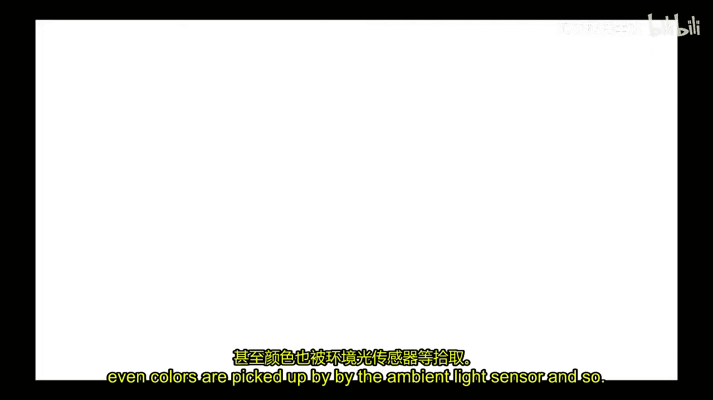

### 漏洞原理
当Web应用程序将用户输入未经适当处理就直接拼接到系统命令中时，就会产生漏洞。攻击者利用Shell的特殊字符（如`;`、`&`、`|`、`\``）来“跳出”数据上下文，注入额外的命令。

**漏洞代码示例（Node.js）**:
```javascript
const filename = userInput; // 用户可控输入，例如 "file.txt; rm -rf /"
const command = `cat ${filename}`; // 拼接成命令: cat file.txt; rm -rf /
child_process.execSync(command); // 执行后，会先cat文件，然后删除根目录
```

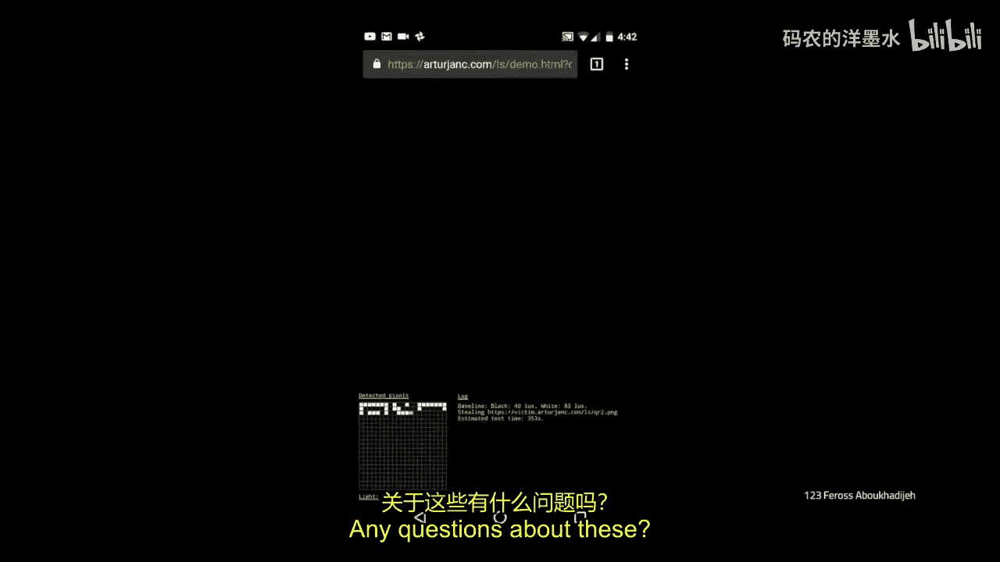

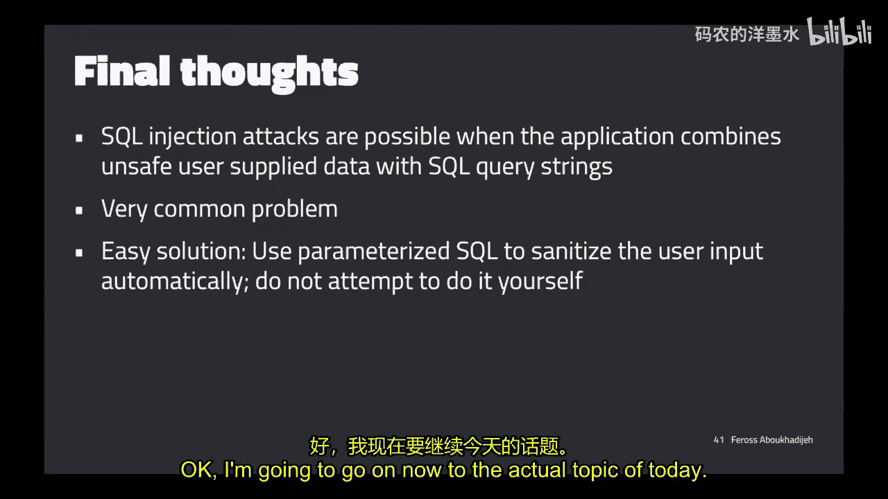

### 防御方法
永远不要将用户输入直接拼接成命令字符串。应使用接受参数数组的API，让库函数负责正确的转义。

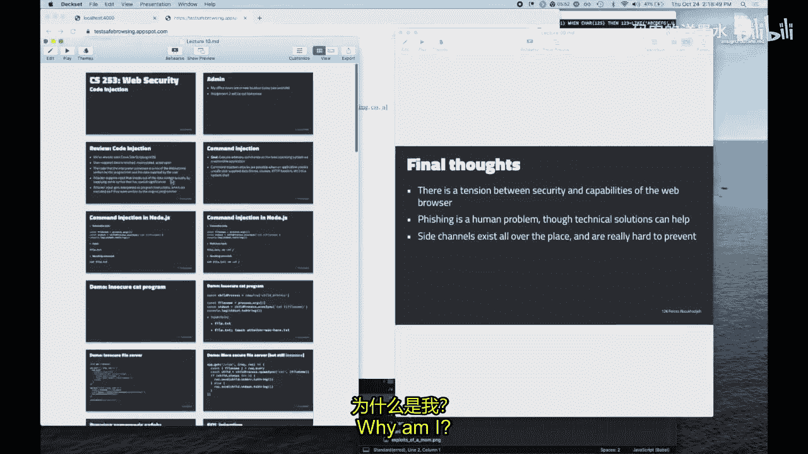

**安全代码示例（Node.js）**:
```javascript
const filename = userInput; // 用户可控输入
const args = ['cat', filename]; // 将命令和参数分开
// spawnSync会确保filename中的特殊字符被转义，不会被解释为命令分隔符
child_process.spawnSync('cat', args);
```

不同编程语言都有类似的安全函数（如Python的`subprocess.run([‘cat’, filename])`）。

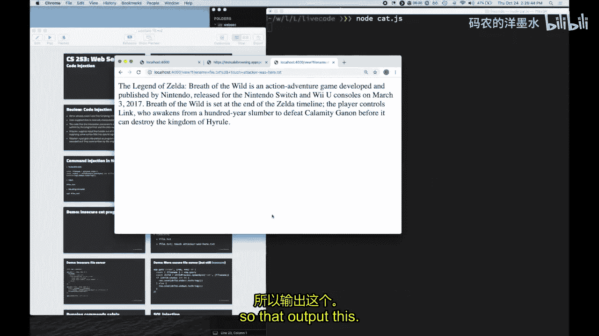

## SQL注入（SQL Injection） 🗃️
SQL注入是命令注入在数据库查询层面的变种，危害极大，可能导致数据泄露、篡改甚至服务器被完全控制。

### 漏洞原理
与命令注入类似，当用户输入被直接拼接到SQL查询字符串中时，攻击者可以利用SQL语法（如引号`'`、注释`--`、逻辑运算符`OR`）修改查询逻辑。

**漏洞代码示例（Node.js）**:
```javascript
const username = userInput; // 用户输入，例如 "admin' --"
const password = userInputPwd; // 密码输入
// 拼接查询
const query = `SELECT * FROM users WHERE username='${username}' AND password='${password}'`;
// 最终查询变为: SELECT * FROM users WHERE username='admin' --' AND password='...'
// '--'之后的内容被注释掉，因此攻击者无需密码即可登录admin账户
db.get(query, (err, row) => { /* ... */ });
```

### 攻击示例
*   **绕过登录**：输入用户名 `admin' --`，注释掉密码检查。
*   **窃取数据**：通过 `UNION` 子句拼接其他查询。
*   **破坏数据**：输入 `'; DROP TABLE users; --`，删除整个用户表。

### 防御方法：参数化查询（Prepared Statements）
最有效的方法是使用参数化查询。数据库引擎会将用户输入始终视为数据，而非可执行代码。

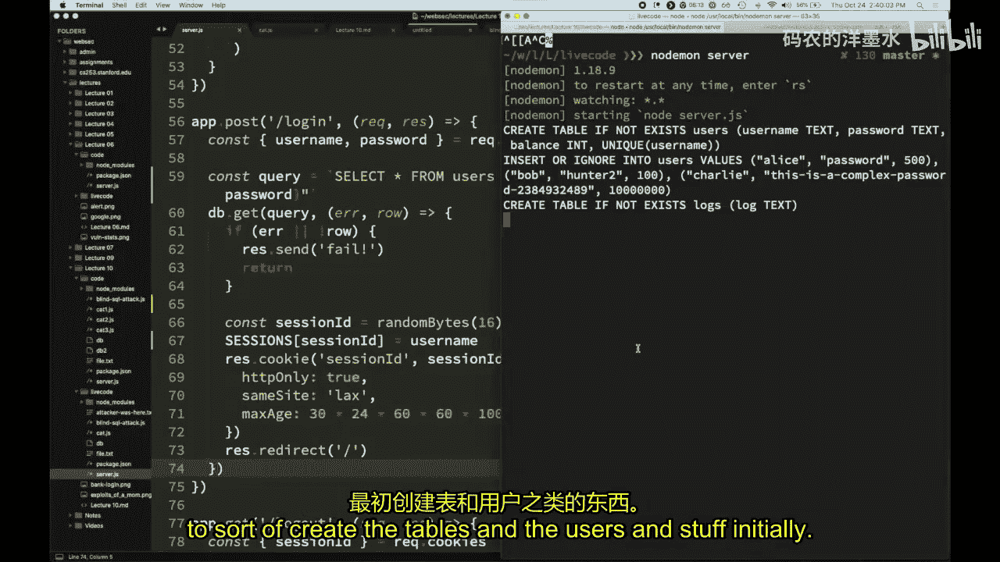

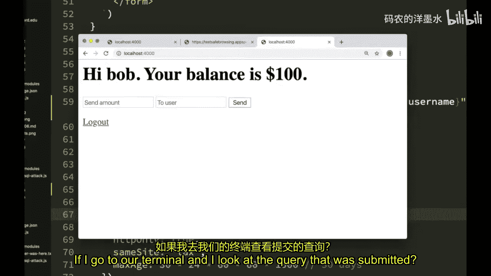

**安全代码示例（Node.js with sqlite3）**:
```javascript
const username = userInput;
const password = userInputPwd;
// 使用占位符 (?) ，将查询逻辑与数据分离
const query = `SELECT * FROM users WHERE username=? AND password=?`;
db.get(query, [username, password], (err, row) => { /* ... */ });
```

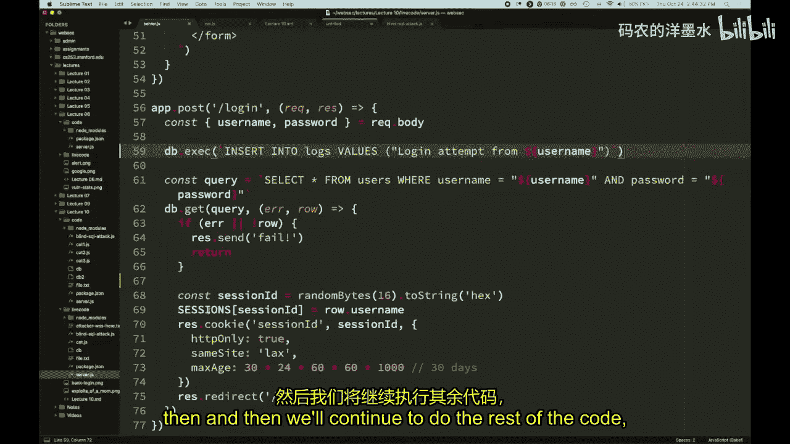

### 盲SQL注入（Blind SQL Injection）
有时页面不会直接返回查询结果或错误信息。攻击者可以通过“问”真/假问题，并根据页面响应差异（如返回时间、是否报错）来逐位提取数据。

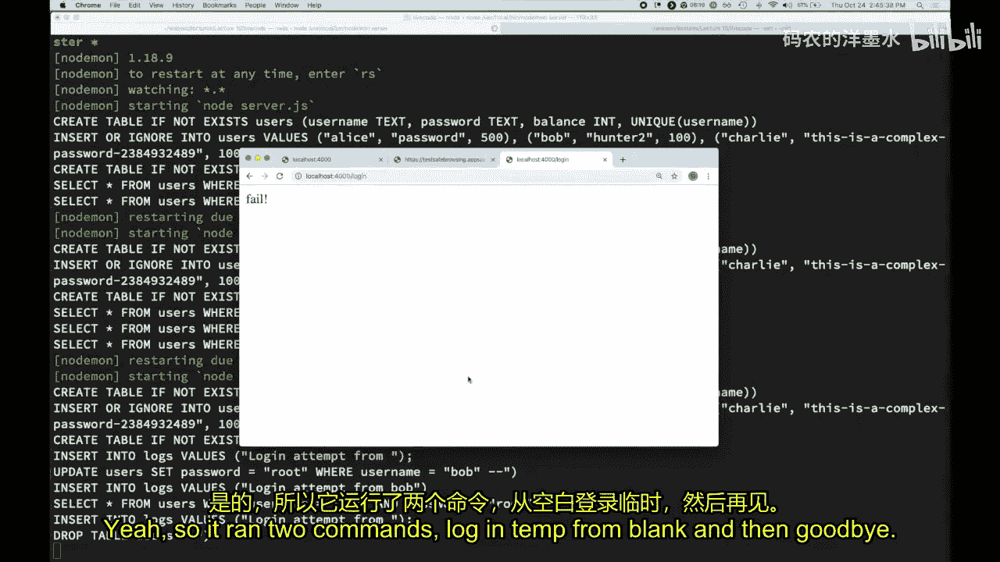

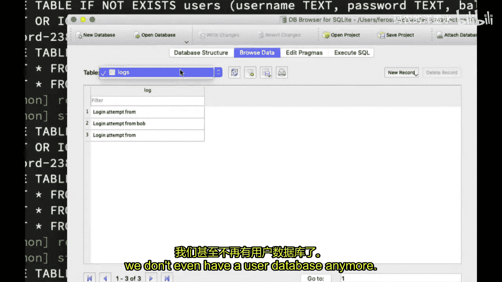

**时间型盲注示例**：
攻击者注入一个包含条件判断和延时函数的查询。
```sql
SELECT * FROM users WHERE username='Alice' AND SUBSTR(password,1,1)='a' AND (SELECT SLEEP(2)) --'
```
如果Alice密码的第一个字母是’a’，数据库会休眠2秒，页面响应变慢；否则立即返回。通过遍历字符并测量时间，可以逐步破解出整个密码。

## 总结
本节课中我们一起学习了代码注入攻击。
*   我们首先了解了**谷歌安全浏览**如何利用哈希前缀列表在保护隐私的同时提供安全警告。
*   然后探讨了**侧信道攻击**，认识到即使逻辑正确的程序，也可能通过时间、传感器等物理信道泄露信息。
*   最后，我们深入研究了服务器端的**命令注入**和**SQL注入**，理解了其通过混淆代码与数据来实施攻击的原理。防御的关键在于**永远不要信任用户输入**，必须使用安全的编程接口（如参数化查询、安全的命令执行函数）来严格区分代码与数据。

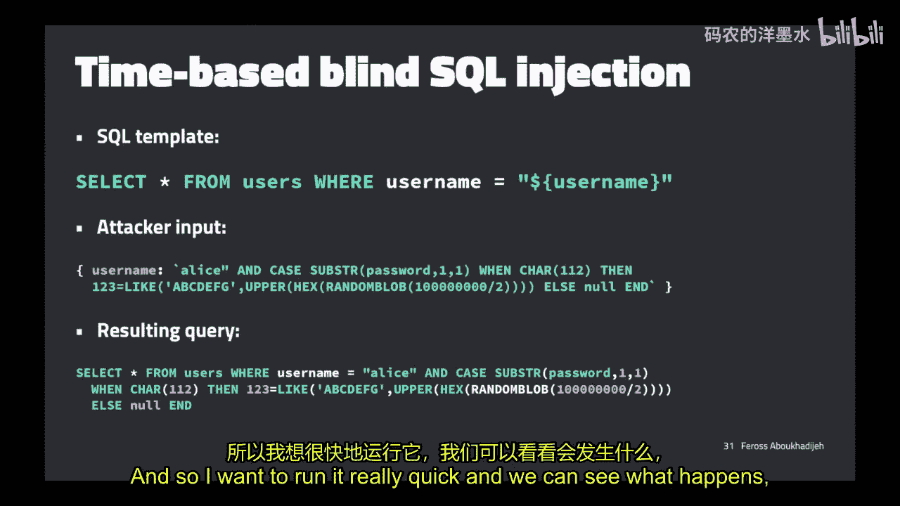

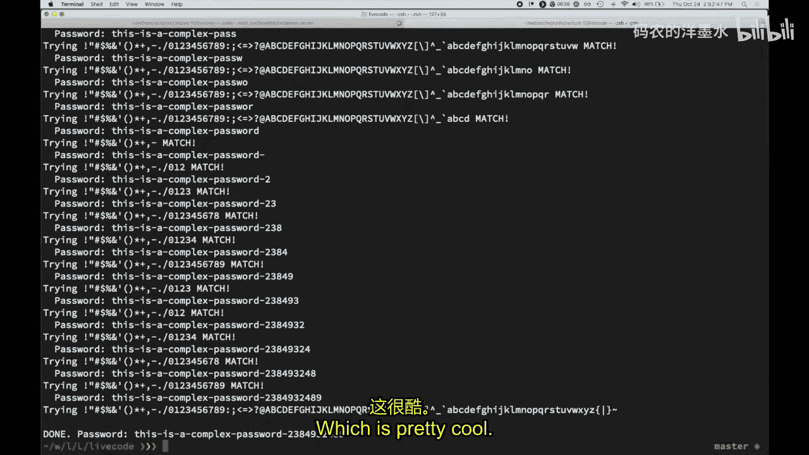

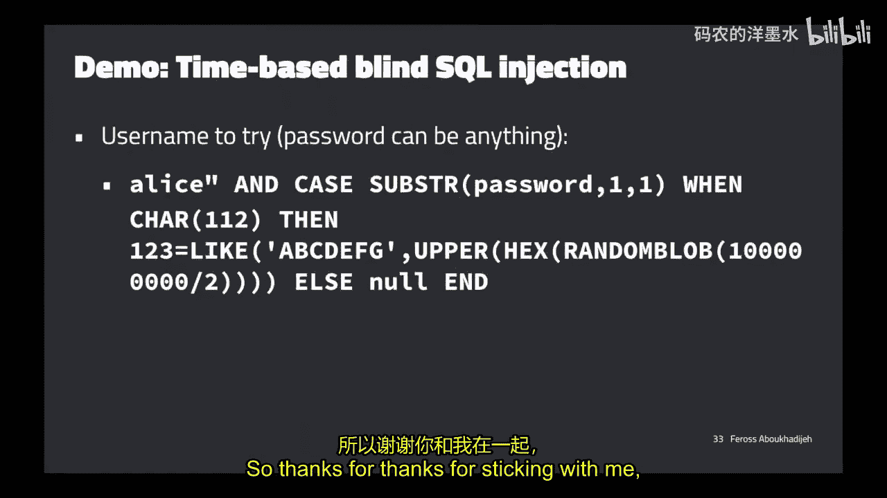

通过本课的学习，你应该能够识别这些漏洞模式，并在开发中应用正确的防御措施来构建更安全的Web应用。