# 011：传输层安全 (TLS) 🛡️

在本节课中，我们将要学习传输层安全协议，即TLS。我们将探讨它如何解决HTTP协议的安全弱点，其核心工作原理，以及如何正确部署它来保护网络通信。

---

## 概述

HTTP协议本身是不安全的，网络中的攻击者可以窃听或篡改通信内容。TLS协议通过在客户端和服务器之间建立加密通道，提供了**隐私性**、**完整性**和**身份认证**，从而解决了这些问题。当TLS与HTTP结合使用时，就形成了我们熟知的HTTPS。

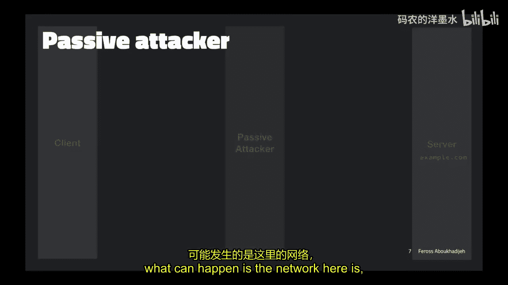

---

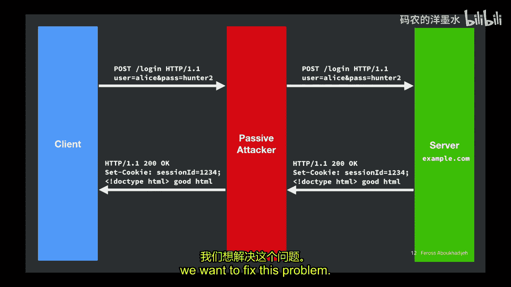

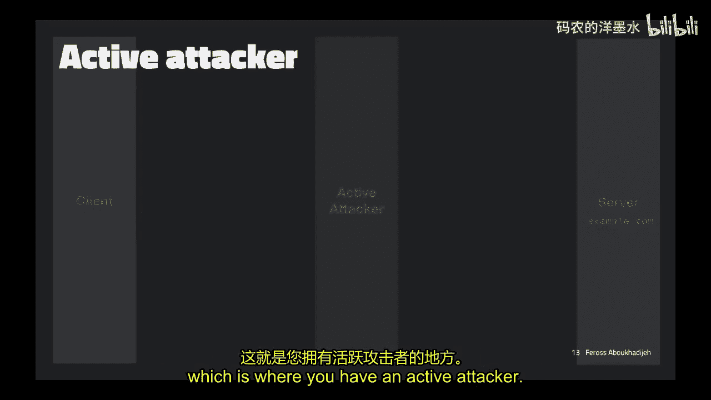

## HTTP的安全问题

上一节我们介绍了SQL注入的防御，本节中我们来看看网络通信的基础安全问题。

HTTP请求和响应在网络中以明文传输，这带来了两大威胁：

1.  **被动攻击者**：可以窃听网络流量，获取密码、会话Cookie等敏感信息。
2.  **主动攻击者**：可以拦截并修改请求和响应。例如，在服务器返回的HTML中注入恶意JavaScript代码。

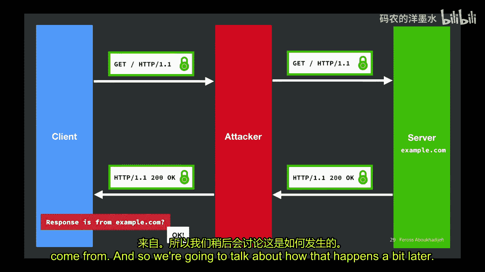

网络攻击者可能控制路由器、ISP，甚至是跨国网关。我们的目标是，即使在这样的威胁下，也能实现安全的通信。

---

## TLS的目标

TLS旨在实现以下三个安全属性：

1.  **隐私性**：防止窃听，通信内容对攻击者不可见。
2.  **完整性**：防止篡改，确保接收到的消息与发送时一致。
3.  **身份认证**：确保客户端正在与预期的服务器通信，而不是攻击者。

没有身份认证，隐私性和完整性就失去了意义，因为你可能只是在与攻击者进行“安全”通信。

---

## TLS工作原理概览

TLS的核心是建立一个安全的“隧道”。客户端和服务器通过一系列握手步骤协商出一个共享密钥，之后的所有通信都使用该密钥加密。网络攻击者可以看到加密的数据包，但无法解密其中的内容。

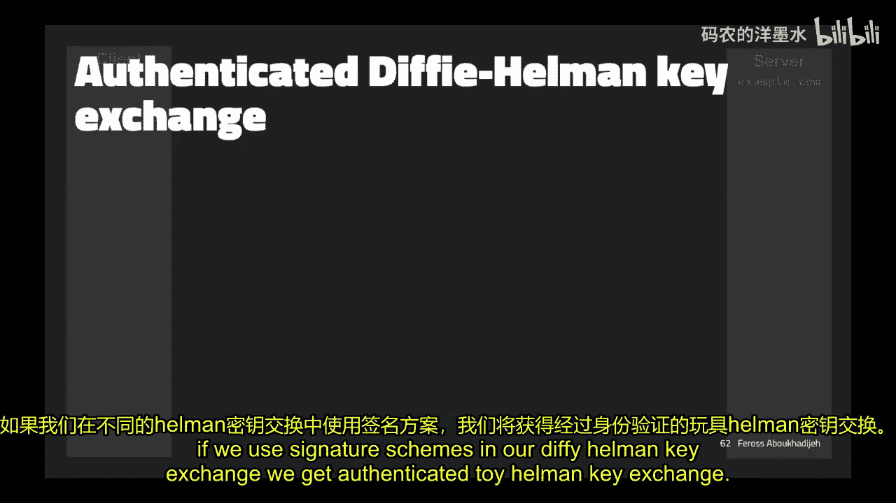

---

## 迪菲-赫尔曼密钥交换

为了建立共享密钥，TLS使用了迪菲-赫尔曼密钥交换协议。我们先看一个简化版本（匿名迪菲-赫尔曼）。

1.  客户端和服务器事先约定一个公开的循环群生成元 `g` 和模数 `q`。
2.  客户端随机选择一个数 `a`，计算 `g^a mod q` 发送给服务器。
3.  服务器随机选择一个数 `b`，计算 `g^b mod q` 发送给客户端。
4.  客户端收到 `g^b` 后，计算 `(g^b)^a = g^(ab) mod q`。
5.  服务器收到 `g^a` 后，计算 `(g^a)^b = g^(ab) mod q`。

现在，双方都得到了相同的值 `g^(ab)`，可以作为共享密钥。攻击者即使截获了 `g^a` 和 `g^b`，在计算上也无法推导出 `g^(ab)`。

**核心公式**：`共享密钥 = g^(ab) mod q`

然而，这个“匿名”版本存在**中间人攻击**风险：攻击者可以分别与客户端和服务器建立密钥，然后转发消息，而双方都无法察觉。

---

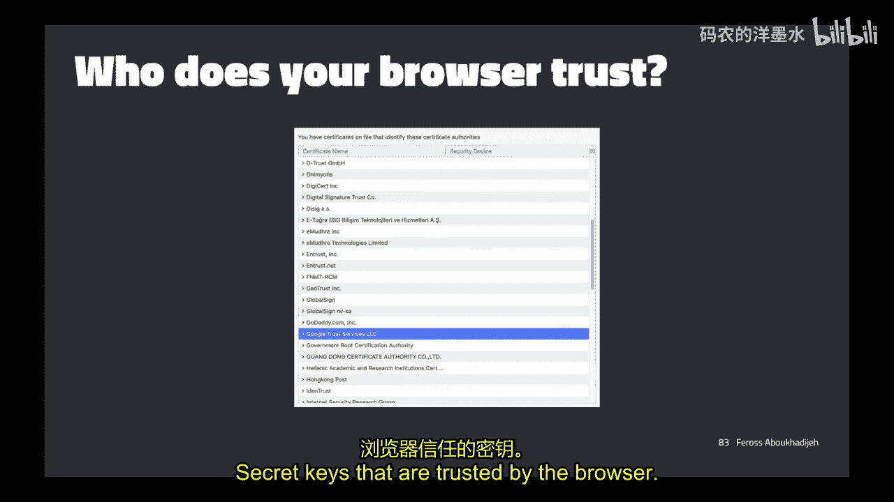

## 添加身份认证：数字签名

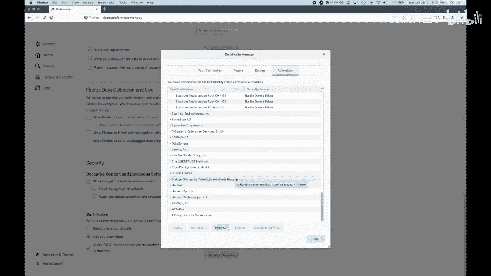

为了解决中间人攻击，我们需要对服务器进行身份认证。这通过**数字签名**来实现。

数字签名方案包含三个算法：
*   **生成算法 (G)**：产生一对密钥：公开的**验证密钥 (PK)** 和私密的**签名密钥 (SK)**。
*   **签名算法 (S)**：使用签名密钥 `SK` 对消息 `x` 进行签名，生成签名标签 `t`。
    **代码表示**：`t = S(SK, x)`
*   **验证算法 (V)**：使用验证密钥 `PK`、消息 `x` 和签名 `t` 来验证签名是否有效。
    **代码表示**：`V(PK, x, t) = accept/reject`

服务器将其验证密钥 `PK` 公之于众，并保管好签名密钥 `SK`。当它发送消息时，可以用 `SK` 对消息签名。任何持有 `PK` 的人都可以验证该消息确实来自该服务器。

---

## 认证的迪菲-赫尔曼密钥交换

现在，我们将签名整合到迪菲-赫尔曼交换中。

1.  服务器生成密钥对 `(PK, SK)`，并公开 `PK`。我们假设客户端已经通过某种方式知道了正确的 `PK`（这是关键，稍后解决）。
2.  客户端发送 `g^a` 给服务器。
3.  服务器生成随机数 `b`，并计算 `g^b`。
4.  服务器对到目前为止的**整个握手过程记录**（包括 `g^a` 和 `g^b`）用其 `SK` 进行签名，得到签名 `t`。
5.  服务器将 `g^b` 和签名 `t` 一起发送给客户端。
6.  客户端使用已知的服务器 `PK` 来验证签名 `t`。如果验证通过，则客户端确信正在与持有正确 `SK` 的服务器通信，然后计算共享密钥 `g^(ab)`。

这样，中间人攻击就无法得逞，因为攻击者无法伪造服务器的有效签名。

---

## 证书颁发机构

遗留的关键问题是：客户端如何首次获知服务器的正确公钥 `PK`？我们不能让服务器在握手时直接发送，否则又会陷入中间人攻击。

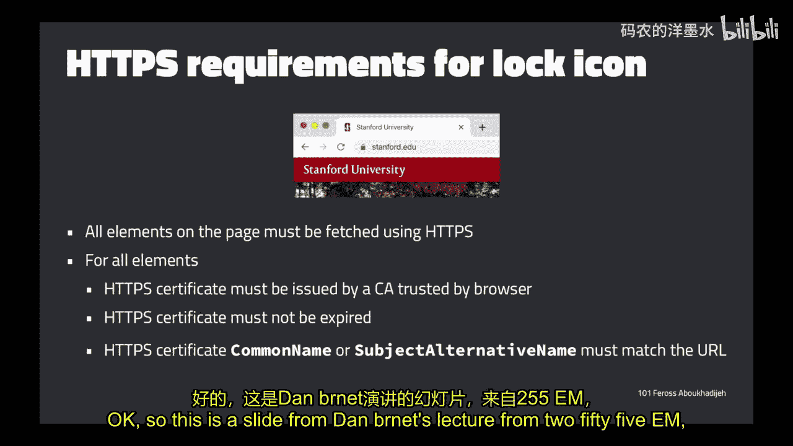

解决方案是引入受信任的第三方——**证书颁发机构**。

CA的工作流程如下：
1.  服务器生成自己的密钥对 `(PK, SK)`。
2.  服务器向CA证明自己拥有某个域名（例如 `example.com`）。
3.  CA验证通过后，使用自己的私钥对一条声明进行签名：“我证明域名 `example.com` 的公钥是 `PK`”。这条签名后的声明就是一个**数字证书**。
4.  服务器获得这个证书。

当客户端连接服务器时：
1.  服务器在TLS握手过程中发送自己的证书。
2.  客户端操作系统中或浏览器内预置了受信任的CA的公钥列表。客户端用对应CA的公钥验证证书上的签名。
3.  验证通过后，客户端就信任证书中的声明，从而获得了服务器的可信公钥 `PK`。

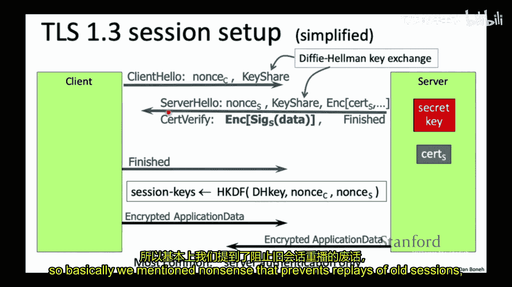

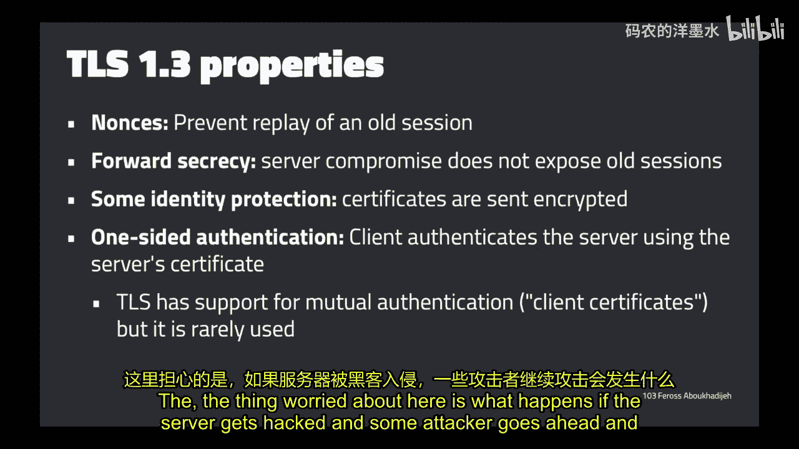

证书中最重要的字段是**通用名称**，它必须与客户端正在访问的域名匹配。浏览器会严格检查这一点。

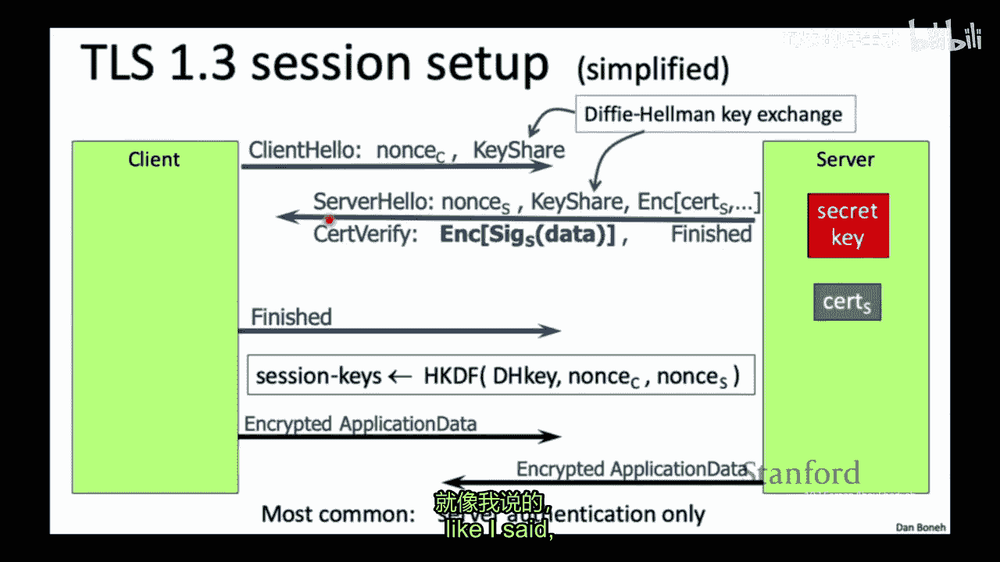

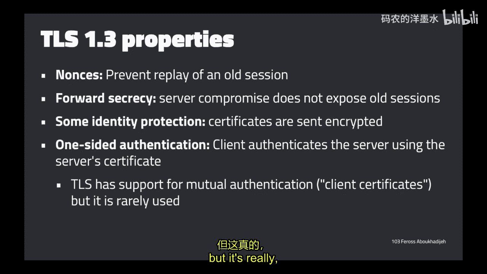

---

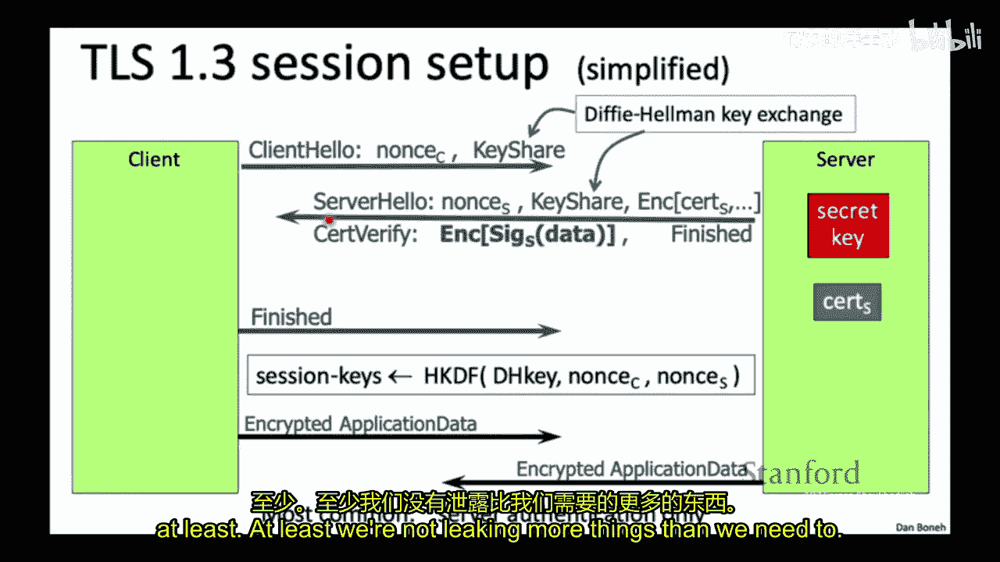

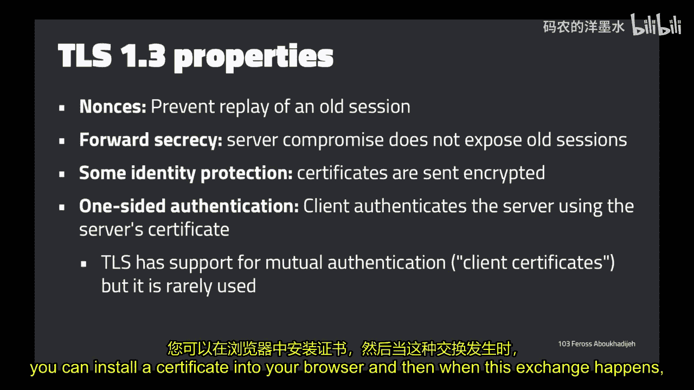

## TLS 1.3 协议流程

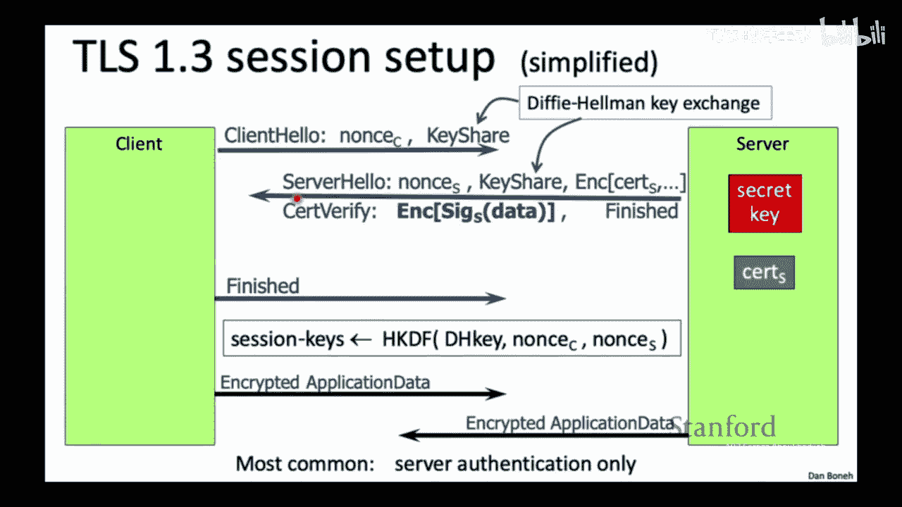

TLS 1.3是现代TLS协议的最新版本，它简化并加强了之前版本。其握手过程主要分为两个阶段：

1.  **密钥协商阶段**：基于认证的迪菲-赫尔曼交换，协商出共享密钥。
2.  **加密通信阶段**：使用派生出的会话密钥，加密后续所有的应用数据（如HTTP）。

握手消息包括 `ClientHello`、`ServerHello`、`Certificate`（服务器证书）、`CertificateVerify`（签名）和 `Finished`。引入随机数可以防止重放攻击。

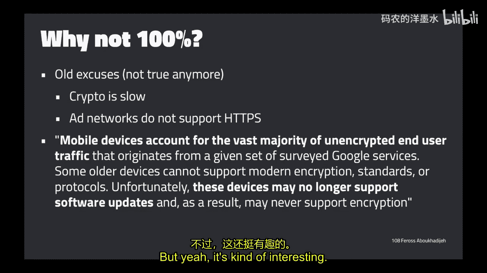

---

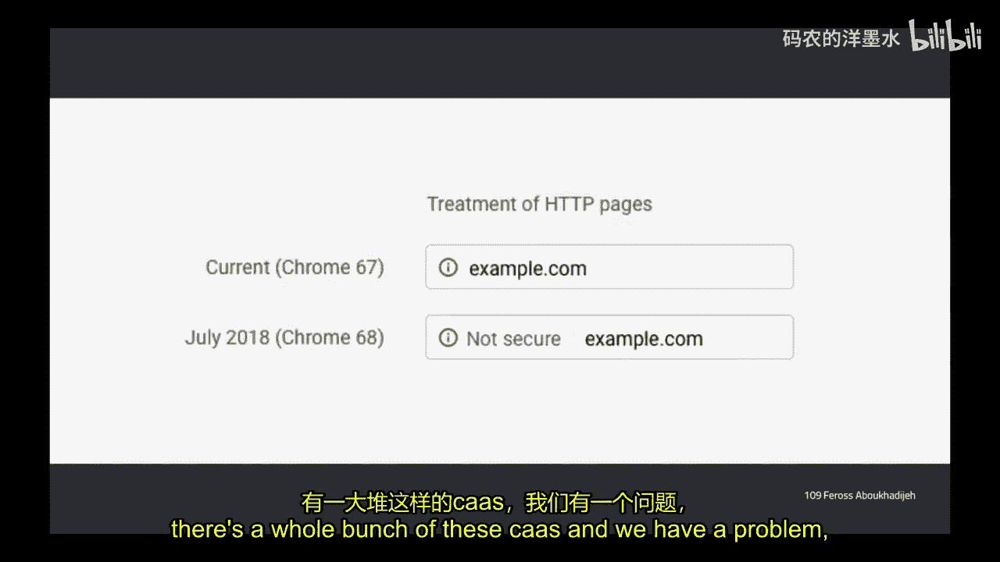

## TLS的重要安全特性

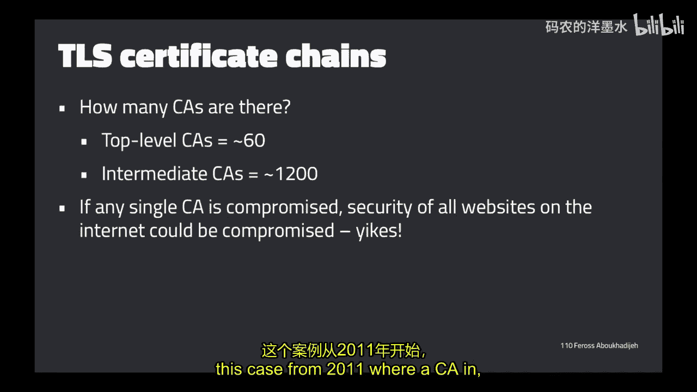

*   **前向保密**：即使服务器的长期私钥在未来某天被泄露，攻击者也无法解密过去截获的加密通信记录。这是因为每次会话的临时密钥在会话结束后会被丢弃。
*   **身份保护**：服务器的证书在握手过程中被加密传输，被动攻击者无法直接看到服务器身份，但通过IP地址等信息仍可能推断。

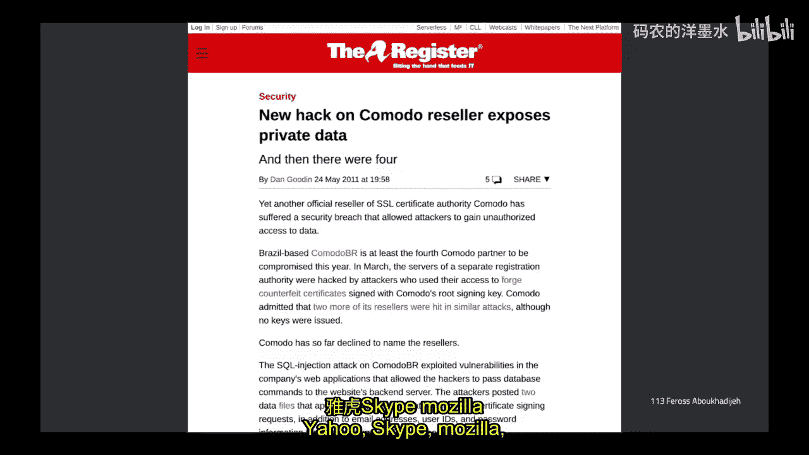

---

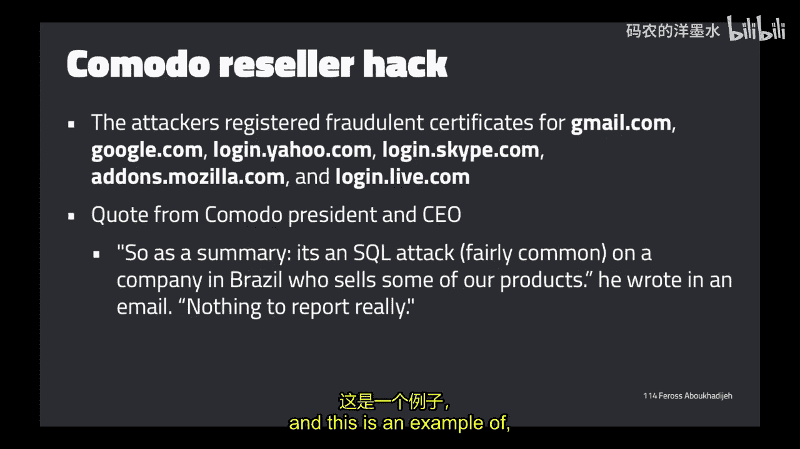

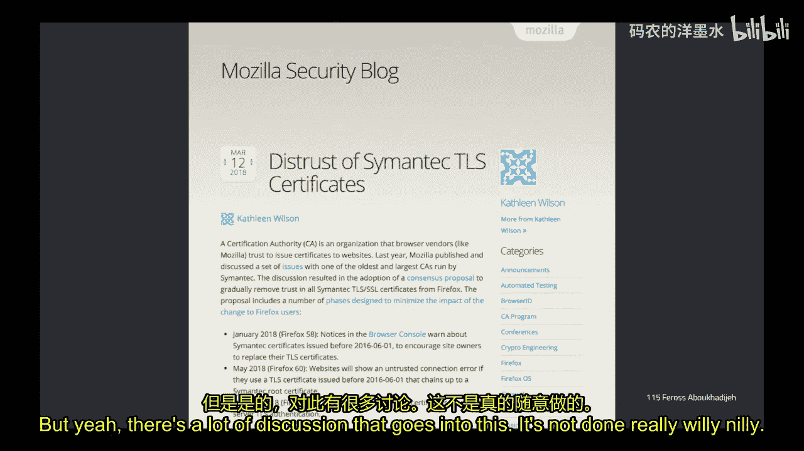

## HTTPS的部署与HSTS

仅仅支持HTTPS还不够，必须确保用户始终使用HTTPS访问。否则，攻击者可以利用 **TLS剥离攻击**：拦截用户的初始HTTP请求，阻止其重定向到HTTPS，并始终通过HTTP与用户通信，从而实施中间人攻击。

防御此攻击的方法是使用 **HTTP严格传输安全** 头。

服务器通过响应头告知浏览器，在接下来的一段时间内（例如一年），对于该域名及其子域名的所有请求，都必须使用HTTPS。
**示例Header**：`Strict-Transport-Security: max-age=31536000; includeSubDomains`

这属于“首次使用信任”模型：用户第一次访问时可能仍不安全，但之后访问就会受到保护。

为了彻底解决首次访问的问题，网站可以申请加入浏览器的 **HSTS预加载列表**。这个列表被硬编码在浏览器中，即使用户从未访问过该网站，浏览器也会强制使用HTTPS连接。但请注意，加入此列表后很难撤销。

---

## 总结

本节课中我们一起学习了传输层安全协议的核心知识。我们了解到：
1.  TLS通过迪菲-赫尔曼密钥交换和数字签名，解决了HTTP的隐私、完整和认证问题。
2.  证书颁发机构体系是建立信任链的关键，但它也带来了“信任锚”过多可能被滥用的风险。
3.  部署HTTPS时，必须使用HSTS来防御TLS剥离攻击，确保用户始终处于加密连接中。
4.  TLS 1.3提供了前向保密等强大特性，是现代Web安全的基石。

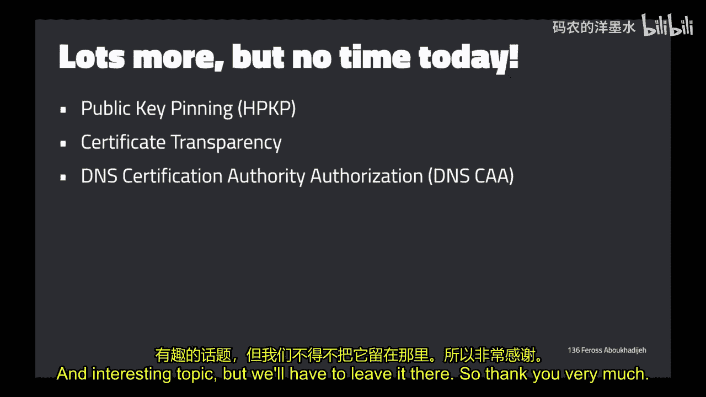

正确理解和部署TLS/HTTPS，是构建安全网络应用不可或缺的一步。