# 013：身份验证

## 概述
在本节课中，我们将要学习身份验证的核心概念、常见实现错误以及如何构建安全的身份验证系统，即使攻击者掌握了用户的密码。

---

## 什么是身份验证
身份验证是确认用户是否为其所声称身份的过程。这通常通过检查用户所知道的信息（如密码）、用户所拥有的物品（如手机、密钥）或用户自身的生物特征（如指纹、面部识别）来实现。

上一节我们介绍了身份验证的基本概念，本节中我们来看看身份验证与授权的区别。

## 身份验证与授权
身份验证是验证用户身份的过程，而授权则是在确认用户身份后，决定该用户是否有权限执行特定操作。两者不应混淆。

以下是两者的核心区别：
*   **身份验证**：例如登录表单、Cookie、HTTP认证，或使用生物特征、密码、物理设备进行验证。
*   **授权**：通常通过访问控制列表或能力URL（如Google文档链接中的唯一令牌）来实现。

---

## 用户名处理中的常见错误
在构建Web应用的身份验证系统时，首先需要正确处理用户名。

以下是处理用户名时需要注意的几点：
*   应以不区分大小写的方式存储用户名。
*   应确保用户名的唯一性。
*   可以在数据库中存储两个版本：一个用于比较的小写版本，一个用于显示的用户偏好大小写版本。

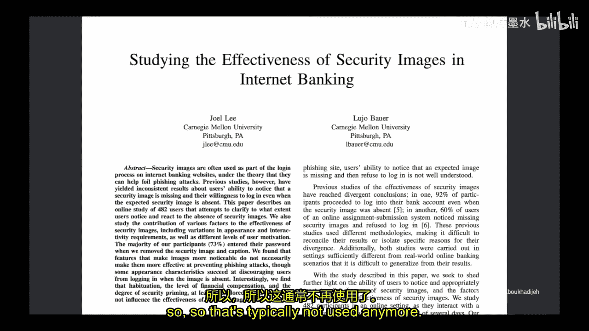

---

## 密码处理中的常见错误与最佳实践
用户倾向于选择弱密码。过去，许多系统会强制要求密码包含大写字母、小写字母、数字和符号，并定期更换密码。然而，这些做法已经过时。

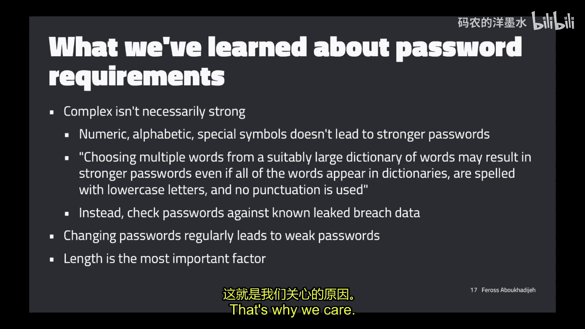

以下是一些过时或错误的密码策略：
*   强制使用复杂字符组合（如必须包含符号和数字）。
*   强制用户定期更改密码。
*   禁止用户重复使用旧密码。
*   对密码设置最大长度限制（例如10个字符）。
*   在电话登录中将字母映射为数字键。
*   设置最短密码更改间隔。
*   在表单中禁用复制粘贴功能。
*   使用安全性不足的密码提示问题。
*   使用屏幕虚拟键盘来防止键盘记录。

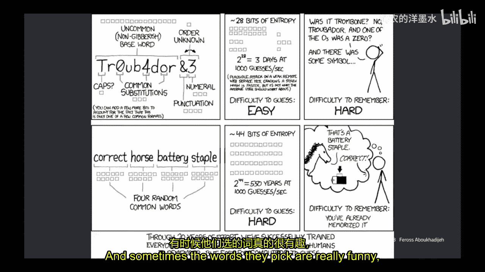

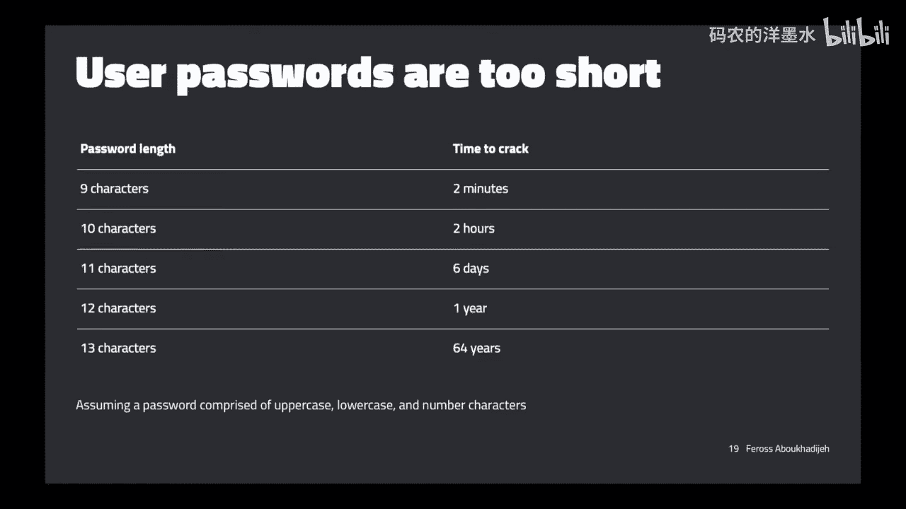

上一节我们回顾了过时的做法，本节中我们来看看当前推荐的密码策略。

## 现代密码策略
研究表明，选择多个来自足够大词典的单词，即使全部是小写且无标点，也能提供比复杂字符组合更强的安全性。公式可以表示为：
`密码强度 ≈ 所选单词的熵值总和`

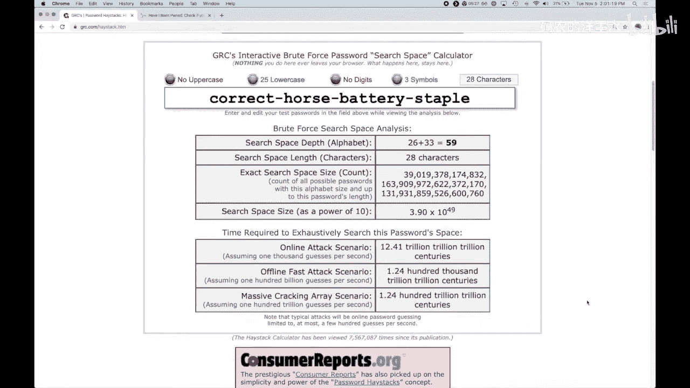

当前的最佳实践包括：
*   **允许长密码**：建议支持最多64个字符。
*   **设置最小长度**：至少8个字符。
*   **检查已知泄露数据**：将用户选择的密码与已知泄露的密码数据库进行比对。
*   **实施速率限制**：限制身份验证尝试的频率。
*   **鼓励或要求使用第二因素**：根据应用敏感度决定。

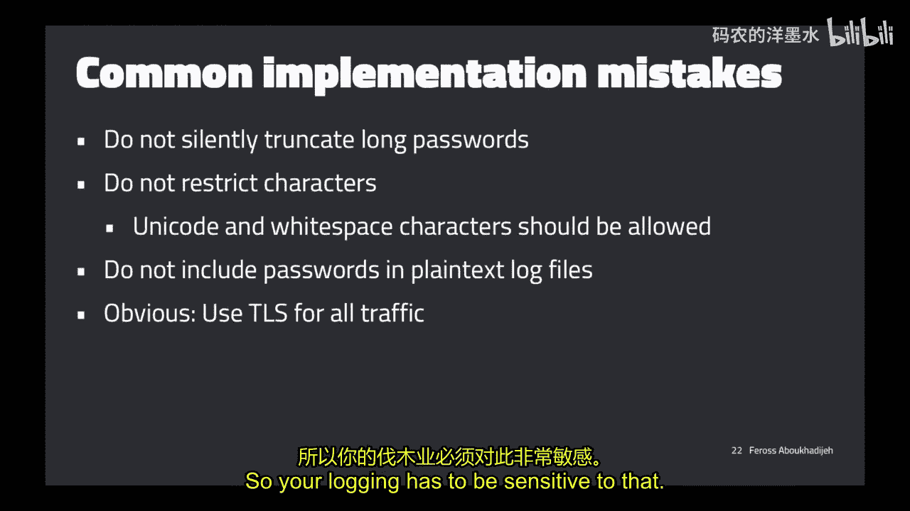

在实现时，需避免以下错误：
*   静默截断长密码。
*   限制用户可使用的字符（应允许Unicode和空格）。
*   将密码以明文形式记录在日志文件中。
*   未对所有流量使用TLS加密。

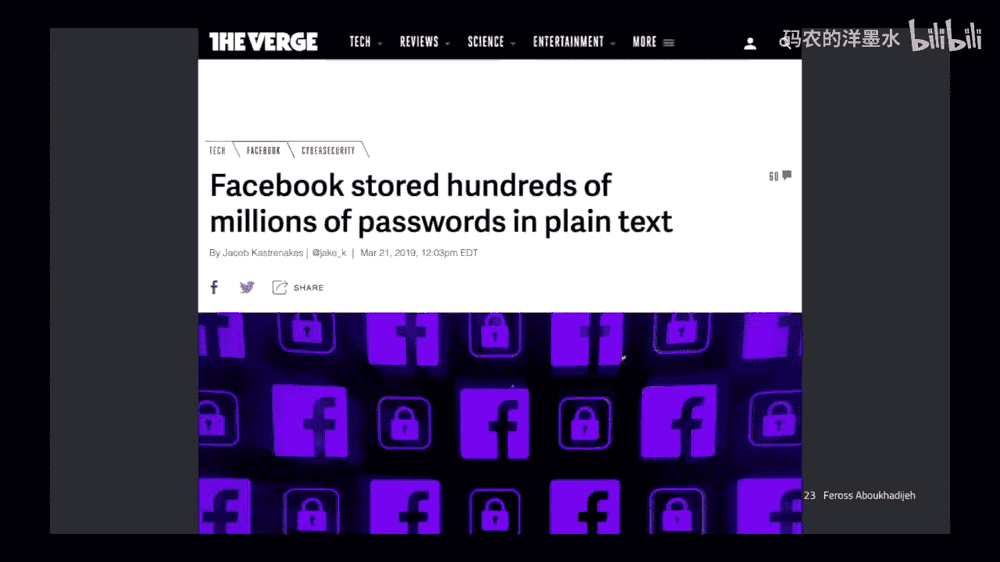

---

## 网络猜测攻击与防御
即使用户选择了强密码，系统仍需防御攻击者通过网络尝试大量用户名和密码组合的攻击。

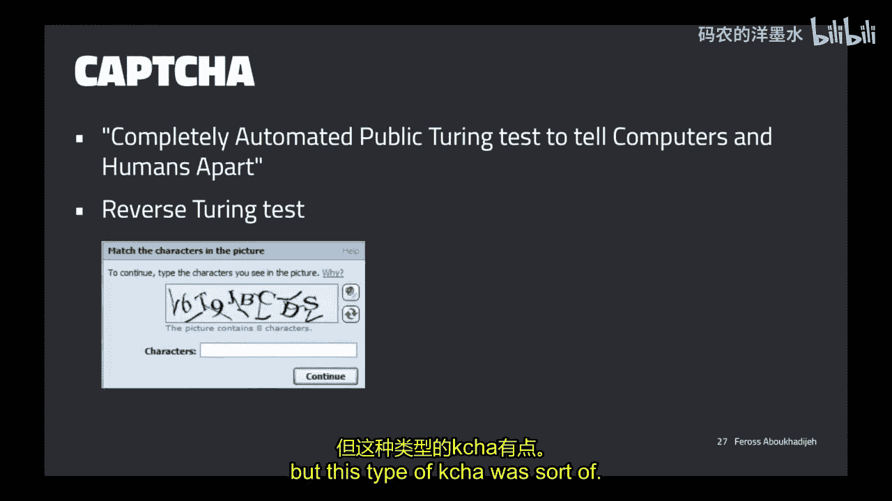

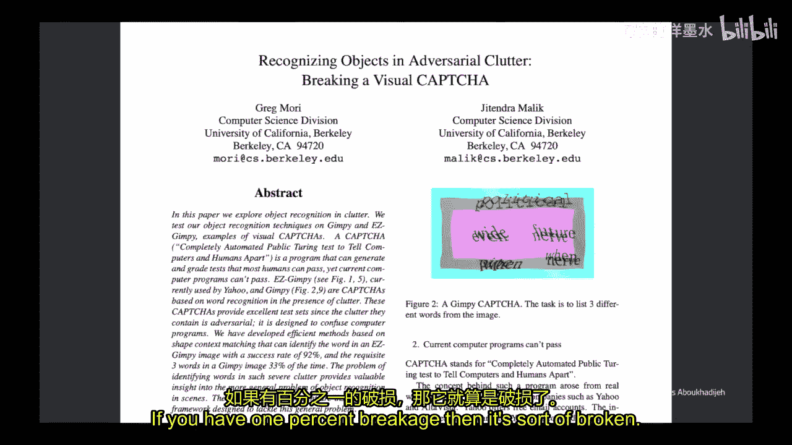

主要的网络攻击类型有三种：
1.  **暴力破解**：针对特定账户尝试所有可能的密码。
2.  **凭据填充**：使用从其他网站泄露的用户名和密码组合进行尝试。
3.  **密码喷洒**：使用少数常见弱密码尝试攻击大量账户。

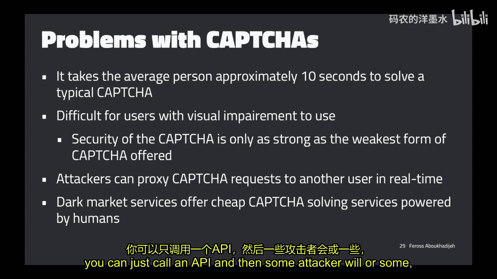

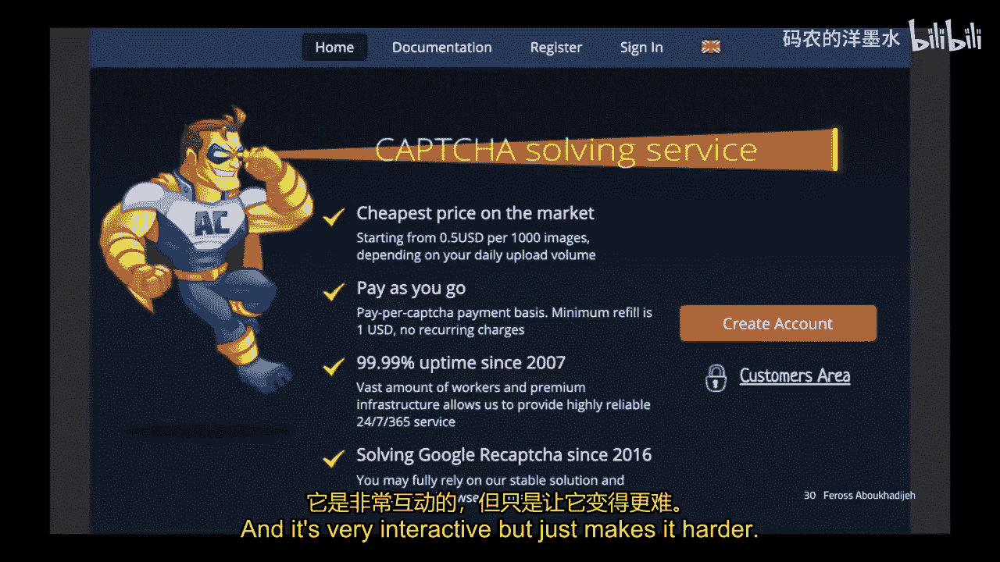

防御措施包括：
*   **速率限制**：限制每个用户名或IP地址在特定时间内的尝试次数。
*   **使用验证码**：要求用户完成测试以证明其为真人。但需注意，传统的基于文本的验证码已被证明容易被破解。现代的验证码（如reCAPTCHA）通过分析用户行为来评估风险。
*   **敏感操作前重新验证**：在用户执行更改密码、邮箱等敏感操作前，再次要求输入密码。

---

## 响应差异与信息泄露
身份验证系统可能通过不同的错误响应，无意中向攻击者泄露信息，例如告知“用户名不存在”或“密码错误”。这被称为响应差异，是一种信息泄露。

为了避免这种信息泄露，最佳做法是始终返回通用的错误信息，例如：“登录失败，用户名或密码不正确。” 这需要应用于登录、密码重置和账户创建等所有相关表单。

此外，还需注意HTTP状态码和响应时间可能造成的差异，确保攻击者无法通过这些侧信道获取信息。

---

## 数据泄露与密码存储
数据泄露事件频繁发生。一旦攻击者获取了数据库，如何存储密码就至关重要。

**绝对不要以明文形式存储密码。** 如果明文存储，泄露意味着攻击者可以直接获得所有用户的密码。

正确的做法是使用加密哈希函数处理密码后，仅存储哈希值。一个简单的哈希存储示例代码如下（使用Node.js的crypto库）：
```javascript
const crypto = require('crypto');
function sha256(password) {
    return crypto.createHash('sha256').update(password).digest('hex');
}
// 存储 sha256(password)
```

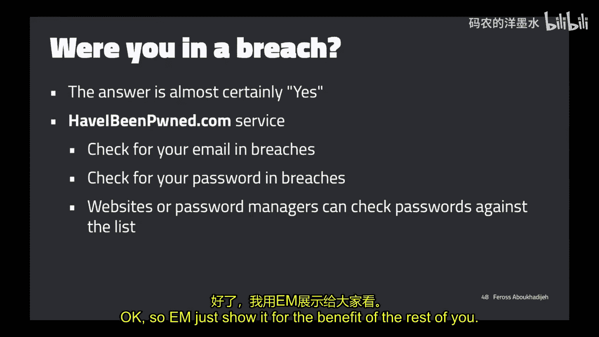

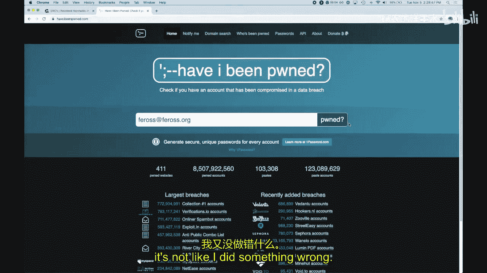

然而，仅使用哈希仍存在问题：如果两个用户密码相同，其哈希值也相同，且攻击者可以使用预计算的彩虹表进行反向查找。

## 密码加盐
为了解决上述问题，需要对密码进行“加盐”处理。盐是一个随机生成的值，与用户密码拼接后再进行哈希。盐值可以明文存储在数据库中。

加盐后的存储验证流程如下：
1.  用户注册时，生成随机盐 `salt`。
2.  计算哈希 `hash = H(salt + password)`。
3.  将 `(salt, hash)` 存入数据库。
4.  用户登录时，使用存储的 `salt` 与输入的密码计算哈希，并与存储的 `hash` 比对。

## 使用Bcrypt
更佳的选择是使用专门的密码哈希函数，如 **Bcrypt**。Bcrypt会自动处理加盐，并且计算速度可调（通过工作因子），使得暴力破解更加困难。

使用Bcrypt的示例：
```javascript
const bcrypt = require('bcrypt');
const saltRounds = 10;
// 创建哈希
bcrypt.hash(myPlaintextPassword, saltRounds, function(err, hash) {
    // 将 hash 存入数据库
});
// 验证密码
bcrypt.compare(myPlaintextPassword, hash, function(err, result) {
    // result == true 如果匹配
});
```

尽管如此，随着硬件算力的提升，即使使用Bcrypt，攻击者在获得哈希数据库后仍可能破解大量密码。因此，不能仅依赖密码。

---

## 多因素认证
多因素认证要求用户提供两种或以上不同类型的认证因素，极大地提升了账户安全性。即使密码泄露，攻击者仍需要第二因素（如手机验证码、物理安全密钥或生物特征）才能登录。

实施MFA时，可以考虑仅在检测到可疑行为时（如新设备、新地理位置登录）才要求第二因素，以平衡安全性与用户体验。

## TOTP实现示例
基于时间的一次性密码是一种常见的MFA实现方式。其工作原理如下：
1.  服务器为用户生成一个密钥。
2.  用户通过扫描QR码将该密钥存入手机验证器应用（如Google Authenticator）。
3.  应用和服务器基于当前时间（以30秒为间隔）和共享密钥，通过HMAC算法独立生成相同的6位验证码。
4.  用户在登录时输入此动态验证码作为第二因素。

核心公式可以简化为：
`TOTP = Truncate(HMAC-SHA-1(SecretKey, CurrentTime / 30)) mod 10^6`

---

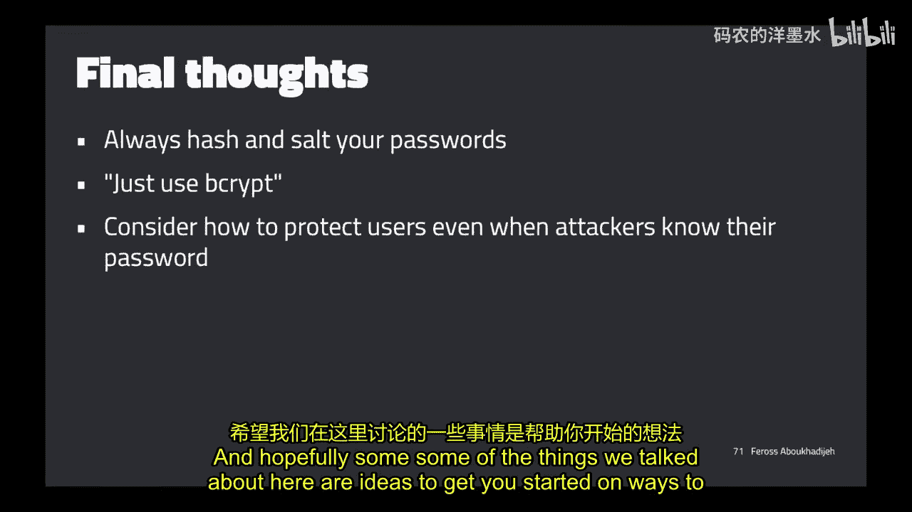

## 总结
本节课中我们一起学习了身份验证的核心知识。我们回顾了身份验证与授权的区别，探讨了用户名和密码处理中的常见错误与现代最佳实践，分析了网络猜测攻击及其防御策略，并强调了避免信息泄露的重要性。我们深入了解了数据泄露的威胁，学习了如何通过加盐和使用Bcrypt安全地存储密码。最后，我们认识到仅靠密码不足以保证安全，并介绍了多因素认证（特别是TOTP）作为关键防御措施。请记住，构建安全的身份验证系统需要层层设防，以保护用户即使在密码泄露的情况下也能得到一定程度的保护。