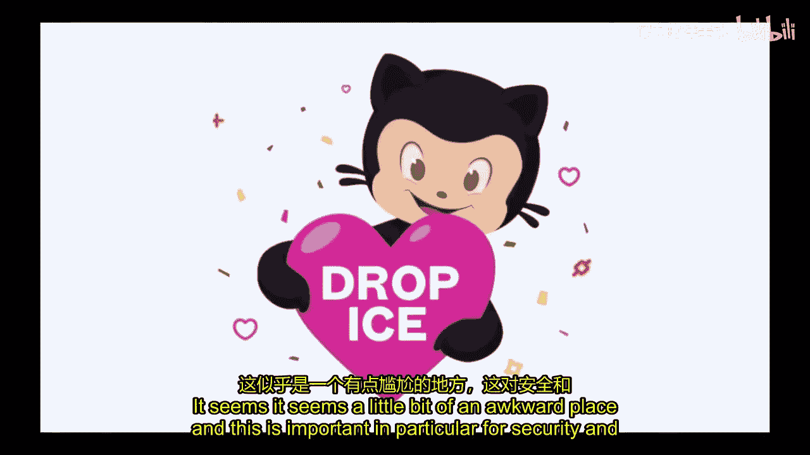
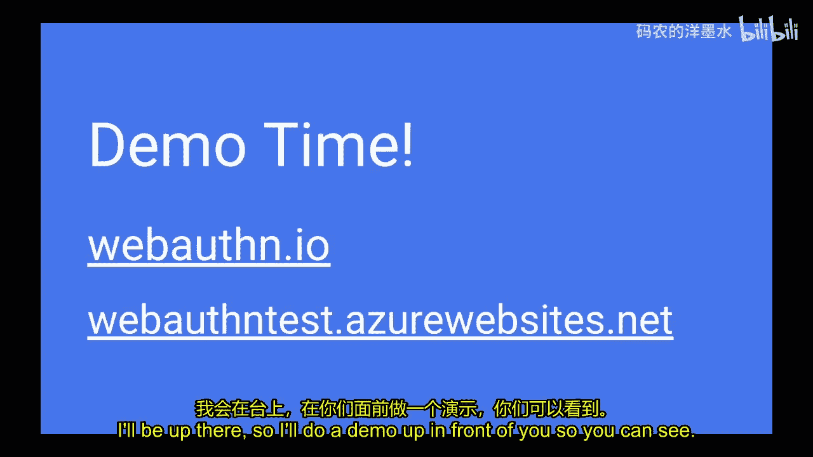
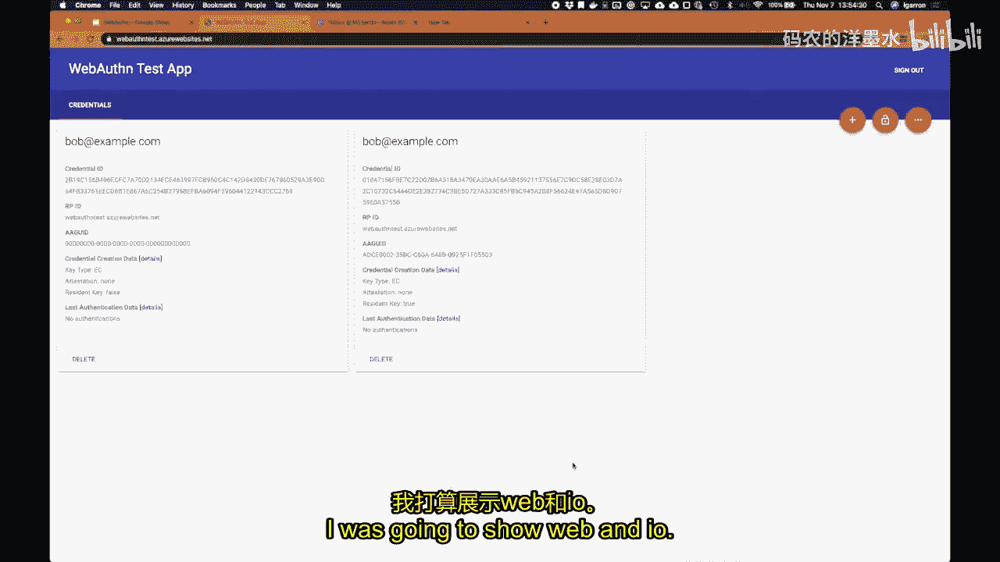
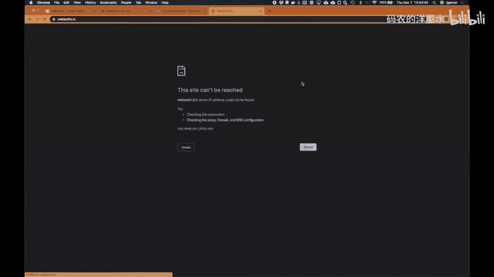
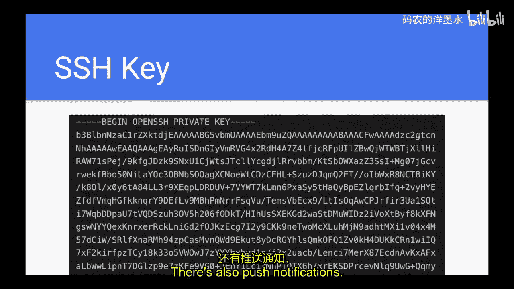
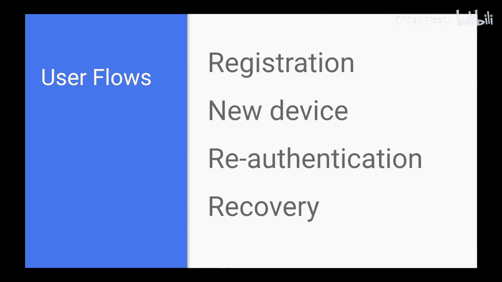

# 014：WebAuthn - 用户认证的未来 🚀



在本节课中，我们将学习 WebAuthn，这是一种旨在取代传统密码的现代网络认证标准。我们将探讨其工作原理、优势、实现细节以及它如何适应更广泛的网络安全生态系统。

## 概述

WebAuthn 是一个由万维网联盟（W3C）制定的网络标准，它允许用户使用生物识别、安全密钥或手机等设备进行网站认证，而无需依赖密码。其核心是公钥加密技术，旨在提供更强的安全性和更好的用户体验。

---

## 认证因素：传统视角与局限性

上一节我们介绍了课程背景，本节中我们来看看传统的认证因素概念。

传统的认证通常基于三个因素：
*   **知识因素**：你知道的东西，例如密码或安全问题的答案。
*   **所有物因素**：你拥有的东西，例如物理安全密钥、手机或智能卡。
*   **固有因素**：你自身的特征，例如指纹、面部识别或步态分析。



然而，这种分类方式在现实中存在局限性。许多现代认证方法（例如，使用设备内置安全元件的指纹识别）并不能清晰地归入某一类。WebAuthn 的目标之一就是抽象这些细节，让开发者无需纠结于具体的认证因素。

---





## WebAuthn 简介：核心概念与 API

了解了传统因素的局限性后，本节我们来深入 WebAuthn 的核心。

WebAuthn 本质上是一个浏览器 API。对开发者而言，它主要涉及两个 JavaScript 函数调用：

**1. 注册凭证**
```javascript
navigator.credentials.create()
```
此操作用于向网站注册一个新的认证器（如安全密钥或设备）。

**2. 获取断言**
```javascript
navigator.credentials.get()
```
此操作用于在后续登录时，要求认证器证明其拥有对应的私钥。

从用户角度看，流程非常简单：首次使用时“注册”设备，之后登录时“使用”该设备。所有复杂的密码学和协议细节都被浏览器和认证器隐藏了。

---

## WebAuthn 的优势与特性

现在我们已经了解了 WebAuthn 的基本操作，本节我们来看看它解决了哪些具体问题。

以下是 WebAuthn 相比传统方法的主要优势：

*   **抵抗钓鱼攻击**：由于认证与特定网站域名绑定，即使用户在钓鱼网站上触发认证，攻击者也无法利用该信息登录真实网站。
*   **无密码体验**：结合“常驻密钥”功能，用户可以实现无需输入用户名和密码的登录，仅需生物识别或设备解锁。
*   **基于公钥加密**：服务器只存储公钥，私钥始终由用户设备安全保管，即使服务器被入侵，攻击者也无法冒充用户。
*   **丰富的认证器类型**：支持物理安全密钥、设备内置认证器（如 Touch ID、Face ID、Windows Hello）等多种形式。

一个关键配置选项是 **`residentKey`**（常驻密钥）。启用后，私钥将安全地存储在认证器硬件内部，无法导出。这是实现无密码登录的基础。

---

## 与其他认证方式的对比

WebAuthn 并非凭空出现，它旨在改进或取代许多现有方法。本节我们将进行一些对比。

以下是几种常见认证方式的简要分析：

*   **密码**：易于被钓鱼、撞库和重复使用。当前最佳实践是使用 Bcrypt 等算法进行哈希存储。
*   **短信验证码**：方便但安全性低，易受 SIM 卡交换攻击和钓鱼攻击。
*   **基于时间的一次性密码**：比短信安全，但仍有钓鱼风险，且备份和恢复体验不佳。
*   **推送通知**：比短信安全，但仍可能被钓鱼，因为用户可能不仔细阅读提示中的详情。
*   **客户端证书**：概念上与 WebAuthn 类似，但用户体验和隐私保护方面存在历史问题，未能普及。
*   **二维码扫码登录**：用户体验良好，但本质上仍可能受到中间人钓鱼攻击的威胁。

WebAuthn 的抽象层理论上可以封装上述许多方法，但其设计初衷是推动更安全、用户体验更好的原生方案。



---

## 技术细节与生态

理解了 WebAuthn 的定位后，本节我们简要探讨其技术生态和实现细节。

WebAuthn 涉及一系列相关标准和协议，初学者容易混淆：
*   **WebAuthn**：指 W3C 的浏览器 API 标准本身。
*   **FIDO2**：是 FIDO 联盟的总体项目名称，**WebAuthn 是 FIDO2 的组成部分**。
*   **CTAP**：客户端到认证器协议。WebAuthn 浏览器 API 通过 CTAP 与物理认证器（如安全密钥）通信。
*   **U2F**：FIDO 联盟的上一代标准，现已演进并融入 FIDO2/WebAuthn 体系。

对于实现者，挑战在于 API 参数复杂，涉及多种编码格式。不过，社区正在开发更友好的库来简化集成。

---

## 挑战与未来展望

任何新技术都有其挑战。本节我们讨论 WebAuthn 在推广中面临的一些实际问题。

*   **账户恢复**：如果用户丢失了唯一的认证器，如何恢复账户访问权限？这仍然是一个未完全解决的难题，通常需要依赖备份认证器、恢复代码或其他备用方案。
*   **用户术语与引导**：如何向非技术用户清晰解释“使用安全密钥登录”或“使用您的设备登录”？“安全密钥”一词容易让人联想到物理设备，而 WebAuthn 也包含设备内置认证器，这造成了术语上的混淆。
*   **隐私考虑**：WebAuthn 设计上防止了不同网站间通过认证器进行用户追踪。认证器不应向网站泄露其他网站的注册信息。

尽管有挑战，WebAuthn 代表了认证技术向更安全、更便捷未来迈进的重要一步。随着操作系统和浏览器支持的不断完善，以及像 iCloud 钥匙串这样的跨设备同步方案出现，其可用性将进一步提高。

---

## 总结



本节课我们一起学习了 WebAuthn 这一现代网络认证标准。我们从传统的认证因素概念出发，探讨了其局限性，并详细介绍了 WebAuthn 如何利用公钥加密技术提供更强大的安全保障。我们分析了其核心 API、安全特性、相较于短信/密码等传统方式的优势，以及它背后的技术生态。最后，我们也审视了其在账户恢复、用户教育等方面面临的现实挑战。WebAuthn 为实现无密码未来奠定了坚实的基础，是网络安全领域一个至关重要的演进方向。