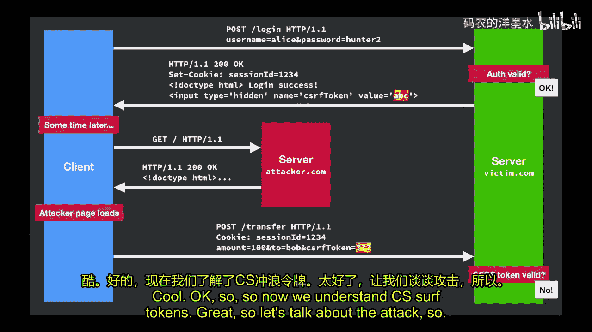
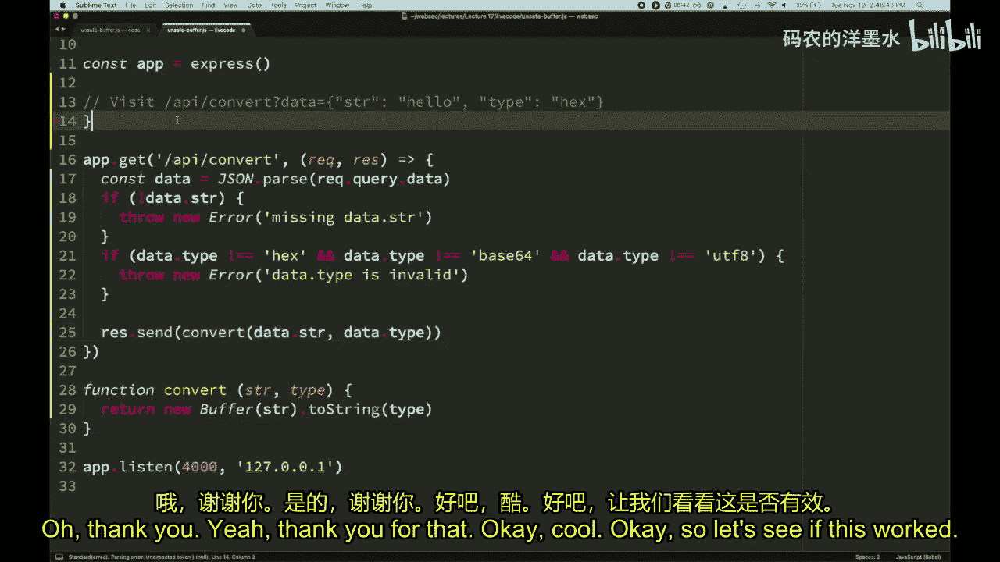
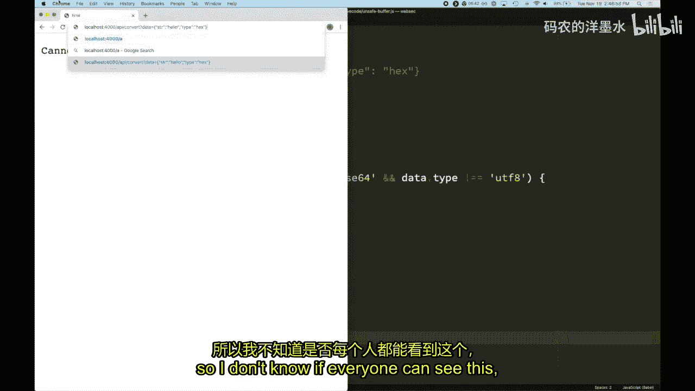
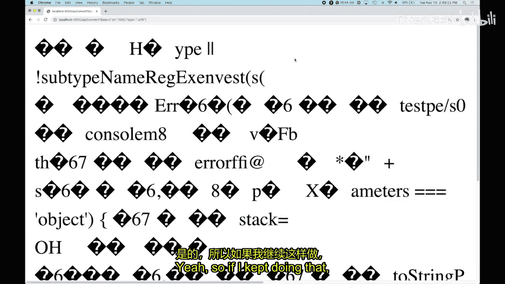
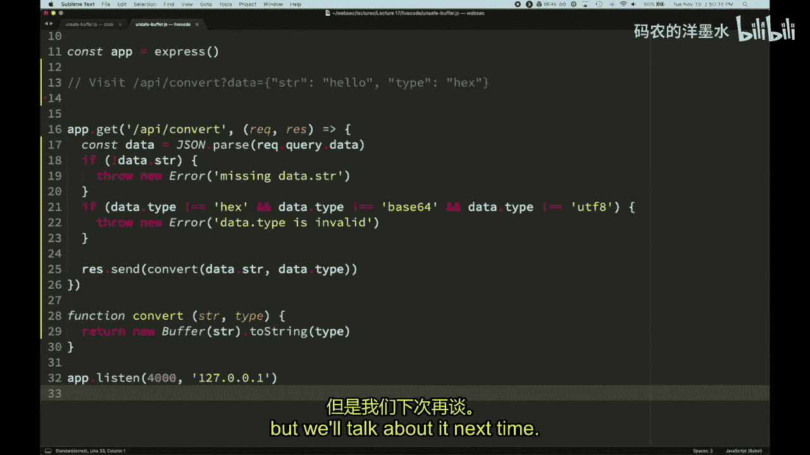

# 017：安全编码实践

## 概述

在本节课中，我们将要学习服务器端的安全编码实践。我们将探讨常见的服务器端安全漏洞，特别是那些由于不良的API设计或代码逻辑缺陷导致的漏洞。课程将通过一个真实的、高额赏金的GitHub漏洞案例，深入分析其原理，并从中总结出编写安全、健壮代码的重要原则。

上一节我们介绍了SQL注入和速率限制等服务器端安全话题，本节中我们来看看更多类型的服务器端攻击以及如何通过安全的编码实践来防御它们。

## 课程公告

以下是本周的一些课程安排和通知。

*   本周将举办一场由Brave公司的Pete Snyder主持的实践研讨会，他是我们的第一位客座讲师。斯坦福应用网络安全俱乐部将主办此次活动，时间是周四下午6点到7点，地点在Gates 1-74，并提供晚餐。
*   今天有两位新同学加入了课堂，他们是我的父母，来听我讲课，请大家友好对待。
*   截至目前，已有三位同学发现了安全问题并进行了报告，因此获得了额外学分。其中一些发现非常有趣：
    *   在Access中发现了一个XSS漏洞。由于Access是斯坦福漏洞赏金计划的一部分，这位同学向该计划报告了漏洞，并从斯坦福获得了100美元的赏金。
    *   另一位同学在CS课程网站上发现了一个XSS漏洞，该漏洞可能导致能够修改作业分数。
    *   还有一位同学发现了一个不安全的设计，允许在求职面试的编码挑战中泄露测试用例。

提醒一下，如果你有兴趣参与漏洞挖掘，还有几周时间。这完全是可选的，但很有趣。

## 案例研究：绕过GitHub的OAuth授权流程

首先，让我们从一个故事开始。几周前，科技新闻网站报道了一个与我们今天要讨论的内容高度相关的故事。一位安全研究员发现了一个方法，可以完全绕过GitHub的OAuth授权流程。

这个漏洞的标题是“绕过GitHub的OAuth流程”。攻击者能够创建一个GitHub应用，该应用可以读取用户的GitHub数据。通常，用户会看到一个提示，询问是否同意授予该应用访问其数据的权限，用户需要点击按钮表示同意。

然而，攻击者找到了一种方法，无需任何用户交互，就能向GitHub发送一个附带用户Cookie的请求，从而授予他的应用对用户GitHub账户的任何权限。这意味着，仅仅访问攻击者的网站，你的整个GitHub账户就可能被完全控制，攻击者可以访问所有数据、所有私有仓库以及所有公司机密。这是GitHub有史以来支付给个人的最高赏金，影响非常严重，甚至影响了所有企业内部部署的GitHub企业版。

有趣的是，根据我们目前在本课程中学到的知识，你们中的任何人都可能发现这个漏洞。这只需要一些额外的解释就能完全理解。有些人确实全职寻找漏洞，并以此谋生。这位研究员就是出于好奇，决定花一周或一个月的时间专门在GitHub上寻找漏洞，这就是他的成果。这是一个鼓舞人心的故事。

在深入分析其工作原理之前，让我们先回顾一下跨站请求伪造。

### 回顾：跨站请求伪造

跨站请求伪造是一种攻击，攻击者可以强制用户对他们当前已认证登录的Web应用执行操作。

攻击者实现此攻击的方式是利用浏览器的认证机制——Cookie。Cookie具有我们所谓的“环境授权”模型。环境授权是一个花哨的术语，基本意思是：一旦你通过登录向网站证明了自己的身份并获得授权，未来所有发送到该站点的请求都会自动携带该授权。这是因为浏览器会自动将Cookie附加到这些请求中。这是我们整个季度一直在讨论的内容。

这意味着，如果 `attacker.com` 能够导致一个HTTP请求被发送到 `victim.com`，那么浏览器会自动将 `victim.com` 的Cookie附加到这个请求上。

以下是CSRF攻击的图示回顾：

1.  客户端访问服务器（受害者服务器），发送包含用户名和密码的登录请求。
2.  服务器验证用户名和密码有效，发送回一个包含 `Set-Cookie` 头的响应，设置 `sessionId=1234`，并告知用户登录成功。
3.  一段时间后，浏览器持有此Cookie。用户可能打开了另一个标签页，或者仍然登录着该网站。
4.  用户碰巧收到了一个指向攻击者网站的链接，并访问了该网站。
5.  浏览器向攻击者服务器发送请求，攻击者服务器返回包含恶意JavaScript的HTML。
6.  该页面加载后，会发送一个请求到受害者服务器（而非攻击者服务器），例如一个转账请求，包含参数（如转账100美元给Mallory）。
7.  浏览器“友好地”将Cookie头附加到该请求上。
8.  服务器收到请求，从它的角度看，这个请求看起来像是来自一个合法的表单，因为所有信息都符合，因此会执行操作。

希望这是复习内容。对此有任何疑问吗？这是标准的CSRF。

### 防御CSRF：同站Cookie

我们修复这个问题的方法是使用同站Cookie。同站Cookie允许你指定：只有当请求是由我自己的站点发起时，才附加我的Cookie。

因此，如果一个请求是从 `victim.com` 发往 `victim.com`，浏览器会包含Cookie头。但如果请求是从 `attacker.com` 发往 `victim.com`，浏览器则不会包含Cookie头。

同站Cookie是一个经常出现的重要Cookie特性。

### 引入：CSRF令牌

现在，让我们讨论一个之前没有谈过的新内容。我原本没计划在这门课中讨论它，但在这里提到它是因为理解GitHub攻击需要了解这个概念。

CSRF令牌在今天看来实际上有些多余了，因为它们是一种有效获得同站Cookie行为的方式，但在同站Cookie成为标准之前，在浏览器实际支持这个概念之前，网站需要一种方法来防止任何随机站点能够向我们的服务器提交附带Cookie的表单。

那么，在同站Cookie属性存在之前，网站是怎么做的呢？在Web存在的大部分时间里，没有办法指定你希望Cookie是同站的。这意味着，在Web存在的大部分时间里，`attacker.com` 可以向你的站点 `victim.com` 发送GET或POST请求，并且你的Cookie会被附加。浏览器允许这样做，而站点无法选择退出这种行为。

那么，网站如何区分一个请求是来自自己的站点还是攻击者的站点呢？一个想法是查看Referer头，但这并不完美，因为攻击者可以通过某些方式禁用Referer头。实际上，在相关规范创建、浏览器实现之前，没有内置的浏览器机制或Web标准能让站点指定其Cookie的同站行为。

因此，解决这个问题的方法是，每个站点都必须实现一种叫做CSRF令牌的东西。

CSRF令牌是一个随机数。随机数是由服务器生成并传输给客户端的一个秘密、不可预测的值。

我们使用CSRF令牌的方式是：客户端必须在所有后续发送给服务器的HTTP请求中包含这个CSRF令牌，以便服务器将其识别为有效请求。如果你向服务器发送请求但没有包含CSRF令牌，或者令牌错误，服务器会认为这是一个无效请求。基本上，服务器会给客户端一个值，并说：“你未来发送的所有请求都必须包含这个值，否则我会拒绝它们。”

以下是如何在页面中包含令牌的典型方式：你可以在表单中包含一个 `input` 元素，类型为 `hidden`。你可以给它一个名字（如 `csrf_token`）和令牌的实际值。因为这是一个输入字段，当表单提交时，所有输入都会作为表单的一部分发送到服务器，这个令牌字段也会被包含在内，就像用户自己输入的一样。

服务器如何生成这些令牌呢？有两种方法：一种是随机选择一个值作为随机数，将其转换为字符串作为令牌值；另一种是基于请求本身的一些信息（如会话ID）来生成。

### CSRF令牌如何工作？

现在我们有这个令牌了。问题是：我们如何使用它？它实际上如何保护我们免受CSRF攻击？

让我们看看CSRF令牌是如何工作的：

1.  客户端访问我们的服务器，发送包含用户名和密码的登录请求。
2.  服务器验证有效，发送回一个响应。这个响应包含一个 `Set-Cookie` 头，为用户设置会话，并告知登录成功。但额外的是，响应中还包含一点HTML，即服务器为用户选择的CSRF令牌（例如 `ABC`）。
3.  现在，这个页面包含了这个令牌。如果客户端以任何方式与发送回的页面交互（例如，现在提交另一个表单进行银行转账），这个令牌将被包含在该请求中。
4.  一段时间后，客户端决定提交转账请求。浏览器像往常一样附加了Cookie，现在我们有了和之前一样的表单字段（转账100美元给Bob），但现在还包含了一个CSRF令牌字段，基本上是客户端回显了之前获得的相同令牌。
5.  服务器检查这个令牌，判断是否与之前给出的相同。如果是，则认为这是一个有效请求，并返回一个页面告知转账成功。

到目前为止，一切顺利。

### CSRF令牌如何防御攻击者？

现在，这如何保护我们免受攻击者的攻击？想象一下同样的场景：

1.  用户使用用户名Alice和密码登录，有效。我们像之前一样返回相同的页面。
2.  一段时间后，他们碰巧访问了攻击者的网站。攻击者返回一些HTML。
3.  当该页面加载时，这个攻击者控制的页面会向服务器发送一个请求。问题是：攻击者在这里为CSRF令牌字段放入了什么？它应该是之前发送的 `ABC`。但是，由于这里发生的表单提交（POST请求）来自攻击者的JavaScript，攻击者实际上无法从 `victim.com` 的页面中读取这个输入。要这样做，它需要能够侵入 `victim.com` 的DOM，这违反了同源策略。

因此，基本上，这里的受害者服务器 `victim.com` 在查看这个请求时，如果发现CSRF令牌与之前相同，它就知道这个请求一定来自它在原始页面中发送的HTML和JavaScript，而不是来自用户碰巧访问的其他网站。所以，即使这里的Cookie是有效的（攻击者发送了这个请求，浏览器附加了Cookie），如果服务器只看Cookie，会认为这实际上是用户，因为他们在这里登录了。但CSRF令牌是错误的，因此它会拒绝该请求。

通常，这会如何处理？服务器需要记住它曾经给用户发送过的所有CSRF令牌，而不仅仅是最后一个。例如，用户可以在一个站点上打开10个标签页。因此，服务器不仅要记住它发送的最后一个令牌，还要记住所有令牌。通常，我们实际上不会只生成一个随机值，因为这意味着服务器必须记住它在合理时间内发送给用户的每一个CSRF令牌。

更好的方法是：服务器已经给了用户一个会话ID，并设置在Cookie中。当用户将其发送回来时，服务器可以基于该会话ID以及一个只有服务器知道的秘密，使用HMAC函数（可以看作是一种哈希）来计算令牌应该是什么。这样做的优点是，服务器只需要记住这一个秘密。客户端将在请求中提供会话ID以及一个令牌。只要服务器在验证令牌时运行的函数与它发送令牌时运行的函数相同，它就应该匹配。因此，服务器实际上可以完全是无状态的，它不需要记住任何这些令牌，仍然可以验证它们。

关于令牌在整个会话中是否相同的问题：只要用户拥有这个会话ID，他们就会得到相同的CSRF令牌。这没关系，因为我们假设用户不会与任何人共享这个令牌，并且攻击者无法猜测它。这就是我们关心的全部。

CSRF令牌与我们之前讨论过的CSP随机数非常相似。区别在于我们使用它的地方。CSP随机数是服务器在头中告诉浏览器：“除非脚本包含这个随机数作为属性，否则不要运行任何脚本。”而在这里，实际上是服务器在说：“除非表单提交包含这个我之前告诉客户端的值，否则我不会接受任何表单提交。”这是一个非常相似的概念。

关于同站Cookie的问题：如果发送了同站Cookie头，那么攻击者发送的这个请求甚至不会包含Cookie，因此这不会起任何作用。你可以同时使用两者。实际上，仍然使用CSRF令牌的一个用例是，如果你的用户使用非常旧的浏览器，或者你正在构建一个企业应用并关心这一点。另一个你可能看到它的地方是，如果你使用像Ruby on Rails这样的Web框架。直到最近，都没有办法防范CSRF，因此互联网上几乎每个站点都必须在自己的应用代码中实现这种保护，尽管框架可能会提供一些便利。

CSRF令牌是完全有效的防御手段。只要从足够大的范围内选择令牌并且完全随机选择，攻击者就不可能猜出它。同站Cookie的引入是为了说：“等等，为什么我们必须让服务器生成这个随机数、检查它，并且每个人都分开做？如果你在一个端点上忘记这样做，你的整个应用就易受攻击。为什么我们不只是在设置Cookie时添加一个属性说 `SameSite`，然后就完成了呢？”这是一个简单得多的解决方案，出错的可能性更小。

关于Referer头的问题：攻击者可以在一定程度上控制Referer头吗？攻击者不能完全控制Referer头到那种程度，但他们可以导致它被省略。然后服务器必须决定如何处理。它是因恶意原因被省略，还是因为浏览器试图更私密而被省略？服务器不清楚应该怎么做。

现在我们已经理解了CSRF令牌。很好。让我们来谈谈这个攻击。

## 深入分析GitHub OAuth漏洞

这是用户在被询问是否愿意授予应用访问其GitHub账户权限时看到的提示。如果他们决定授予权限，可以点击这里的“授权”按钮。在这个演示中，他只选择了非常小的一组权限，但这可能包含更多提示，以获得更多访问权限。

### 正常的OAuth授权流程

当实际授权一个应用程序时，流程是怎样的？假设某个第三方应用出于合法目的需要访问你的GitHub账户。其工作方式是，它会将你重定向到这个URL：`github.com/login/oauth/authorize`，并在查询字符串中包含一些信息，说明是哪个应用。你会收到一个针对该应用的提示，说明该应用想要访问你的账户。当你访问那里时，你会得到这个授权页面。

如果用户选择授予应用访问权限，他们会点击页面上的大绿色“授权”按钮。然后，用户被重定向回第三方应用程序，GitHub在进行重定向时，会在查询字符串中包含一个GitHub令牌，该应用程序可以使用该令牌通过向GitHub发送请求来访问你的数据。这个令牌基本上就像是你的账户对这个应用的密码。

### “授权”按钮的实现

那么，“授权”按钮是如何实现的呢？事实证明，它只是一个表单。整个按钮只是一个包含一个按钮的HTML表单。当你点击按钮时，就提交了表单。该表单还碰巧包含一个隐藏的表单字段，里面有一个CSRF令牌。这确保了随机攻击者不能仅仅通过向这个URL发送POST请求来有效地为你点击“授权”按钮。

当服务器收到这个POST请求时，它将验证CSRF令牌是否正确。如果正确，它将假设用户一定是通过直接访问页面点击了这个按钮，并且这个请求不可能来自某个攻击者站点。这就是CSRF令牌给我们的保障。

一个有趣的细节是：表单实际上提交到页面加载的完全相同的URL。这意味着应用将用户重定向到这个URL，加载了带有大绿色按钮的表单。然后，当你点击大绿色按钮时，也会向同一个URL发送请求，唯一的区别是第一个请求是GET请求，而表单提交是POST请求。因此，服务器可以查看HTTP方法，然后根据方法执行不同的操作。

这是完整的流程：

1.  我们访问一个应用 `example.com`，我们想用它进行身份验证或用GitHub登录。它会返回一个带有“使用GitHub登录”按钮的页面。
2.  假设用户点击该按钮。按钮指向这个URL：`/login/oauth/authorize`，该请求发送到GitHub。可能还有一些查询参数来指定我们试图授予账户访问权限的具体应用。注意，Cookie被附加了，因为这是一个GET请求，浏览器导航到那里，所以Cookie当然会被附加。
3.  我们已登录GitHub，所以GitHub现在会说：“你好，你愿意授权这个应用吗？”它发回那个页面，该页面包含CSRF令牌。
4.  假设用户点击“授权”。现在我们将提交表单。表单将通过POST请求提交到同一个URL。Cookie被附加，CSRF令牌被附加。
5.  因此，服务器GitHub可以检查令牌是否有效。如果有效，很好。然后它将向用户发送成功响应，并通过302（HTTP重定向）将他们重定向回应用 `example.com`，并包含一个GitHub令牌 `XYZ`，该应用现在可以使用它来访问此用户账户。
6.  然后，用户被浏览器重定向到同一页面，但现在附加了这个参数。

这就是你登录GitHub的方式。实际上，这就是你登录大多数应用的方式，比如“使用Twitter登录”。这是一个有效的想法。这个令牌是应用可以用来访问你账户的密钥。

这看起来没问题，对吧？漏洞在哪里？只要我们确实检查令牌，似乎就没有问题。

### 漏洞所在

这位安全研究员通过申请企业试用获得了GitHub源代码的副本。他假装是一家公司，下载了他们的源代码。虽然有些混淆，但他在网上找到了一些代码，可以很大程度上反混淆。因此，他能够查看他们编写的Ruby代码，并在其中找到了这个部分。

这是实现授权流程的代码部分。它说：我们有一个URL `/login/oauth/authorize`，任何时候有请求到达这个URL，无论是GET还是POST，我们都希望它转到这个控制器。你可以将控制器看作类似于Express中的处理程序，它是处理此请求的函数。

这个特定的函数有一个if-else检查：如果请求是GET请求，那么我们将返回带有大绿色按钮的HTML；如果请求是POST请求，那么我们将检查CSRF令牌，如果一切有效，则授予他们使用应用程序的权限。

到目前为止，一切都很好。我没有看到任何问题。有人看到问题吗？没有问题，对吧？我也不认为这有什么不好。

### 关键：HTTP HEAD请求

我需要讨论的另一件事是HTTP HEAD请求。HEAD请求基本上类似于GET请求。其语义是：如果你向服务器发送HEAD请求，服务器应该像处理GET请求一样处理它，去获取你要求获取的任何资源，然后在发送响应给你之前，只省略响应体。它发送所有头部信息，但不发送你请求的实际页面。

这有什么用？你通常会看到HEAD请求被用于以下情况：例如，在浏览器下载文件之前，它可能想看看这个文件是否很大，文件大小是多少。它可以发送一个HEAD请求，然后获取头部信息而不是文件，查看 `Content-Length` 头，然后说：“哦，这是一个GB大小的文件。好吧，也许这会改变我下载它的策略。” 这是一个常见的事情，但它相对小众和晦涩。大多数人不会定期使用HEAD请求。

因此，GitHub使用的框架Ruby on Rails知道大多数人不会费心去实现HEAD请求。所以它想：“好吧，我们可以为你处理。基本上，我们知道当有HEAD请求时该怎么做。我们基本上只想运行为GET请求准备的代码。然后，当该代码准备好发送回响应时，我们只需调整响应，去掉响应体，只发送回头部。” 因此，框架基本上是在说：“我们可以帮你这个忙。它与GET如此相似，为什么不呢？否则大多数开发者会忘记处理HEAD。”

关于HEAD请求是否可能改变状态的问题：这就是为什么我们可以为HEAD这样做，因为GET请求不应该改变任何东西。它不会修改数据库，不会产生破坏性影响。你可以重复GET请求任意多次，什么都不会发生。因此，发送HEAD请求没什么大不了的。而对于POST或任何其他方法，你则不能这样做。

关于HEAD请求有任何问题吗？好的，这就是HEAD请求的工作原理。很酷。

### 框架的“帮助”与抽象泄漏

Ruby on Rails会自动为我们处理HEAD请求。它通过将任何传入的HEAD请求路由到与GET请求相同的地方来实现这一点。Express实际上也这样做。这不仅仅是Ruby on Rails的事情。它将运行与GET请求相同的控制器代码，然后在发送回响应时删除响应体。

这是为开发者节省时间的功能。通常是正确的行为。框架为你这样做非常方便。但有一个问题：它是一个略有泄漏的抽象。泄漏的抽象是指一个不能完美地向开发者隐藏复杂性的抽象。

大多数时候，开发者不需要知道这个存在，除了这里的一种情况：在控制器（再次强调，是处理程序，正在运行的函数）中，他们碰巧检查了 `request.get?`（这是Ruby中表示布尔值的方式，任何以问号结尾的东西在Ruby中都是布尔值，类似于“是GET吗？”）。实际上，对于HEAD请求，这个检查返回 `false`。

这有点出乎意料，因为开发者说他们只希望GET和POST请求进入这个控制器。因此，他们可能假设：我只会收到GET请求或POST请求。所以，如果他们的代码中有一个像这样的if语句（就像这段代码碰巧有的那样），并且正在检查这个，那么在这种情况下，将会有第三个值：HEAD请求也会通过相同的代码路径。

让我们看看这样做会出什么问题。再次查看代码：开发者说，我只希望GET和POST请求进入这个函数。所以他们想：“哦，好吧，这个if块将处理GET，else块将处理POST。” 但是HEAD请求最终也进入了这里。大家都看到了吗？

关于为什么将GET和POST放在一个控制器函数中的问题：是的，这只有在他们决定在一个控制器函数中处理GET和POST时才可能发生。这是一个很好的观点。否则就不会发生这种情况。

### 漏洞如何被利用？

那么，这有什么大不了的？有人向服务器发送HEAD请求。好吧，我们最终进入else情况。这里仍然不会有有效的CSRF令牌，对吧？因为记住，else情况是我们即将授权应用的情况。所以这肯定会检查CSRF令牌是否被包含。攻击者仍然无法找出令牌是什么，因为它不能违反同源策略去读取包含令牌的输入。那么，这如何实际变成攻击呢？

问题是，CSRF令牌处理实际上并不是直接在这个else情况下完成的。框架为开发者做的常见事情（Ruby on Rails是这方面的典型例子，因为它试图为开发者处理尽可能多的事情）是：它说：“好吧，我们知道用户想要验证CSRF令牌。任何时候有POST请求通过。” 因此，它所做的基本上是在任何控制器代码运行之前，Rails中就有另一个函数运行，该函数说：“这是POST请求吗？如果是，检查CSRF令牌。如果无效，返回错误页面。” 在这个代码运行之前。

这就是你在Rails中获得CSRF令牌检查的方式。问题是，当HEAD请求进入时，这不会触发那个CSRF令牌检查代码。它是HEAD请求，不是POST请求。因此，这被绕过了。然后我们进入这里的控制器，HEAD不匹配这个if情况，所以它运行else中的代码。在这一点上，我们没有检查CSRF令牌。我们假设那已经发生了，Rails已经为我们处理了。因此，字面上，你可以省略CSRF令牌，而GitHub会说：“哦，那对我来说看起来合法”，并授权该应用程序。

因此，你只需向你想要的应用发送一个HEAD请求，然后该用户就会自动在他们的账户上接受该应用。一个请求，非常非常优雅。

### 攻击演示

让我们看看实际操作中是什么样子。这现在已经修复了。这是两周前的事。GitHub实际上回应了HackerOne的报告（记得HackerOne吗？那是Miles上次讲的，是你提交漏洞的地方）。他们在8分钟内回应并确认了。他们说：“是的，我们确认了。” 他们很容易测试，只是发送了一个HEAD请求，然后说：“哦，糟糕。” 然后他们立即确认了，并在三小时内修复了它。这是一个非常非常严重的问题，所以他们立即处理了。但为他们如此迅速点赞。

这就是攻击本来的工作方式：你访问攻击者服务器。再次记住，这真的很容易做到，你只需点击一个链接。你最终到达一个攻击者页面，返回一些HTML。该HTML导致一个请求发送到GitHub。这是一个指向 `/authorize` 的HEAD请求，URL中附加了一个应用ID，你的Cookie被发送，并且没有CSRF令牌，服务器根本懒得检查，就直接发回“你已授权”。然后，当然，它会将你重定向到攻击者服务器（这里应该是 `attacker.com`），并附带GitHub令牌。就这样，非常疯狂。

关于自动化漏洞扫描器是否会尝试发送HEAD请求并观察行为是否不同的问题：是的，它应该。我不太熟悉人们在生产环境中实际使用的工具，有数百或数千家安全供应商，我敢肯定有些供应商声称他们可以做到这一点。我不知道效果如何。我猜困难的部分在于，只有在实际发送带有有效Cookie的请求时才能捕获它，因此模糊测试器必须足够智能，能够找出如何发送一个基本合法的请求。

### 如何预防？

那么，让我们想想GitHub本可以如何防止这种情况。有人有一些想法吗？

一个超级简单的方法是使用 `else if request.post?`。这是一种很好的防御性编码方式。基本上，不要假设只有GET和POST两种选择。要偏执一点：“我不知道这里会被调用什么，`else if request.post?`。” 我实际上还建议在最后加一个 `else`，抛出异常。如果还有任何其他情况，你不想跳过这两个情况，然后在HEAD情况下运行后面的其他代码。因此，我实际上会说：如果是GET做这个，如果是POST做那个，如果是其他任何情况，抛出异常。这是一种非常常见的防御性编程范式。你基本上想说：我期望是这种情况。如果不是，那将是非常糟糕的。如果这不是我假设的情况，那么你希望尽快退出，中止进程。好处是，你在这里崩溃了。当然，这意味着现在一些攻击者已经发现，如果他们向你的服务器发送HEAD请求，他们可以导致它崩溃。这仍然比GitHub最终出现的漏洞好得多。关于崩溃的好处是，通常在生产环境中，你有数百或数千个应用实例在运行。如果攻击者可以崩溃其中一个或许多个，当然，他们会在某种程度上影响你站点的可用性。但你会立即收到一封电子邮件或某种警报，说生产环境中出现了异常。你会查看它，然后说：“这种情况永远不应该运行，但它刚刚发生了。好吧，我的一个假设以非常严重的方式被违反了。” 你会立即调试它，然后说：“哦，HEAD请求可以进入这段代码。” 你立即就知道了问题所在，并修复了根本原因。因此，断言你的假设是真的是一个非常好的主意。

另一个想法是：检查CSRF令牌是否实际被验证。如果CSRF令牌不好，那么……我不确定Rails是否会向你暴露足够的细节，因为它是在另一个层面处理的。但如果可以，你可以这样做。

另一个想法是：每次授权应用之前，都显式地放置验证CSRF的代码块。因为这是如此敏感的事情，关系到你的整个GitHub账户。这涉及到显式性和减少魔法。我通常也喜欢这种方式。这是一个权衡。如果你要求用户显式，而他们在一个地方忘记了，或者你团队来了一个新开发者，他刚加入，正在学习Rails，以前用其他东西编码，他们可能会犯错。另一方面，依赖你不完全理解的魔法行为可能会像这个案例一样反咬你。所以这是一个权衡。

另一个你可以做的事情是：为GET和POST使用不同的控制器。是的，完全正确。你建议的好处是，你甚至不需要使用两个不同的URL。他们仍然可以做这种使用相同URL的事情，但他们可以告诉Rails他们想要一个用于GET的控制器和一个用于POST的控制器。这样他们就有两个不同的函数，一个用于GET，一个用于POST。这本来可以解决问题。

Express的一个好处是，你通常会说 `app.get`、`app.post`，你预先注册你的方法，并且只能选择一个。你不能混合两者。例外情况是Express中有 `app.use`。使用它，你基本上是说：我希望所有HTTP方法都进入这个函数并由这个函数处理。在这种情况下，所有赌注都落空了，你必须基本上处理每个方法。所以在Express中，你要么处理每个方法，要么处理一个方法。即使它自动将HEAD请求发送到GET处理程序，也不会出问题，因为同一个路径中没有POST代码。

### 经验教训

在我们继续之前，关于GitHub如何预防它，还有人有其他想法吗？好的，我们讨论了大部分。哦，对了，最明显的一个是：我们可以直接使用同站Cookie而不是CSRF令牌。那么我们就不必处理任何这种复杂性了。

所以，使用单独的控制器可以工作；为授权页面和表单提交端点使用单独的URL可以防止这个问题；将 `else` 改为 `else if request.post?` 以非常明确地确保HEAD或任何其他意外方法不会被当作POST处理，也可以工作。这些是我想到的方法。

这就是你如何进行显式检查。我们已经提到过，但我建议如果不是GET或POST就抛出异常，直接崩溃应用。这是一个灾难性的情况，你不想尝试从中恢复。

关于同站Cookie方法的问题：在合法情况下，当用户点击登录按钮，请求发送到GitHub时，如果使用同站Cookie，Cookie不会被附加吗？同站Cookie有两种模式：严格和宽松。如果你使用严格模式，那么你是对的，因为严格模式基本上是说：“我不在乎是什么类型的请求，如果用户最终到达我的站点并且他们来自任何地方，都不要包含Cookie。” 这是极端的偏执模式。宽松模式说：如果整个浏览器正在导航到页面（顶级页面正在改变），就像这里发生的那样，用户点击登录按钮，整个浏览器就跳转到GitHub。宽松模式说，在这种情况下附加Cookie是可以的。这意味着这仍然有效。这就是为什么如果你使用OAuth登录，比如Google或Twitter，他们总是会弹出一个权限提示，你必须点击授权。他们总是会重定向到你自己的页面让你在那里点击，我想也许这是为了绕过同站Cookie？哦，是的，如果不进入顶级的Google页面，根本无法授予任何权限。因为Cookie不会被包含。我想你可能是对的。

现在，让我们想想Rails本可以如何防止这种情况。我们讨论了GitHub可以做什么。框架本可以做什么？他们本可以如何设计不同以防止这种问题？我觉得他们在某种程度上为他们的用户设置了一个陷阱。有什么想法吗？

一个想法是：对HEAD请求也进行令牌检查。这意味着没有人可以向URL发送HEAD请求，除非他们首先加载了另一个URL并从该响应中获取了令牌。你可以要求你的用户这样做，但这有点改变了语义。通常，我可以说，我可以发送一个HEAD请求来获取站点的主页，我不需要了解这个站点的任何信息。如果你在这种情况下要求CSRF令牌，那么我必须先对主页进行GET请求，获取响应，找到令牌，包含它，然后发送HEAD，这就违背了发送HEAD的整个目的。但它可以工作。只是你做出了完全不同的假设。

这个案例让我想起了“解析HTML不安全，永远不要这样做”的函数。我认为直接检查 `request.get?` 是如此不常见的事情，我们应该阻止它。我不知道它有多常见。根据我编写代码和在Express中的经验，我有时会出于合法原因检查方法。如果我总是不得不像敲击大写锁定键一样来检查方法，我可能会有点恼火，但它肯定能防止这种情况。

另一个想法是：像CORS预检头之类的东西？浏览器是否知道HEAD请求只是为了它可能需要访问的东西？浏览器可以出于自身原因发送HEAD请求，比如在下载文件之前，或者其他站点也可以像GET一样导致HEAD请求被发送。

### 框架可以如何改进？

我有一些关于Rails如何防止这种情况的想法。你可以想象的一件事就是不要自动为用户处理，强制他们自己处理HEAD请求。如果你这样做，那么可能没有人会在他们的站点中支持HEAD请求。所以你失去了那个好处。但这是一个选择。

另一个想法是：即使它是HEAD请求，也将 `request.get?` 设置为 `true`。这是在对开发者撒谎。基本上，框架可以向开发者撒谎，告诉他们这是GET请求，即使它是HEAD请求。我认为这实际上是可以的，因为当开发者编写这个控制器时，他们说我已经准备好在这个控制器中处理GET和POST。所以我们应该假设他们的代码只会检查GET和POST。因此，向他们发送HEAD在某种程度上违反了我们已经创建的抽象。它泄漏了一些我们不想泄漏的随机实现细节。所以，如果它假装HEAD是GET，那么现在我们知道开发者的代码将正确运行，因为我们只给他们GET和POST，就像他们要求的那样。然后，在我们获得响应之后，我们可以删除响应体并为他们处理。现在抽象就不泄漏了。人们明白我说的“泄漏抽象”是什么意思吗？谁以前听过这个术语？谁不知道？我可以解释。

我们创建抽象的原因是因为我们试图向开发者隐藏一些复杂性，我们试图简化他们为了编程而必须在头脑中保持的状态量。就像他们需要记住的复杂性越少，他们就越有可能编写正确的代码。因此，理想情况下，抽象消除了不必要的复杂性，只暴露最基本的复杂性。你可以隐藏太多，你可以有一个类或库，它只有一个函数，叫做“做这件事”。然后，如果我想以不同的方式做这件事，就没有选项了。所以你想暴露一些复杂性，但不想暴露任何对开发者解决问题无关的额外复杂性。因此，泄漏的抽象是指那种大部分工作正常，大部分隐藏了不必要的东西，但在某些地方，实现的一些细节或开发者理想上不需要知道的细节以小的方式泄漏出来，然后违反了抽象，使其成为一个不那么有用的抽象，因为现在开发者必须记住这些边缘情况才能正确使用它。这就是这里发生的情况。这个抽象就像是：“哦，我们要做这个聪明的事情，开发者不需要考虑。” 然后，哎呀，实际上他们需要知道。他们需要知道HEAD请求。所以你实际上并没有让他们的生活更简单。事实上，你让他们损失了2.5万美元，并可能导致大量用户数据丢失。所以，是的，那就是泄漏的抽象。

另一个想法是：使用像Haskell这样更强类型的语言。你可以说，这个问题发生的原因之一是因为没有办法强制要求开发者处理可能传递给其代码的每一种情况。在更强类型的语言中，如果开发者只说 `case GET`、`case POST`，而忘记了你可能调用他们代码的其中一种情况，你实际上可以得到一个编译器错误。这可能会大大减慢开发速度，人们不喜欢它。人们通常使用这些更宽松的语言是有原因的。但这是一种解决方案。

关于检查函数内部是否访问了 `request.head?` 的问题：在Ruby中，你可能可以进行某种内省。在Java中，你可以将函数转换为字符串，然后用你自己的JavaScript解析器解析它，看看它是否实际访问了 `request.head?` 之类的东西。我不推荐那样。除此之外，我想不出有什么方法可以提前知道它会处理它。

### 总结的经验教训

基于我们提出的不同可能解决方案，我认为我们可以从中汲取一些关于如何防止我们的代码或我们编写的库中出现此类问题的经验教训。

在安全上下文中，你会经常看到的一个大主题是，我们试图减少复杂性。复杂性是许多安全问题的根源。当我们试图向开发者隐藏复杂性的抽象时，抽象具有的边缘情况越多，它就越泄漏。复杂性可能来自许多地方，它通常是安全性的敌人。

此外，显式代码优于巧妙代码。我认为这是你在职业生涯中会逐渐变得更好的事情。至少对我来说是这样。起初，尝试写一个非常巧妙的单行代码真的很有趣，很令人兴奋，比如“看我在这行代码中打包了多少功能。我真是个优秀的程序员，我要让我的所有同事和同学都印象深刻，因为他们看着它甚至不知道它在做什么。我是不是很酷？我一定比其他人更厉害。” 然后，随着你职业生涯的发展，你回过头来看代码，你会想：“这太糟糕了。谁写的？” 然后你查看Git历史，发现是你自己写的，你当时太聪明了，以至于一个月后你自己都看不懂了。在多次被这种情况咬到之后，你开始说：“好吧，不，不，不，不，我就要展开这段代码，让它更冗长、更‘笨’。你知道，更简单。它会先做这个，然后做那个，然后做那个。它会看起来更丑，但会更易于理解。” 所以，是的，我认为，我不知道，只是我注意到，随着职业生涯的发展，大多数人倾向于编写不那么巧妙的代码。

另一个想法是尽早失败。基本上，如果某些东西处于你不期望的状态，那么就崩溃或抛出异常。不要试图继续下去，不要试图处理它。一个例子是：在Node.js中，你可以说当我的程序中发生未捕获的异常时，我希望运行这个函数来处理它。你可以设置一个顶层的try-catch。就像任何未在较低级别处理的异常，我都希望它运行这个函数。人们过去常做的是，他们只会记录错误，然后不崩溃进程，他们会保持它运行。想法是：“哦，好吧，可能没问题。也许那个异常没什么大不了的。我就记录一下，以后再修复。保持进程运行。” 问题是你不知道错误发生在哪里，你不知道你当时处于多步骤过程中的哪一步，你在中间抛出了一个异常。现在，你设置并期望稍后清理的一些状态，你不会去做了，因为你中途退出了。因此，与其假设继续运行没问题，你应该直接崩溃整个进程，因为你不知道它现在处于什么状态。所以崩溃进程。然后通常你在系统上有另一个进程，它会重新启动Node进程或任何服务器进程，从头开始。如果你有多个这样的进程，你可以在不给用户造成停机的情况下处理崩溃。

是的，所以这是一个好主意。最后，防御性编码。因此，假设你的假设会被违反，并提前验证它们。不要假设你的函数会被正确的参数调用，例如，它可能不会。

关于这些经验教训有什么问题吗？对人们来说有意义吗？如果你愿意，你可以不同意。它们不是硬性规定，很多是品味和权衡。一切都是权衡。但我认为这些是一些有用的东西。

关于安全通过隐匿性的问题：是的，我们称之为“通过隐匿实现安全”，我们不鼓励这样做。

## 不良API设计

接下来我想讨论的话题是不良API设计。这是一个有趣的话题。

我们提到了所有这些我们可以尝试编写更好代码、干净代码、避免欺骗自己、保持防御性等方法。但有时你使用的API设计得很糟糕，它以可能误导你的方式设置。

这种情况发生的一种方式是，你调用的函数假设的默认参数是不安全的。而安全使用此函数的唯一方法是实际传递一堆选项以使其按你希望的方式工作。我认为这很糟糕，因为大多数用户只会不加任何选项地调用它，然后他们将以不安全的方式运行它。因此，我们希望默认值是安全的，我们希望默认值是合理的。这是API设计不良的一种方式。你会注意到，有可能正确使用它，你可能实际上传递了所有正确的选项，但你只是让简单的路径成为不安全的方式。

你可能看到的另一件事是多态函数签名。这是指一个函数接受多种不同类型的参数。实际上，这一个函数做着一件、两件、三件或四件不同的事情。它决定做哪件事是基于参数的类型。例如，也许你传递一个数字，它做一件事；你传递一个字符串，它做另一件事；或者如果你传递一个额外的参数，它做完全不同的事情。你不希望将太多功能捆绑到一个函数中，我认为，因为它更难以正确使用，尤其是在像JavaScript这样的松散类型语言中。我们将讨论一些例子。

这是一个非常疯狂的例子。我实际上见过这个。Express确实这样做。你可以有函数，它们根据回调函数中参数的数量做不同的事情。我将展示一个例子。这叫做函数重载。

### 示例：jQuery的 `$` 函数

这是一个非常常见的例子。如果你曾经使用过jQuery，jQuery如今有点过时了，不酷了，但它仍然被非常广泛地使用。无论如何，它是一个非常典型的多态函数示例。根据你传入的内容的类型，它会做完全不同的事情。

*   如果你传入一个字符串，而这个字符串恰好是一个CSS选择器来选择页面上的元素（比如这里的 `button`），那么这将返回一个包装了匹配该选择器的DOM节点的jQuery对象。实际上，如果页面上有多个按钮，它也可能返回一个包含多个节点的数组。
*   你也可以传入一个HTML元素，然后它会用jQuery包装器包装它。
*   你可以传入另一个jQuery对象，然后它会克隆它