# 019：浏览器架构与编写安全代码

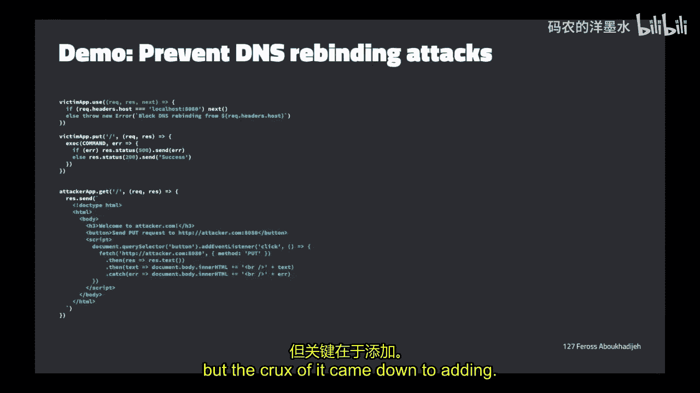

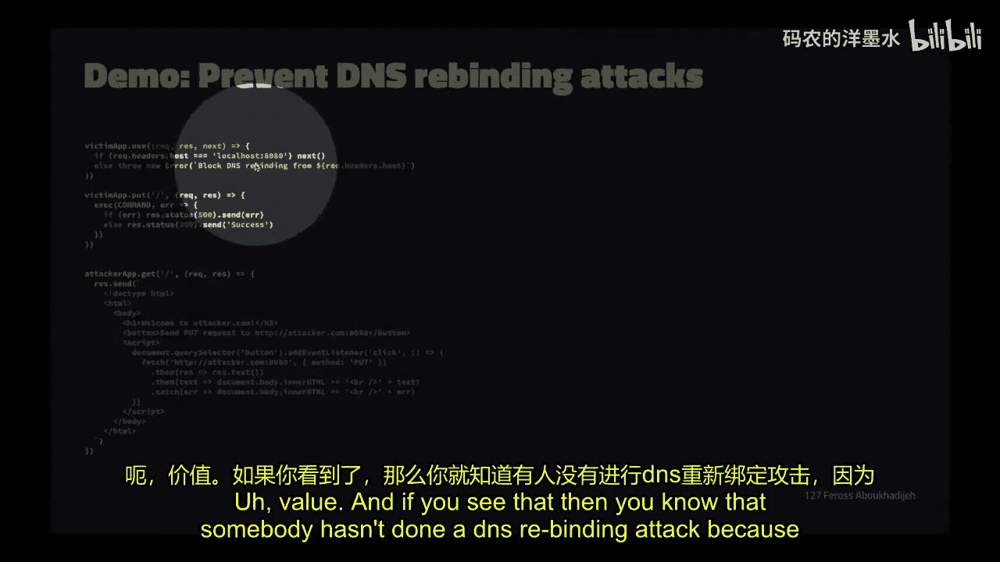

## 概述
在本节课中，我们将学习两个核心主题：现代浏览器的安全架构设计，以及编写安全代码的实用技巧。我们将首先回顾DNS重绑定攻击的防御，然后深入探讨浏览器如何通过进程隔离等机制保护用户，最后总结一系列编写健壮、安全代码的最佳实践。

---

## DNS重绑定攻击回顾与本地服务器安全

上一节我们介绍了DNS重绑定攻击的原理，本节中我们来看看如何防御此类攻击，并探讨本地服务器的一般攻击面。

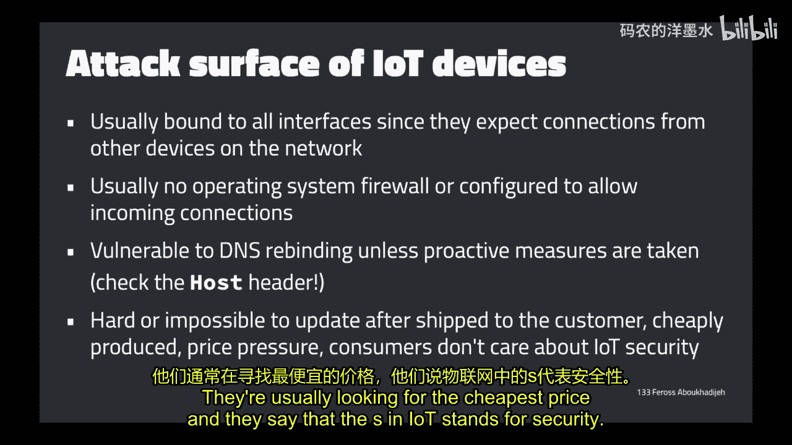

DNS重绑定攻击流程如下：
1.  浏览器导航至攻击者网站（如 `attacker.com`）。
2.  浏览器对 `attacker.com` 进行DNS查询，攻击者DNS记录指向其控制的服务器IP（如 `9.9.9.9`）。
3.  浏览器向该服务器发起HTTP请求并加载返回的页面。
4.  攻击者随后更改其DNS记录，使其指向本地回环地址（如 `127.0.0.1`）。
5.  已加载页面中的代码再次向同一URL发起请求（浏览器认为这是同源请求）。
6.  浏览器再次进行DNS查询，此时获得 `127.0.0.1` 地址，请求被发送至用户本地机器上运行的服务。

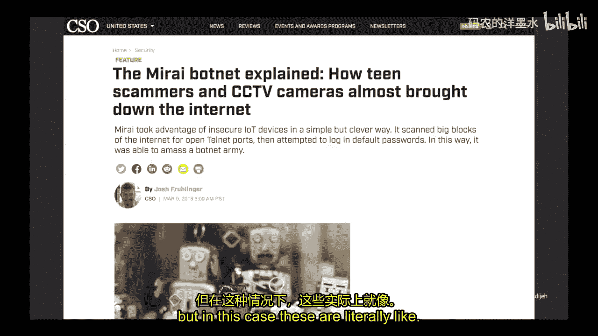

攻击因此得逞。防御的核心在于服务器端检查 `Host` 头部。

```javascript
// 防御DNS重绑定的关键代码：检查Host头部
if (request.headers.host !== 'localhost' && request.headers.host !== '127.0.0.1') {
    // 拒绝请求或关闭连接
    return false;
}
```

如果攻击者成功进行了DNS重绑定，浏览器发送请求时，`Host` 头部仍会是 `attacker.com`，而非 `localhost`。通过检查此头部，服务器可以识别并拒绝此类恶意请求。

接下来，我们探讨本地服务器的一般攻击面。启动本地服务器时，通常将其绑定到本地IP地址（`127.0.0.1`），这可以阻止同一网络内其他机器的连接，从而减少攻击面。

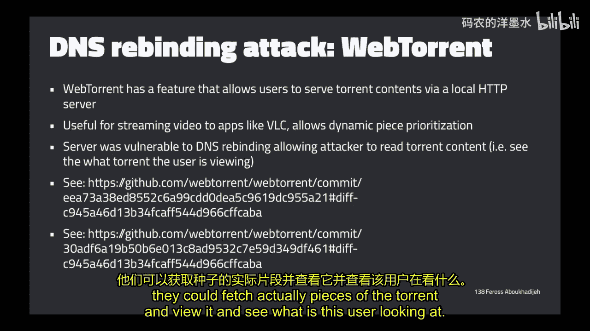

然而，即使忘记绑定或绑定到所有接口，操作系统内置的软件防火墙通常也会默认阻止外部传入连接。但需注意，这些防御措施**无法**抵御DNS重绑定攻击，因为该攻击的请求源自用户本机的浏览器，而非外部网络。

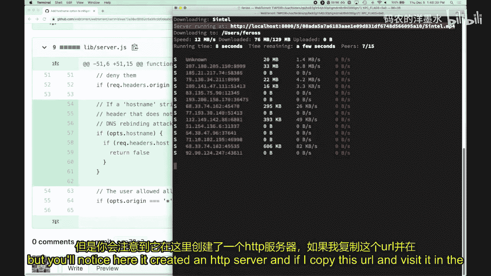

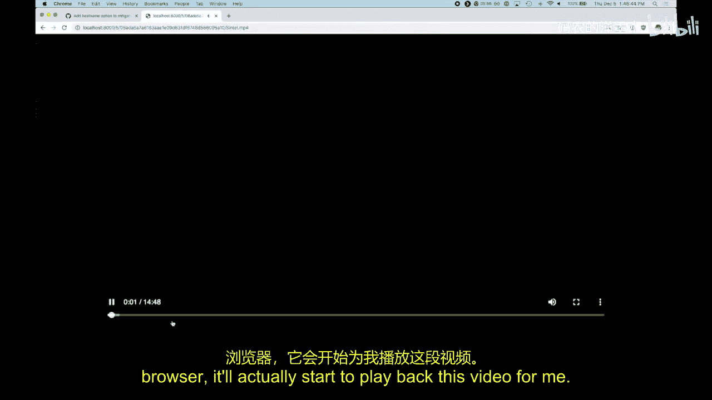

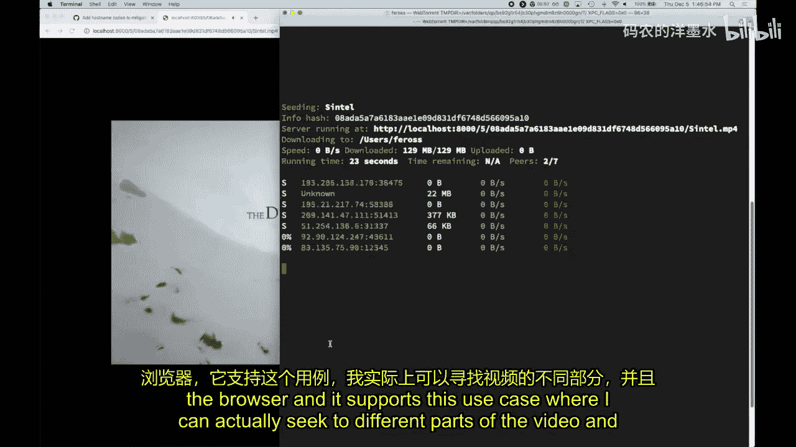


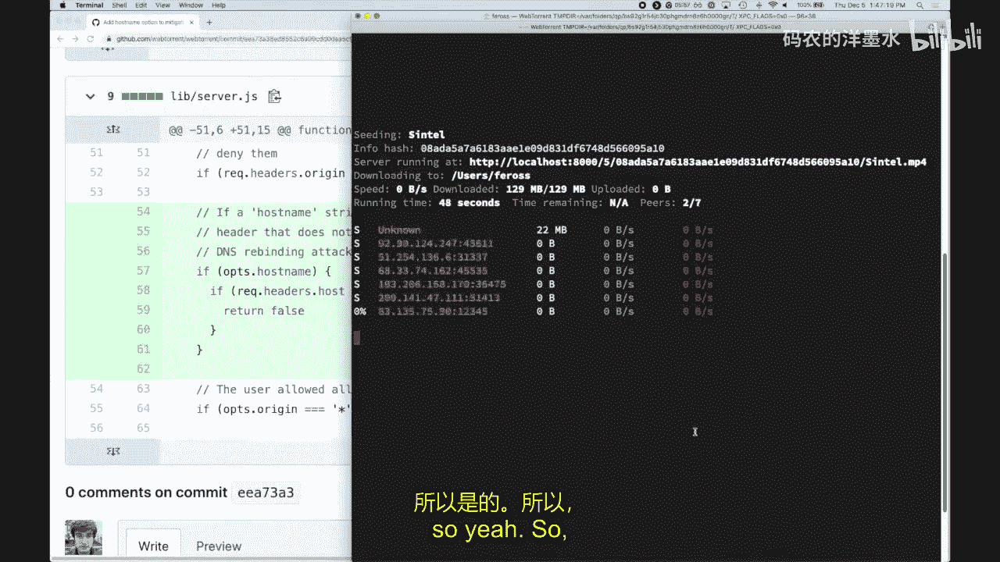

操作系统防火墙（如macOS或Windows的防火墙）主要用于防御网络内其他恶意设备的直接连接，但对于源自本机浏览器的代理式攻击无效。

---

## IoT设备与DNS重绑定的风险

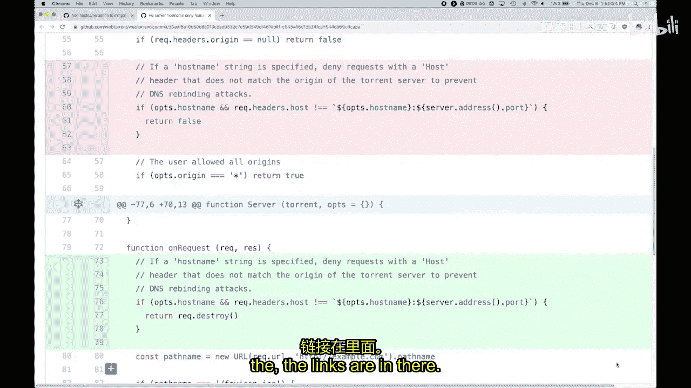

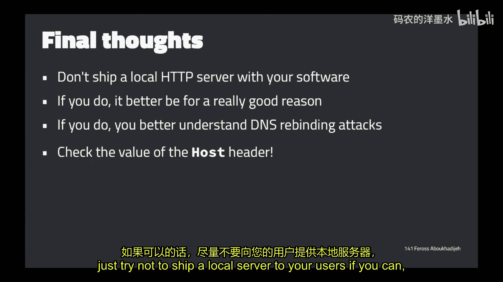

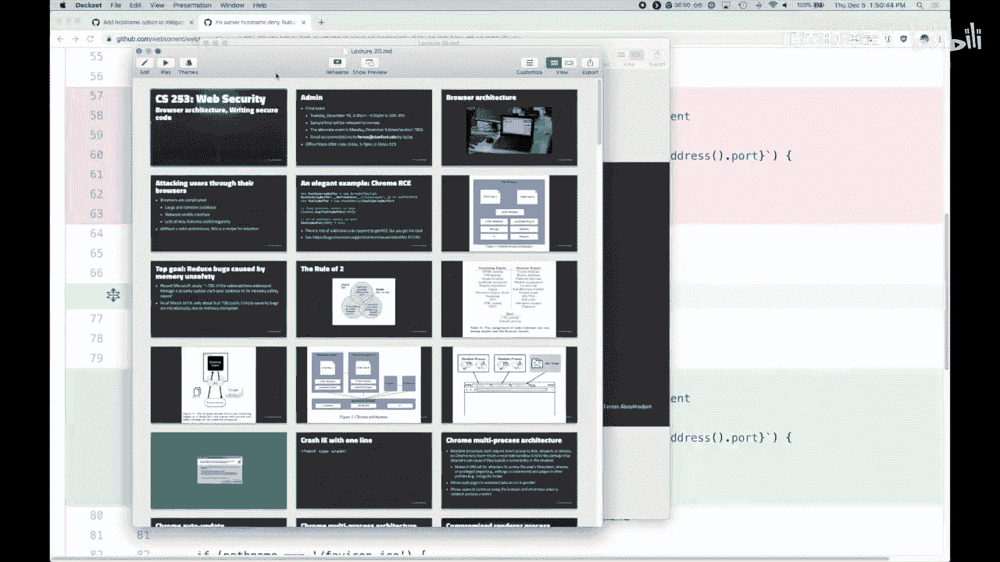

IoT设备（如智能家居设备）通常需要接受同一网络内其他设备的连接，因此其服务器常绑定到所有网络接口，且通常不配置防火墙。这使得它们容易受到攻击。

DNS重绑定攻击对IoT设备的威胁在于，它能将浏览器发起的简单跨域请求（如获取图片）**升级**为浏览器认为的“同源”请求。这使得攻击者可以发起更复杂的请求（如PUT、DELETE方法，或携带特定头部），从而可能打开新的攻击途径。

IoT设备通常难以更新，存在默认密码、安全设计不足等问题，使其成为僵尸网络（如Mirai）的常见目标。攻击者利用这些设备发起大规模分布式拒绝服务攻击。

---

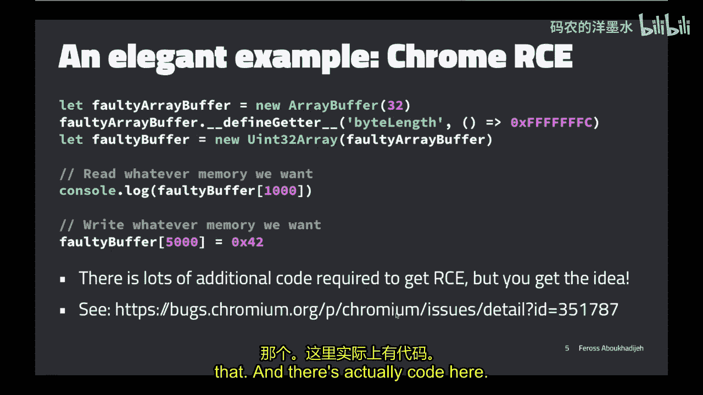

## 真实世界中的DNS重绑定案例

以下是几个因未正确防御DNS重绑定而导致严重安全漏洞的真实案例：

*   **暴雪更新代理**：暴雪游戏附带一个本地HTTP更新代理，用于下载并执行游戏更新。由于未检查`Host`头部，任何网站均可通过DNS重绑定攻击该代理，诱使其下载并执行任意恶意代码，导致远程代码执行。
*   **Transmission BitTorrent客户端**：其用户界面与核心守护进程通过本地HTTP服务器通信。该服务器未防御DNS重绑定，且存在某些端点允许执行shell脚本。攻击者可通过任何网站利用此漏洞在用户计算机上执行命令。
*   **WebTorrent**：同样运行本地HTTP服务器以在浏览器中流式播放种子内容。初始修复尝试因混淆了 `Origin` 和 `Host` 头部而失败。正确修复是将`Host`头部检查置于请求处理的最前端，若不匹配则直接关闭连接。

**重要区分**：`Origin` 头部表示发起请求的页面来源；`Host` 头部表示请求意图访问的服务器。防御DNS重绑定，应检查 `Host` 头部。

---

## 浏览器安全架构

现在，我们转向今天的第一个主要话题：浏览器如何保护用户免受恶意网站侵害，特别是在其自身代码可能存在漏洞的情况下。

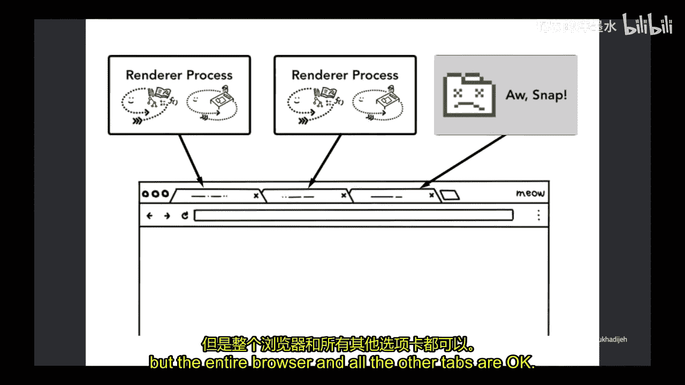


浏览器是极其复杂的软件，代码库庞大，使用C++等不安全语言编写，且直接面向网络接收不可信输入。这使其成为攻击者的主要目标。

传统浏览器架构将所有功能（UI、渲染、网络、插件）置于单个进程中。这意味着，如果攻击者通过漏洞（例如利用JavaScript引擎的缓冲区溢出）控制了该进程，就等同于控制了整个浏览器及其所有权限（如访问用户文件）。

现代浏览器（以Chrome为首）采用了**多进程架构**，核心思想是遵循“二要素法则”：任何代码模块不应同时满足“处理不可信输入”、“用不安全语言编写”和“拥有高权限”这三个条件。

Chrome的解决方案如下：
1.  **浏览器内核进程**：一个高权限进程，负责UI（地址栏、标签页）、网络请求、文件访问和cookie管理。
2.  **渲染器进程**：多个低权限进程（通常每个标签页一个），负责解析HTML、CSS、JavaScript、解码图片等复杂且易受攻击的任务。它们**无法**直接访问网络、磁盘或用户数据。

两个进程间通过严格的**进程间通信**通道协作。渲染器进程需要资源时，必须请求浏览器内核进程代为获取。这样，即使渲染器进程被攻破，攻击者所能造成的损害也受到极大限制。

这种架构还带来了额外好处：单个标签页崩溃不会导致整个浏览器崩溃，提升了稳定性和用户体验。

---

## 站点隔离与跨源读取阻塞

然而，传统的每标签页一个渲染进程的模型仍有不足。一个标签页可能包含来自多个站点的内容（如通过iframe），这些内容会共享同一个渲染进程。如果该进程被完全攻破（绕过同源策略），攻击者可能窃取同一进程中其他站点的数据。

此外，像 **Spectre** 这类CPU侧信道攻击，允许攻击者通过合法的JavaScript代码读取同一进程内其他内存区域的数据。

为应对这些威胁，Chrome引入了**站点隔离**。其核心思想是：**为每个不同的站点（而不仅是每个标签页）分配独立的渲染进程**。

*   浏览器内核进程会标记每个渲染进程所属的站点。
*   渲染进程只能请求和接收与其所属站点相关的数据。如果它请求其他站点的数据（如cookie），浏览器内核进程会拒绝该请求。
*   对于跨域资源（如图片），浏览器内核进程会进行更精细的判断。例如，如果请求一个HTML文档作为图片加载，浏览器会识别其内容类型，并可能拒绝将数据发送给渲染进程，以防止敏感数据进入可能被攻破的进程内存。这项技术称为**跨源读取阻塞**。

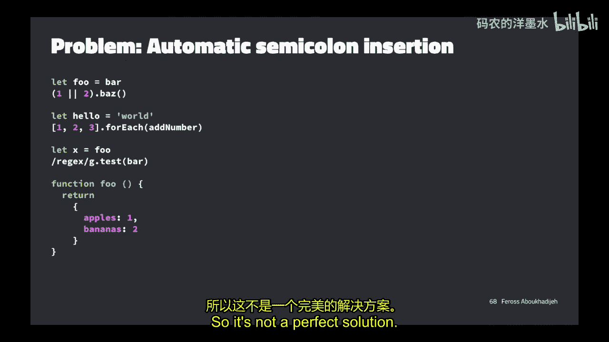

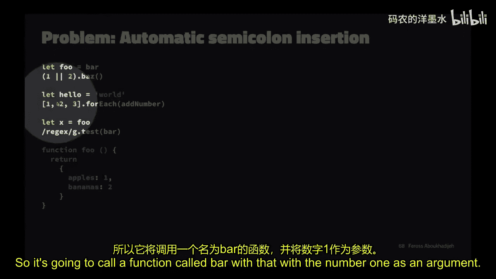

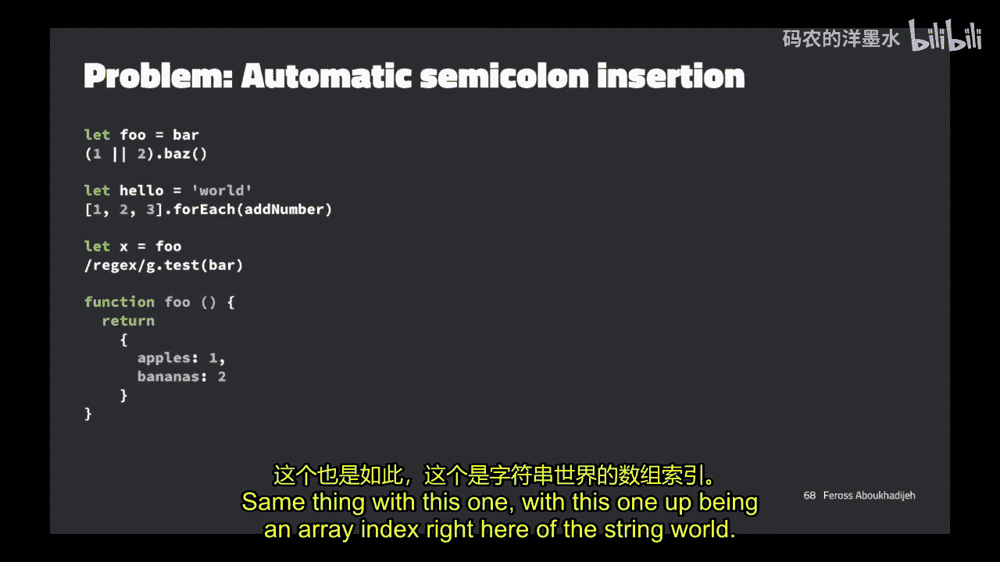

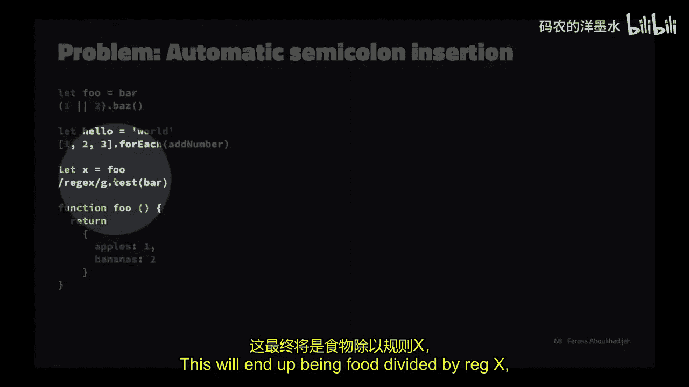

站点隔离极大地增加了攻击者利用Spectre等漏洞窃取跨站点数据的难度。

---

## 编写安全代码的实用技巧

本节中，我们来看看一些编写安全、健壮代码的实用建议，特别是针对JavaScript语言。

JavaScript语言存在一些“坑”，容易导致安全漏洞或难以调试的错误。以下是一些关键点及应对策略：

**1. 使用 `===` 而非 `==`**
`==` 运算符会进行类型转换，可能导致非预期的结果。
```javascript
// 错误示例
0 == '0' // true
0 == [] // true
'0' == [] // false

// 正确做法：始终使用 ===
0 === '0' // false
```
**2. 启用严格模式**
在文件或函数顶部添加 `'use strict';`。这会使JavaScript在更严格的模式下运行，将一些静默错误转为抛出错误，并禁止一些不安全的语法。
```javascript
'use strict';
function foo(a, a) { // 语法错误：重复的参数名
    // ...
}
```
**3. 使用代码检查工具**
使用 **ESLint** 及其配置（如 **standard**）可以在代码运行前自动检测潜在问题，如未声明的变量、不安全的比较、重复的对象键等，并能自动修复部分问题。
```bash
# 使用 standard 检查代码
npx standard
```
**4. 避免自动分号插入的陷阱**
JavaScript的自动分号插入机制可能导致非预期的行为。可靠的解决方案是使用检查工具来捕获相关问题，而不是依赖手动分号。
```javascript
// 可能出错的例子
function getObject() {
    return
    {
        foo: 'bar'
    };
}
// 实际返回 undefined，因为 ASI 在 return 后插入了分号
```
**5. 声明变量时使用 `let` 或 `const`**
忘记使用 `let`/`const`/`var` 声明变量会意外创建全局变量，污染全局作用域。
```javascript
// 错误示例
function foo() {
    x = 5; // 意外全局变量！
}
// 使用严格模式或检查工具可捕获此错误
```
**6. 保持代码简单直白**
可读性优于简洁性。避免使用过于晦涩的语言特性或巧妙的“一行代码”，除非有极其充分的理由。清晰的代码更容易被团队理解和维护，也更容易发现安全漏洞。
```javascript
// 过于巧妙，难以理解
const result = condition && { ...obj, prop: value } || obj;

// 清晰直白的写法
const result = { ...obj };
if (condition) {
    result.prop = value;
}
```
**7. 编写测试**
未经测试的代码很可能存在缺陷。编写全面的测试套件是保证代码质量和安全性的重要手段。

---

## 开源供应链安全

现代软件开发严重依赖开源软件包，这引入了供应链安全风险。主要风险包括：
1.  **意外错误**：维护者无心之失可能引入严重漏洞。
2.  **维护不足**：项目被弃置或缺乏足够资源维护，导致已知漏洞无法及时修复。
3.  **恶意行为**：维护者账号被黑，或项目被恶意接管，在软件包中植入后门。

**案例**：
*   **`bumblebee` 包**：一个安装脚本因空格错误，导致执行 `rm -rf /usr /lib/node_modules/...`，删除了用户的 `/usr` 目录。
*   **`event-stream` 包**：原维护者将发布权限移交后，新维护者针对特定比特币钱包添加了恶意代码，窃取加密货币。
*   **浏览器扩展**：流行的扩展被原作者出售后，新所有者可能注入广告或窃取用户数据。

**应对策略**：意识到依赖风险，定期更新依赖，使用依赖扫描工具，关注所使用关键项目的健康状况。

---

## 课程核心要点总结

在本节课中，我们一起学习了浏览器安全架构和编写安全代码的原则。回顾整个课程，以下是一些贯穿始终的核心安全理念：

*   **像攻击者一样思考**：在设计、编写和审查代码时，始终考虑它可能被如何滥用或破坏。
*   **永不信任用户输入**：对所有输入数据进行严格的验证、过滤和转义。
*   **实施纵深防御**：不依赖单一安全措施，假设某一层防御会失效，并为此做好准备。
*   **提前规划密码安全**：使用加盐哈希（如 `bcrypt`）存储密码。
*   **警惕环境权威**：注意浏览器自动附加Cookie等行为，考虑使用 `SameSite` 等属性进行限制。
*   **避免过度设计**：倾向于编写明确、直白、可读的代码，而非巧妙但晦涩的代码。
*   **让危险代码看起来危险**：对高风险函数使用清晰的命名和文档，将其与安全函数区分开。
*   **保持警惕**：在安全领域，适度的偏执是一种宝贵的资产。

感谢大家本季度的参与，希望这些知识对各位未来的学习和职业生涯有所帮助。


---