# 3800cc(天草)-天草中级班 - P10：第10课 - 白嫖无双 - BV1qx411k7kd

这节课我们讲一下一个比较奇特的破解，解开骗子行径，我们来看一下这个东西，是一个什么外挂制作一个什么东西，垃圾的一个东西，我这里已经找到我的注册码了，但是大家看一下，我的注册码是这个，注册成功。

但是在此启动的时候人员是有，然后呢还可以从另外一个侧面来说明他是一个骗子，我们现在看一下插一下壳，按大家的思路。

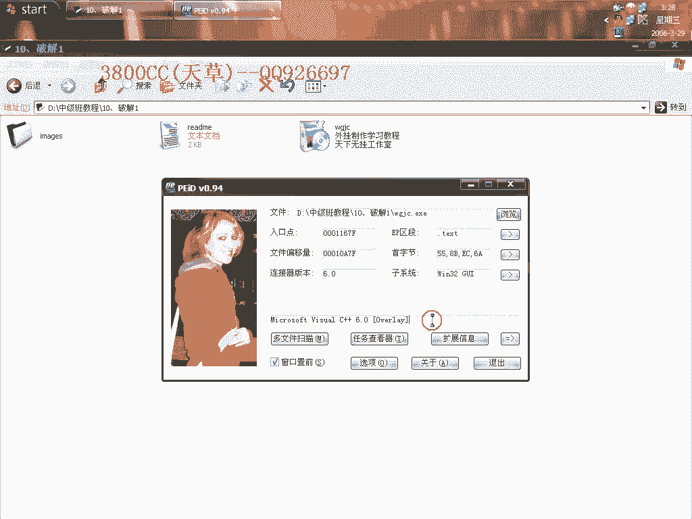

然后我们Odi在录，没有壳，大家可能非常非常高兴。

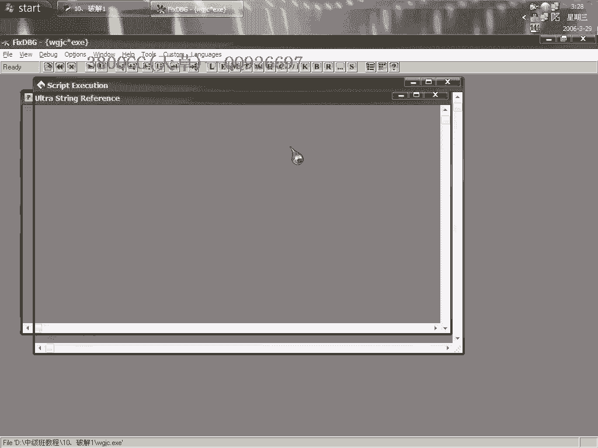

没有壳，还有，输入加码，输入加码，可能会说这样子来找，其实这样是什么都找不到，大家可以来看一下，Odi的，其实这是一个包，这是一个包，真正的程序在这个里面，大家看到，在这个里面，我们把它找到。

在隐藏了隐藏的，Temple，这个里面就是这个了，我们趁他现在还没推出的时候，把它拷贝过来，大家可以看到，那是我退出的话，等一下大家看一下，我退出，把外挂退出来，按道理应该是会自己删掉自己的。

在他这个地方没有删，那我们来看一下，这个才是真正的，我们来看一下是什么壳，这么一个UPS壳，我们就直接用目的插件吧，用PID插件，看行不行，可以运行，我们现在找一下，这个注册码，他的这个注册码。

查一下壳，是Dervi的，但是我们就用DD。

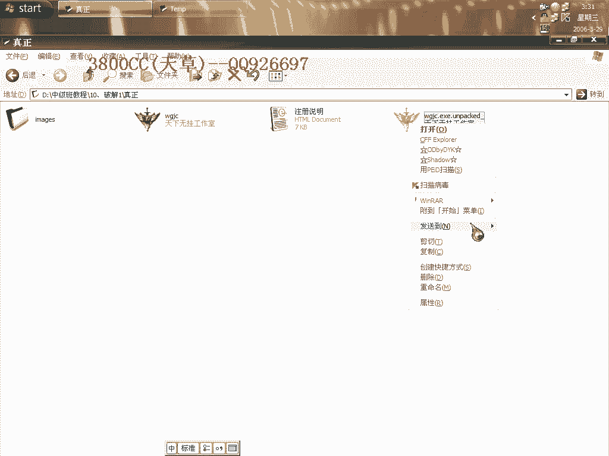

或者用这个OD来试一下吧，还要说一下。

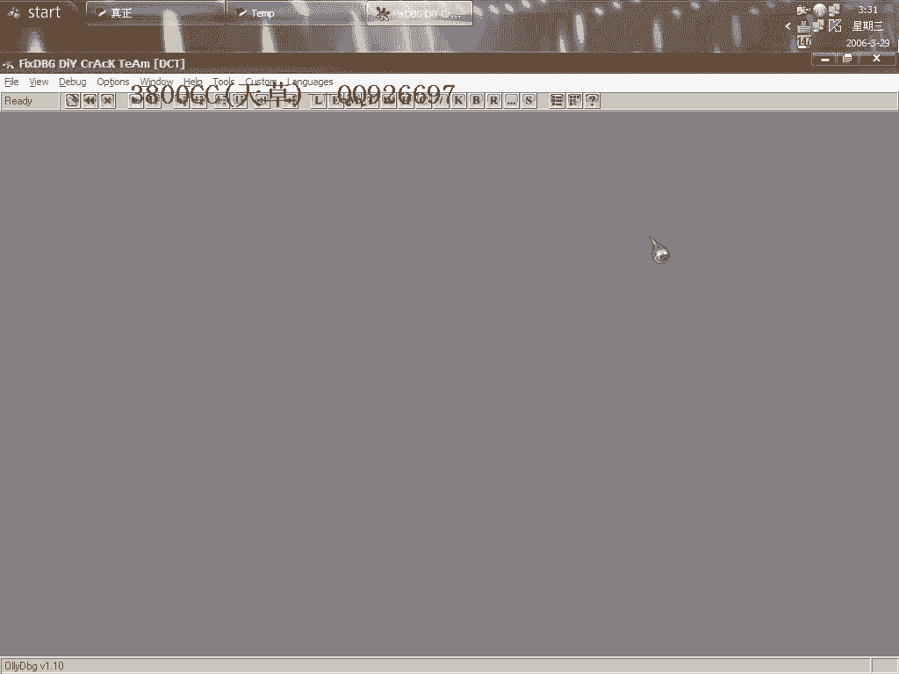

为什么，这是一个程序，原来是一个包呢，你从他启动的时候就可以看得出来，这另外用FI查一下。

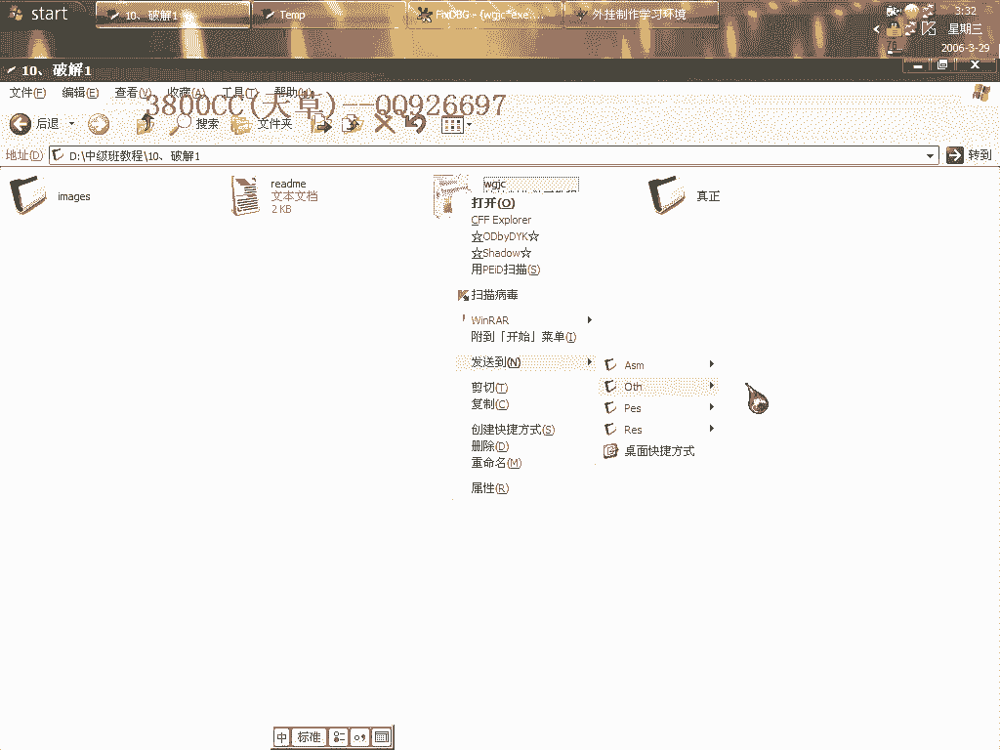

他有一个setup问号，这也是一种提示，说明他是一个安装包。

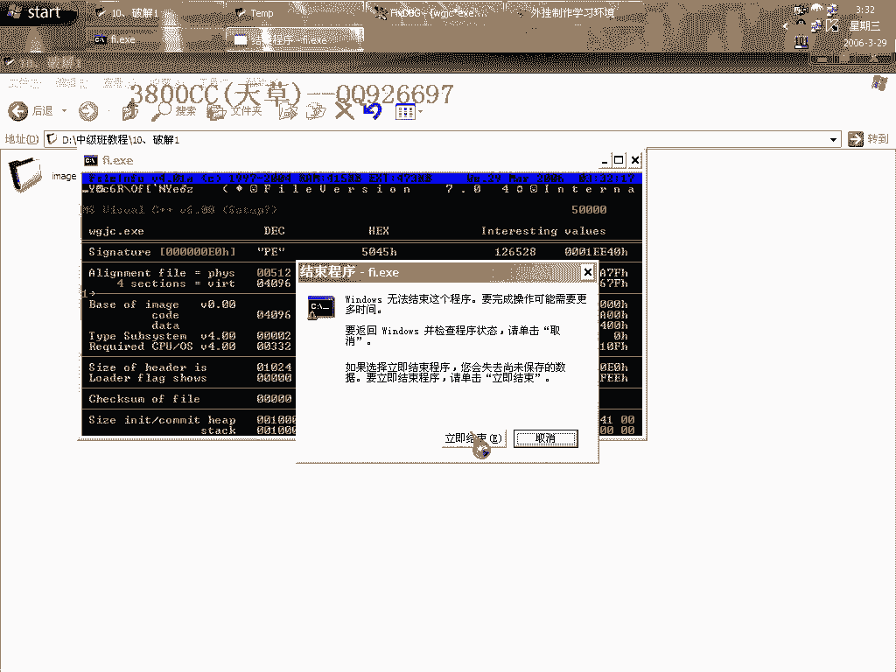

我们稍微加码，大家看清楚，这个时候才能用他。

看一下，这里，放回，他这个好像不行，不行，用F12暂停吧，好像不行，在这里，不行，那我们就用DD来找，他有个注册，看见了吧，F12暂停对单调用这个方法，并不是说是one land。

并不是one land，DD分析有点慢，2。23M，有点大，创建成功，我们来看一下，是这个，在用这个辅助工具来找一下，看一下到底是哪个按钮，有Regisoft的这个窗口。

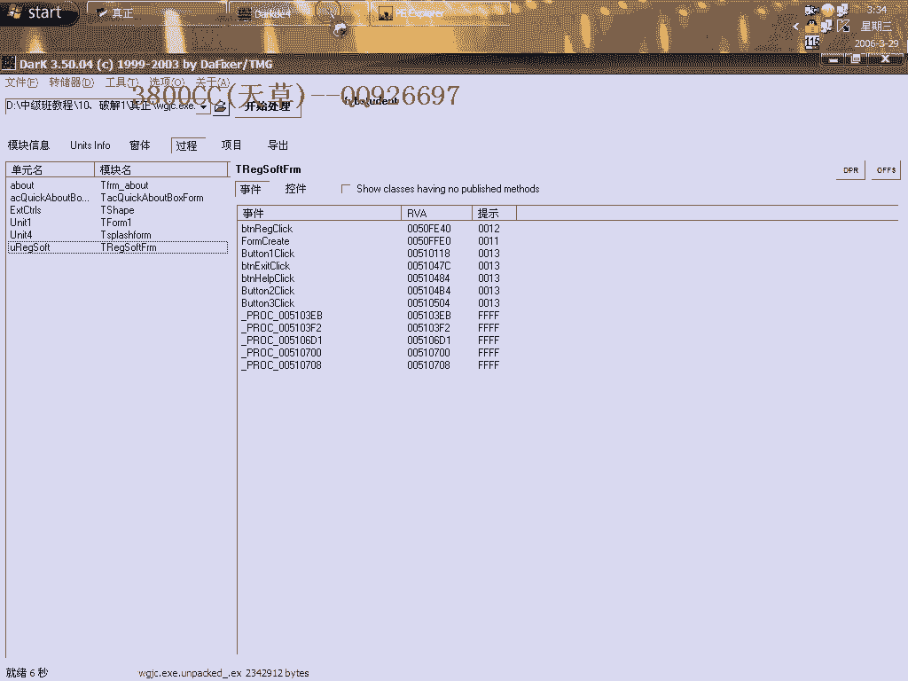

不是这个，这个，注册，BPregi，注册，这个是确定注册，注册，这个，这个就是我们的一个注册按钮了。

看来他好像有反调是功能，我们看看家居到这里来，下好单点，稍微加码，这时候就断下来了，加码，这里是注册码不正确，注册码不正确，这个调整不能调了，这个不能调，这个要调，这里就是一个关键框，我们进去。

大家看到了，这就是我们的一个真正的注册码，好了也就不多找了，不多找了，因为你看一下我这个已经注册过了，就说一天上去他就知道，就保存起来了，他一直都保存这个，提示做总但是呢，还是每次都有啊，非常垃圾。

他竟然就是说啊，骗子行径，骗子行径，那我们就来处理他了，现在停着吧，F12暂停，我们在这个地方下F2断电，这个时候不让他循环了，咱们直接啊，直接找这个端的端位，看是哪一个框调用的，说明是这个框调用的啊。

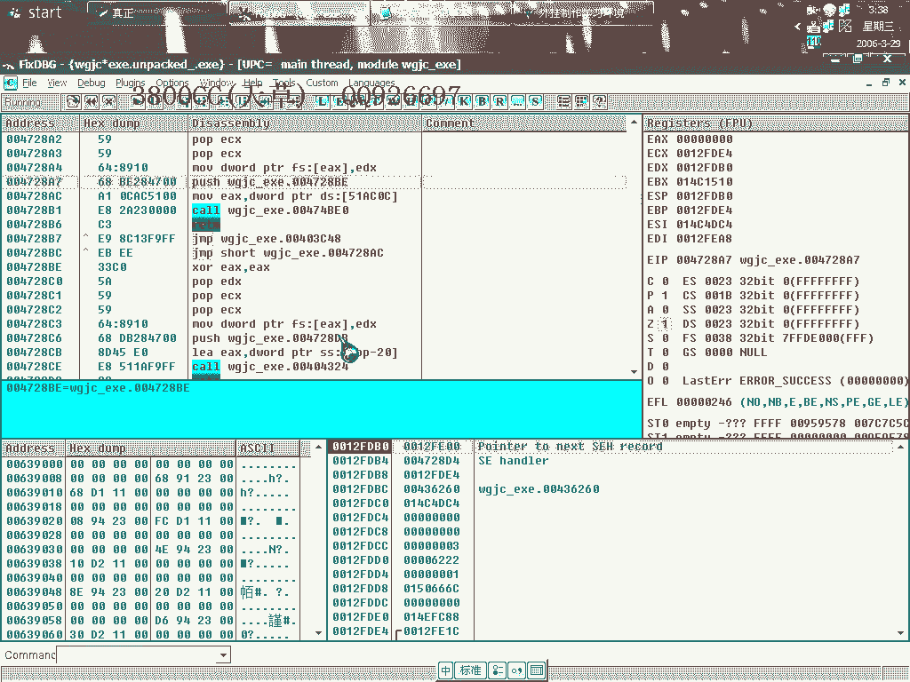

这个框调用的啊，我们把它给录不掉，好。

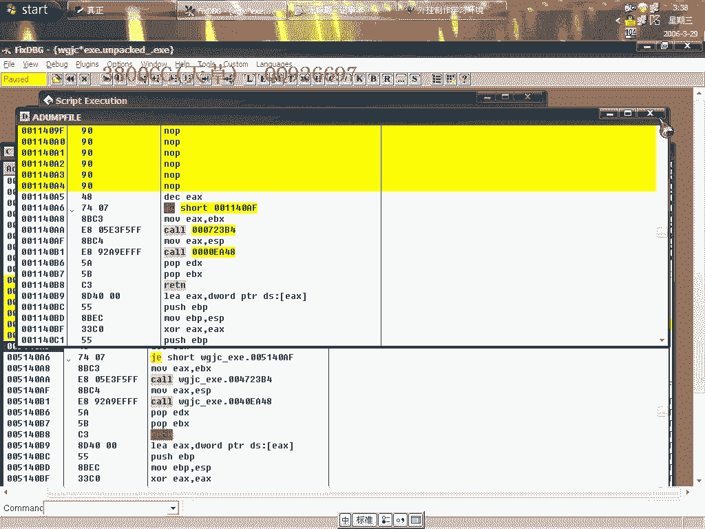

来运行看一下，大家看到了啊。

直接就退出来了，直接就退出来了，那我们在弹幕跟弹幕走一下。

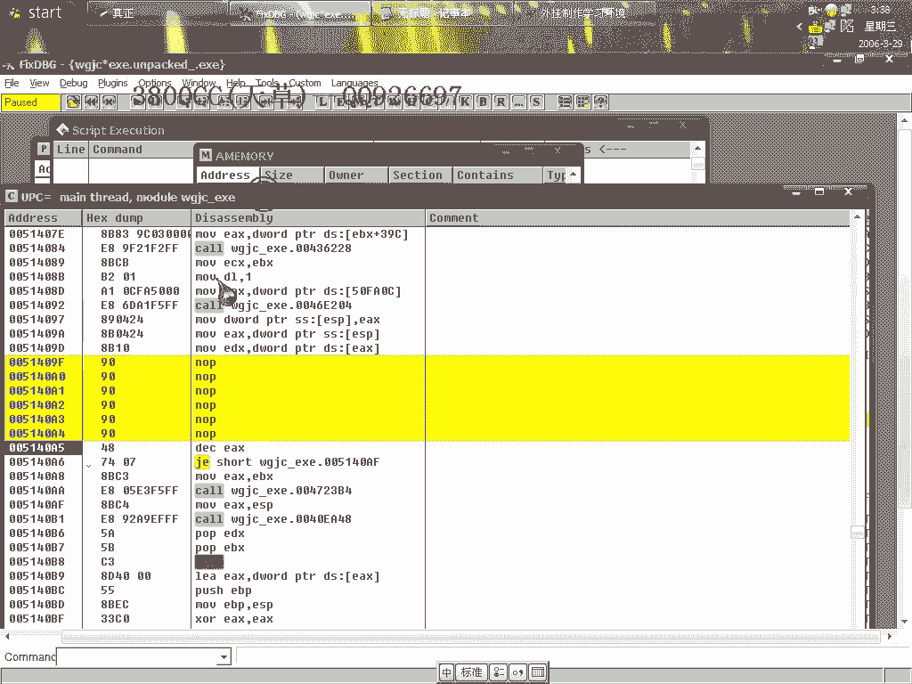

这个跳没有跳啊，因为我们他会在这个地方调用，调用刚才那个call啊，既然就是说我们刚才出现了，直接退出，那说明这个我们把它改掉，看一下，他没有跳的话，我们改成跳，再来看一下，好像还是，出现了，出现了。

大家看挂里面，注册给我了，因为我这个系统的机器名好像就是这个，注册给这是我的机器名，这是我的机器名，再看一下里面内容，没什么实质的东西啊，没什么实质的东西，外挂源嘛，这些东西，就算上面已经有注册给我了。

但他还是这个样子，再加上我照着真正的注册吗，并不能完全完全，并不能注册，不能注册，所以说这个软件是个骗子，软件骗子，再另外我拿这个这个做了个例子，说一下就是，咱们要分清楚啊，是包还是怎么样子的啊。

如果是包的话，他会像他那解压书啊，嗯，让他解，这样解压书，都会在系统的一个Tempo Mood，系统的Tempo Mood里面，把真实的东西解压出来，真实的东西解压出来，像那个007的话。

好像就也是这个样子啊，也会在系统Mood产生一个什么东西啊，这节课就除了说明这个之外啊，这另外就是，像刚才那种启动框啊，怎么去掉，怎么去掉启动框，这节课就这么多内容。

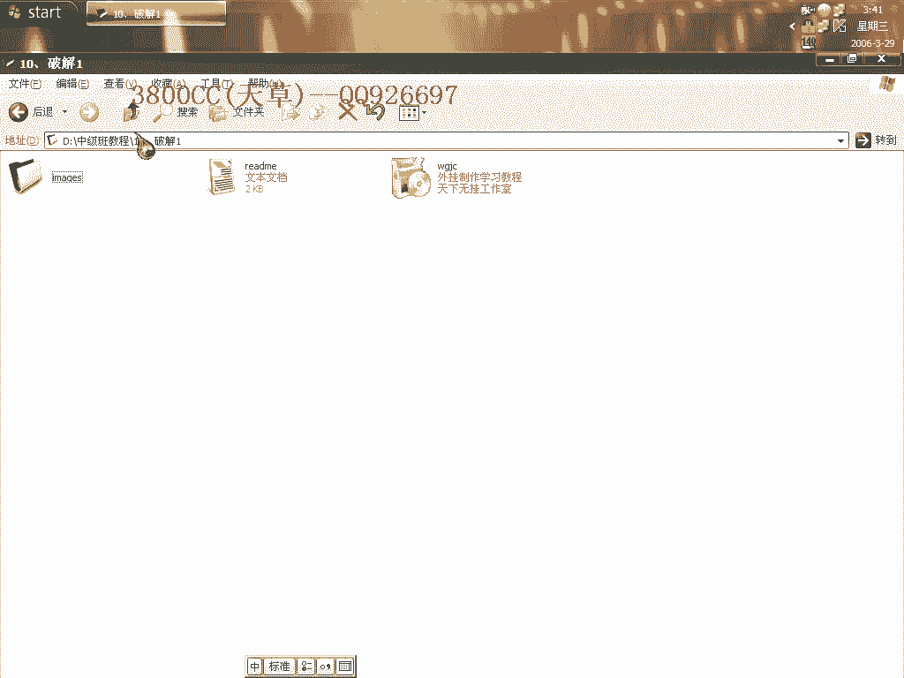