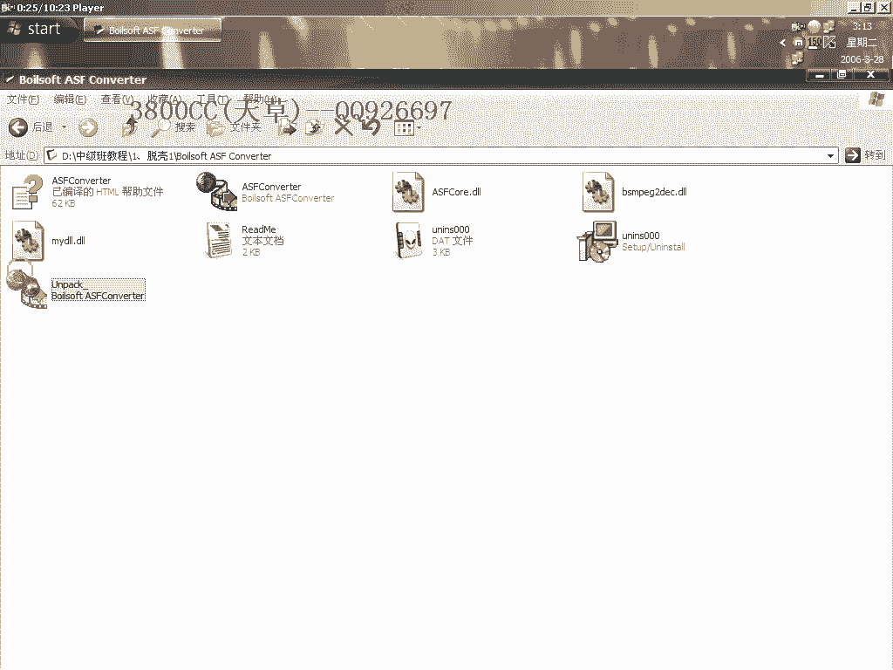
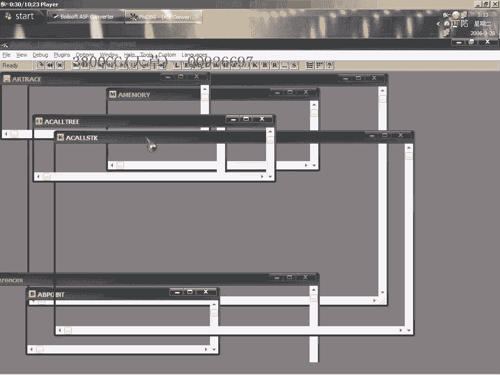
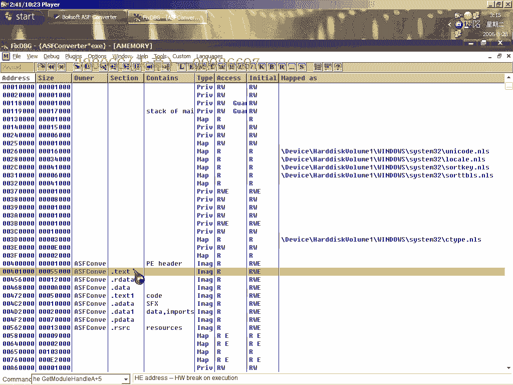

# 3800cc(天草)-天草中级班 - P1：第01课 - 白嫖无双 - BV1qx411k7kd

大家好，現在來進行初級版的第一課，托克，我這裡講的是穿山甲的一個課，穿山甲的一個3。其實這麼高版本的一個課，但是他有一點反調式的功能，這個就是我一個托克號的文件，好。

我們就不多說了，首先呢。

忽略所有異常，然後，先隱藏一下OD，先我這個樣子，注意就是說判斷是標準的還是非標準的，有這麼一個輔助的工具，把這個工具給大家吧，好，怎麼樣來呢，就這樣，好的，大家看到了，這個是一個標準的。

是標準的保護或者是最小保護，因為大家可以，找一下那個家科軟件可以看一下，他有幾種保護，系統還原了沒有裝，好，就說明他是一個標準的，但是首先還要來看一下，再打開它，打開它，我們來看一下，我們來看一下。

這個OD，不用打開它了，大家看到OD載入之後，他只有一個這麼個進程，就說明是單進程的，我們就直接下這個端點，去處理，好，大家看對戰，這是一個快要到麻吉跳的標誌，然後第二個第三個就到了，好。

這個是刪除硬件端點返回，取消，我們這裡有幾種辦法，第二個端點可以就是說，在這裡下端點，但是就是說我們可以來試一下，在這裡下端點看行不行，大家看到了，大家看到了，大家看到了。

他這個debug program was unable，無法調試的異常，說明就是說他已經檢測到我們的一個OD了，那怎麼辦呢，那我們再用另外一種方法，這個就是國外的一些高手喜歡用的第二個端點。

這個在前面也跟大家說過的，好，在這裡，然後呢，用這個端點，我們來看一下這個端點行不行的通，同樣的結果，同樣的結果，那我們現在就需要來，想一下到底是什麼原因，我們還是先到這裡來，我們還是先到這裡來。

把硬件端點給刪掉，把硬件端點給刪掉，這個就是我們的麻吉跳，然後呢，他本身這個又沒有調的，大家看一下這裡就是處理IAT的一個地址，用這麼一個這麼一個IAT地址，來處理的然後他這裡我們這裡。

就是說讓他直接跳過這個跳轉，跳過這裡跳過這裡那我們在這個地方下端點，好，這樣中段下來之後啊，然後呢上面的IAT就處理完了，處理完了我們這個時候啊處理完了之後，我們這個時候需要把這個給改回去。

不改回去的話他就，檢測到他就檢測到我們修改的代碼，好咱們再來看一下下這個端點，好，這個樣子就可以端下來大家看到了吧，這個就是這個的一個技巧而已啊，一個小技巧我們現在返回，但不走。

看到call啊看到一個call，這個計算器的一般是EDX，ECX和EDX啊如果看到這兩個，有這兩個call可以進去的話，看到這兩個call的話就進去啊，大家看一下啊這裡有一個callECX。

這裡也有一個到底是哪個呢咱們當不走，就知道是哪個了這個他跳，過去了我們就讓他跳吧那就是這個了，進去，這裡就是OEP了很明顯的啊，我們這個時候來，脫殼，先糾正一下啊今天大家，要有這個習慣啊不管是脫UPX。

或者其他一個什麼簡單的殼，這個都是要有這個習慣的，現在我們來修復，他這個OEP是312A7，大家看到有14個無效啊，我們在點這個fix dump，修復的時候注意設置一下，這三個都不要選了啊都不要選。

我們再點修啊先是無效的，然後直接把這14個剪掉，好這個時候我們就可以關掉了啊，來看一下啊可以運行的，我們PID來查一下殼，顯示為1。xx到2。xx，這個就是說因為啊穿山甲的一個1。xx到2。xx。

的殼啊他就是把那個路口偽裝成了啊，這個是PID的污包我已經說過了，用FI來查一下，好綠色++的啊，在另外啊破解呢，這個大家可以來看一下，我也不打算講啊，這個是很簡單的。

因為在初級版裡面破解講的非常非常多，他這個是有錯誤提示的啊，The code you have entered is inferior to the code，這個我們也可以來看一下吧。

還算就算是給大家一個提示吧，他這個已經被分析過了啊，我們就不分析了，這裡寫上所有範圍啊，這看到了啊這個沒有啊這個沒有，就是找不到那我們用F12暫停吧，這個我已經下了斷點了。

這裡呢就是一個錯誤提示這個大家自己去找，自己去找啊，大家自己去找這個自己去找了，我也不多說了啊，這個破解很簡單的啊，總不能就是說我每個都講到位啊，這個不可能的，現在因為初級版大家已經接觸到很多破解。

一些大概的一些破解方法，也思路也教給大家了，這個大家不要說我懶啊，這個不是懶，應該是鍛鍊大家了，好吧，好了今天課程就到這啊，這另外啊，另外需要補充一點的啊，因為大家看到了這個體積的問題啊。

原程是1812K，然後Torque後呢是1。11，我們用這個工具，這裡已經弄給大家了啊，就是這裡的SexyHUD，這個我們要對就是說一些區段啊，區段比較了解了，這個啊，選這個HUD和Data。

就是說頭文件和數據全部都刪掉啊，這個也是的，這個也是，這個在黑鷹的一個破解課程裡面啊，有講過的啊，有講過，大家看一下現在是540，可以運行的，減了一半多啊。

就補充這麼一點。