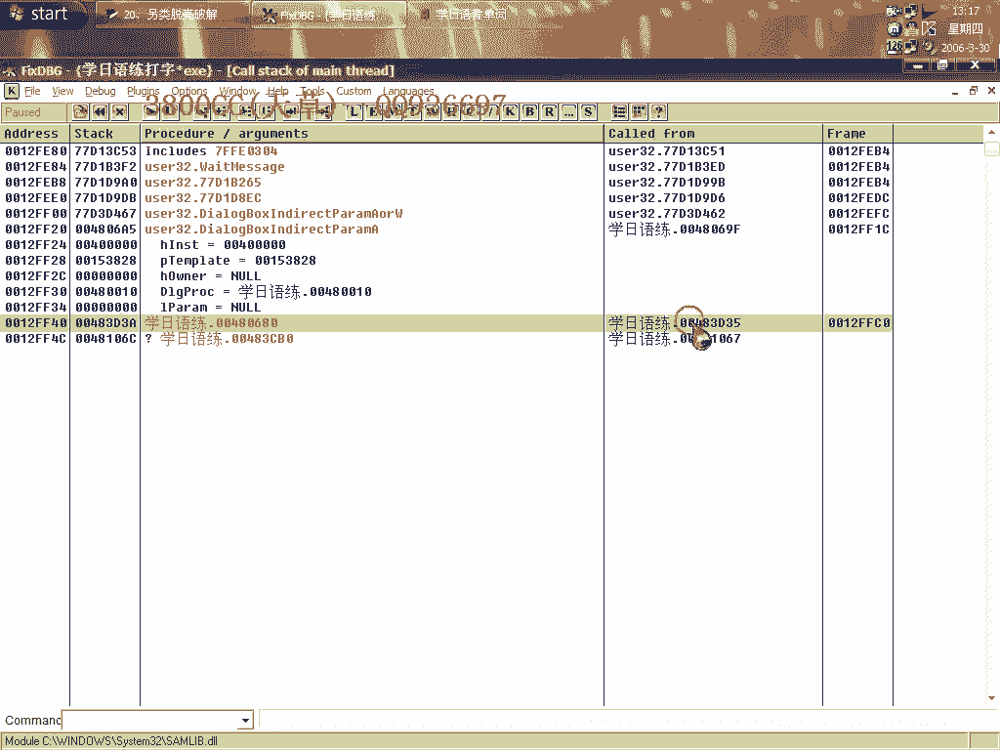
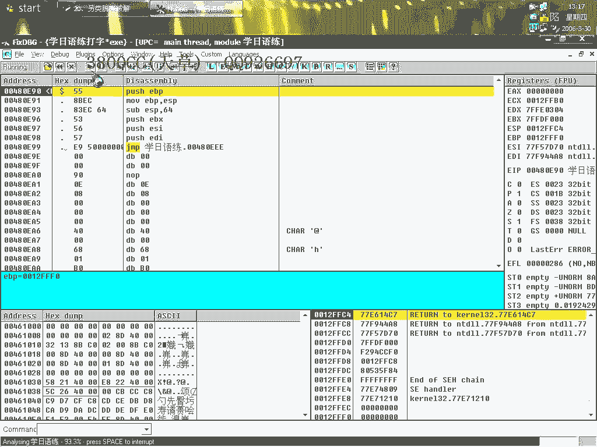
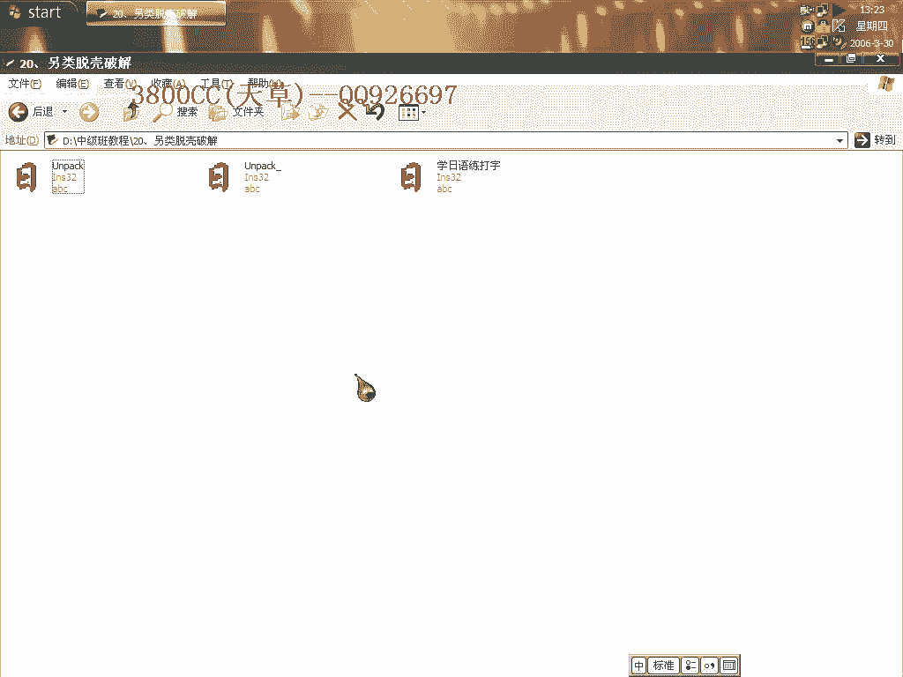

# 3800cc(天草)-天草中级班 - P20：第20课 - 白嫖无双 - BV1qx411k7kd

大家好，这节课呢，就给大家介绍一种另类的脱壳和相当于破解吧，大家先看一下这么一个东西，它要求什么，我要试用啊，试用期已经到了，这里，大家可能会说那用破解吧，那就用破解啊，我们今天来看一下，用另外的方法。

就是这样一个课。

我们来看一下怎么样来弄掉它。

好，先运行，同样，现在就是说用F12对战调用这个方法来节约我们一点时间。

节约我们一点时间，好，我们在这个地方下好断点，我们单步走一下看一下。

这里就调用刚才这么一个试用框，此时呢，我们就F7进去了，在跟踪的时候，大家眼睛要尖，这里呢，也是的，也是的，这个框，好，重新来过，这个框出来了就没办法了，我们让它跳看一下，继续单步走，注意看这些东西啊。

这些东西，看一下后面的一些东西，单步走，大家看到了啊，它这个马上就说这里就退出了，退出了，如果跳了，让它跳了的话，它就退出了，所以这个地方我们不能让它跳，这个地方也是一样的，不能让它跳，它跳了就退出了。

跳到这里来了之后，不管怎么样，它就退出了，那怎么办呢，那这个跳了，这个要是就是说单步走，不管它跳没跳都会退出，到这里之后，我们就进去，都会退出，到这里之后我们就进去，到这里大家看一下。

他这里就会有一个错误提示，什么Fail to run，运行错误，我们不能让他跳，怎么样进去，OK，看一下，很明显这里就是OEP了，这里就是OEP，我们的托克，没有无效的，这样他就自己。

自动把试用框给去掉了。

托克完全，刚才我们是用了对焦用的方法，最后我们用最基本的方法，那就是，单步法来看一下。

单步法就是为了找一些东西，这里了，第一次调试你肯定会把他跑起来，肯定会让他跑起来，第二次调试，就是第一次调试让他跑起来之后，就在这里做一个记录，到第二次的时候，然后再进去就知道了，这一次。

我在下面调试倒是用了不少的时间，这个也是的，跑起来了，我们就进去了，我现在是进去，刚才是通过改调转把他跳过去了，这个现在是过不去了，过不去，通过刚才一个改调转的方法，这个大家，自己看清楚。

就是这个调转了，我们把这个改一下，这样就可以继续走了，看一下，这个不能调，这个不能调，一看这里就知道，当然你第一次调试的时候，你就不知道这个地方不能让他跳了，这个地方也不能调，已经跳过来了没办法了。

直接退出了，这个方法比较奇特，就是说不知道他的应用范围广不广泛，当然就是说，我做这节课的目的就是说，给大家打通一下思路，有些东西还是要靠自己脑袋去想，靠自己脑袋去想，今天这个课程也就这么多。

