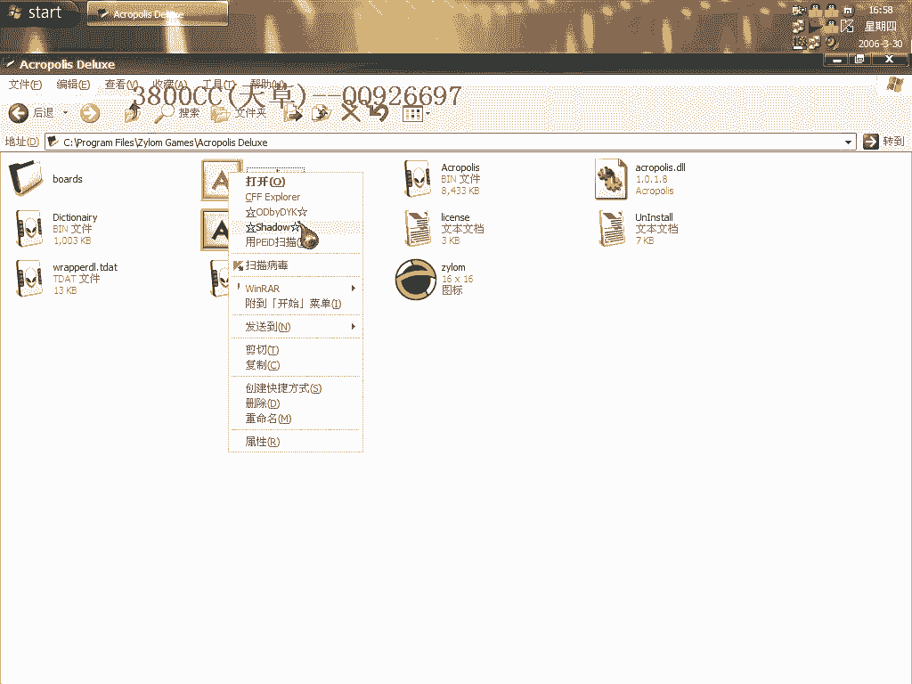

# 3800cc(天草)-天草中级班 - P22：第22课 - 白嫖无双 - BV1qx411k7kd

立刻我们来讲一下一个Lineage的破解，这是一个小游戏，国外的一个小游戏，我们先来看一下运行一下，这里需要，这个是启动游戏，然后呢，它这里有一个时间限制，就是说。

You can play for 59，59，More Minitors in the trial version，就是这个试用版，你还可以玩，59分钟，我们这样看一下，然后呢，我们这个时候。

细心的时候，你就会发现，你就会发现，你看一下，这个里面，程序载入之后，这里面有一个DLL，有一个DLL，也就是说，这个是非常非常明显的，非常非常明显的，我们来看一下，把这个结束掉，但是游戏还在。

这说明这个游戏，主要部分，是这个DLL，这个EXE程序呢，只是一个外壳而已，大家再从这个大小上也可以分得清楚，这个是，396K的，这个EXE程序，这个DLL是700多的，那我们来怎么办，像这一类程序。

我们可以这个样子，大家看我的，它这里有一个，看一下，先测OD的功能。

没有，OD载入。

没有，我们现在要做的呢，就是说，让程序运行起来，并且，让这个DLL，把所有的资源都释放出来，那就需要用到这个，这个断点，这个断点，什么意思，我们来查一下MSDN，这个在前面，杰克里面，有说过的，点缩影。

缩落，就可以显示了，大家这里自己可以看，我们来，下断点，修的加F9，现在这个外壳出现了，因为这个是EXE程序，外壳出现了，开始游戏，大家看一下，看一下，EX里面，EX唯一，我们现在shift加F9。

运行一下，好，EX变过0，再运行一下，EX不变，再运行一下，大家看我这个鼠标，就说明，程序已经完全解码了，好，我们这个时候打开，到PE了，选择这个，DLL，选DLL，完整托克，但是我们这个后缀要改一下。

改成EXE，好，这个时候，我们把这个，精神里面的，这个结束掉，精神里面的结束掉，它已经插入精神了，现在我们来载入，我们这个刚才，当跑出来的一个程序，大家看一下，可以弹幕走一下，大家看一下这个。

Subject，这是我们刚才查那个，刚才查那个的，查这个的，大家可以看一下，它也用到了这个，用到了这个，现在它开始用到这个了，看我们的，这里程序开始运行，我们看一下，大家可以这个样子，进去。

这里是调向OEP了，我们就从这里开始了，把这个Copy下来，我们现在用到LodPE，把这个打开吧，看一下，看一下有没有我们的一个进程，没有啊，这个进程还在里面，没有进程，我们现在帮它打开它，这个呢。

我们改成，0040，就是刚才那个，电保存，然后重建，在重建之前，我们这个选项里面，只能保留这个验证，PE这个选项，好，程序，我们现在把这个，程序运行不了，这个时候我们就要找原因了，找原因了。

我们来载入看一下，直接运行看一下，运行不了，我们这个时候重新来过，重新来过，把这个删掉，不好意思啊，还是下这个断电，我们来看一下，这里呢，我们要三次Shift+F9，一次，两次，三次。

三次Shift+F9，这个时候，它才开始解码完成，看一下，好，现在呢，我们记得刚才那个OEP了，记得了吧，把这个给结束掉，还是打开它，80，LC，保存，还是不能运行，这个就有点奇怪了，有点奇怪了。

查一下OD。

它可能有那个反调式的功能，好，好，终端下来了，Shift+F9，一次，两次，三次，三次，关于这个几次啊，几次，通过调试，通过我调试跟踪才发现，跟踪发现，这个啊，Copy一下，这里有一个DLL了，删掉。

好，保存，PID查一下，非有效的PID，我们来验证一下，为什么拖了之后是非有效的呢，这个就是一个奇怪的问题了，我们用那个换一个PID试一下，PID试一下，好，直接来运行，一次，两次，三次，三次，看一下。

这个，我们来完成脱壳，我们把这个也脱一下，看看到底是哪里的问题，现在才出现这么一个鬼东西，才没有显示了，好，LC，这个大家记得了，把这个也给删掉，看一下，看一下，现在可以了，这个问题，到底是什么问题。

刚才大家在，等一下还是来走一遍，看一下，现在没有那个，要注册的那个框了，没有这么一个启动框了，没有这个启动框了，刚才脱的为什么有问题，我们再来脱一下，再来试一下，看下到底是哪里的问题。

还是用那个PID的，它这个有OD的一个，反调式功能，好，修到+F9，一次，两次，三次，等一下，等一下再，看能不能成功，用PID查一下就知道能不能成功了，这没有显示是有飞那个的，应该可以成功。

我们来看一下，把这个给关掉，这个又不行了，又不行，大家脱的时候，用那个LODPE来脱一下，我这个是PIDPAN的，有点不同，跟这个有点不同，用这个试一下，用它的这个，我这个有点问题。

不要用PIDPAN的，刚才我们再来看一下，为什么是，中断下来之后三次，我们来看一下第四次会是怎么样一种情况，中断之后的那一次不算，中断之后这一次不算，一次，两次，三次，四次，大家看到第四次就运行起来了。

所以还是用第三次，用第三次，我们再来看一下，我们用这个断点来看一下，中断下来了，但是接下来一次，这个会跑起来，我们的结果不是要让它跑起来，好，把这个给关掉，这个也关掉，我们来看一下这个断点的效果。

这个断点好像不太行，大家下去的时候，用这个断点也试一下，刚才用那个断点也出现这种情况，试一下，这两个断点都应该还可以的，刚才查那个MSDN的时候。

上面就说这两个断点都差不多，好了，今天这个教程就到这，再见，如果不成功的话多试几次，再见。