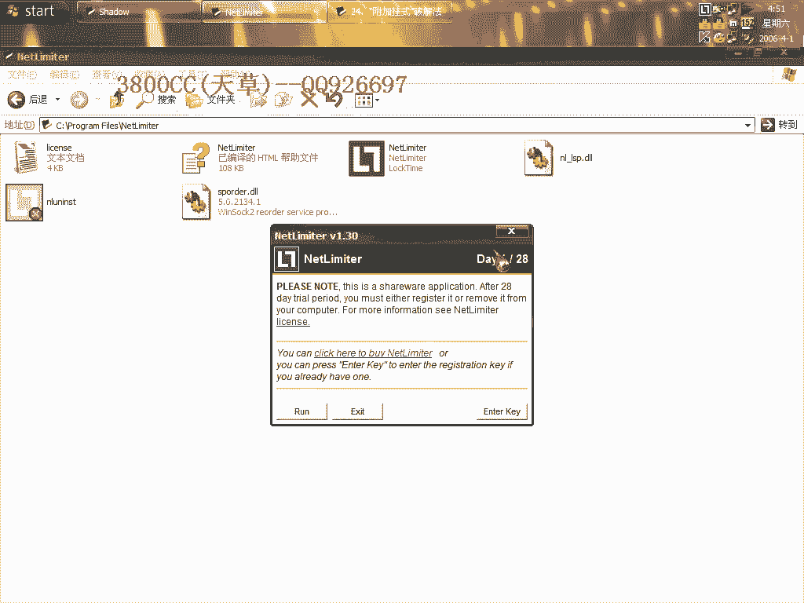
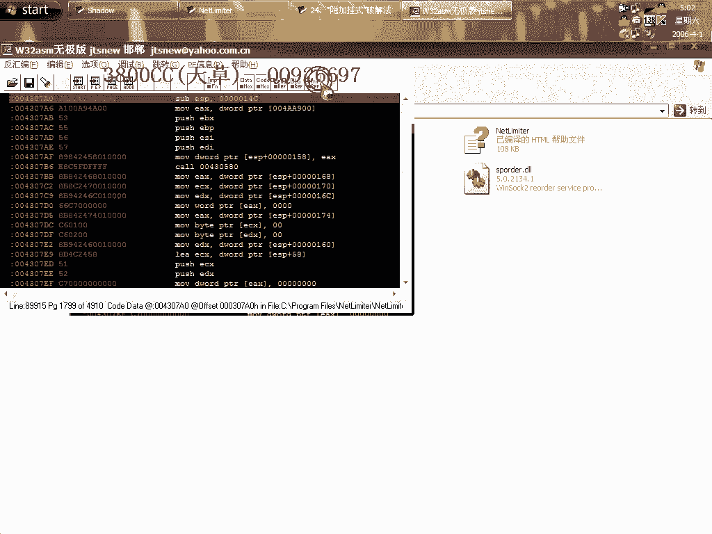
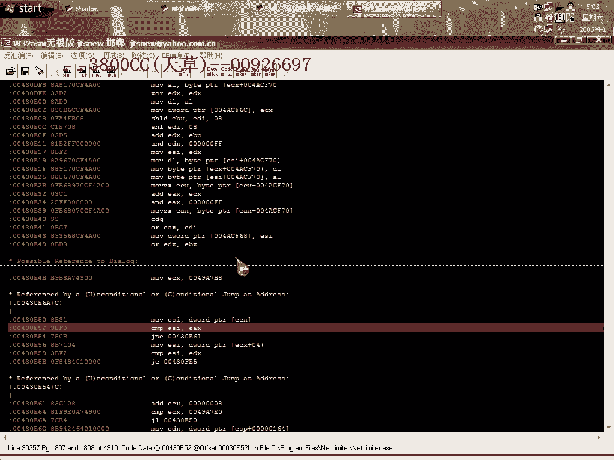

# 3800cc(天草)-天草中级班 - P24：第24课 - 白嫖无双 - BV1qx411k7kd

大家好，今天講一節破解吧，這個破解方法叫做，我取了一個名字叫做附加掛式，這個方法是我一時，錯誤操作，我一時錯誤操作然後想到的一種方法，是這麼一個軟件，沒有殼的，大家看到了，它這個在。

這個任務欄裡面有一個，我就是這樣，然後任務欄裡面有一個然後再載入，在運行發現程序就無故退出，發現無故退出，我就是這樣一個錯誤操作，當然，我們今天首先要找，為了達到一個講課的效果，為了達到一個講課的效果。

我們就這個樣子，就這個樣子先打開一個，進程裡面這樣就有了，這樣就導致我們用OD直接運行不了，運行不了，好，那我們先這個樣子。

先OD載入。

先OD載入，運行一下，註冊一下，有這麼一個錯誤提示，我們首先當然還是，還是找一個要找關鍵的，一個東西一些關鍵的東西，找不到啊，怎麼，唔！唉！找不到啊，怎麼，唔！這裏有個Register Queue啊。

唔！好，分析一下，唔！看他不出來的，好！找不到，怎麼找不到？重新來過，我這個第一次找到了的，為什麼突然找不到我就不太清楚了，這裏有，我的Venue搜索錯了，好，上機進去，大家看到了啊，這個地方。

他這裏有一個跳轉，就是說肯定這個跳轉沒有實現，那上面有一個跳轉肯定跳過來了，那就是這個跳轉了，所以我們在這個地方寫好端底，當然這是我們找的一個關鍵了，把這個記錄下來，大家再看一下啊，再看一下。

這裏要求啊，要求就是AL，要是等於0的話就跳，那也就是說我們要達到破解的目的就是讓AL不等於0，我們就把它收為1，那有的朋友可能會說，我這裏直接把它改掉不行嗎？我們可以來看一下。

直接把它改掉看一下行不行，註冊一下看一下，是不行的，看到了吧，為什麼啊，為什麼，就是因為這個軟件他有兩次校驗，就是說都會檢測到這個地方，就是說第一次檢驗的時候，這個地方就跳了，跳了呢，然後就顯示無效。

但是如果你把這裏改成jump，第二次檢驗的時候，這個地方又沒有跳，但是你把它改成jump，所以就跳了，這個是我發現，我跟蹤的時候發現，這個地方是有兩次校驗，我們在這個地方，把這個地方記錄好，現在呢。

來使用我們今天的目的，附加掛飾，任務欄上面就有一個了，同時我們再打開一個，還是他，這個時候，我們來附加進程，附加這個進程，就這麼一個進程，在附加的時候，會有這麼幾個錯誤提示，不用管他，OD呢。

看這個樣子好像是程序退出的那種情況，其實不是，大家看一下下面，已經中斷了，中斷在ntdll這個裏面，我們到這個地方，下好斷點，然後呢，f9運行，最後來點OK，這樣就中斷下來了，好，我們進去。

直接到最後面，這些其實都是算法，算法我們不用管了，找到斷位，這裡就是斷位了，大家看一下，這裡，X，不是，E和AL和ER一會，如果就說，AL等於0的話，就不行，但是他這裡一和了，那我們這裡怎麼辦呢。

把它改成，ER，我們把這個，複製一份，這是第一種改法，看一下行不行，然後呢，第二種改法，我們看一下行不行，move，ER，把E給ER，當然有的朋友可能會說，那我們就說，直接改這個地方不行嗎。

為什麼要用這種外掛的方法呢，因為現在我遇到有一些程序，就是這種，用OD直接跑不起來，所以用這種外掛的方法，當然這是一種思路，但今天這個軟件正常是可以在OD下面跑下來的，但是我今天首先，就是說。

進程裡面有這麼一個程序，然後呢，再用OD載入讓他跑，當然這樣就跑不起來，這樣做是為了達到今天的一個課程的效果，當然這也是我開始的時候疏忽，沒有發現進程裡面本身就運行了有這麼一個東西，我們來直接運行。

註冊成功了，我們現在來運行看一下，第一個註冊成功，看第二種，也是註冊成功了，這是原程序，原先的，把它退出來，這些都註冊成功了的，這個破解的手法就是那兩種，把這個改成相反的，或者是，move，直接給你。

就是這種，就是這樣的，好了，今天這個內容就這麼多，大家下去自己試的時候，首先運行一個，關掉，但是看一下任務欄上面還有啊，這個時候我們再用OD來跑，OD來打開，這樣跑是跑不起來的，看到，直接就退出。

跑不起來的，這樣我們就不管怎麼樣註冊啊，我們看一下斷點還在吧，你看一下，不管怎麼樣，在OD裡面中斷不下來，我們就這樣啊，動態調試就調試不了，當然剛才大家可以用靜態調試的方法，直接找到了一個關鍵的地方。

比如說用它了，用它，查找支付寸啊，搜索，看到沒有，它這個查不到什麼支付寸啊，查不到什麼支付寸，那我們到我們剛才那個關鍵的地方啊，關鍵的地方在哪。

我們在載入看一下。

在這個地方吧，就是說你可以找到這個地方吧，然後進去嘛。

然後呢，往下面看嘛，當然也可以用，這個是靜態的方法嘛，靜態的方法，往下面走，這些都是算法，靜態和動態最大的一個區別就是靜態的不夠直觀，這很多就達不到我們一種破解效果，因為畢竟啊，你要是動態跟蹤的話。

這樣你就知道一些動態的數據啊，你可以就這樣啊，用一個靜態的方法去弄。

當然這個方法不推薦啊，好了，今天這個課程就到這，大家自己下去練習的時候啊，練習的時候先開一個啊，現在打開，看一下，現在打開然後關掉它，任務欄上面還有，然後你再用這種方法去破解，這是一種思路啊。

有很多程序在OD下面是跑不起來的，今天课程到这儿，再见！再见。

