# 3800cc(天草)-天草中级班 - P27：第27课 - 白嫖无双 - BV1qx411k7kd

现在来做我们的第27课，这个也是我们的倒数第二节课，第28课是终极版的一个总结课，这几个脱课，是脱两种课，当然这个SVKP呢，也只是一个，当一个总结吧，一个总结，复习总结，这个课，现在就是说有些程序。

见得不多，见得不多，但是也是一个算是比较强的课，好，我们先来看这个，先忽略所有一场。

重新载入一下，然后呢，隐藏一下，OD，好，单步走，我们用ESP几率，F9有点新，它这个有些问题，Shift+F9，这个有问题，我们用另外一个，F9运行，这个是出现了，好，我们点试，中断下来，大家看到。

看到那个OD下方提示有这么一个异常，大家把这个异常添加进去，经常就是说碰到一些异常，大家把它添加进去，就可以了，这是一个非常基础的一个姿势，Shift+F9，这个就中断下来了。

刚才我的这个地方是已经把这个异常添加进去了之后，添加进去了，这个，你在第一次调试的时候也会出现这么一个异常，这个异常会出，下面这个007这个异常会出现两到三次，直接Shift+F9让它中断下来就可以了。

好，就会停到这里了，这个时候我们删除硬件端点，然后L7进去。

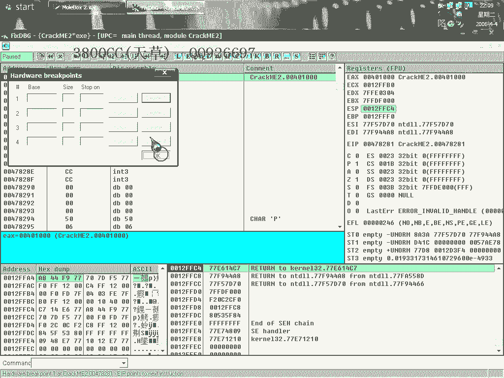

删除一下，然后分析一下，这个就是我们的一个OEP了，大家看这个Look特征就是会变的，好，调整一下大小，现在托克好了，我们现在怎么样找，就是来找IAT了，我们Ctrl+B，FF25。

FF25是IAT的一个起始，这个样子，大家看到了，但是大家看到，FF25就是一个IAT的一个标志，FF15是，就是说IAT有两种形式，一个是加模型的，我们现在看到的是加模型的，然后还有一个靠型的。

在S-Protect这个壳的时候，这个壳它会分两种类型，它会把这个变为加模型或者是靠型，当然你在加密的时候可以选，我们现在看到这里有两个，这两个还没有识别出来，就说明这两个被加密了。

我们现在来修复看一下，Size呢，因为这是一个很小的Crammy，所以它的IAT只有这么一点，大家看到，有这么两个。

一个是402010，也就是说它是2010，就是这一个，然后20011就是20011，就是这一个了。

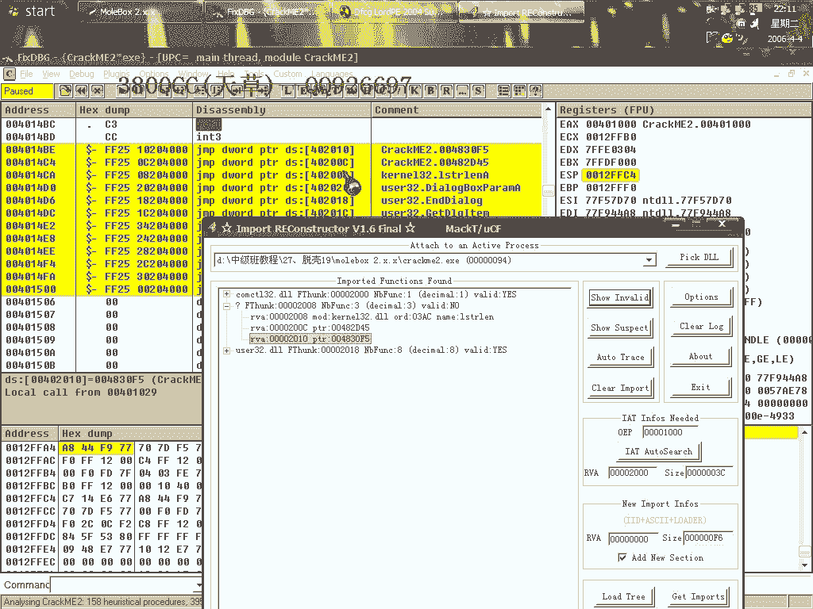

我们用等级1来修复看一下是否可行，但它修复的是这一种，大家一看就不行，我们来抓取一下就知道行不行。

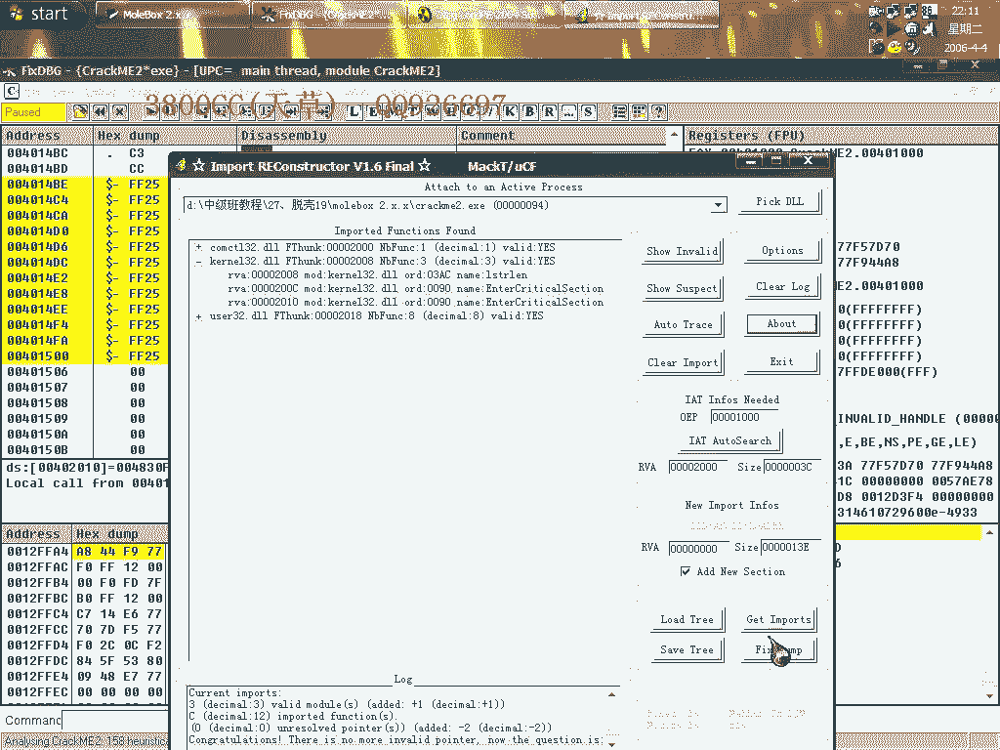

明显不行的，这个就是修复不成功的，我们现在需要把这两行记下来。

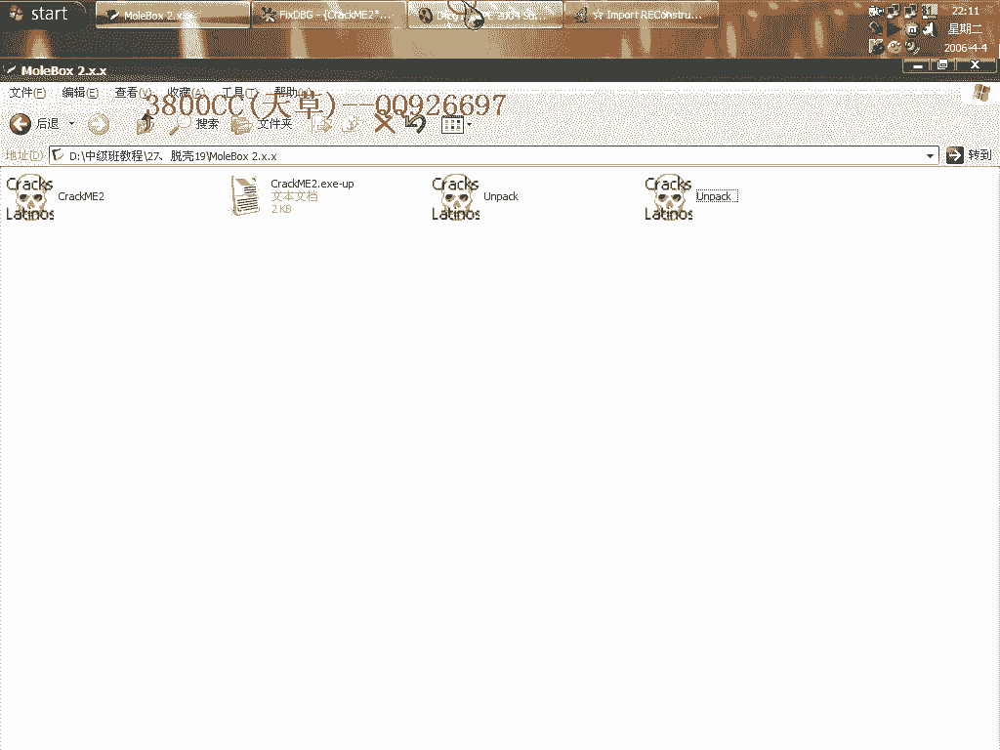

这个是手动查找IAT的一种方法，就是说在以前那种托克方法不怎么先进，因为每一种托克方法都是慢慢改进慢慢研究出来的，大家看清楚是重新载入，然后滴滴，最后呢，像Write这个端点。

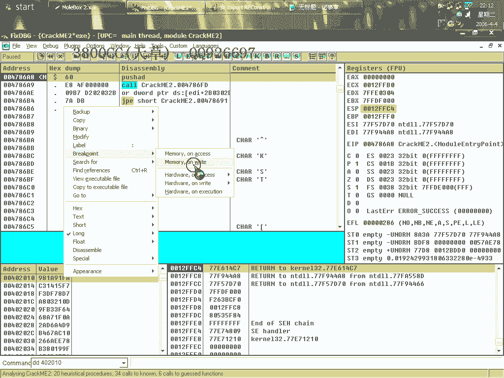

因为有些客玩的人不多，就算他那个方法就少一些。

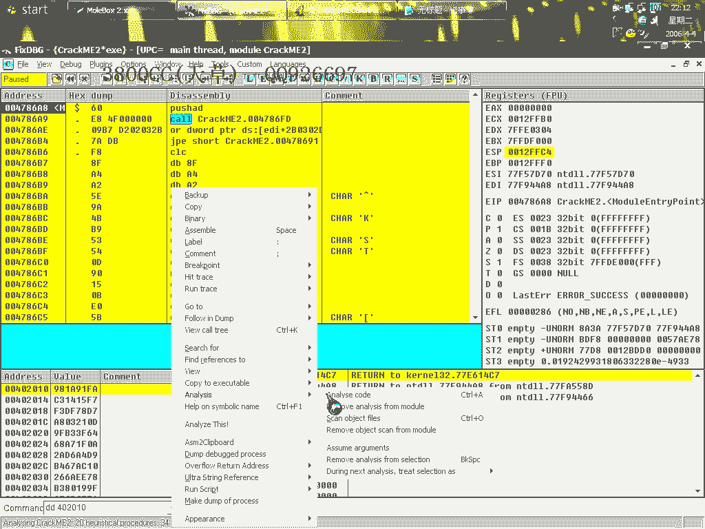

但我们这种手动查找IAT的方法是比较基础的，经常可以用得到的，我们Shift+F9，同样出现这么一个界面，咱们按4，现在这里了，继续按F9。

大家看到了，在这里面是这么一个函数，就说明这个就是这个函数了，同样的方法，我们重新载入，这个是比较基础的。

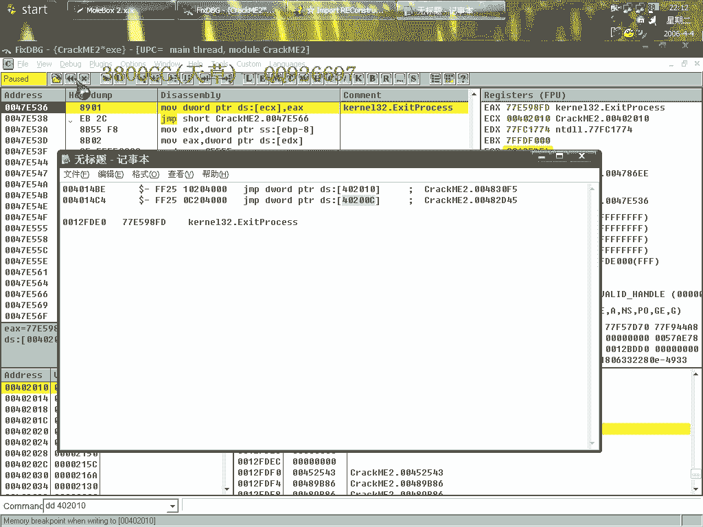

在拖老王的一个D的2003-518的版本的时候，就需要用到这个方法了，大家可以自行到网上去找一些资料，自己查找资料，这个是一个最基本的技能，同样Shift+F9，出来了。

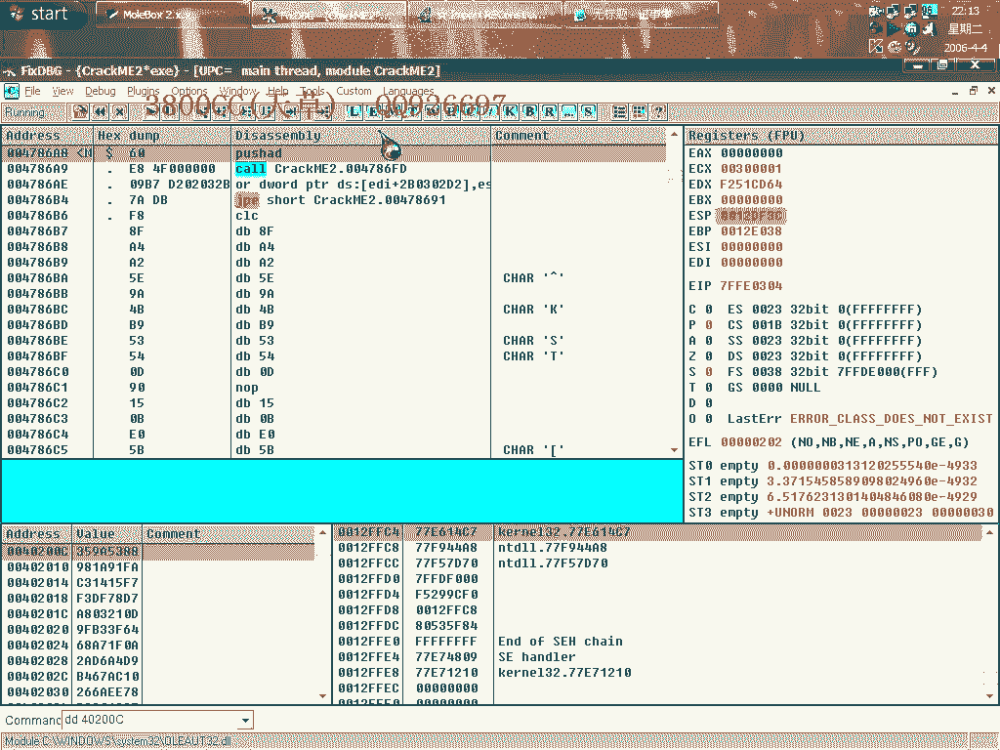

把这个删除分析。

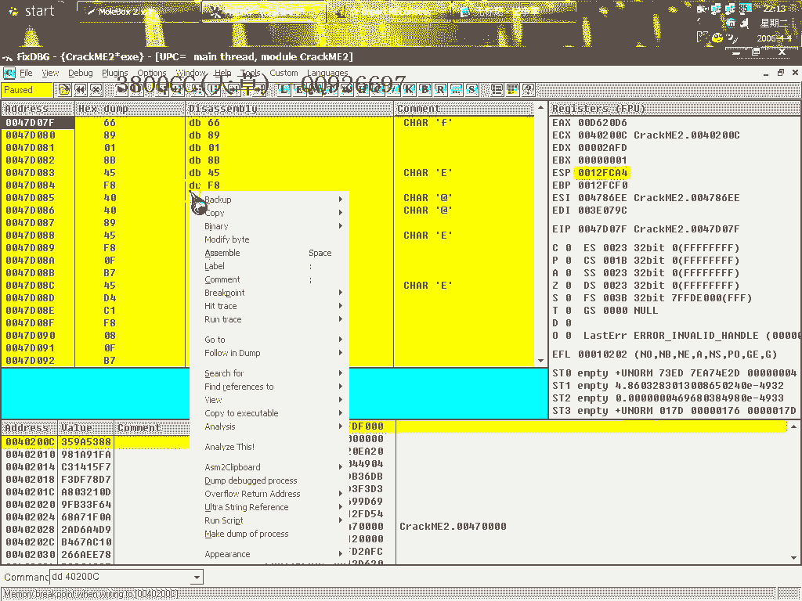

同样F9，这个是这样，这么一个指针，现在我们单步走。

删除一个内存端点，你不删除的话，在这个地方F4不下来的，F4，就到OEP了。

这个时候我们来修复吧，重新载入这么一个进程，因为每次运行程序，这个进程ID不同，好，第一个2010是这么一个，2010，双机啊，第二个，就这么一个，OK，我们现在来抓取。

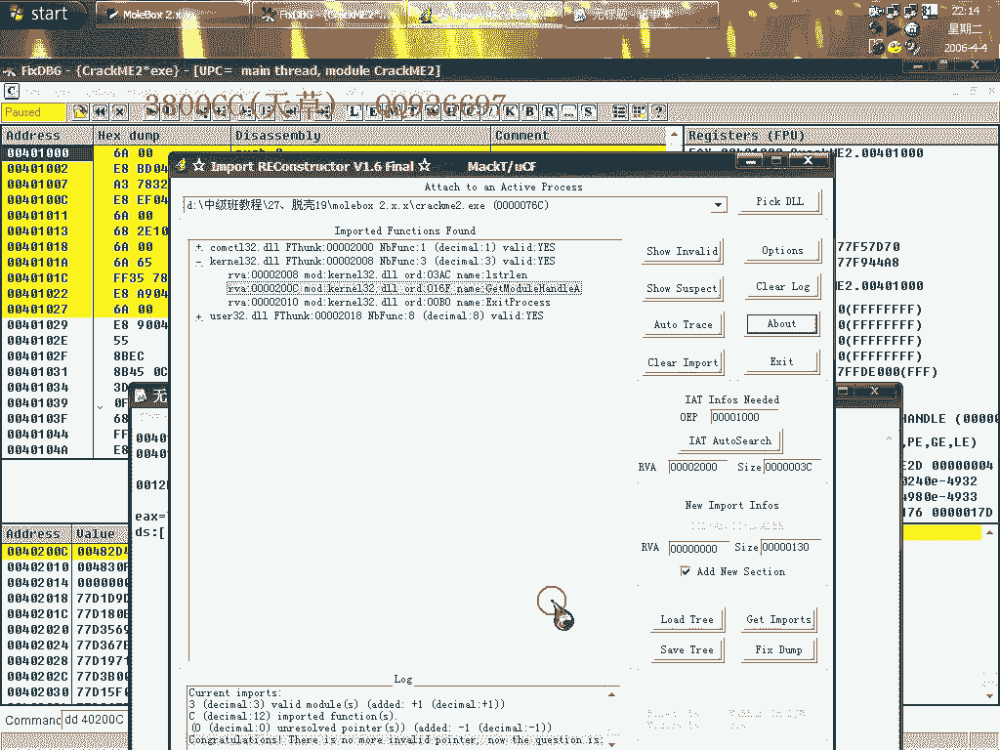

现在来运行看一下，好，直接就没了啊，连启动提示框都没了，会编的，刚才F2走是在课程里面说没有一些原程序，就是说没有一些五种语言特征，你就可以拿这个做会编的了，我们现在来看一下这个，这个呢。

我也不知道是一个什么东西，在一个国外的网站上看到有一个人说，求助托这个课，我就想起来了，应该是一个国外的一个外挂吧，应该是一个外挂，这个是法文的，不是，是俄文的，这是我已经拖好了的，有一点小问题。

也是一个会编的，有一点小问题，我们现在来拖吧，记录啊，这个是我的一个，写下的一个小的一个思路啊，第一步啊，第一步，首先就是用SFX这个方法。

来看一下有没有啊，就是说是同框的，我们选这个吧，比较快一点的，但是不够准确啊，不保证准确性，非常快的啊，它的一个OEP就是4000的啊，40100的啊，OEP，分别做一个记录，然后啊，把这个改一下。

改过来，重新载入，休斯加F9，这个时候返回，这个我这个用英文的OD好像有点问题啊，拖这个SVKP这个课的时候啊，用英文的好像有点问题，隐藏一下。

因为返回的时候总是返回不到程序的领空，这里就返回到程序的领空了，第二步接下来，接下来是查找这么一个特征嘛，看ZF，对啊，返回的不对，重新来看一下，那你又是开这个OD的原因吗，开这个屏幕上三加的，嗯，诶。

Got a modern light，记错了，直接下吧，刷一个D，每次返回都不一样啊，每次返回都不一样，应该是开了屏幕录像专家的缘故了，这个怎么做下去呢，我先把那个屏幕录像专家暂停一下吧，等搜索到再说。

的确是开了屏幕录像专家的缘故啊，这样啊，把屏幕录像专家提一下提下来就没事了，好，大家看一下啊，这里是要跳到第一个啊，跳到这里来啊，跳到这里来就是大家看一下，因为这是第三个注册表函数嘛，这是一个。

这两个第一个第二个第三个啊，就跳到第一个这里来啊，C66啊，C75，714，改成jump，这第一个第二个第三个啊，这里呢，我们跳到pointA，010，C75，850，大家可能发现了发现了一个问题。

大家可能会说，可能发现一个问题，这里呢，在我这个电脑上面啊，我改的这一个00C757，是就是说，比如说程序不同啊，但是这个后面的一个数字是不会变的，这个是个四节尾的啊，这个是四节尾，是跳到以四节尾的啊。

然后呢，这里呢，是从一节尾的跳到以零节尾的，这一个地址啊，这个是一个规律啊，也是一个规律，接下来我们看下家也是，我们把它换一下换一下，这里啊，同样我开着屏幕路线专家也不行。

然后我就把屏幕路线专家再停一下，再中断一下在这里，不然的话中断不下来，停掉之后就中断下来了，非常奇怪，同样啊继续下这么一个断点继续，下一个断点继续，修的加油是9，取消断点啊，我这得又又再停一下。

又再停下不然返回不了了，这样就返回来，返回来之后，我们再下硬件断点，硬件断点第一次中断在这里，第一次中断在这里，我们取消硬件断点取消掉都取消掉，直接到的OEP，直接到的OEP去，看下家居，删除分析。

在这个地方，下了F2之后，下了F2之后，我们呢这里，这样就中断下来了，中断下来，因为这个没有Store Code，没有Store Code，大家可能有Store Code的可以通过这个来跟踪。

跟踪，这里没有这里没有。

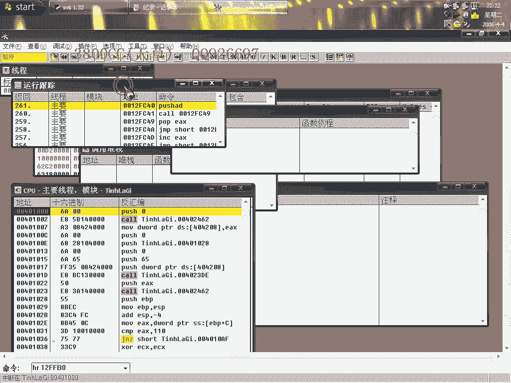

大家看到了，这个地址本来就是00401001，就是这里的一个地址。

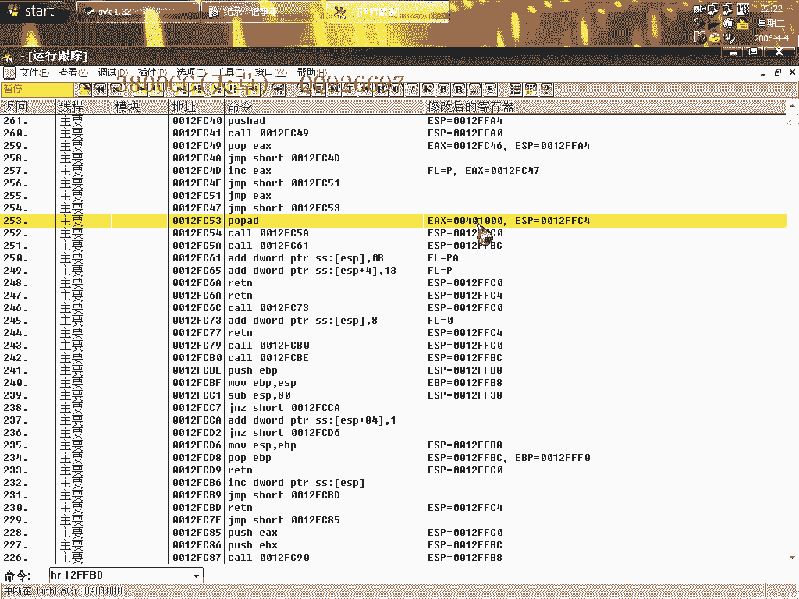

本来就是OEP的一个地址了，这个时候我们来Download。

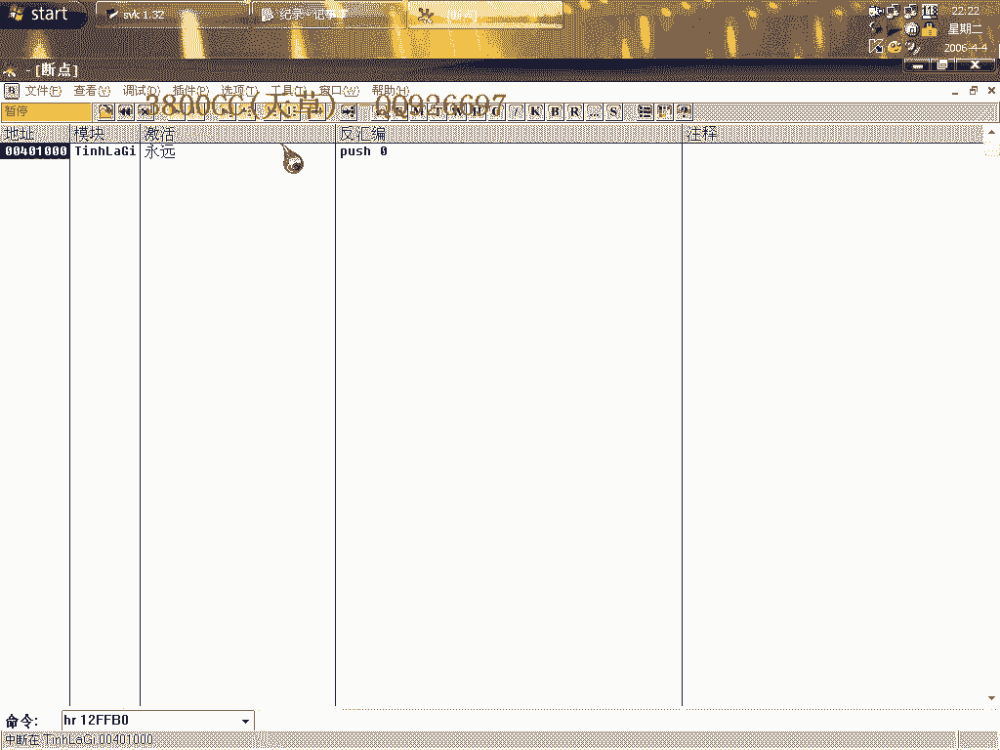

记得要交代一下大小。

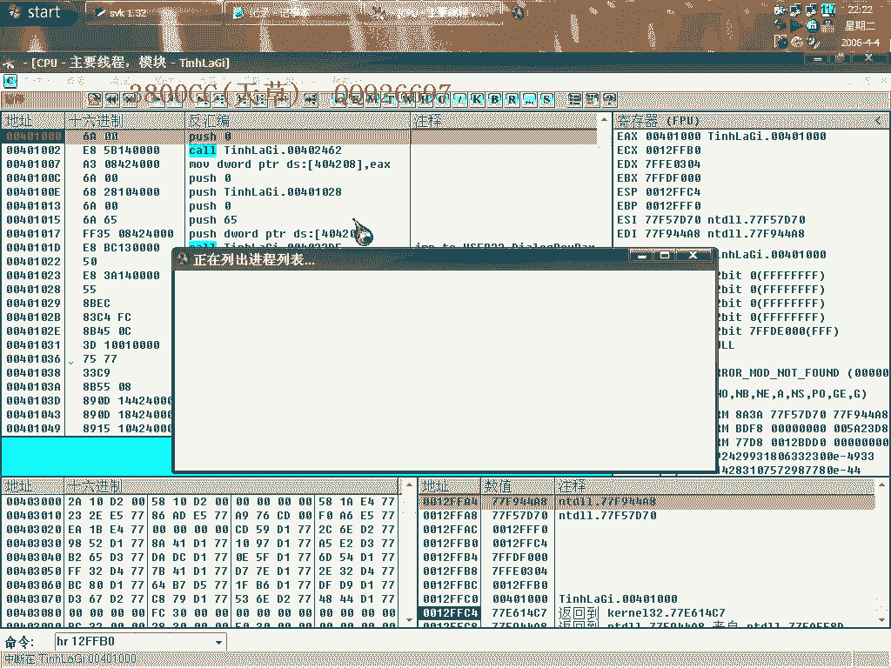

这里这一个这里这一个，因为在上次跟大家说过，上次跟大家说过，就是说他会处理这么三个，这里没有这里没有，会处理几个注册函数注册函数，但是他这个地方，因为是一个很小的一个东西，很小的一个东西。

所以他这个地方本身就没有注册函数，本身就没有，我们可以这个样子进去看一下，进去看一下，这个没有识别出来，就这一个没有识别出来，而且他会加密这个函数，然后这个函数就是，PROC就这么一个地址。

已经跟大家说过了，我们来看一下。

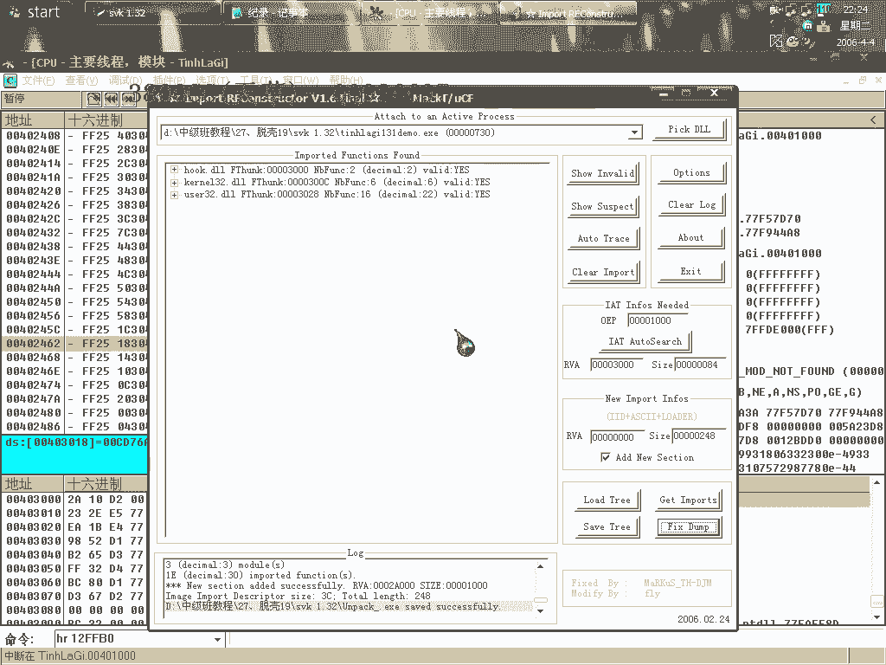

不行，看下怎么回事。

以前是以前，是以前的，看一下，重新抓取一下看一下。

这个应该是显示为会边，显示为会边的，变成这样了，变成这样了，不对了，我们得重新拖一下课。

重新拖一下课，好像拖课出了一点问题，拖课之后，他那个OEP就变了，不对了。

不知道哪里出了一点问题，可能又是开了屏幕录像专家的原因，这个问题我还一直都想不通，到了为什么会影响，这样的入口应该是会边的。

是会边的了，可以了，但他这个每次关闭会有这个错误，每次关闭会有这个错误，我把屏幕录像专家停一下，看一下是不是。

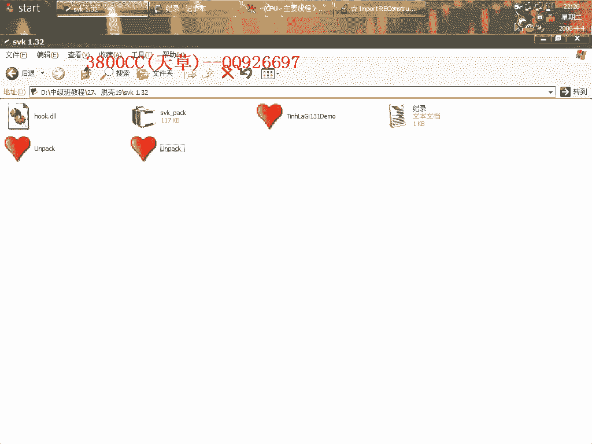

这样吧，我这里只要开着屏幕录像专家，这么一个进程就会有问题。

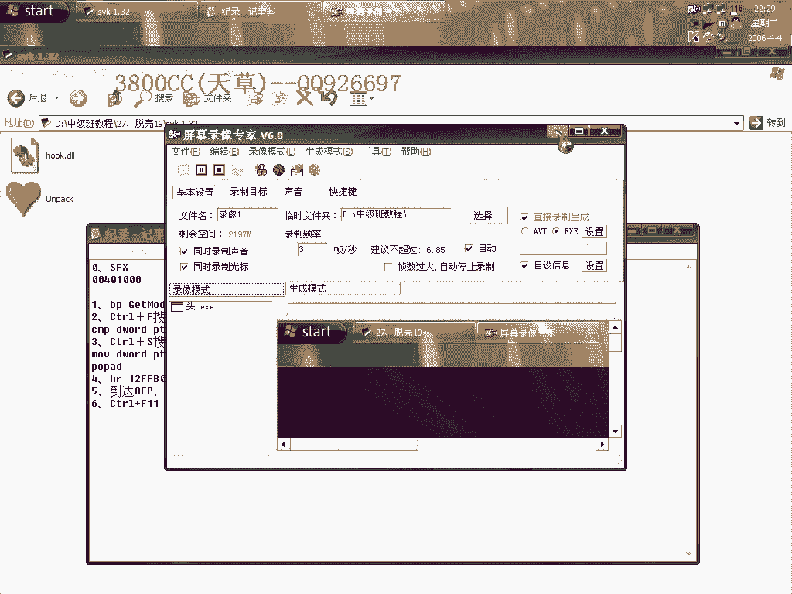

不管拖课还修复，这修复出来他有一点问题，修复出来有一点问题，大家下去自己再试一下，自己再试一下，这个是非常简单的，比前面的两个都要简单多，这里有一个Hook DLL，估计就是这个跟这个，有一个冲突了。

每次运行他的时候可以看一下，运行一下，我们来看一下，他这个里面加载的DLL就知道了，加载到这么一个DLL了，跟屏幕专家有点冲突，大家下去自己再试一下，今天这个课程就到这，这一刀再见。

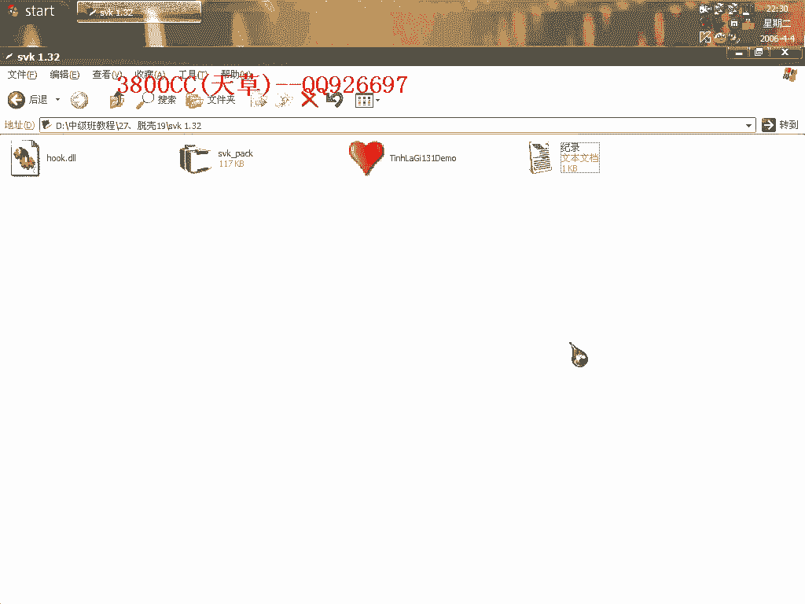