# 3800cc(天草)-天草中级班 - P3：第03课 - 白嫖无双 - BV1qx411k7kd

大家好，现在来进行第三节脱壳课，这个呢，因为怎么说啊，我们的这个目标程序啊，是Sproc1。23RC4这么一个课，现在最新版本是2。X的，而且脱起来是非常非常麻烦，有一步走错的话也要重来，非常烦的啊。

当然我们也可以实现就是说通过不脱壳破解，这个后面我会给大家讲到，就是说如果想脱它的话，想学脱它，就必须对它一些低的历史的版本啊，就是说低的版本要有了解，而且这个版本啊，1。

23RC4这个版本是非常经典的一个版本，算是Sproc一个发展史上一个最经典的一个东西了，一个转折点了，好，我们现在看一下，以前跟大家说过很多遍啊，就是说一些程序的一些原特征啊。

因为我们终极版因为讲到一些课啊。

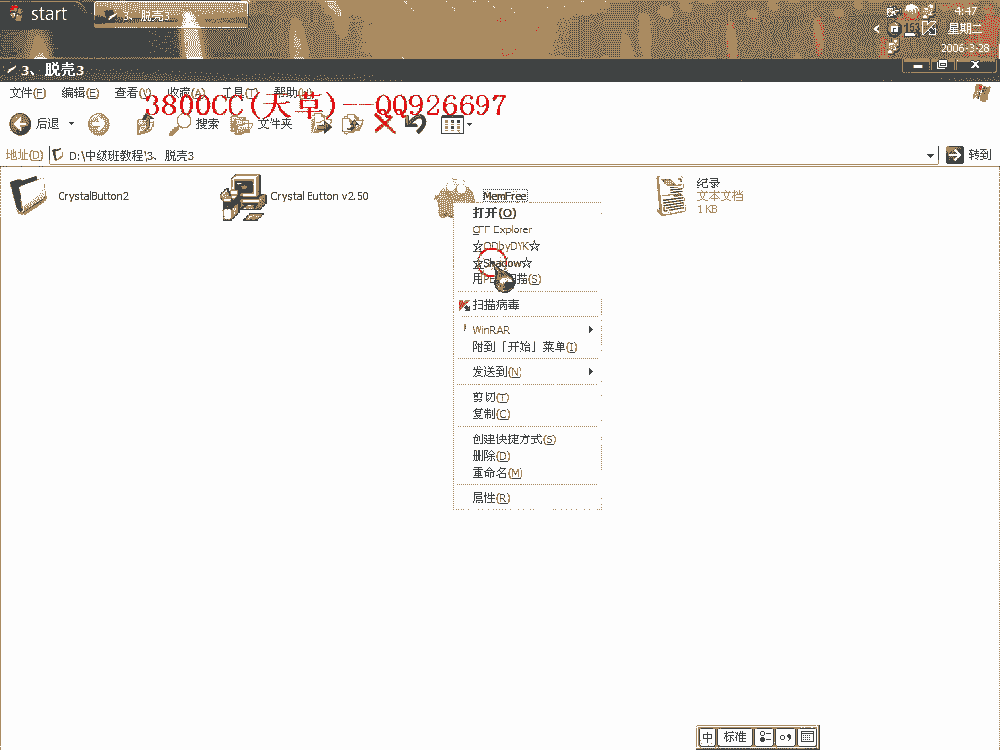

讲到一些课都会有什么Stone Code被抽取了代码的，大家看这个是VC头，VC头啊，就这么一样东西啊，看一下就知道了，我们现在来脱它啊，怎么来脱它呢，好。

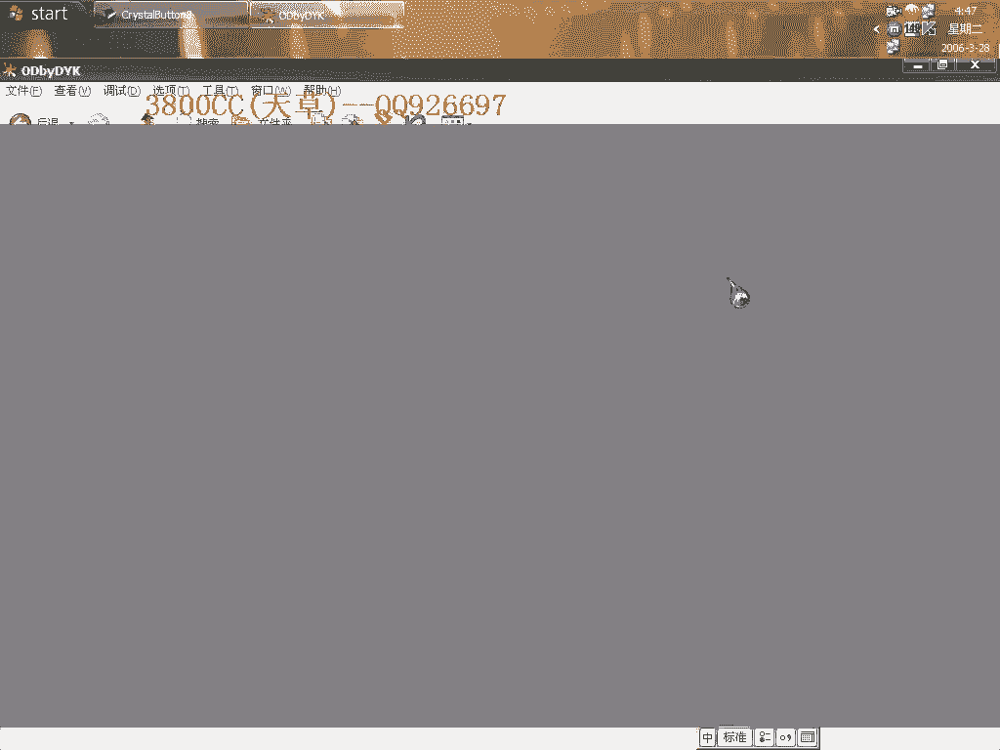

忽略除了内存访问之外的所有异常，我们现在呢是要到最后一次异常去，好，直接走，好，这里啊，这个是最后一次异常，大家看清楚，因为Sproc 1。23RC4的最后一次异常有一个典型的特征。

就是两个接一个Rent，这个是一个非常典型的特征，大家有的时候就是说脱多了的话，就可以不用去数了，不用去数这多少次了，看这个特征就知道，好，这里就是最后一次异常了，我们在这个Rent这里下断点。

确实叫F9断下来，咱们看对战里面，对战里面咱们也取这个地址，0012FF68，这个是一个标志，算是一个标志了，就是这么一个注视的下面第二个啊，下面第一个第二个第二个，咱们HR就是下硬件，硬件断点，好。

然后确实叫F9运行，这个时候删除硬件断点，到这里来了之后啊，咱们F7啊，用F7走，可以单步走了啊，一路上啊都用F7，这里用单步吧，就是过了这个PoP Ad，PoP Ad咱们就要用F7了，现在咱们要找。

Stormcode的啊，大家眼睛看尖一点，眼睛尖一点啊，好，大家看清楚了啊，这里不就是我们刚才所说的一个语言特征吗，看一下像不像，像吧，好，咱们还是单步走啊，就是F7啊，好，到这里。

这个就是Stormcode的一部分啊，这一个啊，然后继续F7啊，好，这个呢，这也就是一部分了，这个也是啊，所以说我跟大家说过很多遍了啊，这个是要大家自己去把这个集中语言都找一下的，就是这些了啊，好。

再用F8，大家看到了走到这里来，上面全部都是被那个了啊，就是被VM的啊，代码全部被抽取掉了，咱们就是需要把这些给填补进去，我这里呢，在这个地方已经做好记录了啊，就是这些了，然后这个地址直接复制上去。

用i-jins连题啊，就复制上去了，这是我们刚才找到的，就是一些位置啊，当然这些前面这个虚拟位置在你们那可能就有些不一样了啊，这个是就是这个是每台机器都不一样的，咱们现在呢，在此处新建一IP。

打开loadp，打开loadp啊，多客，这个，现在啊，咱们来手动，我这里介绍两种方法，介绍两种方法来修复它，首先啊，就是用我们常规的方法来修复，这修复先用这个，这修复相对强可的时候啊，大家记清楚。

这三个都不要选上啊，大家看到有很多无效的啊，咱们首先呢，用等级一啊，可以修复一大部分啊，然后呢，还有六个用插件，1。22的，这样就可以了，这是第一种方法修复的，看下行不行啊，可以的啊，一C++的。

咱们用第二种方法来，大家记清楚啊，OD载入的这个线程的是154啊，154，咱们用它来打开，这个我在也已经给过大家了。

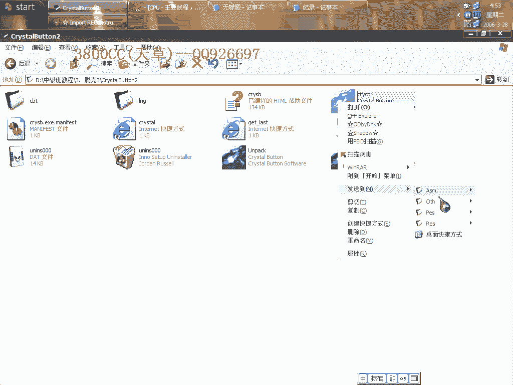

好，点yes，yes，嗯，yes，看到这里呢，看着啊，到了possible这里就停止了，不要再点了。

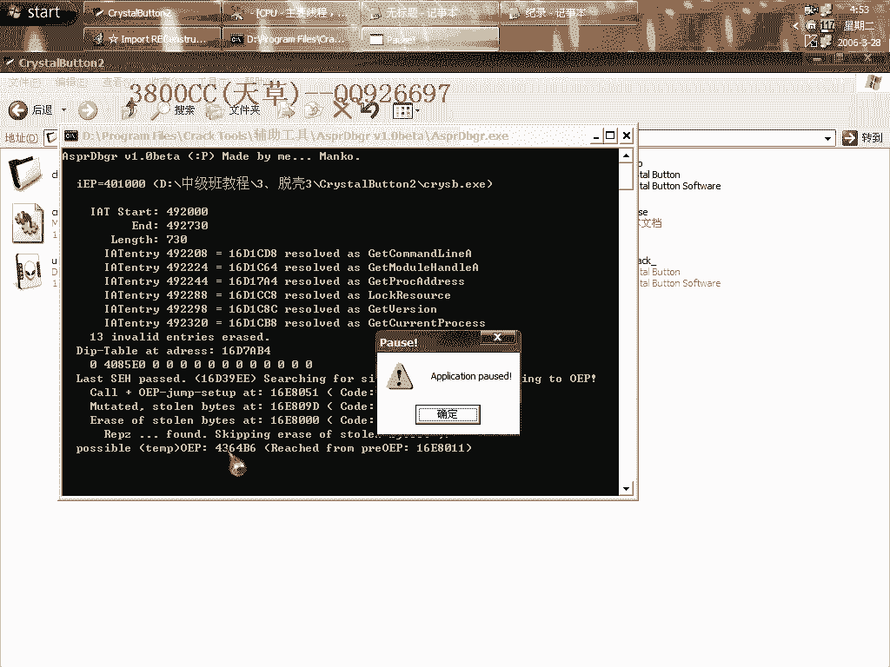

OK，这个时候大家再看一下，它这里有两个相同的进程，刚才154是OD的那一个线程，然后这个呢，是刚才这个软件载入的一个线程，好，我们把OEP贴上去啊，大家看到啊，一下子就全部都是有效的，当然这个东西啊。

这个东西只是对1。23RC4啊。

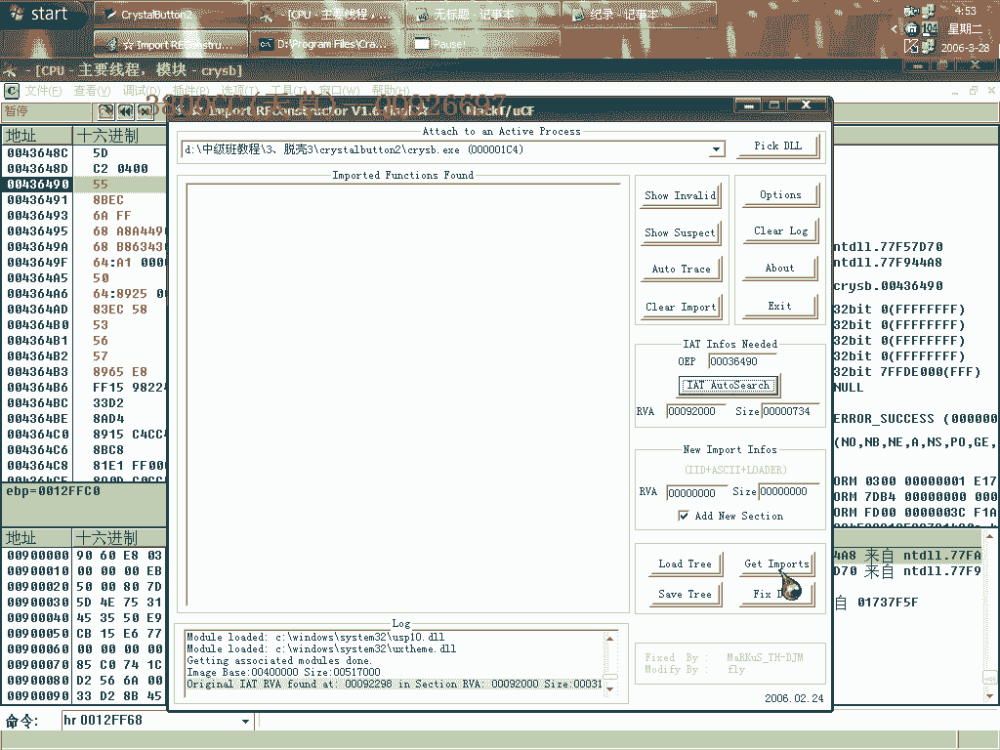

以下版本才有效，高版本的就无效了啊，它这里好像修复有问题啊。

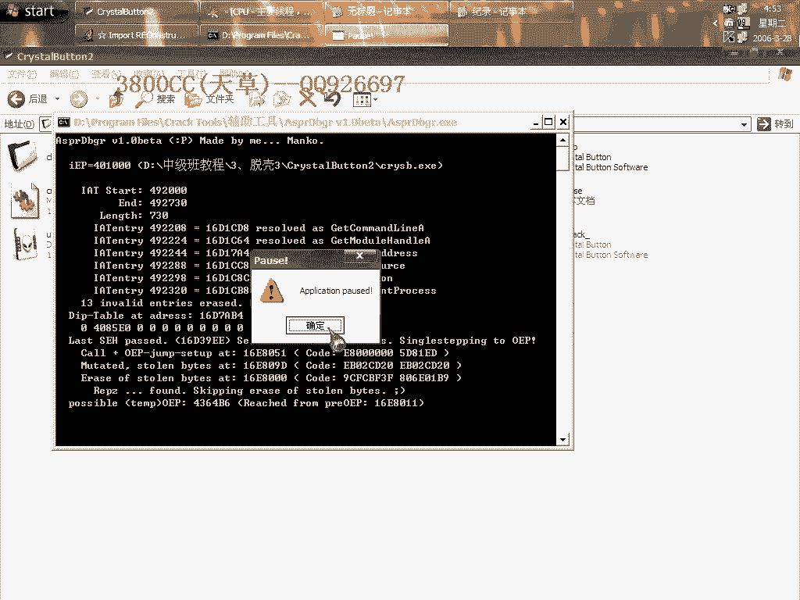

OK，我们再来看一下，它这里的这个，这个修复的有问题，好，那我们就用第一种的吧，这个修复的有问题，应该是没有问题的，我们试一下。

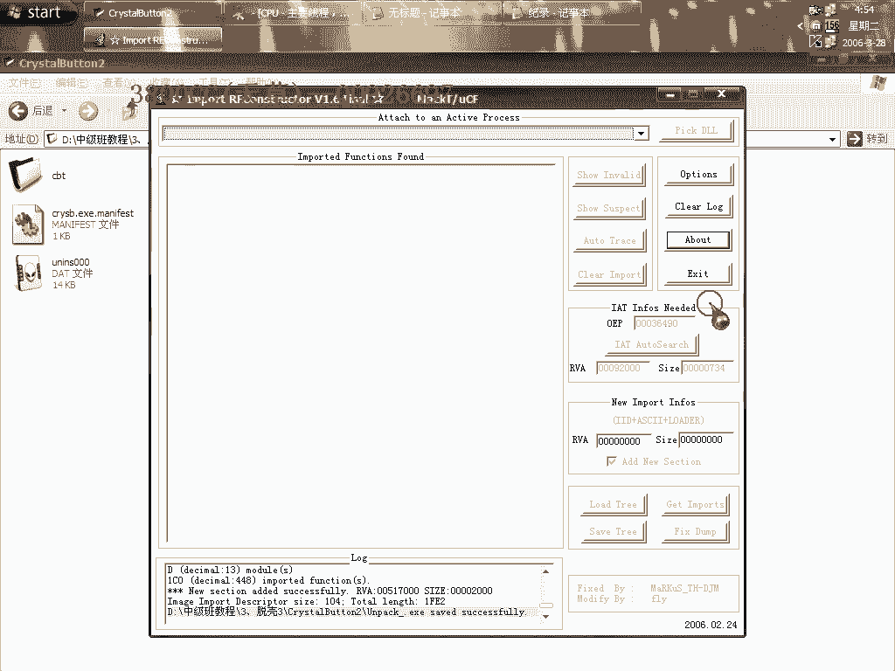

再试一下，就是用这个来载入夹壳的程序啊，好，这个上面的一个线程啊。

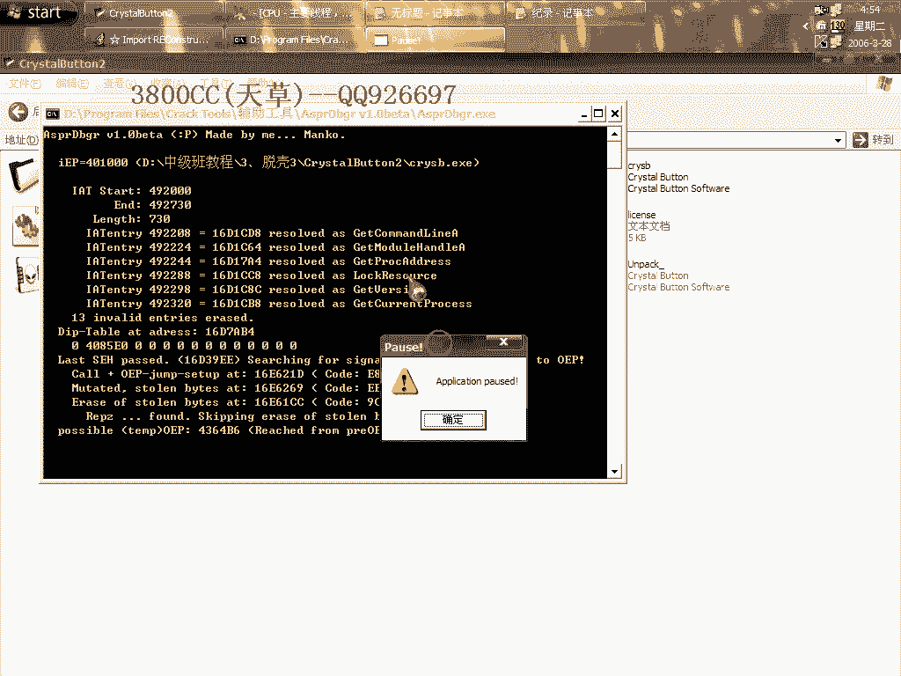

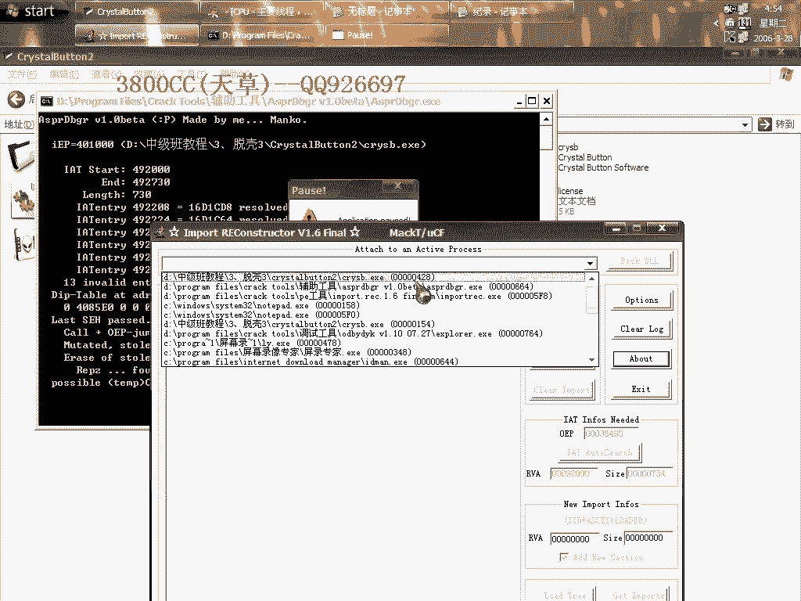

这里就点1000吧，等一下再换，全部都有效了，换成OEP，看一下，它这里是哪里出了问题啊，这种修复出了一些问题，这里还有一个没有修复啊，大家看到了，它这里还有一个指针没有修复，我们到这里去看一下。

是LOW的啊，这个，499啊，499，我们来看一下啊，92，92，40，92，240，92，240，40，中间啊，中间这两个中被中间给剪断了，弄断了，大家看到有两个，两个都中间弄断了，这说明这个还是。

修复有问题啊，我们这样吧，修改数据，复制过来，好，这里呢，看一下这种，看一下这行不行啊，复制，嗯，不行啊。

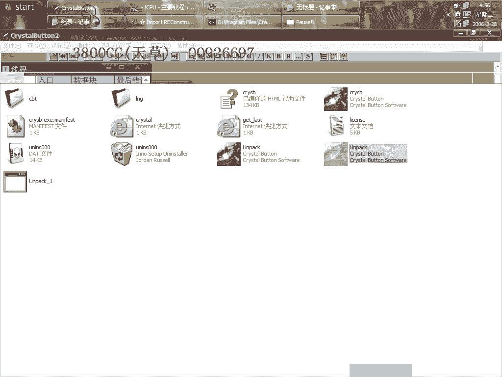

还是不行，就是说用刚才第二种方法修复还是有点问题啊。

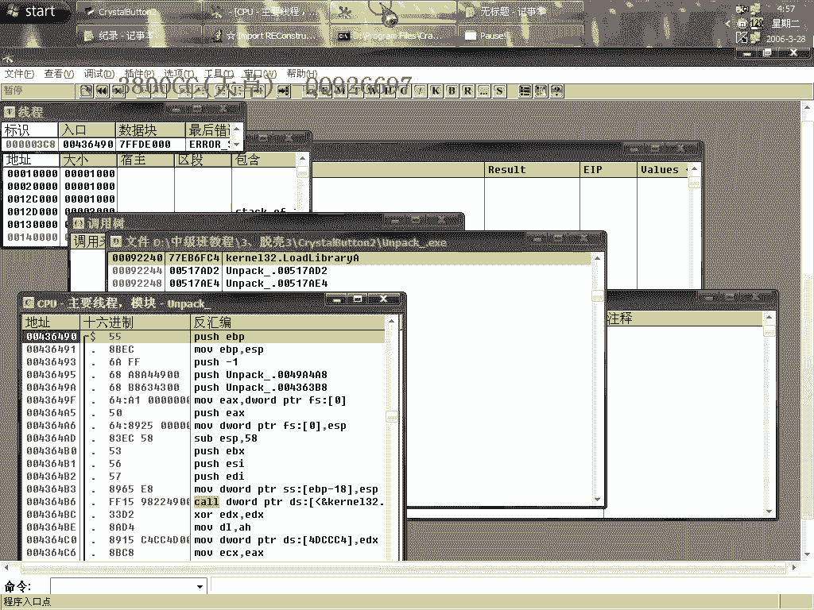

有问题的，好，那我们还是用第一种方法来修复吧，这个第二种方法按道理说是不会啊，不会有问题，大家看到了啊，刚才我们用第二种方法修复的时候，他把这两个给分开了，中间9240，可以看一下。

他刚好把这个剪开剪断了，去掉了，所以就不行了，可以啊，可以的，嗯，好，我们现在呢，来看一下重新加载那个家科的一个程序，注意啊，我们看一下用那个，派系的办法能不能把它给破解掉，注意对战啊，注意对战啊。

第一次出现了硬盘指纹，硬盘指纹，这个叫硬盘指纹，就长这个样，第二次，这个时候我们打开六层景象，在0040，100这一段下断点，学着加F9，这里啊，ESP，然后呢，地址，把这个地址记下来啊，地址。

就是这个地址啊，我们到下面找一个空余的，就找这个吧，嗯，嗯，就打3800CC吧，这个地址记着啊，咱把这个，修改，修改成刚才那个地址，这里就显示为3800CC，现在按住Shift键盘上的Shift。

选择啊。

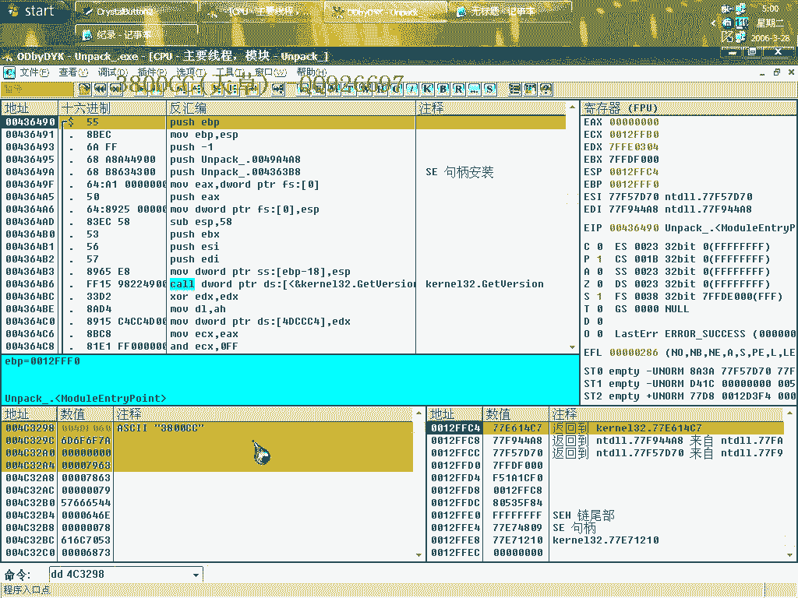

一直拉到最下面来，开始复制，嗯，看行不行的通啊。

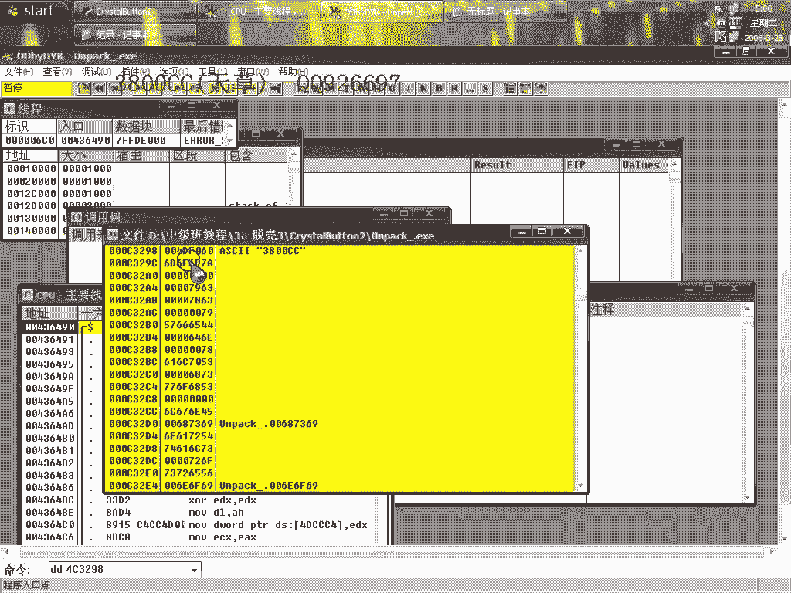

这个样子就直接了啊，这个3800CC，因为就是说。

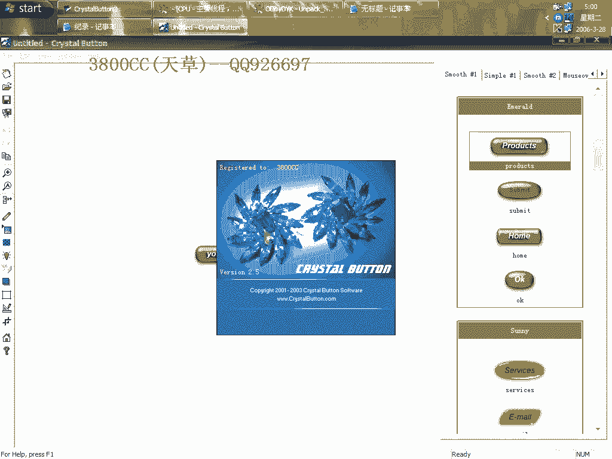

我们发现那个硬盘指纹了啊，发现刚才那个硬盘指纹。

他是把那个用户名放入，是这么一个地址，我现在就是说Patch之后啊，把这个地址Patch了，把我这个注册名啊，Patch给这个地址就可以了，这样就达到破解的目的了啊，好了，今天这个课程的内容就这么多。

就是关于1。23 RCC4呢，我打算还会，就是说还会再讲吧，还会再讲一两节课，这个样子，因为啊，它是很有趣的一个东西啊，很有趣的一个课，这个版本的课是比较有趣的，破解啊，好，再见啊，拜拜。

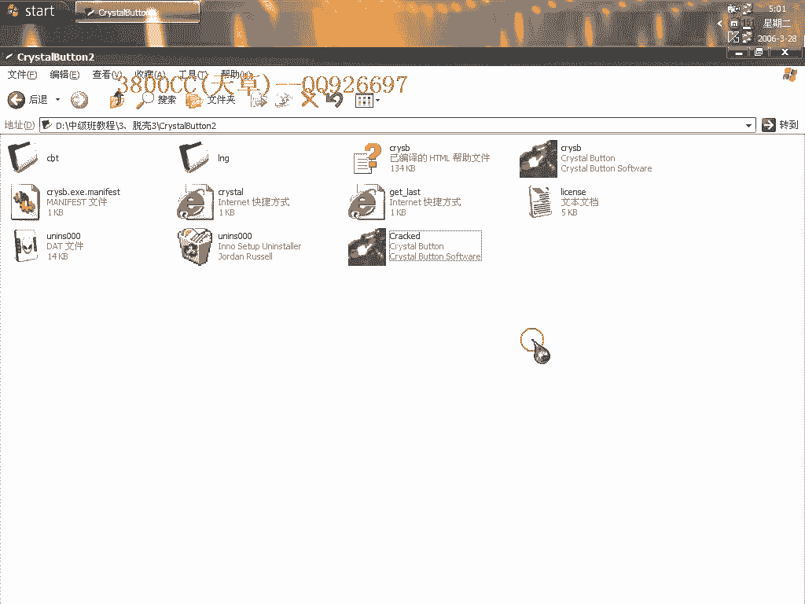