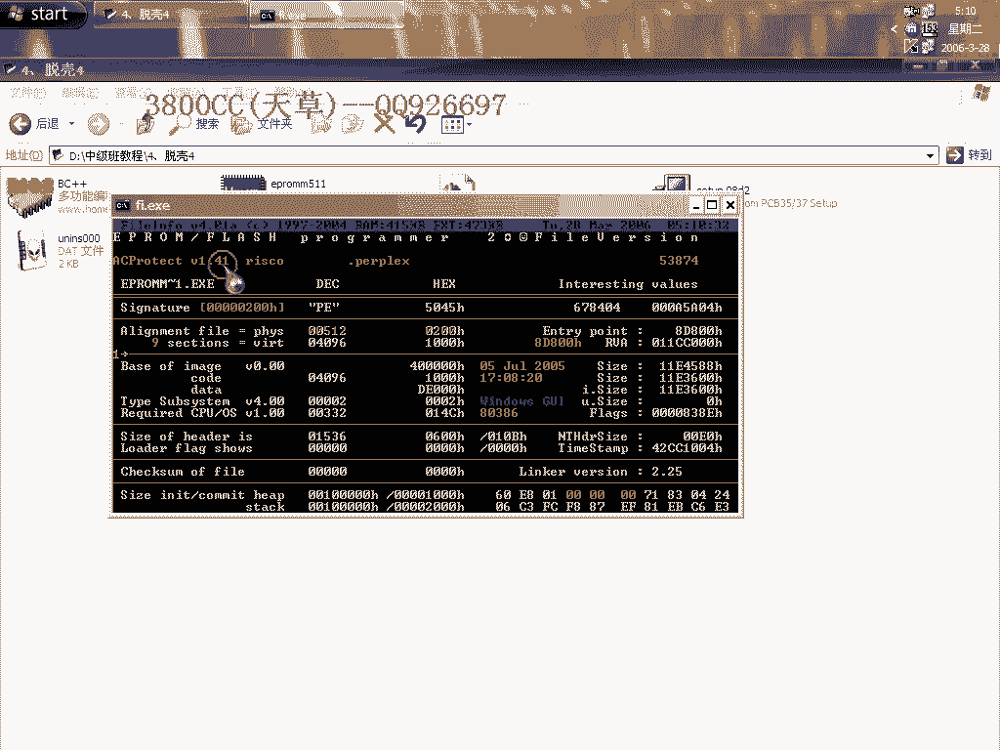
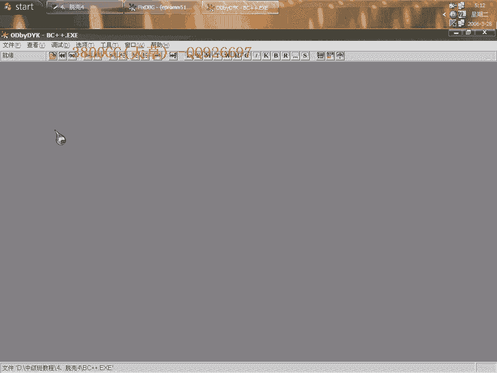

# 3800cc(天草)-天草中级班 - P4：第04课 - 白嫖无双 - BV1qx411k7kd

大家好，現在來拖一下這個坎，也是這麼一個坎，但是它是高版本的，1。41的。

咱們先OD載入吧。

每回載入都要分析一下，很煩的，我們來用前面的辦法，前面忽略它，這個樣子中斷載，最後一次累積一場，在這個地方F2，現在刪掉，刪掉，斷點，在這裡F4，咱們可以直接到OEP去看一下，很明顯，這個都被。

也是有Stone Cold的，分析一下，好，就是说看一下这个结构啊，看一下它这个结构，我们就应该知道它是一个BC++的程序，好，现在我这里有一个啊，有一个BC++，咱们来对比一下。

所以说大家要把前面的基础打好。

我已经说过很多遍了啊。

要把那个入口特征都记一下，大家看到了吧，很明显了，我们把这一段复制下来，对照一下可以，然后呢我们来大概啊，先就不管这个了，那现在咱们怎么样找到它这个Stone Code呢，这个跟前面讲到的方法不一样。

因为这个是高版本的，我们依然啊依然是忽略这么一次内存异常，然后呢隐藏一下OD，弹幕走在这个地方，ESP定律啊这里用的是ESP定律，走，把这个删掉看一下啊，走走走走走走，大家看到了，他就走到这里来了。

那我们来看一下对照一下啊，对照一下他这里哪些是我们需要的，很清楚了，从这个地方，前面三个，前面这三个都是的，是吧，后面的呢，后面的不变嘛，不变，那至于这两个啊，这两个等一下我们就可以分析来得到了。

通过分析来得到啊，我们只需要这三个就OK，这就是我们的三个，那这两个自然就不会少了，这三个也不会少，这就是我们的石头扣的啊，然后呢这里就缺两个啊，缺两个，至于这两个地址肯定就不一样了吧，是不是。

那我们现在就需要找到这两个地址就够了，好，咱们还是走走走走，咱们现在就是要到达OEP去啊，删除删除硬件断电，运行啊，现在前面啊有这几句前面六句啊，前面六句都找到了，现在就是找这后面的两句。

后面两句是相对应的地址，这个分析有点卡啊，隐藏一下看一下啊，运行，那咱们用另外一种方法到OEP吧，iDelt，硬件写入断电，内存写入断电，去回加F9，然后呢，删除掉，在这个地方下F2断电，我们来看一下。

到这里来了啊，再一次啊，他这个还没有好，OK就到达了，OEP了，分析一下啊，分析一下，咱们先让他分析啊，先让他分析，咱们来分析一下这个，分析下X和Y是多少了，大家看到了啊。

他这里是把这个地址放到EDI里面去啊，放到EDI里面去，这个放到ECX里面去，然后两个进行比较，那么就这两个值，大家看到EDI里面就是这个值啊，然后呢，这个ECX呢，就是这个值很明显啊。

就是说这里显示了两个值，就分别是这两个了，X和Y就容易很容易找到了，这里又混淆了啊，混淆了还是来分析一下，刚才我这里单步走过了，单步走过了，重新来吧，走过去了，我们因为我们等我们要看这一句啊。

要看这一句来找到这个所谓的X和Y啊，有点卡了，咱们来快速达到OEP吧，获利索引一场，用这个，内存写入，然后删除这个端点，然后，这样就到了啊，大家看到了啊，就是这里了，就这个地址了啊，那么可以分析出来啊。

就这么一个地址，那Stun code呢，就是这些了，咱们拉到上面去，开始写了，其实就是我的这个二进制代码了，二进制代码我这里都有，在这里新建，OEP，这个就是说一些代码，一些程序的入口特征啊。

语言的入口特征，我们要非常非常熟悉了，现在咱们来托克，现在就修复了，1000，然后大家看到，C0 C0 0，我们把这个地方改成0，这里呢改成1000，有很多无效的啊，有很多无效，咱们用点击1。

一个都没修复，然后用这个插件来看，有的找到有的没有找到，再来显示一下，这里咱们不要急着剪切掉啊，要注意看有一个啊，有一个，这个里面的啊，我跟大家说过啊，这个可对这个对这个啊，就是MaxDbox啊。

MaxDbox处理，咱们就是要这一个，等一下咱们来看一下啊，修改好了之后剪切掉，修复，现在来看一下有什么问题没有啊，有这么一个错误提示，但是还是可以运行起来，这里就是说，因为啊，在我们在托克过程当中。

并没有就是说对他进行特殊的处理，那我们的改，把它改掉，这大家在另外发现一个问题啊，这每两个啊，每两个之间的距离可以看一下，可以看一下这个mapFacial，就是这一个。

然后接下来是windowsPound，也是接着这个，然后MaxBP啊，就这一个，就是说它是按照顺序来的，大家看到i开头的都在一起，KL就是这样在一起，我们再试一下，都试一下，我们选这一个，选它来试一下。

既然这个有错误，我们来选它，同样啊，同样是有这个错误提示，接下来咱们选择下面这一个，再来运行看一下，有这么一个错误提示，有一个小错误提示，咱们来选这个timeout，一样的有这么一个错误提示啊。

接下来改一下，改这个，这个样子它就可以运行了，没有错误提示，但是我们来用另外一种方法，另外一种思路来看一下，因为它对这个进行特殊处理，虽然我们仍然说把它修复好了，但是他就是说有些代码还是没有解码的。

我们就这样让它有这个错误提示，有这个错误提示，咱们来用OD来载入这个脱口后的文件，看一下，看一下我们用F42暂停对战调用的那个方法，看行不行，直接运行，有这么一个提示啊。

但就是说好像跟刚才咱们的咱们就是说单独运行，它的一个提示不一样啊，大家看到了，现在是一样，他现在把我们这个OD啊就彻底就阻拦住了，阻拦住了，没有办法了，对战里面任何的没有，所以说我们这种方法还是不行了。

用这个方法行不通，我们来看一下取消掉这个断电，重新来过，取消掉它，这么一个位置啊这么一个位置，我们到这个位置去看一下，15012918，也是这没有解码开的啊，没解码开的，咱们就不试了啊，不是了。

把这个指针修改过来，因为大家看到这些规律啊，就这么开头的都在一起一样的开头化，另外可以看到啊，可以看到他这个体积是非常非常大的，我们用了的皮啊，这个漏的皮这个重建啊重建这不行，这里，咱们用英文版的吧。

因为买的漏了皮了，压缩重建我凭显这里这上面的六个选项都选上啊，体积啊体积压到10%了，我们来看一下，现在变成1。85，但是不影响使用啊，这个大家下去之后再自己试一下，另外呢，这个是他的安装包啊。

我这个是单独打开单独单独就是说已经安装了一个文件，他在一台电脑上第一次运行的时候会出现提示错误，而且退出不正常，咱们需要在任务管理器里面结束他，然后呢第二次运行才会正常啊。

就这样。