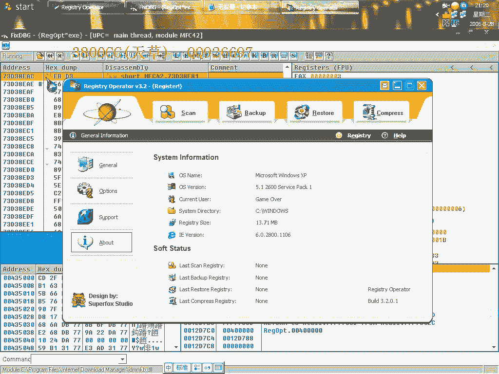

# 3800cc(天草)-天草中级班 - P6：第06课 - 白嫖无双 - BV1qx411k7kd

大家好，现在我们还是来做一课，关于这个OSPRUG2。X的，不脱壳破解，就这么一个课。

我们OD直接载入它，忽略所有的遗藏。

然后隐藏一下。

直接运行起来，好，登入register，我们先分析一下。

分析这一步是一定要做的， hope you can understand this video。

就是这里了，这里，小卡，大家看到了，就在这里了，我们找到断首，好，就这里了，下一键执行断点，这样就中断下来了。

我们就单步走，这里要是我们没有输入注册码和用户名的话，它就会提示我们，但是我们输入了就跳过去了，这里它在算我们的注册码，取1，取2，取3，取4，我们这里直接过去，继续走，这里它就放入了一堆支付串。

我们可以来看一下，它到底是什么算法，看能不能查得到，这个带了壳的，有时候查得不太准。

有时候查不到，这里又放了一个支付串进来，这里有一堆支付串了，但是它肯定不是我们的注册码了，大家看到有这么一堆，我们可以拿过来试一下，拿过来试一下可以。

这里还是继续走，这里还是继续走，这个我们也可以拿来试一下，这里是进行比较了。

但这里显示了烂码，对我们没有什么作用，我们就不要管了，这里可以看一下，它这里是会直接跳到，错误了，这里我们把它改一下，这里继续走，好，说成功，大家看一下，You must，你必须重新启动，重新启动它。

重新启动它，这里就直接退出来了，就退出来，就说明这个软件。

这个软件是一个重启验证的，还是没有注册的，重启验证型的，我们就不用试了，不用试了，我们来用另外一种思路来看一下，我们先用这个来试一下，错误了，这个是错误的，然后我们来用这个，这个它是，调换了一下。

调换了一下，我们来试一下吧，还是不行。

就说明通过我们这样，就是我们上一课是直接找注册码。

不行，不行，我们来看一下，查找支付串，看一下有没有可用的信息，好，添加一下，添加一下，大家看到这里有一场，有一场我们就把这个一场给添加进去，我们现在fill模块，我们因为我们现在这个模块是在那个系统的。

这个这个32这个模块里面，我们要到啊，所以我到这个模块去，OK。

现在来查找一下，查找不到啊，大家看到这个样子查找不到的，我们重新来过。

分析一下。

再来查找看一下。

这样就可以查找到了，但大家仔细看一下，仔细看一下，有没有可用的信息啊，可用的，大家看到有这么一个，那个什么，这个什么东西啊，注册表，那么就是说我们可以通过下注。

下一下断点，因为它重启验证，类型的现在非常非常多的软件都是这种类型的，但是我们来这个样子看一下，我不是在，以前说啊。

用conn+n，大家看到如果用conn+n的话，找不到啊。

因为，加密了，因为加密了，我们就用接触到这个，这个插件，选上这个就可以了，然后再隐藏一下OD，但看着啊，要这个插件，但看着啊，要这个插件，API break，好，直接F9，F9，F9，注意看对照。

就是找我们刚才那个注册表啊，好。

这就到了断点不要取消啊，autograph就返回，大家看到他这里有没有解码，我们刚才返回没有解码，大家看这就变了啊，我们再来分析一下，还没有解码，咱们不走啊咱们不走，大家看啊这里。

Backup Direct，Backup Direct，我们看一下能不能运行不了它，大家在运行之前仔细看一下界面啊，这些都是一些界面上的一些功能选项啊，这个是一个界面上的功能选项，好这没有什么东西啊。

没有什么东西，跑不动啊，因为带了可的啊带了可，我们这样调试是有点不方便，好重新来吧，来先来运行看一下，这里Backup啊，Result Sky Compression，还有这个这一堆啊。

这些都是一些选项，大家看清楚，那看清楚。

因为等因为等一下会看得到的，查一下OD，直接运行，啊，让很多次啊，很多次前面都没有用的啊，嗯，嗯，好到了啊，大家看我一返回，他这里有两条黄色的，这样就是我们经常就是经常会见到的，没有解码就会这种情况啊。

好，这个样子，Backup啊，大家看的啊，这是他的一个Backup目录，他会见这么一个目录的，嗯，那看到他这样就来到了一个什么，来了系统系统的领空啊，我们继续F9，这个不重要啊，继续F9。

不重要继续F9，不重要啊，好继续来到这里了啊，我们再次返回，再看到一个Lost OS卡，这也是刚才界面上看得到的啊，浪啊，这也是刚才界面上看到的，好继续啊，啊，他叫F9啊，继续返回。

现在是Lost Backup啊，现在这个是等一下就到了Lost Rowside啊，Rowside，继续返回，好，现在呢，接下来还会断在Lost Compress，继续返回，那是浪啊。

他这回又到了系统的领空，我们再一次F9，断下来，因为这里就应该是我们的一个关键的啊，大家看到有User Name啊，有User Name，这里是Red Code，大家看一下这里，如果这个跳了的话啊。

那BL就为0了，BL就为0，大家看清楚啊，BL就为0，这里要是没有跳的话，BL就为1，这个是我们在前面见到的非常非常多的一种情况啊，非常非常多的一种情况，他这里居然跳了啊，而我们现在又是没有注册的。

那么我们肯定要把它改成没有，没有跳的啊，他这种检测的方法是非常非常常见的啊，这个我们在前面，在初级版里面啊，有很碰到过很多次了，就是说，如果跳，然后就给EXR，就是什么值啊，他这里是BL，只是BL而已。

换了，很明显的啊，这是很明显的对比，跳过来BL就为0，如果没有跳的话，BL就为1，我们这里不能让他跳，关键啊，大家要有学会分析的能力，BL2，好再一次返回，Flag，这里BL为1。

因为我们刚才刚才所得到的啊，就是这个没有跳，然后BL就为1，这里呢，BL为1，然后呢，这里对BL进行比较，这个也是也算是一个关键，我们可以把它拷贝下来，大家看一下情况啊，对比一下。

然后AR和BL进行比较啊，好，这两个本，这两个都没有跳啊，就是说我们改了这两个改了这个跳之后，这个这两个跳都没有跳，如果我们让他跳了的话，有个这个跳转，我们不改的话，这两个跳这个跳是会会会会跳的啊。

这个跳是会跳的，因为如果我们不改的话，BL就为0了，这里的BL为0。

BL为0，然后他就会跳，好，大家看啊，看清楚这里啊，register啊，大家看到了，自然就跳到register了啊，也是我们刚才那个跳转是非常改的非常成功的啊，好，这回到了系统的领口。

我们这个是删除断点，好，来看一下。

register，about，里面啊注册给我了，这是我们的注册表里面那个名字，非常清楚了，现在我们来做补丁。

做补丁，用到这个，我们点啊，new project，选上他，这里呢，可以写上自己的名字啊，大家要清楚这个这个补丁工具是非常好用的啊，非常好用的一个补丁工具，我们以后要经常经常的用到，然后呢。

再选edit，我们这里他这里有五个选项啊，我们选这个，选这个啊，OK，然后再选上他，选edit，同样选上他的名字，这里我们选啊，因为他是加了壳的，我们选虚拟地址，模式啊，我们这里呢，就是改这个地址了。

原先的是75啊，我们改成90，好，原先的26这一个地址呢，因为75啊，75是5425嘛，04呢，是5426了啊，5426，04同样改成90，这样就添加了这两位，现在save，他这里啊，创建loader。

创建parts，创建loader，他有两种，两种啊，一个是安装型的loader，一个是简单型的，普通型的，我们点普通型的，好，我们可以来看一下，大家看到了啊，register，注册给我了，这里呢。

还是可以的，还是可以注册的，就这么简单的，那我们再来看一下，再来看一下，简单型的，安装型的，会是怎么样安装呢，好，是否安装，yes，大家看到了，然后他就生成这么一个文件，然后这个文件呢。

我们运行这个文件，就可以了，以后每次运行这个文件，他就自动调用，大家看到了啊，原先的是这么一个文件，他只是把名字改了一下，然后你安装了之后啊，每次运行这个就可以了，这个就是安装型的。

这个大家要学会使用啊。

这个，好，我把这个保存一下吧，工程文件啊，这个是这个的工程文件，这个呢，我们把这个删掉吧，这个删掉，把名字改回来就可以了，这是unregistered，因为我发现啊，你看。

如果用这个简单的loader的话，软件启动是有点慢的，然后如果用这个安装型的，安装型的，然后如果用这个安装型的呢，看一下，他这个稍微要快一点点啊，稍微要快一点点，这个是看大家自己喜欢的。

还有这个图标可以自己改啊，这个图标，这里setting里面，这里你自己载入一个图标啊，载入一个图标，我喜欢用这个图标的啊，然后呢，再打开，这个，我们再创建一下吧，重新创建一下，好。

这个图标还是没改过来啊，好了，今天课程就到这儿啊。

最后一集 再见。