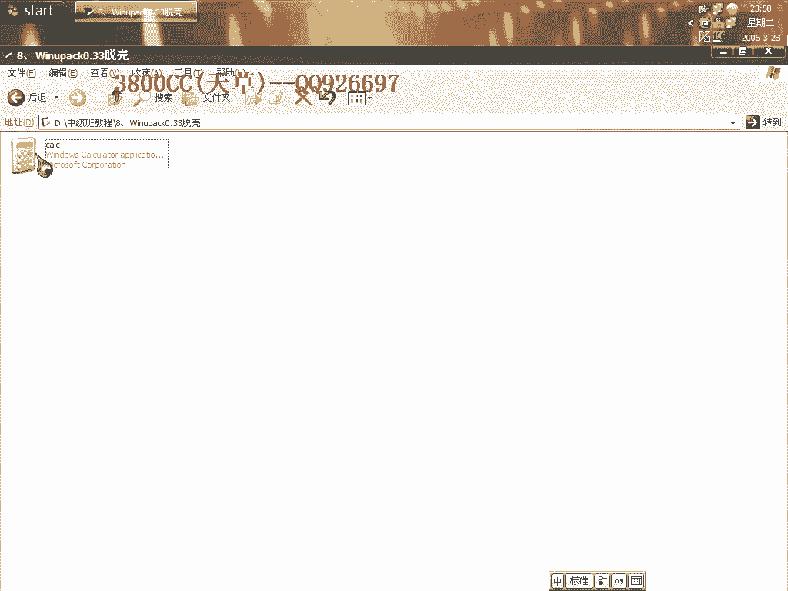
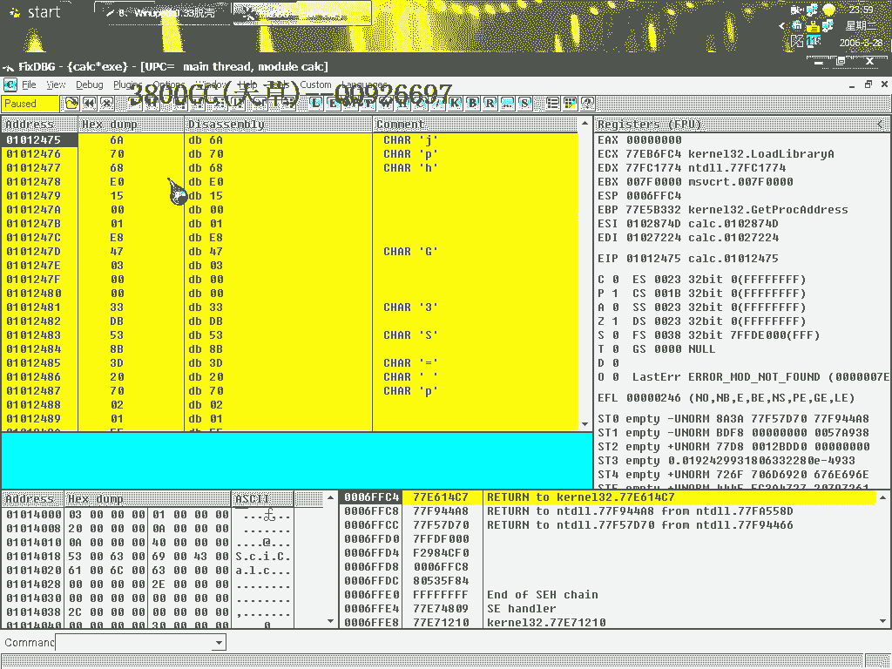
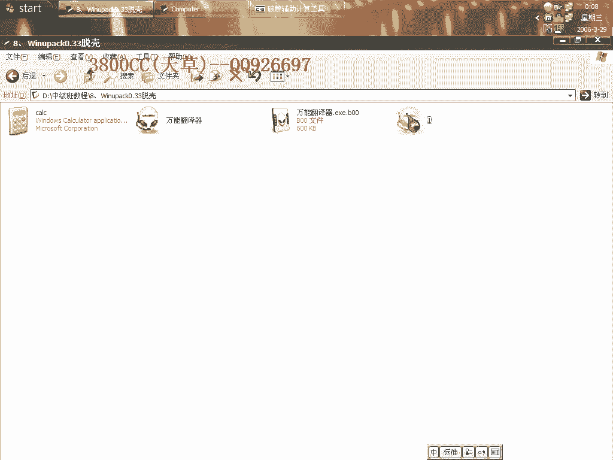
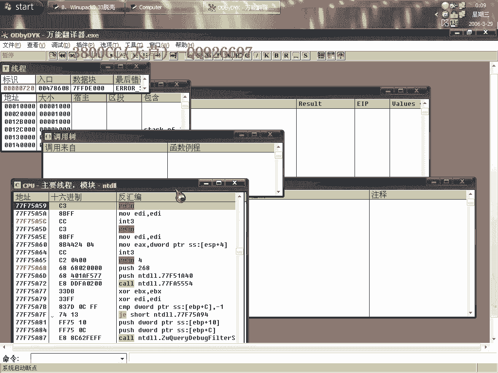

# 3800cc(天草)-天草中级班 - P8：第8课 - 白嫖无双 - BV1qx411k7kd

大家好，現在來進行我們的第八課，第八課內容是這麼一個課，這個就是像看雪的拉布包，他寫了一個托克機，這個算是稍微低一點版本的，現在是0。39這個版本，那我們就先來看一下，就是說他這個課加了課之後。

大家可以看一下，可以運行，但是我們用自然工具來打開看一下，也可以，這裡也可以找得到，那咱們來用這個，看一下他的一個PE頭，他有一個PE頭，Hex編輯，大家看到這個PE頭，PE頭全部被改了。

一般的家科軟件，一般的家科軟件，那我們來看一下，像這種，我們來看一下，他的這個PE頭，對比一下就知道，他把PE頭改成什麼樣子了，這個才是就是說，真正的PE頭，都有一個說。

This is program cannot be run DOS，但是他這個沒有啊，就是說家科的程序，都會有這個，但是他這個不同，這個就是他的一個特色了，他這樣改了之後，我們OD載入。

都有這麼一個錯誤，看一下，都有這麼一個錯誤，那我們來，先忽略一下所有的異常，隱藏一下OD，這個算是一個加密客，找到這個，大家看到了，我們PE頭有這麼一個MJ-log library，按鍵盤按著。

或者是Follow，大家往下面找，這裡，其實剛才到了那裡之後，可以來通過查找來找到他，我們來看一下，可以通過查找，在這裡下好端D，大家看到，他現在開始載入這個了，我們看一下F，大家看到，找到這裡了。

去掉剛才的那個，整個區段，整個區段，這裡下好端D，確實是F9，大家看到，這麼一個端D，這麼一個API，我們再找到端位，中斷下來了，這個時候我們F7，大家看一下。

刪除分析模塊，這樣就到OEP了，我們打開它，大家看到，可以打開這個看一下，這個peheart，他是010開頭的，並不是我們平常所見的0040那一個，所以OEP就是12475了，所有都有效。

今天用這個來託客，選上他就可以了，Modem的，可以運行的，當然我們也可以用PID來託客，大家可能還不知道ImportREC有這麼一個託客功能，他有這麼一個東西，也可以來，都可以了。

另外大家通過這個就應該知道，我們可以通過下這個端D，很快的到達這麼一個地方，GP，Library，用這麼一個端點，但是我這個系統，我發現我這個系統下這個端點不行，在其他機器上可以，大家看到。

我用這個端點的時候，ESI就變成這麼一個值了，在系統裡面找不到的一個值，我這個系統是進鍵版的，大家可以試一下，下好端點之後，大家可以試一下，中斷兩次返回，我這裡返回就是返回到這裡。

因為系統沒有這麼一個地址，大家自己下去試一下，中斷一次看一下返回是不是到達那個地方，我估計是應該要中斷兩次，這個就是我的一個小問題了，今天這個課程也就這麼多一點，這是他的一個新版本，這麼可的一個新版本。

大家自己下去再看一下，我們另外還有一點時間，我們就看一下，用單步走，因為他這樣改了之後，我們只看到一個PE頭，其他的都看不到了，我們這可以單步走，也可以單步走看一下，好了，太快了，好，直接到這裡了。

也可以的，雖然單步走也是可以的，也是可以的，另外我們用PID查的，查的是Lost in Found，但是大家看這個取檔，從PAC，應該可以判斷就是這麼一個課了，這個大家要學會判斷，另外，找一個。

找一個託課程序吧，RB4G可以，有課沒有，就找他吧，叫大家怎麼樣來手動修改PE頭吧，用他來修改吧，手動修改吧，好，這裡，手動修改PE頭，大家看到這裡到這裡的大小是，224個字節，我們來轉化一下。

轉化為16進制的看一下，好，224個，10，就是說這個長度是10，這裡的這個值就是10，就是這個長度的PE頭到這裡了，他這個跟這個區段，code段，dat段，resrc，中間要隔一行，大概16個空字節。

16個空數字節，這裡PE，PE是100，100轉化成16進制，這裡不用轉化，就是16進制，大家看一下這裡，100，相當於是0，所以他是從反著來的，就是這個位置，把它複製過來，大家要記得。

這一句英文不能全部都沒了，但是你可以留一個T就可以了，為了計算方便，我在這裡，選224個字節，現在這個PE，所在位置是60，就相當於0060，00，另外這個位置，我們要把它填充，全部都是0。

我們現在看一下這一整塊有多少個，384個字節，384個就是180，180就是0180，反過來就是8001，我們要改成8001，這個大小，我們來保存一下，保存一下，可以運行。

但是我們來看一下用OD載入會是什麼效果，咦？這好像改了沒什麼效果，另存為吧，我們來打開它來看一下，(打開)，好像是改過來了，就算改了之後。

它都會出現這麼一個錯誤提示，而且我們來看一下，我們這樣手動改的效果跟它這個可的效果差不多，但是有的時候，你想阻止別人用OD來調試就這樣改，大家自己找一個沒有可的改一下吧，你看這個原先的。

用它來看一下，好像我那個英文OD還有這麼一個功能。

這個也是改了，大家看一下。

這個樣子吧，這個是有可的，(打開)，大家看一下，這個沒有改的時候，是沒有這個錯誤提示，是改了之後的，好了今天這個課程就到這，再見。

