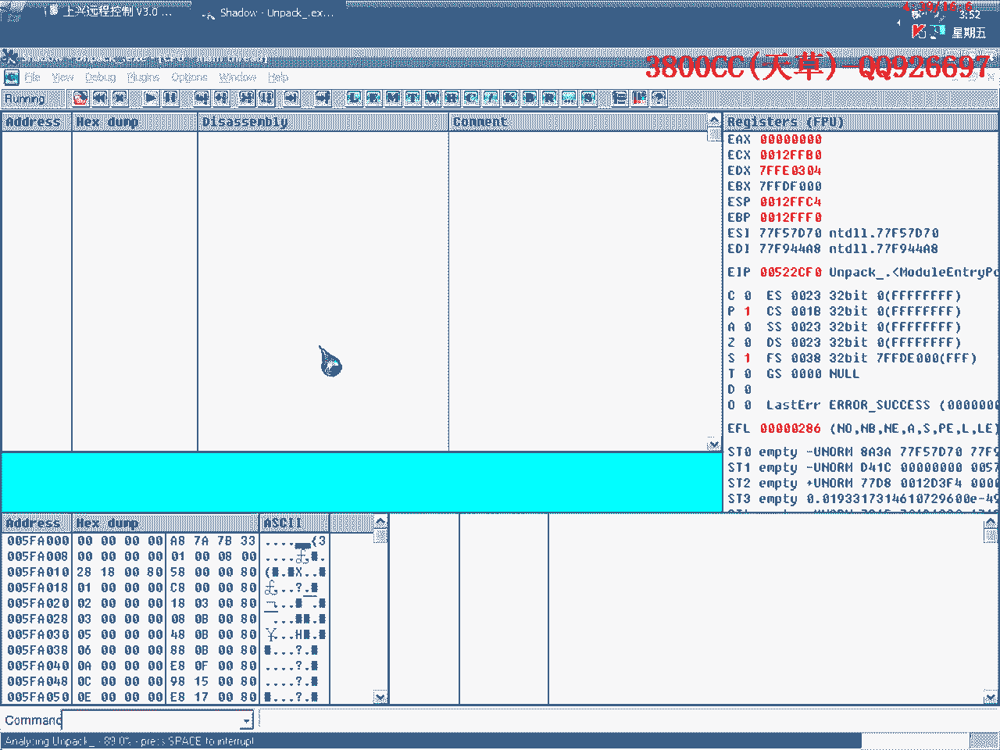

# 3800cc(天草)-天草流初级 - P10：9、脱壳1 - 白嫖无双 - BV1qx411k7qA

大家好，現在做新的一節課程，這節課程就講一下脫殼，再加上脫殼後的一些處理，目標程序是這個商行遠程控制3。0的軟件，這是一個免費的註冊版，可以免費使用，如果滿意的話，可以繼續使用，可以買新版的使用。

先用PID來查一下，小灰垃圾，汪鼎，小灰，秘界出的垃圾人物，情慾中小灰，脫殼，看到這裡就可以用ESP定律脫殼，直接到OEP了，看一下有沒有另外的方法，用兩次段點法。

這裡只有三個區段，看一下，只有三個區段，兩次段點法似乎不行，直接運行一下，用模擬跟蹤法來試一下，只有這麼幾個區段，還是不行，沒帶碼了。

走過了，用ODP載入機器卡了，用ODP來脫殼，修復。

全部都有效，接觸Lag。

用前面兩種方法，修復，也有，看一下，跳轉，GET FILE SIZE，下一個段點法，這裡應該就是一個大小的校驗了，走到這裡來，265 8304，原本這個文件本身就這麼多，這裡通過這個來看。

他就是獲取文件的大小，然後把它轉化為16進制的，265 8304，獲取了之後，大家可以看一下這裡，226，可以看一下原版程序是多少，565，565 28可以記一下，565 28看一下，不是的，也不是啊。

看一下這個是不是，也不是啊，可以這個樣子，可以這個樣子，用OPID來看一下。

這個估計應該是一個C32校驗，但是不是，289，289就是我們剛才那個文件的大小，56789，這裡他又沒有跳，關閉現成，他這裡已經開始關閉現成了，關閉現成了，我們看一下上面那個跳。

看一下是不是應該可以跳過來，可以跳，看一下有沒有跳過這裡，484B，這個跳應該可以跳過了，我們就是說，可以用來這個跳，把這個跳過去，我們再看一下吧，把兩個文件拿著對比一下就知道了。

看一下原版程序跳了沒跳。

我們在這裡做一個記錄，TALK後的沒跳，這裡也是沒跳，也是沒有跳的，這裡他這裡沒有跳，這裡沒有跳，BLBLE，看一下這個多大，這裡要是跳了的話，這裡要是跳了的話，應該可以過去了，看一下，看到了吧。

直接就過去了，沒有出現那個那個那個那個窗口了，沒有出現那個窗口了，好那咱們現在來載入一個原版的程序看一下，好看一下啊，這個下的硬件斷點還在，先到OEP去，好最後呢，到這裡來下斷。

好，把這個斷點給刪掉，自己也是直接斷下來，也是直接斷下來，現在咱們來可以來對比一下，到我們剛才看到的這裡，這裡他也是沒有跳，也是沒有跳的，這裡也沒有跳，這原程序也沒有跳的，都沒跳都沒跳。

程序校驗之後他會，大家可以看一下，PA00，565248，他獲取自己的大小，這裡他就跳過去了，這裡就跳了，BX此時的BL為0，此時BL為0，對應了之後，對照了之後我們就知道了，前面是一樣的。

前面是一樣的，咱們直接走吧，沒跳啊沒跳，也是沒有跳的，也是沒有跳的，這裡也沒有跳，獲取大小，這裡呢，大家剛才可以看到，剛才這裡跳了，剛才這裡跳了，為什麼這裡要，跳了為什麼這裡要跳，大家可以看到。

這裡是通過檢測BL，檢測BL是不是為0，如果是0的話，如果為1的話，剛才他那裡是為了1，為了1之後他就跳了，如果我們把他為0的話，把他為0他就不會跳了，那為1是怎麼來的，就是這裡來了。

咱們可以這個樣子來看一下。

咱們可以來看一下，可以了吧。

大家可以看到，咱們不修改了，來看一下，這裡原本BL為0，這裡把1送給BL之後，BL就一路保持，保持到這裡就沒有跳了，咱們把這裡修改了之後呢，咱們在這裡來下段，把這個段點給取消掉，可以節約我們的時間。

這裡讓他跳，然後BL裡面就一直保持為0，這裡就跳過去了，所以說大家要學會對照。

這也是解除自交頁的一個方法，當然我們一般解除自交頁呢，是通過兩個OD，兩個OD來打開一個加可程序和一個拖可後的程序進行比較，這個方法比較巧一點，現在我給大家介紹的這個方法比較巧一點。

那麼今天這個課程就到這，大家也學會分析關鍵代碼，因為從這個地方看到，如果BL為1的話，他就沒有跳了，那麼BL為1是從哪裡來的，咱們就從上面開始找了，發現這個地方才是關鍵，當然也可以通過包破這個地方。

把這個地方改成jump也可以，但是這個地方是最合理的，最合理的，好，那今天課程就到這，再見，這個呢，原版的程序，我就把這個一起打包吧，有的朋友可能會用得上，然後通過可以來修改他，可以來修改他來做這個。

做DIY版，DIY版本，好，那我們這個用這個PID來插的，這個區段還是區段沒有變，咱們可以來改一下，改成自己的區段，區段，然後選第一個區段，然後編輯區段改成自己的，這樣就可以了，記得要點保存，確定。

再來插一下，就是了，看到了，好，那今天這個課程就到這，再見，(字幕製作/時間軸：秋月AutumnMoon)，这就真的是自己的梦想。

