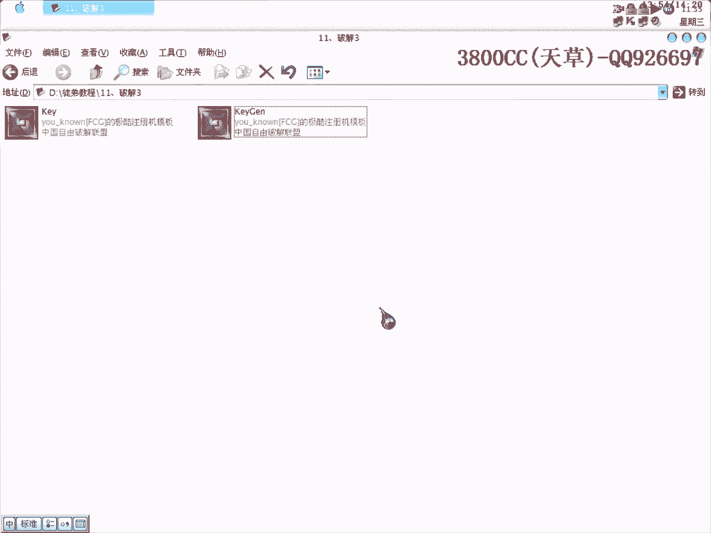
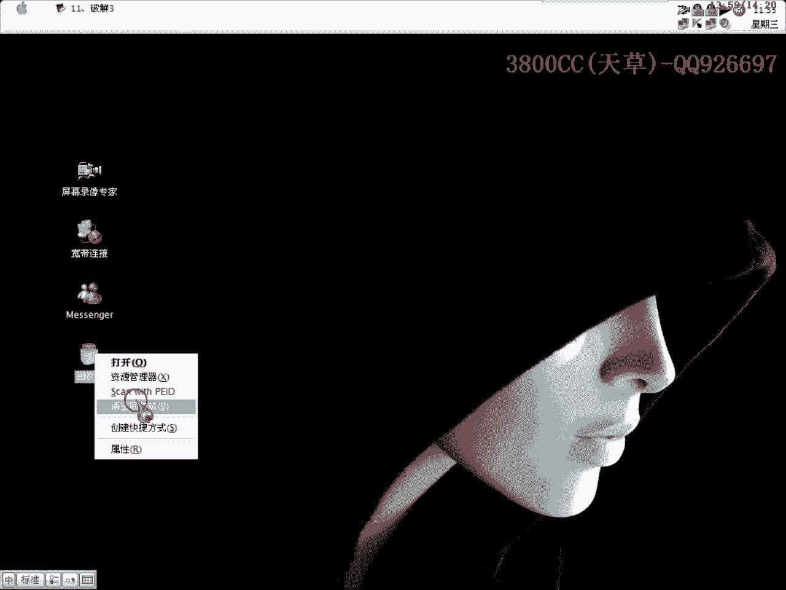
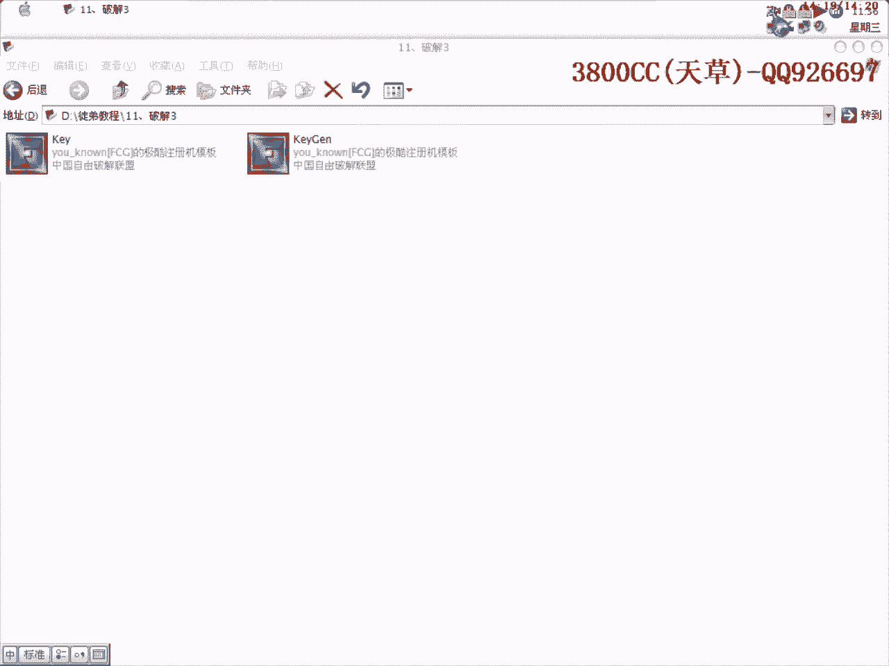

# 3800cc(天草)-天草流初级 - P12：11、破解3 - 白嫖无双 - BV1qx411k7qA

大家好，现在来进行我们的第11课，第11课也是和第7第8节课有一些类似，但是并不是完全一样的，咱们来看一下，这个目标程序是这个，这个是我今天装这个屏幕录像转家的时候，发现了一个注册集，它这个注册集呢。

大家可以看一下，有一个不同意和一个同意这两个框，就是说我们点同意，然后就进去了，点不同意就退出来了，点不同意就退出来了，这是我呢，修改了的，直接运行之后就出现了一个注册集的一个主画面，这个是加了可的。

我首先就把可拖掉了，拖掉就是为了配合一个效果而已，首先Od載入，同样啊，同样，首先运行，好，再点F12，修靠，这个注册集的声音很吵啊，很吵啊，咱们来看一下能不能把这个声音给去掉，很吵啊，现在看一下吧。

看一下吧，看一下啊看一下，这现在找不到啊，现在找不到就不用管了，咱们在这里呢，就直接进去啊，这里就是我们调用我们那个程序的一个call啊，这里我们进去啊，进去看一下啊，看一下这个call里面是哪个啊。

哪个是具体调用的啊，啊，好，好，就是我们刚才那个地方是一个具体调用啊，具体调用，好我们进去，进去啊，这里，好大家注意看，注意看啊，这里，点同意啊，点同意，点同意这个时候004083F0就是唯一啊。

咱们来第一看一下啊，第一啊，这里唯一了，注意看这个地方是注意看的啊，咱们这里再走一下啊，这里是没有跳啊，这里呢，就开始出现我们的一个这个框了，这里呢，就开始出现我们的一个这个框了，这里呢，这里呢。

就开始出现我们的一个这个框了，这里呢，就开始出现我们的一个这个框了，这里呢，就开始出现我们的一个这个框了，这里呢，就开始出现我们的一个这个框了，这里呢，就开始出现我们的一个这个框了，这里呢。

就开始出现我们的一个这个框了，这里呢，就开始出现我们的一个这个框了，这里啊，这里啊，我们把这里给录不掉看一下，录不掉看一下会不会有声音啊，很烦的，好没有声音了，这个人就方便多了，这样就不影响我讲课了。

这样就不影响我讲课了，刚才那个位置啊位置，好，把这个记下来吧，00405215啊，00405215，这里出现声音，我们把给把它给录不掉了啊，录不掉了，这里呢是出现了一个具体的一个就是一个对话框。

注意看这里啊，首先这里004083F0这里是为0啊，咱们进去看一下啊，进去看一下，进去看一下，他肯定会给这个004083F0付一个值的，他这个值取决于我们到底是按同意还是不同意。

他这个值取决于我们到底是按同意还是不同意，好，如果我们这里点同意看一下情况，他这里反过为一啊，反过为一了啊，啊，这里反过为一，然后再给EX啊，一再给EX这里就自然就没有跳了啊，自然就没有跳了。

所以就出现我们一个调用对话框，这里应该是如果点同意啊，大家在就是说在学习的过程当中啊，也要养成这种良好的习惯，做笔记啊，或者是做注释，这样方便我们，在下一次啊，下一次，进行那个跟踪啊。

我们在这里来来看一下，我们点不同意，看一下情况，不同意他这就是反过为0了啊，反过为0，那么这里自然就跳了啊，跳了啊，那也说我们把这个地方漏掉，看一下情况啊，看一下再看一下情况会是什么样子的啊。

就是说不让他出现这个框了，好，大家看到了啊，一点他鼠标就转了一下，他就自动退出了，这是怎么样种情况呢，嗯，好，大家来看一下后面的代码就知道是怎么样种情况了啊，啊，这里是具体调用我们刚才那个框的啊。

具体调用我们刚才那个框的，然后呢，咱们来看一下下面这里呢，如果我们点同意自动就掉自然就调用那个注册框，然后如果不点点不同意的话，程序就退出来，大家看到这是有一个退出函数了，这是有一个退出函数，所以说呢。

如果我们把这里给直接录不掉了啊，好来看一下录不掉了，走，EX为0，这里就自然就跳了啊，跳了，然后就会，这个程序就会退出来了啊，程序就会退出来了，退出来了，大家看到了吧，就是说如果我们把录不掉。

然后他程序就默认默认返回为0了，默认返回为0，刚才那个断点怎么取消掉了，这就是这个就是那个在实际编程过程当中啊，一种约定俗成的返回为0，就是说，他要通过我们的一个鼠标点击鼠标点击简称为就是说鼠标事件。

然后鼠标事件通过鼠标事件来返回为1还是返回为0了，这个呢，我在后面会实际用那个实例用Delphi来说明这个事情啊，这里出现一个对号框，就出现这个鬼对号框了啊，好，我们呢，这里呢，点同意。

点同意他这里自然就返回为1了啊，返回为1，大家可能会说我们就直接把这里修改为1不行吗，大家可以来试一下，可以来看一下结果，这里呢，他本身就是1了，本身就是1，Copy，可以来试一下啊。

看一下情况是怎么样子的啊，这里始终返回为1啊，始终返回为1，我们点不同意也是一样的啊，不同意居然也可以进去啊，不同意也可以进去，点同意呢，也可以进去，这是怎么样的情况呢，大家看清楚了吧。

就是我们始终把这个地方定，把这个地方定为1了啊，定为1，就是说不接受这个call返回来来值，大家再来看一下，点不同意也是一样进去的啊，但是如果是原版的话，点不同意就退出来了啊，退出来了。

这里呢就相当于是把这个地方啊，把这个地方直接改成，直接就是loop掉了啊，相当于就是把它给loop掉了啊，这个程序还写的不是怎么好啊，一般像这种内存地址的话，它这个值会变动的啊，就是说会流动的。

就是说第一次是，比如说第一次是为为0，然后呢第二次呢就通过一些程序运行啊，通过运算之类的，然后又清零，然后再又加入其他值啊，也就是说我们在这里写为写入1的话，按道理的话，应该是不可能达到什么效果的。

因为它这个1会可能会被，第一可能会会被就是说，程序在运行的过程当中给清除掉了啊，清除掉，但是就刚才我们修改了，修改了一个效果来看的话，这里它这个1是常住的啊，常住的，好，我们把这里给直接loop掉啊。

这里要loop掉的，不要让它出现刚才那个框啊，这里呢，也是要loop掉的啊，也是要loop掉了，因为刚才我们只loop这里呢，它这里就默论防火为0了，这里就跳了，跳到直接退出程序了啊。

刚才我们大家也看到了啊，就是说修改程序，方法很多啊，方法很多，但是就是说方法很多，但是目的是一样的，就是为了去掉这个电话框啊，大家看到了啊，直接就可以了，我这个呢是没有去掉那个声音的。

我这个是没有去掉声音的啊，好了，今天这个内容就是大概这么多了，就是大概这么多了，主要就是为了让大家熟悉一下，另外一种类型的，就是通过一个对号框，然后有几个选项按钮啊，这样我们来准备去掉这些东西啊。

去掉这些这些这些鬼东西啊，非常麻烦啊，因为每次要运行要注册的话，非要点一下同一页啊，因为每次要运行要注册的话，非要点一下同一页啊，这是什么鬼组织啊，FCG的啊，FCG的组织啊，同不同意都无所谓啊。

只要能够使用就行了啊，今天课程就到这啊，今天课程就到这啊，后面会给大家讲到啊，为什么会出现这种情况，就是说点同意反复为1，点不同意反复为0，因为这是在程序编写的时候啊，程序编写的时候，有一种约定速成的。

在Delphi里面有这样一种语法，就是说x，我复制一个x，然后呢，这是Dialog，box，然后是怎么样，怎么样的啊，yes啊low啊之类的啊，yes low啊之类的，这个在后面会给大家讲到啊。

会给大家讲到，然后就是说，他默认了yes为1，no是0，这里也是一样的，因为这个程序是，VC++写的，VC++写的，但是就是说，程序那种语言有一种，共通性啊，共通性。

好，那今天课程就到这啊，再见啊，大家回去下去之后啊，下去之后好好的练习一下。

好好练习一下，这个要，大家一定要，提升一种，自己的一种，什么追踪的能力啊，追踪的能力，也就是说代码分析的一种能力，好再见啊，謝謝觀看，小萌萌。

