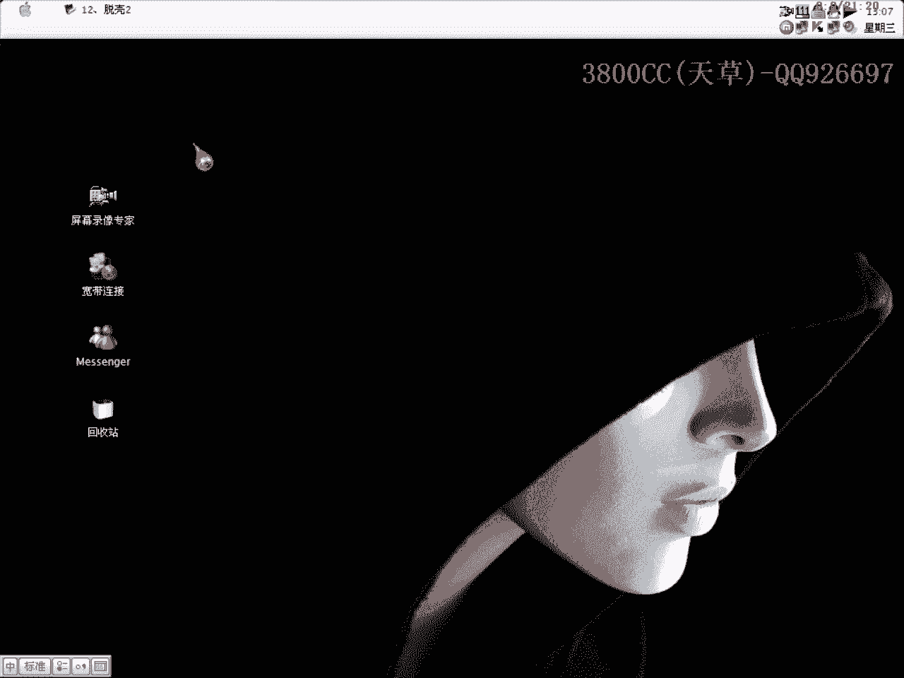
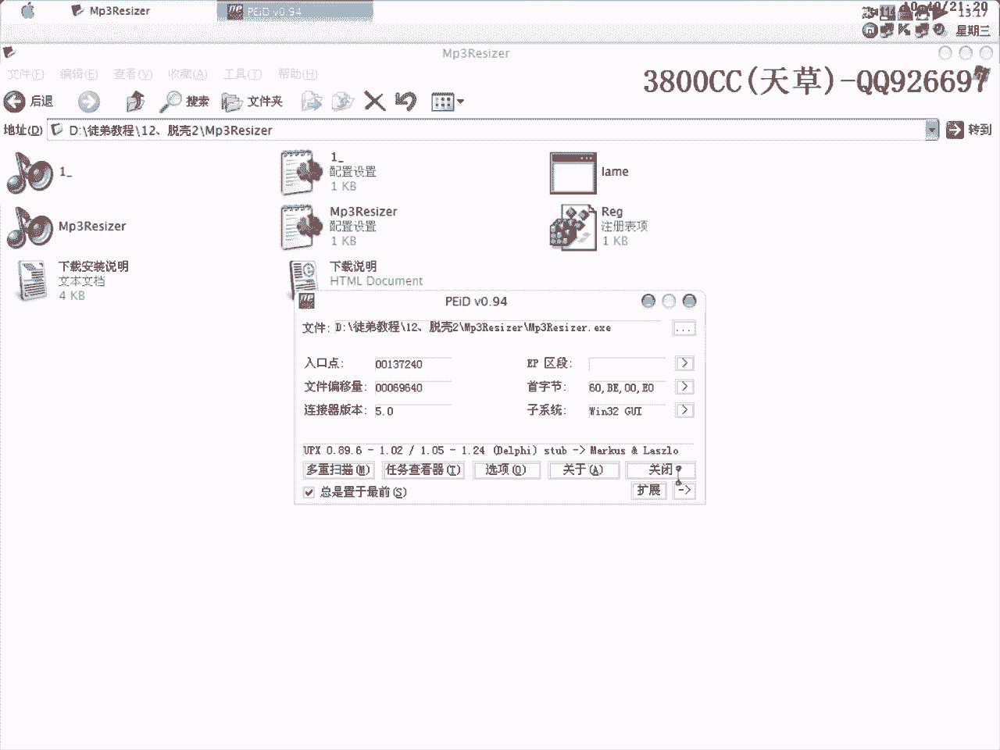
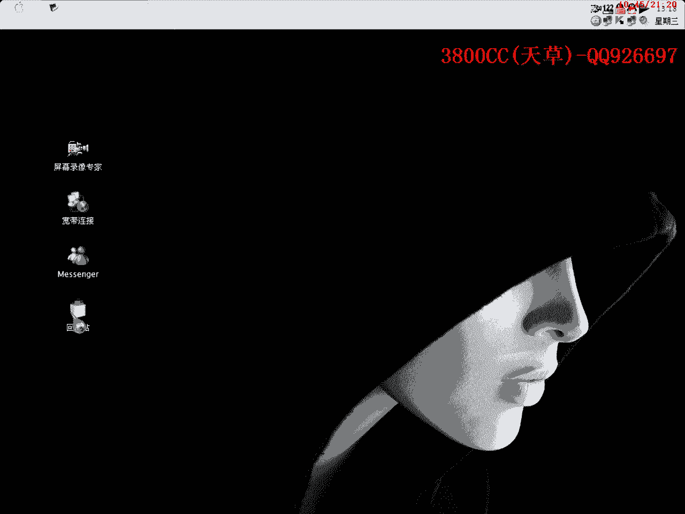
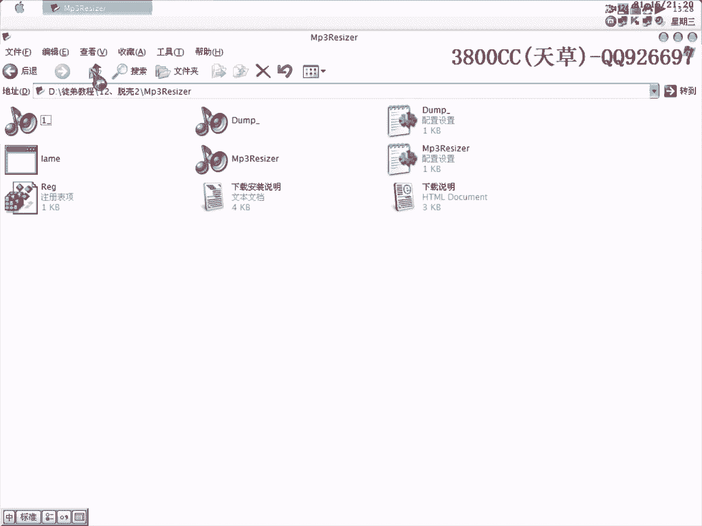

# 3800cc(天草)-天草流初级 - P13：12、脱壳2 - 白嫖无双 - BV1qx411k7qA

大家好。

現在進行我們的第12課，第12課，我們第12課呢，介紹，有三個例子，這個是雲的等待，雲的等待，遇到的一個例子，然後呢，這個就是寒寒的心，這個就是我的一個兄弟，先來看這個，用PID查可，是這麼一個軌可。

這一個可，用OD載入來看一下情況，他這裡有一個錯誤提示了，錯誤提示了，這個呢，就是因為這個程序，已經就是說，PE頭已經被修改了，我們來看一下PE頭的情況，我們來看一下，可以看到了吧，就他這個PE頭。

已經完全被改了，完全被改了，正常的一個加可程序的PE頭呢，拿這個來看一下，他的PE頭，就知道了，大家看到了吧，正常的PE頭有這一句的，有這一句，CP是最開頭的，他這裡就是把這全部都改掉了，所以。

也是造成我們，造成我們OD載入的時候，會有那麼一個錯誤提示，當然這個也是他，防破解防脫可的一種手段，但是我們還是有辦法來制服他，這裡我們設置一下OD，把這個OD裡面那個，按鍵設置在系統端點。

我這裡已經是系統端點了，好，然後直接打開內存，或者是，在這個PE號的007，就是說0040這一段，下直接F2下端點，好，shift+F9運行，這樣就來到了一個程序的領空了，我們現在單步F8了，好，走。

在這裡F4，因為今天是上個例子，我就，不，慢慢講了，我就動作快一點，錯了錯了錯了，這個忘記刪掉了，不好意思，重新來過了，原先的那個文件忘記刪掉了，直接單步走，重新來過了，原先的那個文件忘記刪掉了。

直接單步走，原先的那個文件忘記刪掉了，直接單步走，單步走，這樣很快可以到達OVP了，這樣很快可以到達OVP了，這裡是F4，大家也有一點脫殼的基礎了，這裡就返回到OVP了，PB，明顯是PB寫的。

我們現在來脫殼，OVP是1528，因為程序是VB寫的，它的一些系統函數只有這麼一點，因為程序是VB寫的，它的一些系統函數只有這麼一點，它的一些系統函數只有這麼一點，這樣脫殼成功了。

大家就可以自己做一下免殺，大家就可以自己做一下免殺，這樣脫殼成功了，這樣脫殼成功了，大家就可以自己做一下免殺，大家就可以自己做一下免殺，這個殼是被我的卡8給報毒的，這個殼是被我的卡8給報毒的。

我現在是把卡8給禁用了，我現在是把卡8給禁用了，現在來看一下這個，現在來看一下這個，這個是NSP，這個是NSP，但是有一個overlay，但是有一個overlay，我這個已經脫好殼了。

我這個已經脫好殼了，我今天剛好兄弟讓我脫的一個殼，我今天剛好兄弟讓我脫的一個殼，我今天剛好兄弟讓我脫的一個殼，我今天剛好兄弟讓我脫的一個殼，我今天剛好兄弟讓我脫的一個殼，我今天剛好兄弟讓我脫的一個殼。

come on，大家看到這裡，我們在counter直接加，就是counter+S，就是counter+S，因為我的這個有一個Q的，是這麼一個快捷鍵，所以我就是用鼠標來點，POP，AD，POPFD。

大家看到了這個方法我也說過，裡面和裡面的相對應，外面和外面的相對應，直接在這裡，發下斷點，shutdown+F9，斷下來之後取消斷點，這樣到OEP了，分析一下，程序好像有點，沒有完全解碼的那種樣子。

沒有完全解碼的那種樣子，用這個，用這個，用這個，來脫殼了，現在來修復，修復了，大家看到了，只有這麼一點系統還是有問題的，有問題了，先不用管它了，修復完成之後，修復完成之後，咱們來運行看一下。

這裡invalue就是，delta in the file，就是在文件裡面，錯誤的數據，這個明顯，因為查核我們就知道，是很明顯有overlay的，修復的時候只有那麼一點指針，所以說，肯定是有問題的。

咱們來用，NodePE，我這個要放到郵件裡面去，這裡要用到它，用NodePE來打開它，加可的程序，去斷，找最後一個去斷，就是這裡的nsp4，R of Z，這兩個相加，等於28400，也就是說。

附加數據的地址，起始地址就是28400，記下來就OK了，咱們現在來用，WinHUX，關於這個WinHUX，我在原先的課程裡面講，我用不了WinHUX，這裡有一個朋友給我提了一下問題。

就是這裡面的設置問題，選項，然後這是，看一下是哪裡，忘記了，看一下，這裡面，在選項，常規裡面，這裡面的這一個，它是用於臨時文件和備份文件，它這個目錄呢，目錄是，這裡系統上面有的一個目錄，如果沒有的話。

當然就出錯了，這裡要有，隨便你指定什麼目錄都可以，廢話不多說，我們直接來到28400，在上面，28400，就這裡開始了，點上這個6，右鍵選快開始，然後再直接拉到最下面，點上這個2選快結束，再點上。

點這個右鍵，在我們選的右鍵這裡點編輯，複製Ctrl+C，這樣就可以了，打開，打開，在，打開我們剛才修復了的，直接拉到最下面，拉到最下面，這裡，右鍵，看一下V，OK了，現在就可以保存了，保存了一個。

update，exe，可以關掉了，再來查可，多了一個overlay，看一下原先沒有的，沒有torque的，這裡面，update，可以運行了，這個附加數據，好像在黑鷹的課程裡，也給大家講過。

我也不具體再說了，再來看一下這個，這個是我們今天一個重頭戲，這個程序有點怪，很怪的，這裡是我已經拖好可了，雖然說是一個，是一個upx的可，但是還是有一點。

那麼一點小技巧在裡面的，好。

等一下再說一下，這個程序怪在哪些地方，好，首先直接載入，就是在用OD，載入它的時候，有點卡，系統有點卡，這個問題我還沒找到，先不管了，用esp定律吧，這樣就可以直接，到達了，看這個文件。

看它這個頭就知道是，BC++的，在這裡我再用這個，為了對比一下，我先用，notepad來拖一個，錯了錯了，notepad來拖一個，這樣大家就可以知道，這個程序怪在哪些地方，好，我再用這個，拖殼插件。

這裡rebuild，先不要修復了，dump，這裡要分清楚，notepad這個是notepad拖的，這個呢，這個是我插件拖的，咱們再來看一些效果，要看一些效果，這裡呢，因為程序是BC++寫的。

程序是BC++寫的，這裡可以非常清楚的，BC++寫的，或者通過這個入口可以看得到，我們這裡呢，就需要給大家講一些新的內容，手動查找IAT，手動查找IAT，這裡我們首先呢，在程序裡面找一個。

系統的一個函數，這裡就是我們可以找到的，這個就是一個系統函數，咱們用右鍵，for no 或者是按鍵盤上的enter，大家看到了，這些都是一些系統函數了，咱們拿到最上面來，拿到最上面這裡。

這裡就是IAT的起始位置，就是41010C，-40000，也就是1010C，也就是1010C，1010C，這個我們需要改，這個我們需要改，然後拉到最下面來，拉到最下面來，看一下結果，這裡是10118。

咱們來計算一下，計算一下大小，起始呢，是10111C，然後開始的，就是說，開始是10118，我們來計算一下大小，我們來計算一下大小，ddc，ddc，這個大小是ddc，我們改一下，把這裡要改一下。

然後再點get in force，沒有，沒有無效的，咱們來修復一下，抓取一下，來看一下情況，這就是手動查找IAT的辦法，運行一下，大家看到了，這裡出現一個錯誤提示，出現一個錯誤提示，都有這種錯誤。

都有這種錯誤，這就是這個程序，奇怪的地方，奇怪的地方，OK，它這已經開始載入了，載入到那個，載入到那個程序了，這個程序不光這麼一點奇怪，還有更奇怪的，後面會，後面慢慢來，後面慢慢來。

這是我們在修復的時候，修復的時候，把這裡要改成，改成1000，好，再來抓取一下，看一下情況，可以再來看一下情況，還是不行，這就是這個程序奇怪的地方，奇怪的地方，好，我們來解決一下，就是說有時候脫殼。

破解是一件非常非常煩的事，煩的事，我們需要耐心，這個1就去掉，重新來過，看一下我們剛才那個斷點，刪了嗎？重新來過，這時候，用這個，拖一下，再來修復，再修復，1200，這裡呢，剛才我是教大家怎麼去計算。

其實呢，一般啊，塞子填1000就可以了，當然也會出現一些，在某些程序上會出現一些，無效的函數，但是呢，塞子填1000就可以了，看到了吧，這樣就可以了，很奇怪的，要經過兩次，好像就是說程序。

好像需要經過兩次才解碼，再看一下情況，我們還是用英文的，用英文的，看一下，直接來修復，也可以，也就是說程序在脫殼的時候，要注意就是說，它這個需要，你拖兩次，第二個呢，就是手動查找IET的技巧。

也可以這樣，到了OEP之後，手動搜索，見call就進，見到call就f7進去，這樣就可以找到，當然我們這個程序，是一下子就找到了，然後呢，還有其他的，需要進，要多進幾個call才可以找得到，我這裡呢。

因為IET的位置是，1010C，RAV是1010C，我在這裡自動把它減去了一個C，減了一個C，我們可以把這個C加在一起，來看一下情況，也可以的，也是可以的，就是說在IET的時候，可以適當縮放。

當然適當縮放，可以就體現在size上面，因為我們剛才計算的大小，是DDC，縮放成1000，這個是沒有什麼影響的，就是說在某些程序，你如果縮放了之後，它會出現一些無效的指針，你把它cut掉就可以了。

這個在後面也會給大家經常提到，手動查找IET是一門技巧，現在呢，來看一下這個程序，奇怪，奇怪在什麼地方，也行吧，收入註冊嘛，隨便收入，要等一下，謝謝你的註冊，非常變態，再來運行一下，有點卡，看一下。

運行了之後，它就直接註冊了，還有就是，它這裡是註冊給這個，並不是我剛才輸入的那個名字，非常變態，我不知道這個軟件到底是怎麼搞的，然後呢，它的註冊表，是保存在這裡面的，我來把註冊表刪了之後，刪了看一下。

倒出來，我把它刪掉，再來看一下，它還是沒有註冊的，非常非常的奇怪，我導入了之後呢，它就註冊了，非常變態的，第一次遇到這種，今天內容就這麼多，關鍵是這個，大家可以拿去看一下，看一下這兩個文件。

在你們那裡能不能跑得起來。

好 再见，拜拜！