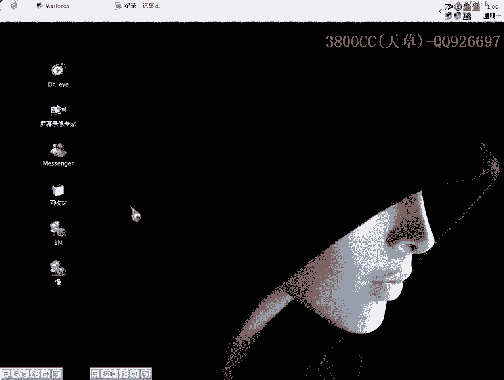
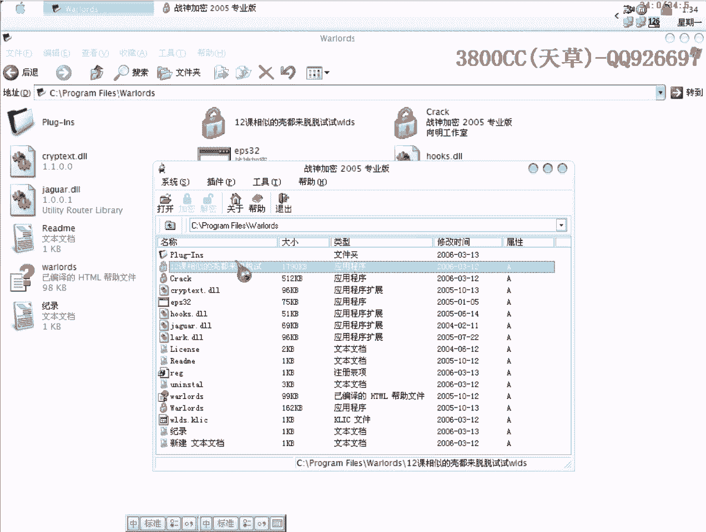

# 3800cc(天草)-天草流初级 - P15：14、破解5 - 白嫖无双 - BV1qx411k7qA

大家好，現在來做一下第14課。

剛才那個教程錄了一半，錄了一半就斷掉了，講了大概有快一個小時了，那我這集課現在就來說一下這個，好，首先來查一下課，是Asparag的課，然後呢，用這個算法工具，來看一下有什麼算法。

大家可以看一下這些DLL的，這個也是有可的，這個是B4++的，這個B4++的，這個作者呢，作者還是有那麼一點水平啊，居然會兩種語言啊，兩種語言，所以說，所以說，剛才我也稍微就是分析了一下，分析了一下。

是這幾課，應該是容量還是比較大一點，容量是比較大一點，因為它是重啟驗證的，可以來看一下，我現在這個已經過期了，已經過期了，已經過期了，但是我現在這個破解的文件是可以用的，破解的文件是可以用的。

變成灰色了，變成灰色了，然後呢，關於啊，這樣，好，先來脫課，先來脫課，我們就直接用ESP定律，用ESP定律來，定律來，大家看到啊，這個入口啊，入口是B4++的特徵。

剛剛在群裡面看到那個KK糖和阿刀的討論，哪個是入口啊，這個就說明，還不是非常用心啊，我在第一節課，在前面，在破解的課程裡面，就很早很早就說過了啊，大家自己去找幾種，就是不同語言啊，五種啊，一般是五種。

找一下程序，然後記一下它們一些，入口特徵的一些情況啊，一些樣子，就像他們剛才討論哪個是入口啊，就有點不太好了，不太好了，這就和SERAC是一樣的，是一樣的，我們需要找到一個系統的API，也就是說。

在import。iec裡面所說的IAT了，這個就是一個了，我們右鍵跟隨或者按，基本上按的都可以，往上面找，找到，這個，就是API這個表的一個開頭，這裡就是開頭了，大家可能會說。

那麼IAT的這個起始位置就是311，311，430了，這裡還需要補充一下的就是，在一般情況下，我們要對它進行一下放縮，我上一個講那種啊，就是說，大概的一種情況，這個也是可以的，但是標準的情況而言的話。

我們還是要對它進行一下放縮啊，這個樣子選上第一行，右鍵，內存地址，這裡，好，往上面看到，看到，這裡是00，我們一般是要放縮四個字節啊，放縮四個字節，也就是說我們應該取這個字節，但是為了計算的方便。

我就取這個，放縮八個字節，好我們記下來，記下來啊，28，最後我們找到最下面，好這裡，也是一樣的啊，這裡啊，我們對它放縮四個字節，這個，這個76呢是90c，那個這個就是90p了，90b，大小就是1413。

我們脫殼啊，脫殼，現在來，現在來進行修復啊，修復，OEP是1438，點一下這個，然後再填上這個，31，然後大小，點，先輸一下啊，Cut掉，好，現在我們看一下，可以運行啊，可以運行，把這個給刪掉啊。

現在我們來破解它，破解它，載入這個，點上嗎，好，首先我們查查一下這部分，看一下有沒有什麼可疑的啊，因為我們已經確認了啊，已經確認程序是重啟驗證的，現在就需要再進一步確認的就是啊，這樣，重啟驗證。

我在黑鷹課程裡面有講的，第一個就是一種類型註冊表的，可以通過下這個端點來找到，它需要讀取的一個註冊表，這就是文件，文件分IIII還有DLL，或者是其他的一些文件，除了DLL之外。

都可以用bit這麼一個端點來查找到，查找到程序會讀取哪個文件啊，DLL就另當別論了，好，大家再來說一下，就是說，程序在運行，這個值，會變化的，會變化的，會變化的，也就是說，程序在運行的時候都會。

就是說獲取這麼一個值，大家又看到這裡有啊，再生加密什麼，還有還有還可使用，什麼次啊，什麼次，那我們就可以在這個地方，放機進去啊，這裡有，我這已經那個了啊，已經就是說，註冊好了，好我們找到程序頭。

好這裡啊，這裡我這裡已經下好斷點了啊，看一下，好，另外的，因為我們現在是需要攔截啊，需要去攔截程序啊，程序在運行之前啊，就是說，程序介面出現之前，我們需要攔截他，那我們現在怎麼樣攔截了，這是一種方法。

這是一種方法，因為程序在運行的時候，會讀取有多少，還有多少次可以讓我們使用嗎，所以我們在這個地方就可以攔截到，還有另外一種方法，打開滴滴，點到過程裡面，賣找到主窗口，就是這麼一個form create。

就是窗口創建啊，我們也可以選擇這個地址，選擇這個地址，也可以讓程序斷下來，也可以讓程序斷下來，這裡面也可以在這裡面下斷點，這裡面就斷下來了，但是呢因為這個代碼，就是說，有點遠，有點遠，我們就需要。

這些都是白白走過，白白走過了，沒有什麼重要的東西去分析，我們就從程序運行的時候，會讀取有多少次，那個地方開始攔截，開始攔截它，就這個地方攔截住了，好，我們當然不走了，但不走，注意了，注意這個窗口。

這個窗口，這個窗口，四個窗口，這裡有一些主窗，這21具體21是什麼，我就不太清楚了，所以我在群裡面就問QQ糖，這個程序本身提供多少次試用，我記得應該是提供21次試用，這裡，我這裡有說清楚，把它分開。

加密，支付寸，加密支付寸，還有個16禁止支付寸，這裡可以進去，大家可以自己進去瞧一下，這裡是關鍵地方，非常可疑的，說它可疑，從哪幾個地方可以看得出來，大家可以往下面走，第一個，Brain in C。

就是說經過下這個斷點，下這個斷點，下這兩個斷點，並沒有發現有可疑的文件，有可疑的文件，所以我們可以確定是通過DLL，通過DLL寫入，寫入DLL，然後配合註冊表，配合註冊表來存那個計數。

就是存那個還有多少次使用，這個也是可疑的，出現註冊表的值，這裡會出現註冊表裡面的值，註冊表具體在哪個位置呢，我這裡也已經給大家導出來了，這個是我在使用了幾次之後的一個值，這個值會變化。

你每使用一次這個值都會變化，大家注意看，好，這也是比較可疑的，這也是可疑的，這裡有幾次試用，這有幾次，這都是比較可疑的，我們可以先來改一下，先把它改成jump，直接讓它跳過去，或者這個樣子。

我們重新來過，在這裡面下斷點，這個地方下斷點，把原先那個斷點給刪掉，這個刪掉，這個也刪掉，把這個也刪掉，好 重新來過，好，這樣就斷下來了，我們把它改成jump，直接運行，大家看到了，沒有註冊。

沒有提示要註冊了，這個就是非常非常的爽了，這裡就是關鍵了，我們先把它保存下來，至於分析的話，我們也可以來分析一下，我們可以來分析一下，彈幕走一下，看一下為什麼，這裡它開始讀取註冊表了，大家看清楚了。

這就是一個固定的值，在我這個地方是這個，在你們那我就不知道，是不是這個一個固定的值了，讀取版本，出現註冊表裡面的值，可以來看一下，就這麼一個值，一樣的，這裡-8，-8次，這個地方顯示了一個值。

這個地方顯示了值，就應該是，應該是我們使用多少次了，它這裡就是說，我們已經超過使用了8次，這個大家要看清楚，可以在這裡面，大家記清楚這個地方，應該是使用的次數，這個大家去驗證一下。

因為我這個已經被用完了，老點老點就點完了，這個是現在的TrueInt，就是註冊轉化為整形的，-8，這個大家自己去驗證一下，是不是使用的次數，這個是整形轉化為註冊型的，-9，這裡又變成-9了。

這裡是什麼軌跡，也不太清楚，因為文件，大家可以看一下文件使用的是，三種加密，三種MD5和MRTES，這三種加密，writeString，寫入字符串，好，大家看著，這裡是D-register，註冊了。

setEnable，這裡有多少次，就是說它會設置標題框，標題像text的，data。exe的名字，就這麼一個，就這個名字，然後它會讀取這個目錄，它已經把這個目錄給連起來了。

大家看到myplanesload，它開始就加載這個，兩個插件，大家可以單步走，注意這些就是函數，好，這裡大家看到了，它開始運行了，但是沒有任何反應，我們重新來過，重新來走一遍，還是單步走。

這裡大概就是說要走兩遍，走兩遍才可以看到效果，前面都是一樣的，這裡開始復十次了，剛才運行了一次，這裡呢，剛才給大家講了，這裡就是註冊表的，應該是註冊表裡面的值了，看一下，這是上面出現的一個值。

上面出現的註冊表裡面的值，已經過了，這裡呢，現在是已經，我這裡現在已經無效了，有些效果看不到，本來就是說，這個是重新驗證的，本來說現在還不講，因為這個設計都比較深，黑鷹裡面課程，也是後面才講到。

一些重新驗證，但今天既然大家就說拿出來了，那就來講一下，這個當然還得靠大家自己去分析，因為現在好像有些東西跟不出來了，過期了，這裡已經過期了，好像就跟不出來了，我們這個樣子試一下吧。

知道這個地方是關於次數的，應該是把那個次數進行加密了，這個值改一下，現在來運行看一下情況，可以17次，可以的就說改註冊表，那我們現在來看一下，把改最大，有多少個，行不行，跟著相同的F，這裡是次數，錯了。

雖然說提示錯誤，但是他已經沒有次數限制了，這個也是一種破解的方法，因為他現在讀取的註冊表，因為他註冊表的這些值是通過算法來的，他現在這個值進行解密，不適合解密的算法，所以還是提示錯誤，那我們就這樣。

既然他提示錯誤，那我們來看一下，這個脫口的文件也是一樣的，提示錯誤，OK，我們來，這裡就先，既然知道這裡，我們就另外一種方法來破解，看一下行不行，好，暫停，對戰，還行不行，調用，這裡，直接運行。

這裡就斷下來了，剛才是這個地方，是哪個地方出現錯誤，我們就把這個跳跳過去，看一下，還是提示錯誤，既然斷下來就肯定是提示錯誤了，先禁用一下，免得到時候忘記地址，可以啊可以啊。

這個地方我們還是可以把它改成這樣的，我們第二種方法破解，剛才是改那個跳轉，不對啊，這個是，他現在是到這個組件裡面去了，那我們就可以做一個不停看一下，看一下行不行，這個也是一種思路，還蠻好玩的，W。

就選他吧，添加，400，就不知道行不行啊，因為他現在是已經到了一個系統的領空了，一個長度，現在指令是1B，現在指令是74，我們先這個地方下好斷點，我等一下要把成語重啟一下，不行，就是說他對他無效啊這個。

對DLL進行那個是無效的啊，我笑了，我們先就在下面吧，斷尾斷尾下斷點，看一下能不能返回到系統的領程序的領空，直接去的加F9，斷下來了啊，斷下來了，這個錯誤啊，肯定就是這個來調用的啊，這塊調用了。

那我們就在這裡面下斷點，OK重新來過啊，這個我們讓他跳，取消掉，可以好像可以吧，好像又是另外一種破解思路啊，看一下行不行啊，就是說每次每分析一次啊，這個怎麼又是到系統那個這個裡面來啊，真是不給面子啊。

那我們就先不管了啊，我們在這個裡面下斷點啊，這個下斷點重新來過，看能不能返回到程序的領空啊，關鍵是能夠返回到程序的領空才是最好的，一直都是在，這個啊，這個垮了這個垮了，因為現在這個跳轉沒有跳了啊。

我們再返回一下，這個跳轉，看一下這個卡啊，注意啊，就加一個標記，我這個地方加一個標記而已，把其他的斷點都給取消掉啊，就留著一個，現在回到程序的領空了，這個沒有跳啊，我們把它改成降跑看一下啊，讓它跳過去。

也就是說它不讓它這個靠來調用啊，如果行的話不讓這個靠來調用，我們現在來看一下，可以啊可以可以，這個是第二種破解方法啊，第二種的，就是說通過修改註冊表，通過修改註冊表，把這個註冊表內，雙擊導入。

雙擊導入之後，然後再配合使用它，就可以了啊，配合使用它就可以了，就是說思路很多啊，思路很多，這種第二種方法，破解方法也是剛才突然想到的，突然想到的，所以就是說大家多跟幾次，就可以發現一些問題。

好現在來教大家怎麼樣來修改一下啊，因為現在是爆破嘛，現在爆破有幾個地方啊，好修改一個啊，就這個unregister，然後就是這個註冊，不太好看啊，不太好看，所以我們來用它來修改啊，用它來修改，先用它。

好，RSC啊，剛才那個呢，這個文件啊，是在關於裡面啊，那就是我包的box啊，雙擊，這裡大家可以看到，授權給誰啊，unregister，那我這裡可以改成自己的名字了啊，好，可以來看一下效果啊。

這裡已經改好了，好，現在呢，我們就用另外的啊，另外的繼續，接著改這個，找到register，因為我們想把那個註冊按鈕變回灰色，我們在這裡加上這一句，enable，加上這一句，現在呢。

我們又想把那兩個編輯框變成灰色，也在這裡加上這兩句，保存更新，現在來看一下，都變成灰色了啊，這兩個都不能輸入了啊，這個樣子就好看一下，看一下，好了，我們今天這個課程就這麼多啊，就這麼多。

思路是非常非常多的啊，大家回去之後啊，再好好地就是說考慮思考一下，這裡有我本來說打算講一種方法的啊，現在是講了兩種方法，剛才這裡呢，為什麼會為什麼要寫這個啊，也來講一下吧，啊，這樣課程已經拉得很長了啊。

我們用Belfry來實現一下，開啟有點慢，隨便啊，首先來一個編輯框，再來一個註冊按鈕啊，OK，我們現在呢，來運行一下，首先看一下初始的效果啊，這些都可以輸入的啊，註冊按鈕也可以按的。

我們現在需要把這兩個都變成灰色，第一種方法，找到他們的屬性，Enable屬性，把它變為False，假，這呢，也是把它變為False，再來看一下效果，不能輸入的啊，不能按的，我們現在用代碼來實現。

先把這個編回來啊，編回來了啊，FormCrate雙機，在這個我們建的這個組件的雙機啊，進去，edite就這一個組件的，False就這樣，然後呢，Button這樣，這是什麼意思呢，這個就是說。

edite這個組件的這麼一個屬性，這個這個這個，點呢代表可以理解為D，這麼一個屬性，複製為假，可以來運行一下，這裡應該是，Derf裡面應該是這個樣子，大家看到了啊，看到這個就是變回灰色了，變回灰色。

Derf裡面會，那個複製語句啊，複製語句是一個貓號加一個等於號，所以我們剛才就寫在那個文件裡面是這樣去寫的，好那麼今天這個課程啊課程就這麼多，大家下去呢，好好的那個弄一下弄一下，這另外啊。

我這發現就是說，這個這個軟件好像只能對DLL進行加密啊，因為，選上他選DLL才可以加密，然後如果是寫上EXE呢就不能加密，這個我就不知道是不是因為，沒有破解完成，還或者是本身就是這個樣子。

大家在還有適用的次數的時候啊，大家可以試一下，看一下你們對EXE加密啊，好那今天課程就到這啊。

