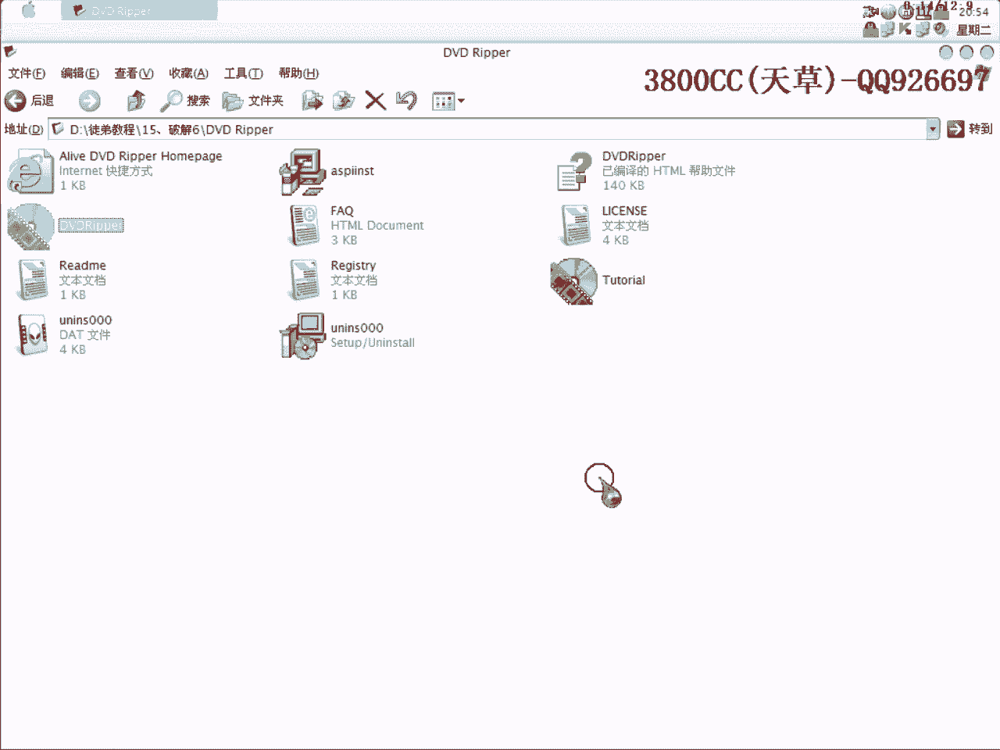
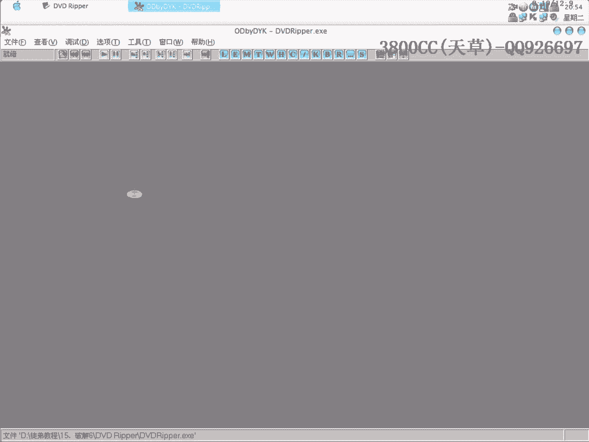
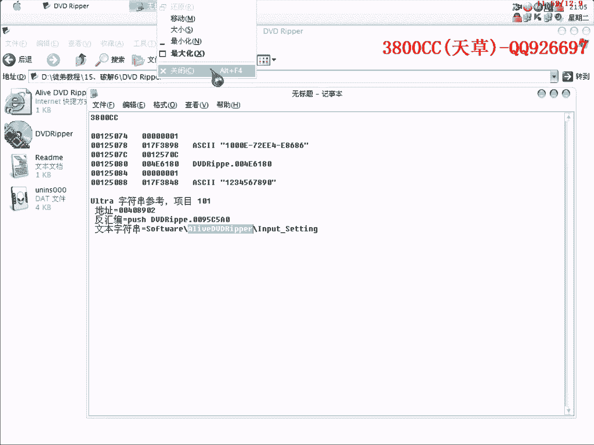
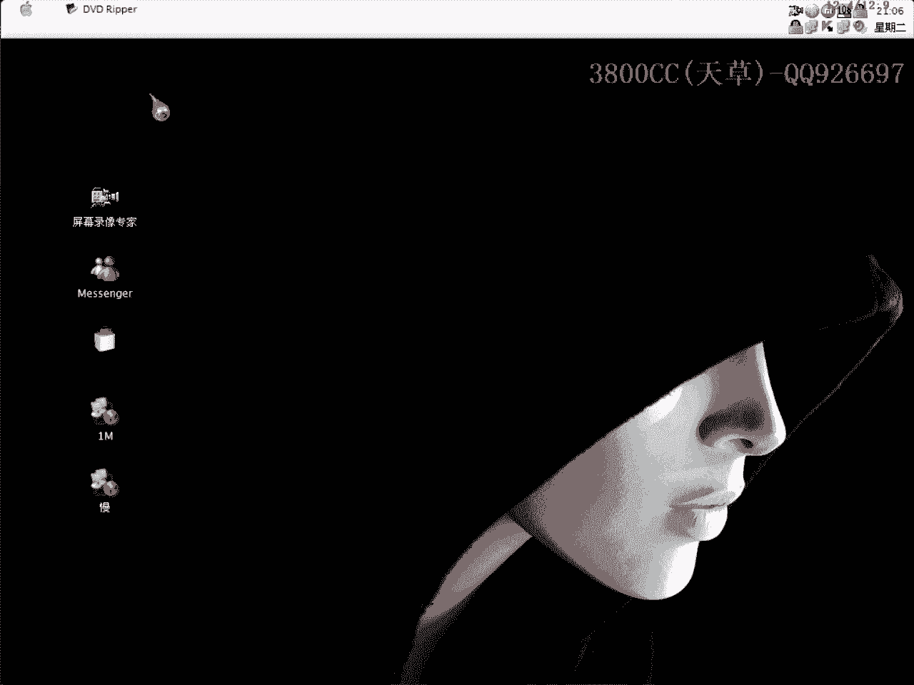

# 3800cc(天草)-天草流初级 - P16：15、破解6 - 白嫖无双 - BV1qx411k7qA

大家好啊，现在来进行我们的第15课，第15课呢，就是说我先以这个程序作为一个实例，然后呢，再看一下有没有时间，用这个程序来作为实例，这个是一个PDF转化为Word文档的一个程序，这个是3。4。0的吧。

我们这个声音调一下，现在看一下，它这个一运行就要注册的，然后呢，我这个已经破解了的，这里也是已经注册了，我现在就是说给大家讲一下，怎么样来破解它，是微笑C++的一个程序，直接运行，输入一个邮箱，确定。

提示序列号错误，直接暂停，现在这个地方挡住了，我们重新来一下吧，把这个拉到下面来，这个样子吧，暂停，这个地方又挡住了，重新来过吧，到这里面来吧，先确定，暂停下来之后，直接到这个里面去，这里做好记录。

这里是序列号错误，这里要感谢您的注册，看到了吧，那我们就这个地方下断点，直接运行，点注册，这样就断下来了，我们现在F7进去看一下，这里面可以看到一些算法，大家可以自己去弄一下，大家看到了。

这里EX和EX疑惑，我在会变课里面有讲的，两个相同的疑惑之后变为0，变为0之后，这里就开始测试是否为0，如果是0的话就跳，刚好就符合了这个0，这里就跳了，大家应该知道了，应该知道我们要改哪个地方了。

这里我们把它给，这个样子，先保存一份吧，看一下效果，看一下效果，没有跳了，感谢您注册了，这个我们就不用管了，这个方法是这个样子，现在来接着看一下这个程序，查一下课，没有课的，再看一下算法，找不到算法。

咱们就用OD直接载入来看一下。

刚才上一个程序。

推出的时候有一个退后框，大家可以当做课后练习，把那个退出的退后框给去掉，我们直接去新这个，点Register，这里提示错误，提示错误，当然我今天就给大家说一下思路，就按提示错误。

有的朋友可能就是说第一下，咱们来查找，就按第一种思路来查找，Invalued，这里大家看到有正确和错误的，这里就是我们的关键，重新来过，大家看到了，因为这个已经是非常常见了，不是这个跳，这里是正确的。

这里是错误的，刚才这个跳是把错误的也跳过去了，这个也是把错误的跳过去了，仔细看一下是哪个，咱们就先到这个地方来下断点，大家看到了，这里就出现了我们真正的注册码，3800cc对应的一个真正的注册码。

就是这个，那咱们继续弹幕走，看一下结果，大家看到了这个跳转，这里把ESI和EDI相比较，我们先这样来，大家再仔细看清楚一点，这样就断下来了，这里就是把ESI和EDI里面的一个值，这个是我们家码。

这个是真正的注册码，这个是真正的，真正的注册码呢，放到ECAX里面去，再call一下，push的，pull back的ECAX，弹到，弹出ECAX里面，这里我们要是把这个跳转改一下，再来看一下。

这个没有跳，这个是第一种方法，通过查找的方法，我们接着呢，用我所说的第二种方法，注册了，注册放到哪里去了，看一下是不是在这里面，没有啊，没有，也没有，也没有啊，咱们到注册表里面找一下吧，不然的话。

下一种方法就讲不了了，(咳)，(咳)，(咳)，(咳)，(咳)，(咳)，这么容易就注册了，真是受不了，(咳)，(咳)，(咳)，看一下是不是这里呢，看一下，看一下，这个它是哪个文件。

我们导出来看一下它是在哪个目录，(咳)，(咳)，(咳)，ADRP，好像不是这个啊，不是这个啊，咱们继续找，(咳)，(咳)，(咳)，这回苦了我大姨啊，(咳)，(咳)。

看一下它这个里面有没有什么可参考可提示的，(咳)，(咳)，(咳)，(咳)，这个，soft，然后是A开头的，不是这个里面，那就是在这个里面了，(咳)，(咳)，(咳)，(咳)，(咳)，(咳)，(咳)。

这个啊，(咳)，这个应该是一个就是存放注册的地方啊，output，(咳)，(咳)，这个里面肯定没有诶，A开头的也没有，这个里面呢，A开头的，也没有，(咳)，(咳)，(咳)，(咳)，(咳)。

搜索不到了就完了哦那后面就是说其他的方法大家自己就自己去摸索了，(咳)，(咳)，(咳)，这么容易就注册了，(咳)，(咳)，(咳)，那还是我就说口头的阐述一下啊阐述一下后面两种方法大家。

自己去找一下就是说首先运行然后呢，提示错误提示错误之后然后F12中断，F12暂停下来再打开对战打开对战，这样也可以找到关键的地方另外一种方法呢是也是，F9直接运行听清楚这两种大家自己下去做一下。

然后F9直接运行然后输入假的用户名和注册码，然后呢直接啊BP啊，Mercy Box啊，下好断点之后下好断点之后再按那个注册，这个样子就可以断下来了断下来之后啊，这个也可以找到关键的地方。

大家下去弄一下下去弄一下这个太好意思了，等一下再找一下吧再仔细找一下看一下这里的地方要行的话把后面两种方法又补。

一下啊好了今天这个课程就到这啊再见。

