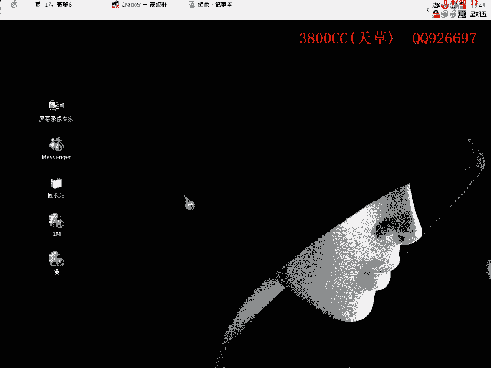
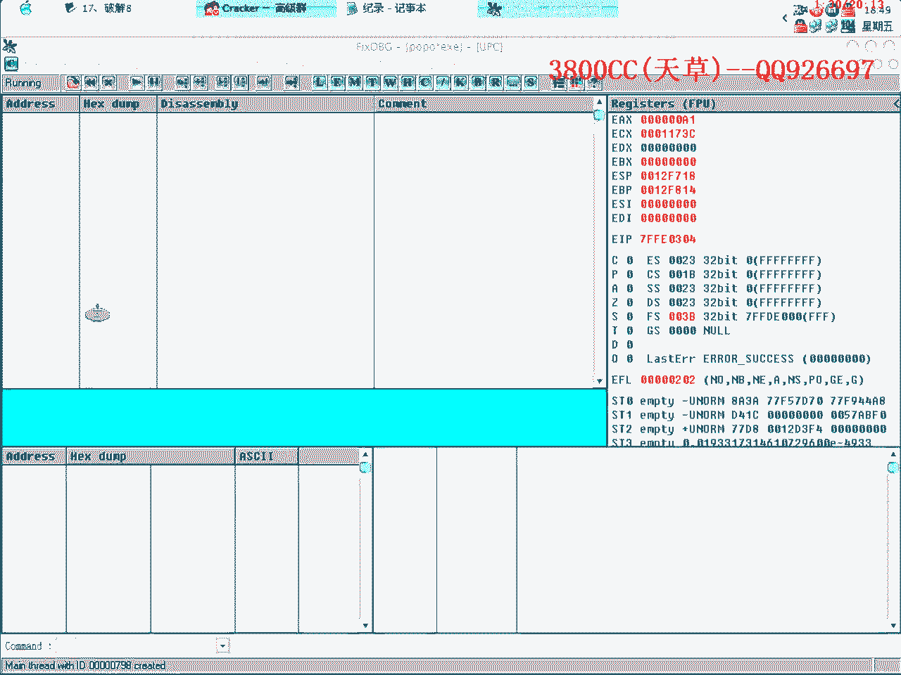
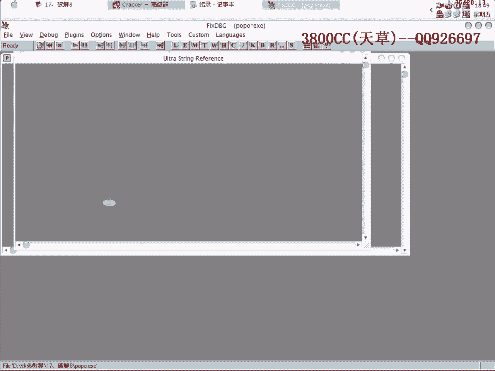
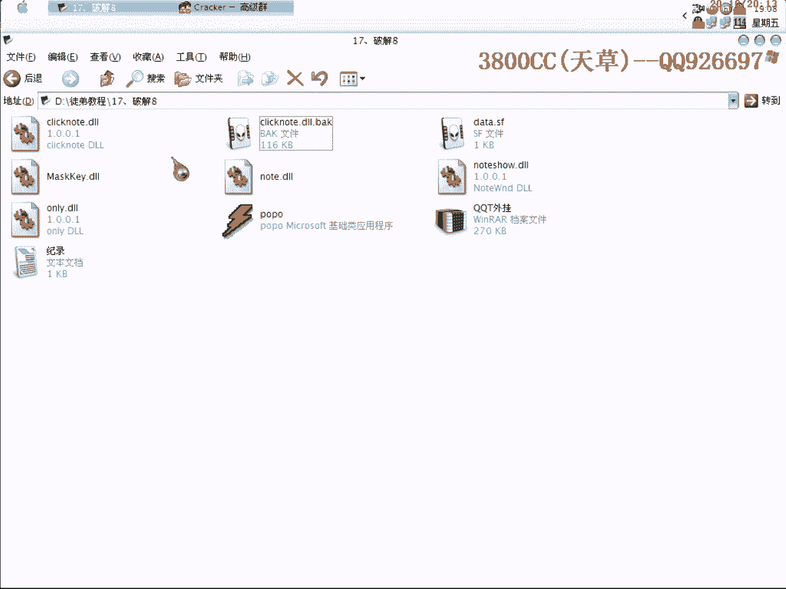

# 3800cc(天草)-天草流初级 - P18：17、破解8 - 白嫖无双 - BV1qx411k7qA

大家好，现在来做我们的第17课。

第17课就是原来等待他给我的一个，什么KK糖的一个外挂，这么一个外挂，这里只能使用100次，我们今天就暴力破解它，让这个次数不要动，首先我们得弄清楚这个外挂是怎么样一个注册机制，怎么样分析，大家看我。

首先咱们来查一下课，是VC++的，咱们现在来注册一下，点确定之后就退出了，很明显，它退出了也没有提示错误也没有提示正确，但是就是我们下一次启动之后呢，人员还是没有注册，说明这是一个重启验证。

重启验证我在上面课程也说过有几种，注册表还有DLL还有INI文件的，那就是说我们这个是怎么样的呢，那我们就一一来分析一下，它这里有反调式机制。

那我们来查一下，看一下，大家可以仔细来看一下，在这个里面没有什么可用的资源，就是说里面没有注册表值之类的，我们可以这个样子来试一下，Open，注意这个要大小写要分清楚，OpenR，这个大小写要分清楚。

我们来试OpenR，难道错了，看一下，这里没有，就是说这个程序它这里面没有这个根子，没有这个键，没有调用到这个模块，所以我们下不了断点，所以那个注册表通过注册表来重启验证的这个我们就排除掉了。

现在我们来看一下，Create，用这个来看一下，它在load DLL，它在多取一些DLL，这个大家可以记清楚，它在读这个，我们看一下这个是不是我们的一个，它一个技术的。

大家看到了这样打开之后没有任何东西，就说明这个不是关键，它并不是把次数放到这个里面来，大家看到了，启动之后，一直到启动，除了读那个DLL之外，就是读这个，那就是说明说明这DLL有那么一些嫌疑。

有那么一些嫌疑，我们现在怎么来看呢，对DLL进行查询一下，可以来看一下，看一下对号框，这么一个对号框，大家看到了，那也就是说这里有技术次数，那也就是说这个DLL是一个关键了，次数。

它是关于次数的一个关键，那我们打开下一个DLL，这个没有什么资源，这里查看资源就是变灰色，这个没有资源，来看一下这个，这个也没有什么资源，看一下对号框，大家看到这个是注册的，注册的，ONLY看一下。

这个也没什么资源，大家刚才看到，有这么两个关键，一个是这个，一个是这个，我们现在就是说破解它，去掉那个次数限制，就用到这一个，因为这个是关于次数的，这个是关于注册的，那我们现在怎么办呢。

因为它是重启验证，我们就必须在程序启动之前，让它给断下来，这里我这里已经说做好了一些记录之类的，我们现在今天就要结束到这么一个段点，这个段点是对IMI文件的，因为刚才我们就是说分析过了。

注册表已经排除了，然后呢，Create File也排除了，那就是出了DLL，因为现在这个是跟DLL有关的，但就是说，它并没有对DLL进行写入，但是它还有一个次数的记录，通过什么来记录呢。

我们可以试一下IMI，它肯定就是说，可能就是说利用一个IMI文件进行记录，至于这个IMI文件在哪，在哪里，我们现在还搞不太清楚，可以从这个里面找一下，看能不能找得到，能不能找得到，从这个里面，找不到的。

找不到，我们可以查一下，查找不到的，这里有一个IMI，但就是说文件名没有，没有文件名，没办法，这个我们也是，这个线索也断了，好，那我们就直接下这个段点，下这个段点，看一下，下段点之前。

把前面的那个给清除掉，因为我们前面下过这么一个，create的这个段点，很多，就不上了吧，我操，直接shift+F9运行，这里就断下来了一个，好我们段点先不要取消掉，先不要取消掉，我们，按下F9，走。

大家看到，这里有一个8C8，这里呢，有一些支付串，像OD里面，计算器还有什么，这些对战里面提示的一些支付串，这些大家都要记清楚，大家看到了，这是十次，现在我们看不到了，刚才大家可以看得到。

就是说我们已经就是使用了九次，在这一次运行就是第十次了，再按下F9，再来走，这是第十一次，大家看到了这个呢，就是获取一个次数的很明显啊，获取次数的，很明显啊，这是获取次数，大家看到了。

就是说这里获取的次数，然后呢，大家看到了，就是说，写入啊，开始写入，就是说如果我们这个地方没有跳的话就写入错误啊，没有跳就写入错误，这里呢，也是，这两个data文件，这个可以作为我们等一下。

等一下可以再进一步分析的一个依据啊，大家看到现在这个模块，还是在这个模块，click note，就是这个模块里面，跟我们刚才分析的是没有错误的，是一样的，就是说这个是通过，这个是来计数的，大家看到了。

可以再走一下，这个估计是作者的一个什么，估计是一个鬼什么东西啊，也不清楚，81%，这也是我们一开始就看到的一个数字，他次数已经获取了，次数已经获取了，也没有什么，现在也没有往下面跟的话。

也没有什么关键的地方，我们再来跟一次，大家注意眼睛看清楚啊，好我们先来看一下有多少次啊，这是第12次啊，12次好，看清楚，好，放回，这仍然是88，这个88估计就是说。

就我估计就是说他把这个次数通过某种运算得到一个数字啊，大家看了这13次啊，刚才是二次，我们这次运行就是13次了，这个没错的哈，再次放回，这里呢，我们可以进去看一下吧，进去这里是获取次数，我们进去。

看一下，这里没有什么重要的东西啊，没什么重要的东西，大家看到这里次数啊次数，Post Quit，Post Quit就是发送你是quit的，quit也是退出啊，退出信息发送退出信息啊。

昨天那个摇下就是问我就说这一些，API，API就是说有没有API的一个输插表，这个呢我就不需要了，因为这些东西都是每个啊，那个那个表每个就是说API呢都是一些英文单词所写的，我这也非常熟悉了。

大家去找一下吧，找一下就是说熟悉一下，搞多了自然就记得啊，昨天摇下就说不会这么多不会都记得吧，就是说只是一种疑会吧，一会看这个名字就大概知道是什么意思了，这里14次已经没有什么可更的啊。

我们把这里给loaf掉，不让他回去就OK了，这里呢我就把这个保存一下啊，保存为另外一个名字，因为我们现在修改的是这个DLL啊，这个是我们刚才修改的，那这个呢我就buff一下。

因为他到时候读取的名字是要一样的啊，我们再来看一下，大家看到变成零词啊变成零词了，不管运行多少次都是零词，刚才看到的信息这个是做的qq啊，这个是做的email啊。

这样就可以达到我们去掉次数限制的一个目的，那我们现在就是说对要对他进行修改一下，怎么样来修改呢，因为这个样子不太好看啊，现在就是说教大家，顺便教大家使用一下工具啊，这个我们双击进去，双击啊双击。

我们在选项，比如说这里要一个啊，把这个我们改掉啊，这里再移动一下啊移动一下，因为这个是VC写的啊，再移动一下，把这个也移动了，好，这个呢，大家看先选上它，然后再点这个，非小而非小，可是可是的意思。

就是我们现在可以用眼睛可以看得到，我们把它去掉，看不到了，这个也去掉，这个呢，人员去掉，这个去掉，这个去掉，这个就留着吧，留着我们就是说作为修改一个广告的，好，这样就可以了啊，这个呢就去掉吧。

让它不要看到了，这样就说大概的已经就差不多了啊，差不多了啊，就这个样子了，我们就保存一下吧，覆盖一下，看一下啊，大家看到了哈，就这些，然后这些呢，大家可以自己找着去啊，去找的那个修改一下啊，修改一下。

然后呢，还这里的一个啊，未注册，未注册，我找了一下，大概就是说，是在这个主程序里面啊，主程序里面，用这个啊，用这个U32来了，好，我们去啊，这个，一波解啊，未注册一波解，替换替换了啊，已经替换了一次。

OK保存一下，再来看一下，哎，好吵，不对啊，看一下吧，刚才可能没那个啊，替换啊，全部替换，另存为吧，这个好像不对啊，重新打开看一下，搜索吧，查找未注册，这里写上查找阿斯卡马，他就是这一个啊。

这个这个不是我们要找的，不是我们要找的，那这个看一下是在这个里面，大家看到啊，是在这个里面，替换啊，替换，错了错了，这里改成一波解了，就是这么一样些东西啊，就这么一样些东西，呃，这个呢，大家到时候。

就是说做练习的时候啊，做练习的时候，就把这个包解开啊，这个包解开，因为这两个已经被我修改了，然后这个记录呢，记录我就这些东西都删掉吧，我这里写好啊，中断两次，就是因为第一次我们要跟啊。

我就就是说我在自己破解的时候，直接中断两次就可以了，直接中断两次，第一次跟的啊，然后又返回来一次，这是第二次知道了吧，这个是对NI的，大家不要把它一起下断啊，那今天这个课程就到这啊。

再见。