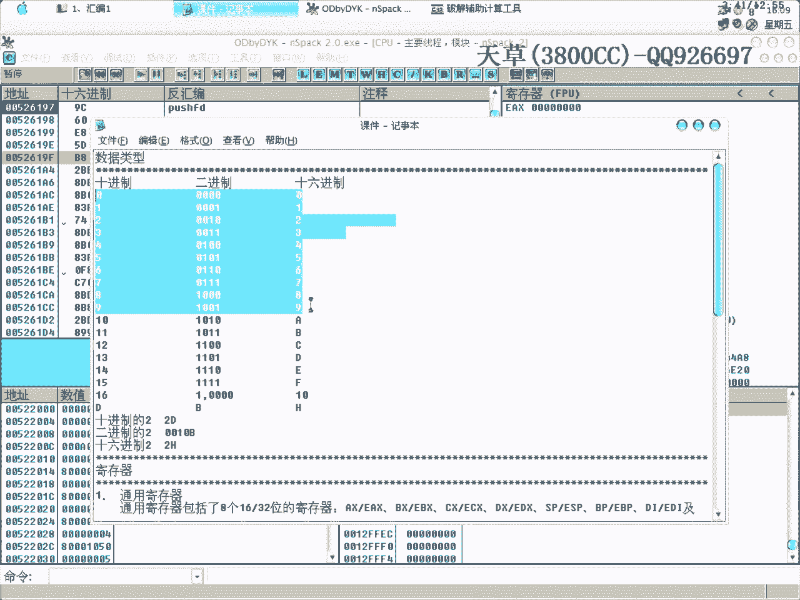
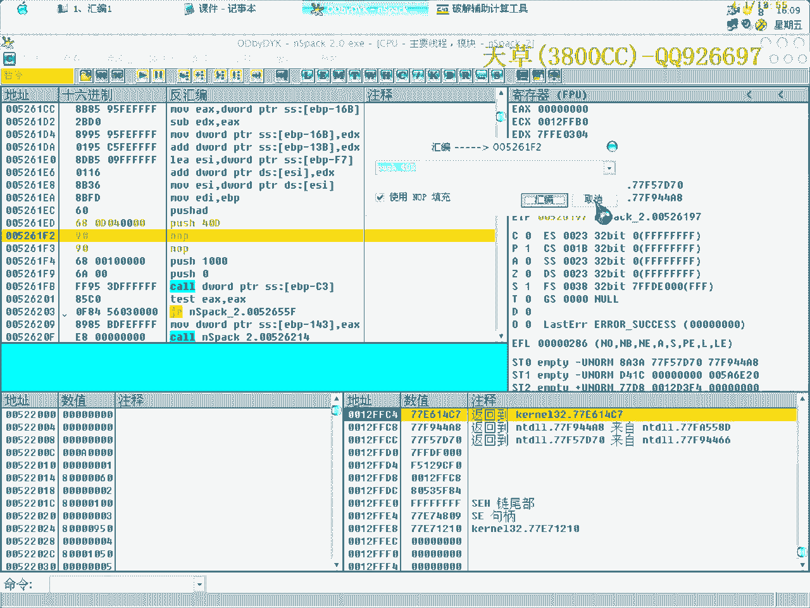
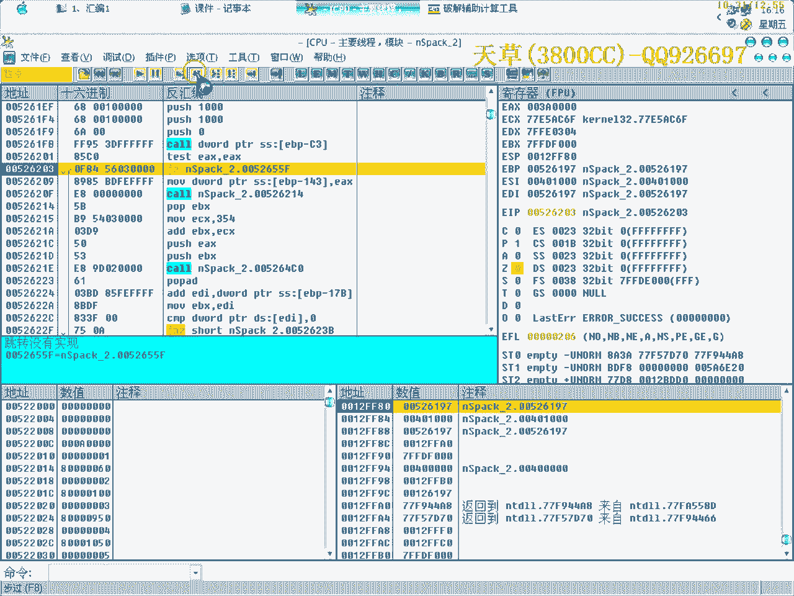
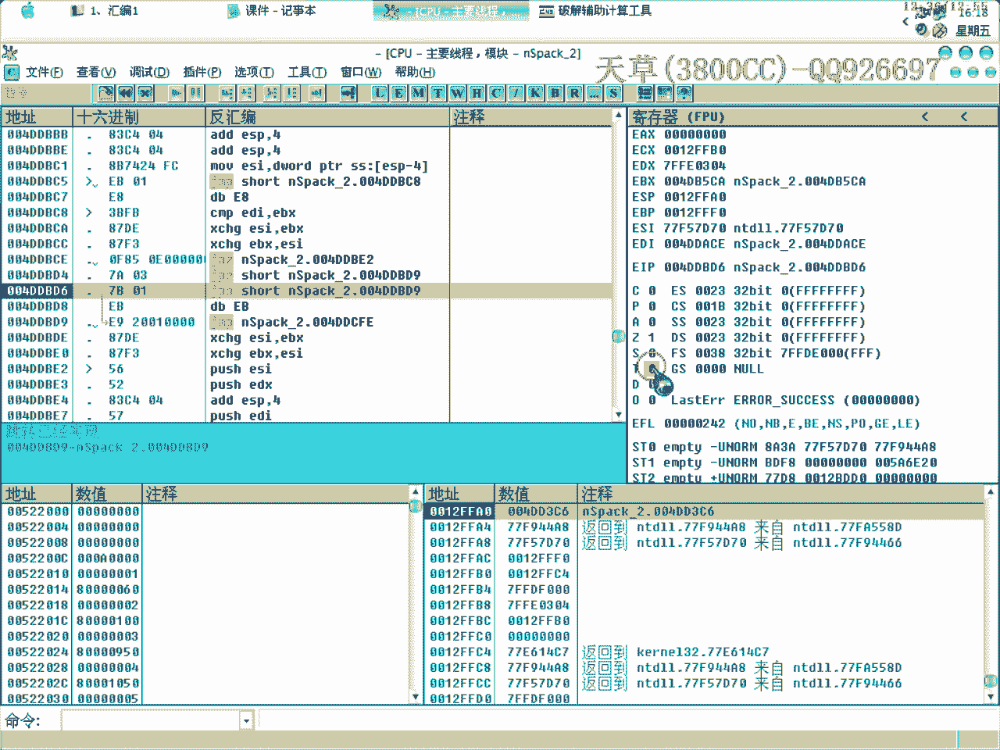
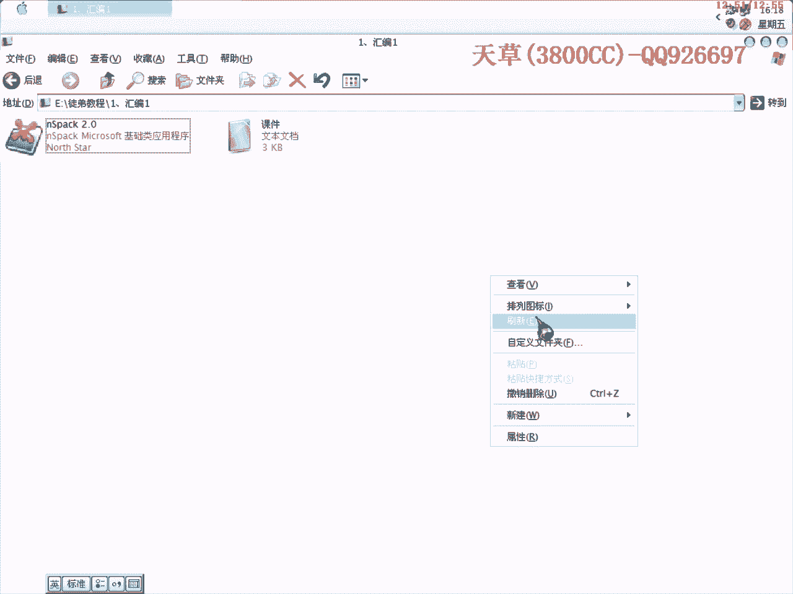

# 3800cc(天草)-天草流初级 - P1：1、汇编1 - 白嫖无双 - BV1qx411k7qA

大家好，現在來進行我們的第一課，初級班我是打算先多講幾課的會變，當然是和破解相關的一些會變，單單講會變的話，我們這三個班一起講都不夠，講在一起全講會變都不夠了，現在來看一下我們的課件。

首先我講一下數據類型，實金制，因為破解裡面有實金制和二金制，因為我們數據類型是有實金制和二金制，當然大家常接觸到實金制，就是說在生活當中，然後呢，實六金制是在破解會變裡面經常用到的。

而且是默認的一個數值是實六金制，實金制的二呢，他這裡有啊，我這裡也寫清楚了，我這裡也寫清楚，實金制，實金制用了個D來表示，二金制用B，然後實六金制是用H來表示，也就是說如果實金制的二呢。

你可以表示為2D，實六金制的二呢，是表示為0010B，這個怎麼來的，這裡呢可以寫為00001，就是說0然後加上1，就變成0001了，然後呢，再加上1，0001加上1呢，他這裡是-2就進位了，向前進一位。

就變成0010，再加就是這個，再看一下這個，也是加了1之後，然後就變成2，2呢向前進一位，進一位呢，這個加起來也是2，也向前進一位，後面就變成0了，這個大家自己看一下，關鍵是要著重給大家說一下，就是。

揮鞭也就是說我們用OD來表示，OD裡面的數字，看一下是實六金制的。

這個大家要搞清楚，比如說這裡的7，這裡的7是實六金制的，你要是不相信可以改一下，7D，他就變成7D了，那7H呢，還是7。

知道了吧，你要是把這裡改成7D，硬要是把它改成實金制的話，來看一下，這裡呢，你心裡想的，這個7D是實金制，但是他是實六金制，我們可以來轉換一下，轉換一下，7D的，7D實六金制，也是7，為什麼呢，看一下。

你要是非常僥倖的話，改到前面這十個數字的話，是非常僥倖的。

就剛好是表示一樣的，表示一樣的，我們再來看一下，找一個大一點的數，這個，40D，40D，我們來看一下40D呢。

40D的實六金制是什麼，是28，原先呢，人家這裡是40，實六金制，實六金制，是你改成40D之後就變成28了，這個大家要搞清楚，也就是說我們在這個裡面，在OD裡面所顯示，默認是實六金制的。

再看一下這個計算器。

計算器，這些文字，文字，大家自己看，我按這個上面講，也沒什麼意思，主要就是給大家說清楚一點，就是我們在學，我在學校學了個彙編，是16位的，16位彙編，然後他的一些計算器是AX BX CX和DX。

然後這個16位的呢，也可以分為兩個，每個16位可以分為兩個8位的，也就是說AX呢，可以分為，AL和AH，這分別代表什麼意思呢，AL呢，L是NO，英文單詞說寫L，D的意思就是低8位，H是HIGH。

是高的意思，是高8位，就給大家說清楚一下這個，那再看一下這個計算器，這裡有通用計算器，EX ECO EDS，這些之類的，然後還有一個標誌，標誌計算器，標誌計算器，這裡呢，還有一個浮點計算器，標誌計算器。

等一下會著重稍微講一下，然後呢，浮點計算器呢，其實我在那個黑鷹的破解課程裡面，專門拿了一節課，加上一個軟件的實例，加上一個軟件作為實例，來破解它，也是浮點標誌的，這個後面還是會給大家講一下。

還是會給大家講一下，好，來看一下，還是來看一下吧，這些是作用，其中呢，這上面四個EX ECO EDS EBS呢，是通用的數據計算器，除了這上面的一些功能之外，還有下面的，EX，是作為雷加器用的。

作為雷加器用的，它是算術運算的主要計算器，大家可以想得到，破解的一些算法裡面，肯定就是都是一些算術運算，所以在破解，非運算法的時候，EX是一個比較主要的一個計算器，再看一下EBS。

在計算存儲器地址的時候，可以作為機子使用，然後再看一下，主要看一下這個，ESP呢，我們不是講過ESP定律嗎，它是一個對戰指針，大家可以彈幕走一下，這裡，所在的ESP值是0012FFC0，在彈幕走一下。

就變了，也就是說剛才的0012FFC0，是指向00526198這個地址，然後現在呢，走過來就指向這個地址，它是作為指針用的，學過C的話，學過C的朋友也就知道指針了，指針是比較重要的，再看一下標誌計算器。

進位，進位C，C是表示Carrie，C是英文單字，Carrie進的意思，F呢，是Flag，Flag，它這個是標誌的意思，符號呢，是SIGN，是符號的意思，信號符號的意思，然後0呢，是ZERO，是0。

ZERO，也是那個單詞縮寫，溢出呢，OVER，這個也是一樣的，這兩個用的比較少，用的比較少，就不說了，在這裡我跟大家說這個的目的，說這個目的，就是我們在破解的時候，比如說，你發現這個跳轉跳過去之後。

程序就不行了，那你也必須要把這個跳轉給改過來，不能讓它跳，當然大家也可以想到一種方法，想到一種方法，比如說這個跳轉跳了，我改成相反的路，就沒讓它跳，不讓它跳，這樣是非常麻煩的，我現在給大家說一下簡單的。

因為那個彙編裡面，就是OD裡面所反出來的一個彙編，J1和JZ是不分的，J1，JZ，我把這裡改成JZ，但是還是J1，也就是說，它默認把JZ，把JZ默認為J1，它是受Z標準位影響的，Z標準位影響的。

我右鍵把它置0，置0。

這個跳轉就沒有實現了，也可以雙擊，雙擊，它原本是實現了，這裡已經顯示，跳轉已經實現了，再雙擊一下，沒有實現，這樣不是很方便嗎，免得你又去改代碼，對吧，我們彈幕走，彈幕走，當然大家要記得，脫殼的時候。

脫殼的時候，最好是不能，不是最好，是不能去改這個，不能去改這個。

因為，有的朋友可能會說，因為有一個向上的跳轉，我就通過改它了，讓它不要跳，因為這個樣子，你改了之後，程序可會檢測到，可進行一些數據釋放的時候，你要改掉了。

它會出現死的情況，就說我們剛才出現那種情況，全部都變為0，就是說它數據沒有解壓，知道吧，因為我們在脫殼的時候，我給大家介紹的方法是，在下一行，如果有向上的跳轉的話，在下一行F4，打斷它向上跳。

在破解的時候就不一樣了，破解的時候不一樣，破解的時候你可以通過修改，標誌基準器，標誌位，來決定，來決定那個跳是否跳，剛才這裡呢，JMP是無條件跳轉，無條件跳轉，是不受這裡的基準器的影響。

不受這裡的標誌位的影響，大家不要搞錯了，不要搞錯了，再多找幾個跳轉看一下，多找幾個跳轉看一下，給大家練一下吧，給大家練一下吧，為了試驗這個JPE，為了試驗這個JPE，我們就讓這個JMP呢，不要跳了。

彈幕走下來，這裡它原本沒有跳的，這裡它原本沒有跳的，它是受P標誌位影響的，雙擊，跳轉已經實現了，這個也是一樣的，受P標誌位，雙擊，大家可以看到，在另外的幾個，大家自己下去試一下，有一個配方。

大家要是不知道的話，不知道是受哪個標誌位的影響，可以一個一個試嘛，比如說這個已經跳轉了，我把它改成不跳轉了，雙擊一下它，它變過來了，但是沒有反應，把它還原，比如說A呢，也是的，C呢，也是的，S呢。

也是的，不是的就還原。

這個呢，大家自己回去試一下，回去試一下，好了今天的課程就這麼多，今天的課程就這麼多。

再見，由 Amara。org 社群提供的字幕。