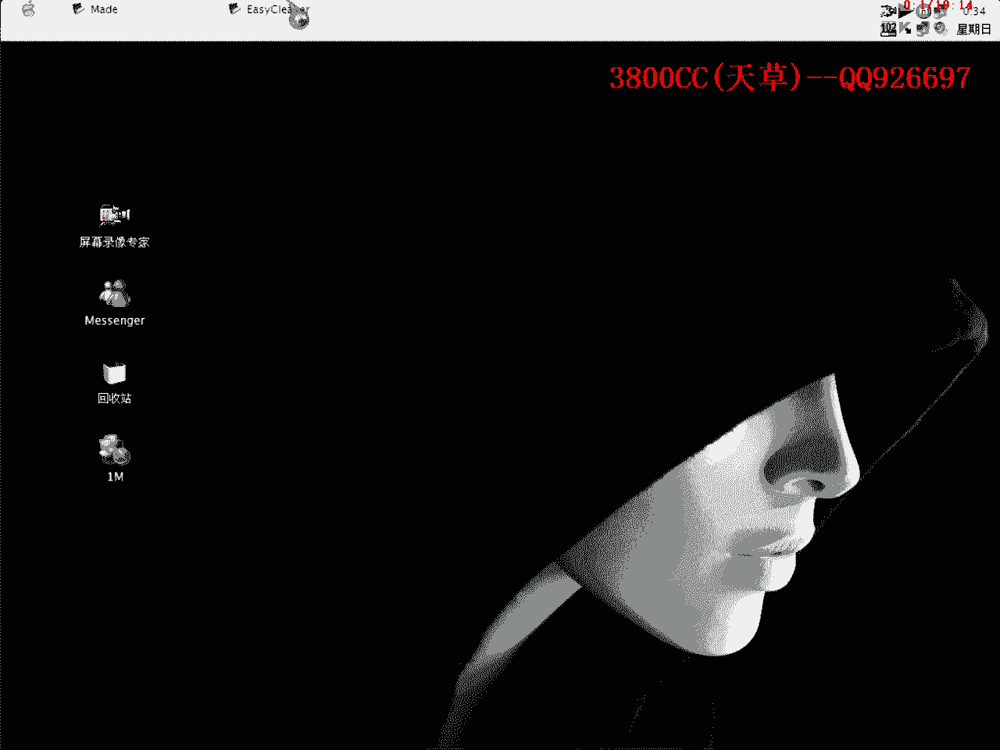
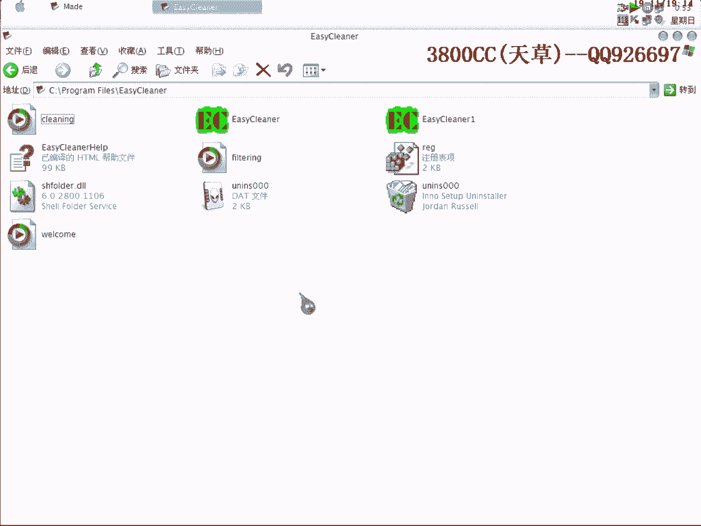

# 3800cc(天草)-天草流初级 - P20：19、破解10 - 白嫖无双 - BV1qx411k7qA

大家好，现在来进行我们的新的一课。

这个软件非常简单的一个软件，做这个动画的目的，就是让大家了解一下，软件的注册机制，再就是说怎么去查找，怎么去分析，我们先来查一下课，VC++写的没有可的，这个也看不到什么经典的算法，我们写OD载入。

点错了，首先我们来看一下，大家看到了，这个非常清楚，这个软件非常傻的，这个就是注册表箱，我们再来看一下，就是这个，大家看到，这里是unregistered，这里是000，这个是unregistered。

我们来对比一下注册成功之后会是怎么样一种情况，就是有些软件，有很多注册漏洞，等一下我们就可以来看得到，这个软件到底有什么样的漏洞，就是这一个了，我们先把这个记着，先直接运行，输入呢，这样就可以了。

然后暂停，大家看到了，这里是调用messagebox，这里要抽我们单机，双机进去就可以了，大家仔细看一下，这里是注册成功了，这个是注册失败，大家再来看一下，这里直接就这样过来了，上面有循环。

直接就过来了，也就是说，上面肯定有一个跳转是可以跳到这里来的，这个跳转是跳到这里来的，那我们就是说，首先来跟一下，还是来跟一下，好，点一下，OK，暂停，我们单步走，大家看到了。

首先在装入这么一个固定的支付串，咱们单步走，循环一次，这里就变了，这里要循环很多次，大家看到，循环一次，这个值就变了，至于它是不是注册码，先还说不清楚，关键是这个跳转，我们来看一下，Eax，Eax-1。

Substance SBb，这个是带移位的减，0-1，这里就相减了，这里就开始比较了，这个没有跳转，我这里呢，现在还说不清楚，这个是不是注册码，最终的注册码，就看这个最后这个跳转没有循环。

这个是在变化的，这个循环的有点发毛，当然这里也是算法，大家可以仔细去跟一下，还是来说一下大概的算法吧，Ebp放Eax，Ebp放Eax，也就是假的，假码放Esi，上一次循环得到的一个注册。

放到Eax里面去，Eax开始取了，取第一个，放到Dl，Esi取第一个0，放到Bl里面去，Dl放到Cl，大家看一下，Ecx的Cl就是12这个值，变成35了，然后再比较，Compare Dl， Bl。

Dl就是这一个，这个35，Bl呢，30，相比较，不相等就跳，不相等就跳，我们可以拿这个来试一下，看能不能当注册码，全部都复制一下吧，就留这一个，继续两步走，还在循环，循环很多次，循环有点烦，(看视频)。

这里要慢慢走，记一下，记一下，每次都记一下，因为等一下我们会走过，记一下，这个也记一下，(看视频)，(看视频)，(看视频)，(看视频)，(看视频)，(看视频)，(看视频)，(看视频)，(看视频)。

(看视频)，(看视频)，(看视频)，(看视频)，(看视频)，(看视频)，(看视频)，(看视频)，(看视频)，(看视频)，(看视频)，反正是要循环很多次的了，(看视频)，(看视频)，(看视频)。

这个没有跳我们就不记了，(看视频)，(看视频)，(看视频)，(看视频)，循环了很多次啊，(看视频)，这里还是没跳啊，(看视频)，好像记录掉了，那我们就是说现在来看一下，看一下，把这个硬件断电给删掉。

看一下是不是这个，是这个啊，就最后一次了，这是最后一次循环得到的结果，这个是最后一次循环结果，已经注册了，这个硬件放里面，那我们现在就是说要爆破的话，把这个直接改过来就可以了。

现在就是说现在怎么样来验证，是否爆破成功呢，我们把注册表给删掉，这个就是我们真正的注册码，现在来看一下，删掉了就还是没有注册，我们再来输入一下，验证一下原版，我们来看一下上面的，上面记录的都行不行。

这好像注册码是非常非常多的，有点奇怪了，说了什么英语听不懂，哈哈，他给你们刚才说了一句什么话，他这个很多啊很多了，就是说注册码是非常非常多，好像每次循环都是可以当注册码，我们再来挑一个看一下。

再来挑一个，这，这成功之后，他开始就说欢迎使用这个软件了，注码非常多，这个全部都是，没想到的全部都是，那也就是说，现在咱们来验证一下我们的爆破成果，随便输入，这样就可以了，随便输入都可以。

那咱们现在来对照一下，对照一下注册信息，大家看到了，看到了，这里，他这个现在，已经注册了，我们把它删掉吧，先把它删掉，再来验证一下，他这没写入注册表了，没写入注册表了，已经注册了，已经注册成功了。

再来看一下，我们今天也讲一下，就是说这个，这个大家看到了，我们就是说没有注册成功的话，他这个里是regcode，是unregister，regname呢，就是我们自己填了，然后呢。

register是01，变成01了，那我们现在来可以这样来改一下，这样来改一下，好，这样可以了，我们来通过修改注册表，通过修改注册表，大家看到了，咱们把它改成register，regname呢。

随便输入一个，380。cc，register呢，这个在前面也跟大家说过，就是说，如果你点4的话，他可能就是返回6，返回7或者返回1，这个是默认的，然后注册呢，这个也跟大家说一下，注册了。

就是1没有注册的话，就是0，那我们就把这个修改一下，按键盘上的这个，左右向左向右的这个键头，01，就这个样子了，好，再来运行，大家看到了，3800cc了，已经注册了的，也就是说。

这个软件是有这么一个漏洞的，有这么一个漏洞的，就是说，有很多很多的软件，都有这种漏洞，咱们都可以就是说，通过各种方法去达到破解的目的，这个大家要记住，大家要记住，这个软件，有什么破解的目的。

这个大家要清楚，在我以前破解的一个商业软件里面，就有这么一个漏洞，改一下注册表就OK了，这个，还有一些就是说，我们在前面也看到过，就是他把一些软件，有试用次数嘛，有试用次数他就，写入注册表。

我们可以通过修改那个写入次数，来达到破解的目的，所以呢，所以说在，做软件，做共享软件，加密的时候，我个人觉得，如果要使用通过注册表，来验证是否注册成功的话，还是，这个方面还是要谨慎一点。

或者是把注册表这方面，进行多项加密，并不是说很简单的把次数啊注册码，就这个样子放进去，通过各种加密之后再放进去，这个也是一种建议，大家以后自己学编程的时候，这个也是要，自己去思考的，当学好破解了之后。

学好破解，你在写软件的时候，你都会想到，别人会通过什么样的手段去破解，这样在强度上面就有很大的加强了，好。

那今天课程就到这儿。